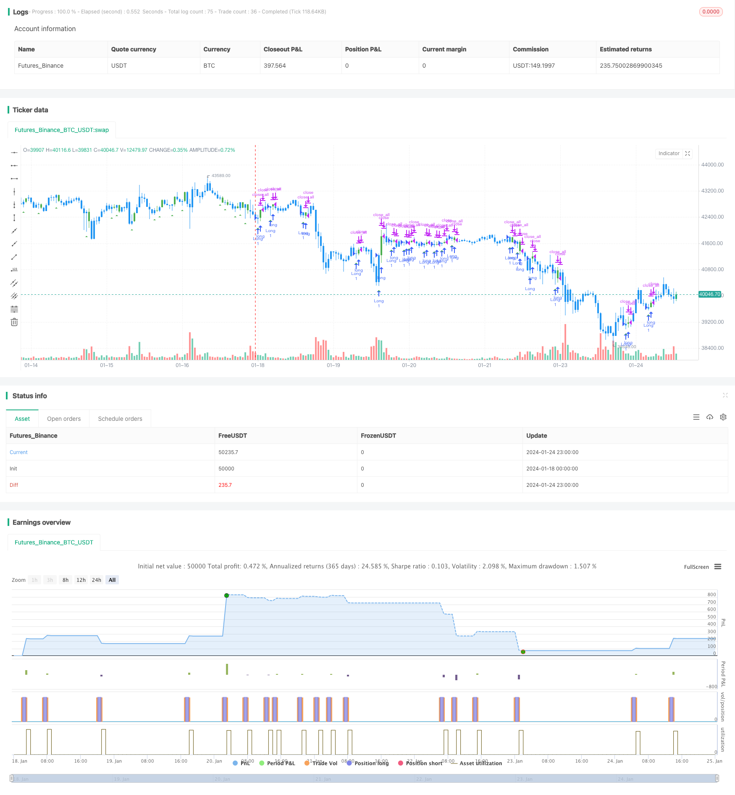

> Name

Key-Reversal-Backtest-Strategy Key-Reversal-Backtest-Strategy
> Author

ChaoZhang

> Strategy Description


[trans]
#### Overview
The key reversal signal backtesting strategy identifies the key reversal signals of the stock price and determines whether the current trend is reversed to capture the price direction after the trend reversal. This strategy is based on the theory of "key reversal days". It goes long and short when a key reversal signal is found, and locks in profits by configuring take-profit and stop-loss.
#### Strategy Principle
The core logic of the key reversal signal backtesting strategy is to identify key reversal days. Based on the stock's price trend, we can determine the current trend direction. When a key reversal signal appears, it indicates that the trend may reverse.
Specifically, for a stock's upward trend, if the lowest price of the day hits a new low, but the closing price is close to the previous day's lowest price, then this day is a key reversal day. This means that the strength of the bulls is weakening and their ability to withstand pressure is declining, indicating that the upward trend may reverse into a downward trend. The strategy will open short positions on key reversal days.
On the contrary, for a stock downward trend, if the day hits a new low, but the closing price is close to the previous day's highest price. Then this is also a key reversal day, indicating that the power of shorts has weakened and the downward trend may reverse to an upward trend. The strategy will open long positions on key reversal days.
By identifying key reversal days and tracking subsequent market movements, the strategy can capture the movement after price reversal.
#### Advantage Analysis
The main advantages of the Key Reversal Signal Backtesting Strategy are:
1. Capture trend reversals and have large profit potential. Key reversal signals often indicate the direction of trend change. By judging the reversal signal and tracking subsequent operations, you can obtain relatively large profit margins.
2. The rules are clear and easy to backtest and verify. The judgment rules for key reversal days are very clear. When the price reaches a new high or a new low, it forms a reversal pattern with the closing price of the previous day. This makes the strategy easy to backtest and reduces misjudgments.
3. Flexible adjustment and easy optimization. The setting of stop-profit and stop-loss points is very flexible and can be adjusted according to market conditions and personal risk preferences to optimize the strategy and reduce the risk of loss.
#### Risk Analysis
There are also some risks associated with the key reversal signal backtesting strategy:
1. Risk of misjudgment of reversal signals. Stock prices often undergo short-term adjustments, and not all key reversal signals herald a trend reversal, which may lead to misjudgments. By optimizing parameters and adjusting take-profit and stop-loss conditions, the probability of misjudgment can be reduced.
2. The risk of failure to reverse or continued reversal after reversal. Even if the judgment is accurate, after the price reverses, it may turn around again or the original trend may continue to run. At this time, you face the risk of loss. Control losses by stopping losses promptly.
3. Backtest deviation. The performance of any rules and signals in real trading may deviate from the backtest results, and the backtest profit situation cannot be completely reproduced.
#### Optimization direction
The main optimization directions of the key reversal signal backtest strategy are:
1. Optimize the settings of take profit and stop loss. Appropriate take profit and stop loss points can be calculated based on more historical data.
2. Add filtering conditions and combine with other technical indicators to filter out misjudgments. For example, trading volume can be used to confirm reversal signals to avoid being misled by arbitrage operations.
3. Optimize the tracking strategy after inversion. There are also certain rules to follow in the price movement after reversal. Set up follow-up strategies to further expand profits.
4. Combine with machine learning model to judge signal quality. The trained model evaluates the reliability of each key reversal signal and avoids tracking poor quality signals.
#### Summarize
The key reversal signal strategy captures price trend reversal opportunities by determining key reversal days. The policy rules are simple, clear and easy to implement. There is a lot of room for the trend to continue running after the reversal, but there is also a certain risk of misjudgment. By continuously optimizing parameters and filtering conditions to reduce the probability of misjudgment, more reliable results can be obtained.
||

#### Overview
The key reversal backtest strategy identifies key reversal signals in stock prices to determine if the current trend is reversing, in order to capture the price movement direction after the trend reversal. The strategy is based on the theory of "key reversal day". It goes long or short when detecting key reversal signals, and locks in profits by configuring take profit and stop loss.

#### Strategy Principle 
The core logic of the key reversal backtest strategy is to identify the key reversal day. According to the price movement of the stock, we can judge the current trend direction. The emergence of a key reversal signal indicates that the trend may reverse.

Specifically, for an uptrend, if the lowest price of the day breaks the new low over a period of time, but the close price is near the previous day's low, then this day is a key reversal day. This means that the bullish power is weakening and the bearish pressure is increasing, indicating the uptrend may reverse into a downtrend. The strategy will open short position on the key reversal day.

On the contrary, for a downtrend, if the lowest price of the day breaks the new low, but the close price is near the previous day's high. This is also a key reversal day, indicating that bearish power is diminishing and the downtrend may reverse into an uptrend. The strategy will open long position on the key reversal day. 

By identifying the key reversal day and tracking the subsequent price movement, the strategy is able to capture the run after the price reversal.

#### Advantage Analysis
The main advantages of the key reversal backtest strategy are:

1. Capture trend reversal with large profit space. Key reversal signals often imply a change in trend direction. By judging reversal signals and tracking subsequent runs, relatively large profits can be obtained.

2. Clear rules easy to backtest. The criteria for determining key reversal days are very clear, with the new high/low price reversing the closing price of the previous day. This makes the strategy easy to backtest and helps avoid misjudgments. 

3. Flexible adjustment for optimization. Take profit and stop loss levels are very flexible and can be adjusted according to market conditions and personal risk preferences for strategy optimization to reduce risk of loss.

#### Risk Analysis
The key reversal backtest strategy also has some risks:

1. Risk of misjudging reversal signals. Stock prices often have short-term adjustments. Not all key reversal signals imply a trend reversal, which may lead to misjudgments. The probability of misjudgment can be reduced by optimizing parameters and adjusting profit taking and stop loss conditions.

2. Risk of failure to reverse or reverse again after reversal. Even with an accurate judgment, prices after reversal may turn around again or the original trend may continue. This faces the risk of losses. Manage losses in a timely manner by stop loss.

3. Backtest bias. The performance of any rules and signals in live trading may deviate from backtest results and fail to reproduce backtest profits.

#### Optimization Directions
The main optimization directions for the key reversal backtest strategy:

1. Optimize take profit and stop loss settings. Calculate appropriate levels based on more historical data.

2. Add filter conditions combined with other technical indicators to avoid misjudgments. For example, confirm reversal signals with trading volume to avoid misleading by arbitrage operations.

3. Optimize tracking strategy after reversal. Price movements after reversal also have certain rules to follow. Set up subsequent tracking strategies to further increase returns.

4. Use machine learning models to judge signal quality. Train models to evaluate the reliability of each key reversal signal and avoid tracking poor quality signals.

#### Summary
The key reversal signal strategy captures price trend reversal opportunities by identifying key reversal days. The strategy rules are simple and clear, and easy to implement. The trend after reversal has large space to run, but there are also certain risks of misjudgment. By continuously optimizing parameters and filter criteria to reduce misjudgment, relatively reliable results can be obtained.

[/trans]

> Strategy Arguments


|Argument|Default|Description|
|----|----|----|
|v_input_1|true|Enter the number of bars over which to look for a new low in prices.|
|v_input_2|20|Take Profit pip|
|v_input_3|10|Stop Loss pip|


> Source (PineScript)

``` pinescript
/*backtest
start: 2024-01-18 00:00:00
end: 2024-01-25 00:00:00
period: 1h
basePeriod: 15m
exchanges: [{"eid":"Futures_Binance","currency":"BTC_USDT"}]
*/

//@version=4
////////////////////////////////////////////////////////////
//  Copyright by HPotter v1.0 21/01/2020
//
// A key reversal is a one-day trading pattern that may signal the reversal of a trend. 
// Other frequently-used names for key reversal include "one-day reversal" and "reversal day."
// How Does a Key Reversal Work?
// Depending on which way the stock is trending, a key reversal day occurs when:
// In an uptrend -- prices hit a new high and then close near the previous day's lows.
// In a downtrend -- prices hit a new low, but close near the previous day's highs
// WARNING:
// - For purpose educate only
// - This script to change bars colors.
////////////////////////////////////////////////////////////
strategy(title="Key Reversal Up Backtest", shorttitle="KRU Backtest", overlay = true) 
nLength = input(1, minval=1, title="Enter the number of bars over which to look for a new low in prices.")
input_takeprofit = input(20, title="Take Profit pip", step=0.01)
input_stoploss = input(10, title="Stop Loss pip", step=0.01)
xLL = lowest(low[1], nLength)
C1 = iff(low < xLL and close > close[1], true, false)
plotshape(C1, style=shape.triangleup, size = size.small, color=color.green, location = location.belowbar )
posprice = 0.0
pos = 0
barcolor(nz(pos[1], 0) == -1 ? color.red: nz(pos[1], 0) == 1 ? color.green : color.blue ) 
posprice := iff(C1== true, close, nz(posprice[1], 0)) 
pos := iff(posprice > 0, 1, 0)
if (pos == 0) 
    strategy.close_all()
if (pos == 1)
    strategy.entry("Long", strategy.long)
posprice := iff(low <= posprice - input_stoploss and posprice > 0, 0 ,  nz(posprice, 0))
posprice := iff(high >= posprice + input_takeprofit and posprice > 0, 0 ,  nz(posprice, 0))
```

> Detail

https://www.fmz.com/strategy/440103

> Last Modified

2024-01-26 16:11:28
