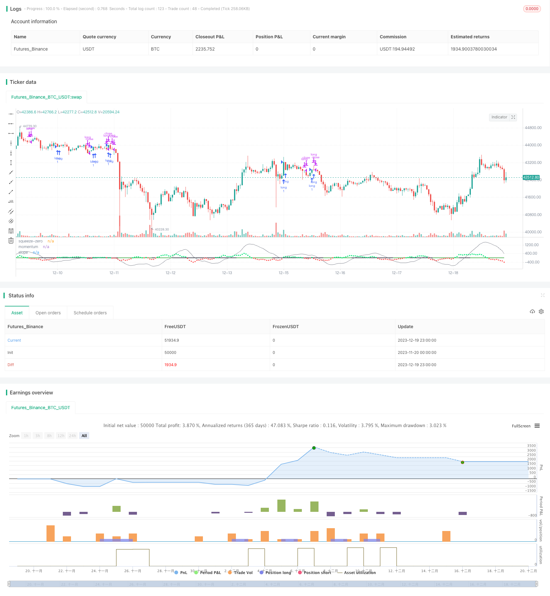

> Name

Momentum-Strategy-Based-on-LazyBears-Squeeze
> Author

ChaoZhang

> Strategy Description


[trans]

## Overview
The main idea of ​​this strategy is based on LazyBear's Squeeze Momentum indicator, which analyzes the timing of buying and selling. It analyzes trend turning points in momentum and locates highs and lows as signals to sell and buy. Since this is a long strategy, the 50-period exponential moving average is also considered to identify uptrends. If the closing price of the candle is above the 50-day exponential moving average, and the 50-day exponential moving average is in an uptrend, a buy signal is executed. If these conditions are not met, the buy signal is ignored.
## Strategy Principle
This strategy combines the Bollinger Bands indicator and the Keltner Channel indicator to identify trends and pressure zones. Specifically, it calculates the 20-period Bollinger Bands, and the upper and lower rails of the 20-period Keltner Channel. When the Bollinger Bands fall completely within the Keltner Channel, it is considered a squeeze signal. When the lower track of Bollinger Bands exceeds the lower track of Keltner Channel and the upper track of Bollinger Bands is lower than the upper track of Keltner Channel, it is identified as a squeeze interval. On the contrary, when the lower track of Bollinger Bands is lower than the lower track of Keltner Channel and the upper track of Bollinger Bands is higher than the upper track of Keltner Channel, it is identified as a non-squeezing interval.
In addition, this strategy also uses linear regression to analyze the trend and slope of momentum. It calculates a linear regression of price minus typical price over the past 20 periods. When the slope of the linear regression value is positive, it is considered an upward trend; when the slope is negative, it is a downward trend. When the momentum slope reverses during a squeeze zone, it is considered a buy and sell signal. Specifically, when the momentum changes from positive to negative in the squeeze interval, a sell signal is generated; and when the momentum changes from negative to positive in the squeeze interval, a buy signal is generated.
To filter out false signals, the strategy also determines whether the closing price is above the 50-day exponential moving average and whether the 50-day exponential moving average is rising. Only when these two conditions are met at the same time, the buy signal will be executed.
## Strategic advantage analysis
This is a very smart strategy. It uses two different types of indicators to make multi-dimensional judgments on the market at the same time, which can effectively avoid false signals. Specifically, its advantages are:
1. Comprehensive use of Bollinger Bands, Keltner Channel and momentum indicators to conduct multi-dimensional analysis to improve the accuracy of judgment.
2. The squeeze interval can effectively identify the high and low points of momentum reversal and accurately capture the turning point.
3. Trend filtering based on closing price and 50-day exponential moving average can avoid repeated opening of positions during consolidation.
4. Only sending signals in the squeeze range can reduce false signals and increase the probability of profit.
5. This strategy has a large space for parameter optimization, and can be targeted and optimized by adjusting parameters such as cycles.
6. Taking into account both the long and short term, it not only takes into account the macro-cyclical trend, but also combines medium and short-term indicators, and the long direction is clear.
## Risk Analysis
Although this strategy Nonfarming uses a number of technical indicators to judge, there are still certain risks:
1. When Bollinger Bands and Keltner Channels diverge, buying/selling opportunities will be missed.
2. When the market rises and falls sharply, it will bring huge losses to the strategy.
3. In high-volatility markets, squeeze situations may not be obvious and there may be few signals.
4. When there is a transition between bull and bear, it is easy to form an adjustment loss.
We can avoid these risks through the following methods:
1. Optimize parameters to make Bollinger Bands and Keltner channels as synchronized as possible.
2. Set a stop loss line to control single losses.
3. Use this strategy as part of a combination strategy and use it in conjunction with other strategies.
4. In highly volatile market conditions, appropriately reduce positions.
## Optimization direction
This strategy still has a lot of room for optimization. The main optimization directions are: 
1. Optimize the length period of Bollinger Bands and Keltner Channel to make them as synchronized as possible.
2. Test different multiple factors to find the best parameter combination.
3. Try to add other indicators for confirmation, such as RSI, etc.
4. Determine the market stage based on models such as Mandarin Five Color Line and use this strategy selectively.
5. Use machine learning and other methods to dynamically optimize parameters.
6. Backtest different currencies to find the most suitable trading variety.
7. Explore the effect of this strategy on longer periods (daily, weekly, etc.).
## Summarize
The LazyBear pressure moment quantified momentum strategy comprehensively uses a variety of technical indicators to accurately identify momentum turning points in the squeeze range for trading and avoid frequent opening of positions in non-trending markets. It systematically defines quantitative buying and selling rules and performs well in backtesting. By optimizing parameter settings and introducing new judgment indicators, this strategy also has a lot of room for improvement and is worthy of in-depth study and application by quantitative traders.
|| 

## Overview

The main idea of this strategy is based on LazyBear's Squeeze Momentum indicator to analyze the timing of buying and selling. It analyzes the inflection points in the momentum trend, locating the peaks and troughs as sell and buy signals respectively. As it is a long strategy, it also takes into consideration the 50 period Exponential Moving Average to identify upward trends. If the closing price of the candle is above the 50EMA, and the slope of the 50EMA is trending upwards, then the buy signal is executed.

## Strategy Principle 

This strategy incorporates Bollinger Bands and Keltner Channels to identify trends and squeeze zones. Specifically, it calculates a 20-period Bollinger Bands and 20-period Keltner Channels. When Bollinger Bands fall entirely within the Keltner Channels, it is viewed as a squeeze signal. The squeeze zone is identified when the Bollinger Bands lower band goes above the Keltner Channels lower band and the Bollinger Bands upper band goes below the Keltner Channels upper band. Conversely, when the Bollinger Bands lower band falls below the Keltner Channels lower band and the Bollinger Bands upper band rises above the Keltner Channels upper band, it is a non-squeeze zone.

In addition, the strategy utilizes linear regression to analyze the change in momentum slope. It calculates the linear regression value of price over the last 20 periods minus the typical price. When the slope of the linear regression value is positive, it is viewed as an upward trend. When the slope is negative, it is a downward trend. Within the squeeze zone, if there is a reversal in the momentum slope, it signals a buy or sell. Specifically, when within the squeeze zone, a momentum flip from positive to negative issues a sell signal. And when within the squeeze zone, a momentum flip from negative to positive issues a buy signal.  

To filter out false signals, the strategy also judges if the closing price is above the 50-day Exponential Moving Average and if the 50-day Exponential Moving Average is in an upward slope. Only when both conditions are met will the buy signal be executed.

## Advantage Analysis

This is a very clever strategy, utilizing two different types of indicators to make a multi-dimensional judgment of the market, which can effectively avoid false signals. Specifically, its advantages are:

1. Comprehensive application of Bollinger Bands, Keltner Channels and momentum indicators for multi-dimensional analysis and improved accuracy.

2. Squeeze zones can effectively identify peaks and troughs of momentum reversals and precisely capture turns.

3. Trend filtering based on closing price and 50-day EMA avoids repetitive opening of positions during consolidations. 

4. Signals only emitting during squeeze zones reduces false signals and improves profitability rate.

5. Large parameter optimization space allows targeted optimizations via adjusting periods etc.

6. Long and short combined, considers large cycle trends and integrates medium-term indicators, long direction is clear.

## Risk Analysis 

Although this strategy has Nonfarmed multiple technical indicators, there are still some risks:

1. Missing buy/sell opportunities when Bollinger Bands and Keltner Channels diverge.  

2. Large losses may occur during violent market rises or falls.

3. In high volatility markets, squeeze situations may not be obvious, resulting in fewer signals. 

4. Prone to adjustment losses during bull-bear transitions.

To avoid these risks, we can take the following measures:

1. Optimize parameters to synchronize Bollinger Bands and Keltner Channels as much as possible. 

2. Set stop loss to control single loss.

3. Use this strategy as part of a portfolio strategy, combined with other strategies.  

4. Reduce positions appropriately during high volatility markets.


## Optimization Directions

There is still large room for optimizing this strategy, mainly in the following directions:

1. Optimize periods of Bollinger Bands and Keltner Channels to synchronize them as much as possible.  

2. Test different multiplier factors to find optimal parameter combinations.

3. Try introducing other indicators for confirmation, such as RSI etc. 

4. Based on Wen Hua Five Color Lines models, selectively utilize this strategy depending on market stages.

5. Adopt machine learning etc to dynamically optimize parameters.

6. Backtest on different coins to find the most suitable trading products.

7. Explore efficacy of this strategy on longer timeframes (daily, weekly etc).


## Conclusion

The LazyBear Squeeze Momentum Strategy comprehensively employs various technical indicators, accurately identifying momentum reversals for trading during squeeze zones, avoiding repetitive opening of positions during non-trending markets. It has systematically defined quantifiable buy and sell rules, performing excellently in backtests. Through optimizing parameter settings, introducing new judgment indicators etc, this strategy has large room for improvements and is worth in-depth research and application by quant traders.

[/trans]

> Strategy Arguments


|Argument|Default|Description|
|----|----|----|
|v_input_1|20|BB Length|
|v_input_2|2|BB MultFactor|
|v_input_3|20|KC Length|
|v_input_4|1.5|KC MultFactor|
|v_input_5|true|Use TrueRange (KC)|


> Source (PineScript)

``` pinescript
/*backtest
start: 2023-11-20 00:00:00
end: 2023-12-20 00:00:00
period: 1h
basePeriod: 15m
exchanges: [{"eid":"Futures_Binance","currency":"BTC_USDT"}]
*/

//@version=4

//
// @author LazyBear 
// List of all my indicators: https://www.tradingview.com/v/4IneGo8h/
//
initialBalance = 8000

strategy("Crypto momentum strategy", overlay=false)


length = input(20, title="BB Length")
mult = input(2.0, title="BB MultFactor")
lengthKC = input(20, title="KC Length")
multKC = input(1.5, title="KC MultFactor")

useTrueRange = input(true, title="Use TrueRange (KC)", type=input.bool)

// Calculate BB
source = close
basis = sma(source, length)
ema = ema(source, 50)
dev = multKC * stdev(source, length)
upperBB = basis + dev
lowerBB = basis - dev

// Calculate KC
ma = sma(source, lengthKC)
range = useTrueRange ? tr : high - low
rangema = sma(range, lengthKC)
upperKC = ma + rangema * multKC
lowerKC = ma - rangema * multKC

sqzOn = lowerBB > lowerKC and upperBB < upperKC
sqzOff = lowerBB < lowerKC and upperBB > upperKC
noSqz = sqzOn == false and sqzOff == false

val = linreg(source - avg(avg(highest(high, lengthKC), lowest(low, lengthKC)), sma(close, lengthKC)), lengthKC, 0)

slope = (val - val[2])
emaSlope = (ema - ema[1])


bcolor = iff(slope > 0, color.lime, color.red)
scolor = noSqz ? color.green : sqzOn ? color.black : color.green
squeeze = (noSqz ? 0 : sqzOn ? 1 : 0)

plot(val, color=color.gray, style=plot.style_line, linewidth=1, title="momentum")
plot(slope, color=bcolor, style=plot.style_circles, linewidth=2, title="slope")
plot(0, color=scolor, style=plot.style_line, linewidth=2, title="squeeze-zero")

co = crossover(slope / abs(slope), 0)
cu = crossunder(slope / abs(slope), 0)

if co and source > ema and emaSlope > 0
    strategy.entry("long", strategy.long, comment="long")
if cu
    strategy.close("long")

```

> Detail

https://www.fmz.com/strategy/436117

> Last Modified

2023-12-21 14:22:49
