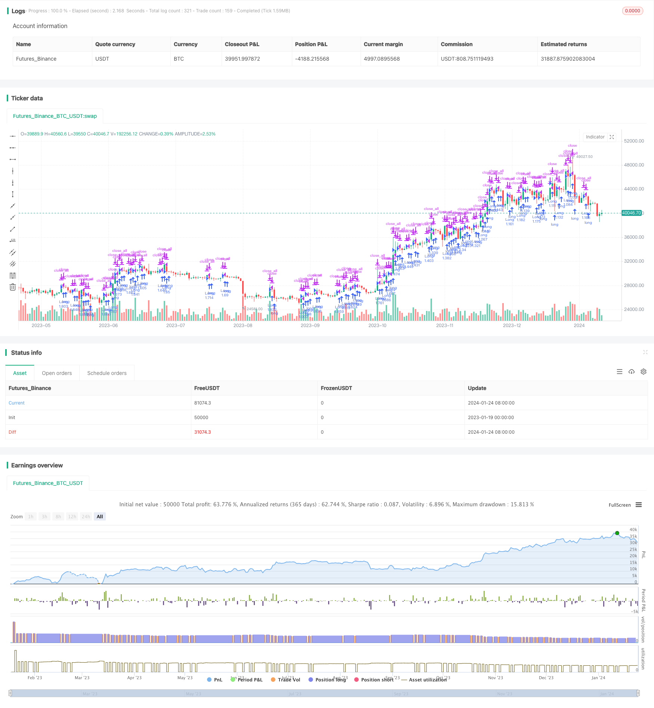

> Name

Leveraged-Martinale-Futures-Trading-Strategy
> Author

ChaoZhang

> Strategy Description


[trans]

## Overview
This strategy is a Martingale futures trading strategy that uses leverage to achieve high returns. It achieves profit targets by dynamically adjusting the position size and increasing the position when losing money.
## Strategy Principle
The core logic of this strategy is: when the price triggers the stop loss line, re-enter the market with a larger position and at the same time lower the stop loss line by a certain amount. This reduces the average entry price by increasing the position size. When the number of positions reaches the set maximum number of orders, wait for the price to reverse and break through the take-profit line to stop the loss.
Specifically, the strategy first enters the market at the current price and sets the position size and take-profit and stop-loss levels. When the price moves in an unfavorable direction and reaches the stop-loss line, the strategy re-enters the market with a larger position and moves the stop-loss line downward by a certain percentage. This operation of covering and moving positions will lower the average opening price each time, thereby increasing profit opportunities. After the number of position replenishments reaches the set maximum order quantity, profit will be taken when the price reverses and rebounds and breaks through the take-profit level.
## Advantage Analysis
The biggest advantage of this strategy is that it can reduce the cost of opening a position through leveraged position cover, and there is still the possibility of reversing in a favorable direction when the market goes unfavorably. At the same time, setting reasonable stop-profit and stop-loss conditions can effectively control risks.
This strategy also works well in high-volatility markets such as commodities. Use leverage to magnify profits and losses to obtain higher returns.
## Risk Analysis
The main risk of the strategy is that the price may continue to run unfavorably after the position is covered, or even fall below the previous stop loss level. At this time, you may face greater losses. This risk can be controlled by setting a wider stop loss range, a smaller leverage multiple, etc.
Another risk is that funds may no longer be able to support the maximum order volume before the reversal. This requires investors to have sufficient financial strength.
## Optimization direction
This strategy can be further optimized from the following aspects:
1. Dynamically adjust the leverage ratio, appropriately reduce it when making profits and increase it appropriately when losing money
2. Use moving average indicators to determine the market trend, and stop loss and exit when the trend is unclear.
3. Set the stop loss range based on market volatility, and expand the range when volatility is high
4. Add an automatic stop loss module to avoid huge losses in extreme market conditions
## Summarize
This strategy is a typical leveraged Martingale trading strategy. It pursues higher returns by adding positions to reduce costs, but it also carries a certain degree of risk. There is still room for optimization through parameter adjustment and function expansion, and it can adapt to more market environments.
||

## Overview  

This is a futures trading strategy that leverages the martingale mechanism to achieve high returns. It dynamically adjusts position sizes to increase positions when losing to meet profit targets.  

## Principles  

The core logic of this strategy is: when price triggers the stop loss line, reopen positions with larger sizes while lowering the stop loss line by a certain percentage. By increasing position sizes, it aims to lower average entry price. When number of positions reaches the set maximum orders, it waits for price reversal to take profit.   

Specifically, it first enters at current price with set position size and take profit/loss levels. When price moves to the stop loss line, larger positions will be reopened and stop loss line is lowered by a set percentage. Such reopening and stop loss lowering operations will lower the average opening price, increasing profit potential. After number of added orders reaches maximum, it waits for price reversal to hit take profit.  

## Advantage Analysis

The biggest advantage is the ability to lower cost basis through leveraged reopening, while still having the chance of favorable reversal when trends are negative. Also by setting proper stop loss/profit levels, it effectively controls risks.  

It also works well for commodities and other high volatility markets, amplifying gains/losses through leverage.

## Risk Analysis  

Main risk is price may continue downward trend after reopening, even breaking previous stop loss levels, leading to heavy losses. This can be mitigated by setting wider stop loss percentage, smaller leverage ratio etc.  

Another risk is insufficient capital to support max order quantity before reversal. It requires adequate funding.

## Improvement Areas

Some ways to further optimize the strategy:

1. Dynamically adjust leverage level, lower when profiting and higher when losing  

2. Incorporate trend indicators to stop loss when trend unclear  

3. Set stop loss width based on market volatility, wider when volatile  

4. Add auto stop loss modules to limit extreme losses

## Summary   

This is a typical leveraged martingale trading strategy. By lowering cost through added orders, it pursues higher returns but also introduces risks. There is still room for optimization through parameter tuning and feature expansion to suit more market conditions.

[/trans]

> Strategy Arguments


|Argument|Default|Description|
|----|----|----|
|v_input_1|2|Take Profit Percentage|
|v_input_2|2|Position Size Multiplier|
|v_input_3|10|Maximum Number of Reinforced Orders|
|v_input_4|10000|Trade Size in USD|
|v_input_5|true|Drop Percentage for Next Trade|
|v_input_6|5|Leverage Factor|
|v_input_7|true|Enter First Trade at Current Price|
|v_input_8|0.1|Taker Order Fee Percentage|


> Source (PineScript)

``` pinescript
/*backtest
start: 2023-01-19 00:00:00
end: 2024-01-25 00:00:00
period: 1d
basePeriod: 1h
exchanges: [{"eid":"Futures_Binance","currency":"BTC_USDT"}]
*/

//@version=4
strategy("Leveraged Martingale Strategy with Fees", overlay=true)

// User-defined input parameters
var float takeProfitPct = input(2.0, title="Take Profit Percentage") / 100.0
var float positionMultiplier = input(2.0, title="Position Size Multiplier")
var int maxOrders = input(10, title="Maximum Number of Reinforced Orders")
var float tradeSizeUSD = input(10000.0, title="Trade Size in USD")
var float dropPctForNextTrade = input(1.0, title="Drop Percentage for Next Trade") / 100.0
var float leverage = input(5.0, title="Leverage Factor")
var bool enterAtCurrentPrice = input(true, title="Enter First Trade at Current Price")
var float takerFeePct = input(0.1, title="Taker Order Fee Percentage") / 100.0

// State variables
var float last_entry_price = na
var float avg_entry_price = na
var float total_position_size = 0.0
var int num_trades = 0

// Entry logic
if (num_trades == 0)
    if (enterAtCurrentPrice or close < last_entry_price * (1 - dropPctForNextTrade))
        float size = tradeSizeUSD / close * leverage
        strategy.entry("Long", strategy.long, qty=size)
        avg_entry_price := close
        total_position_size := size
        last_entry_price := close
        num_trades := 1
else if (close < last_entry_price * (1 - dropPctForNextTrade) and num_trades < maxOrders)
    float size = tradeSizeUSD / close * leverage * pow(positionMultiplier, num_trades)
    strategy.entry("Double Long" + tostring(num_trades), strategy.long, qty=size)
    avg_entry_price := ((avg_entry_price * total_position_size) + (close * size)) / (total_position_size + size)
    total_position_size := total_position_size + size
    last_entry_price := close
    num_trades := num_trades + 1

// Take profit logic adjusted for leverage and fees
var float take_profit_price = na
var float fee_deduction = na
if (num_trades > 0)
    take_profit_price := avg_entry_price * (1 + takeProfitPct / leverage)
    fee_deduction := total_position_size * close * takerFeePct
    if (close > take_profit_price + fee_deduction / total_position_size)
        strategy.close_all()
        num_trades := 0

```

> Detail

https://www.fmz.com/strategy/440058

> Last Modified

2024-01-26 11:12:23
