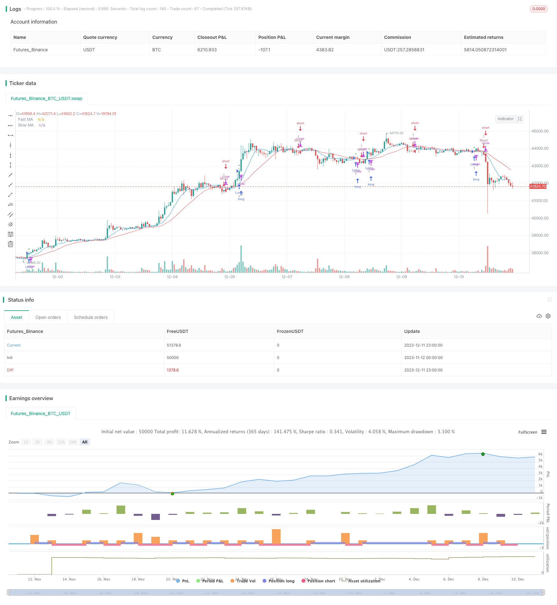

> Name

Long-Short-Moving-Average-Crossover-Trading-Strategy
> Author

ChaoZhang

> Strategy Description


[trans]

## Overview
The double moving average trading strategy is a typical trend following strategy. This strategy uses the golden cross of the fast moving average and the slow moving average to determine the market trend, and do long and short positions accordingly. When the fast moving average breaks through the slow moving average from bottom to top, it is considered that the market has entered an upward trend, and you will go long at this time; when the fast moving average breaks through the slow moving average from top to bottom, it is considered that the market has entered a downward trend, and you will go short at this time. This strategy is suitable for markets with strong medium and long-term trends.
## Strategy Principle
The core logic of the double moving average trading strategy is based on the golden cross of the moving average. The moving average can effectively filter out the noise in the market and reflect the direction of the market trend. The fast moving average is more sensitive to price changes and can reflect the trend at the current stage; the slow moving average responds more slowly to price changes and can determine the direction of the overall trend.
When the fast moving average crosses the slow moving average, it means that the upward momentum of the short-term trend is stronger than the long-term trend, and you can go long; when the fast moving average crosses below the slow moving average, it means that the downward momentum of the short-term trend is stronger than the long-term trend, and you can go short.
Specifically, this strategy defines fast moving averages and slow moving averages with lengths of 9 and 21, and then uses `ta.crossover` and `ta.crossunder` to determine their golden crosses and dead crosses. Go long when a golden cross occurs and go short when a dead cross occurs.
## Advantage Analysis
The double moving average trading strategy has the following advantages:
1. The idea is simple, easy to understand and implement;
2. Moving averages can effectively filter market noise and identify trends;
3. Used in conjunction with fast and slow moving averages, medium and long-term trends can be captured;
4. Customizable moving average parameters, suitable for different markets;
5. Can be used in a variety of time periods and has high flexibility.
## Risk Analysis
The double moving average trading strategy also has the following risks:
1. When the market is in a volatile area, multiple false signals may appear;
2. Improper parameter settings of fast moving average and slow moving average may lead to signal errors;
3. It is impossible to judge the strength of the trend, and losses may occur near the reversal point;
4. The specific entry point cannot be determined, and there is a certain degree of randomness.
In response to the above risks, risks can be reduced by optimizing moving average parameters, filtering in combination with other indicators, and limiting stop loss points.
## Optimization direction
The double moving average trading strategy can be optimized from the following directions:
1. Optimize the parameters of the moving average and find the best parameter combination;
2. Add other indicator judgments, such as MACD, KDJ, etc. to avoid false signals;
3. Add a stop-loss mechanism to control single losses;
4. Use volatility indicators to determine the strength of the trend and optimize the timing of entry.
## Summarize
The double moving average trading strategy is generally a simple and practical trend following strategy. Through the combined use of fast moving averages and slow moving averages, the market trend direction can be effectively identified. However, this strategy also has certain flaws. After optimization and improvement, it can become one of the basic strategies for quantitative trading.
|| 

## Overview

The long-short moving average crossover trading strategy is a typical trend-following strategy. It uses the golden cross and death cross of the fast and slow moving averages to determine market trends and make corresponding long and short trades. When the fast moving average crosses above the slow moving average, it indicates an upward trend, so go long. When the fast moving average crosses below the slow moving average, it indicates a downward trend, so go short. This strategy works well for markets with strong mid- to long-term trends.   

## Strategy Logic

The core logic of the long-short MA strategy is based on the golden cross and death cross of moving averages. Moving averages can effectively filter out market noise and reflect trend direction. The fast MA reacts more quickly to price changes and captures short-term trends. The slow MA responds more slowly and tracks long-term trends.   

When the fast MA crosses above the slow MA, it shows that the short-term trend has more upward momentum than the long-term trend, so go long. When the fast MA crosses below the slow MA, it indicates stronger downward momentum in the short-term trend, so go short.

Specifically, this strategy defines a fast MA (length 9) and a slow MA (length 21). It then uses `ta.crossover` and `ta.crossunder` to detect golden crosses and death crosses between them. It goes long on golden crosses and goes short on death crosses.  

## Advantage Analysis 

The long-short MA strategy has the following advantages:

1. Simple logic, easy to understand and implement;  
2. Moving averages filter noise effectively and identify trends;
3. Fast and slow MAs combined catch mid- to long-term trends;  
4. Customizable MA parameters work for different markets; 
5. Applicable to multiple timeframes, flexible.

## Risk Analysis

The long-short MA strategy also has the following risks:

1. Whipsaws and false signals may occur in ranging markets;  
2. Poor MA parameter tuning leads to bad signals;
3. Unable to gauge trend strength, losses near reversals; 
4. Entry levels not clearly defined.

These risks can be reduced by optimizing MA parameters, adding filters, and setting stop losses.

## Optimization Directions

The long-short MA strategy can be improved in the following aspects:  

1. Optimize MA parameters to find the best combination;
2. Add other indicators as filters, e.g. MACD, KDJ to avoid bad signals;  
3. Add stop loss mechanisms to control loss per trade; 
4. Combine with volatility metrics to fine-tune entries.  

## Conclusion

In summary, the long-short MA crossover strategy is a simple and practical trend following system. By combining fast and slow moving averages, it can effectively identify trend direction. But it also has some flaws. After optimizations and enhancements, it can become a core quantitative trading strategy.

[/trans]

> Strategy Arguments


|Argument|Default|Description|
|----|----|----|
|v_input_1|9|Fast MA Length|
|v_input_2|21|Slow MA Length|


> Source (PineScript)

``` pinescript
/*backtest
start: 2023-11-12 00:00:00
end: 2023-12-12 00:00:00
period: 1h
basePeriod: 15m
exchanges: [{"eid":"Futures_Binance","currency":"BTC_USDT"}]
*/

//@version=5
strategy("MA Strategy", overlay=true)

// Input parameters
fastLength = input(9, title="Fast MA Length")
slowLength = input(21, title="Slow MA Length")

// Calculate moving averages
fastMA = ta.sma(close, fastLength)
slowMA = ta.sma(close, slowLength)

// Plot moving averages
plot(fastMA, color=color.blue, title="Fast MA")
plot(slowMA, color=color.red, title="Slow MA")

// Strategy conditions
longCondition = ta.crossover(fastMA, slowMA)
shortCondition = ta.crossunder(fastMA, slowMA)

// Strategy orders
if (longCondition)
    strategy.entry("Long", strategy.long)

if (shortCondition)
    strategy.entry("Short", strategy.short)

// Plot entry signals
plotshape(series=longCondition, title="Buy Signal", color=color.green, style=shape.triangleup, size=size.small)
plotshape(series=shortCondition, title="Sell Signal", color=color.red, style=shape.triangledown, size=size.small)

```

> Detail

https://www.fmz.com/strategy/435246

> Last Modified

2023-12-13 15:23:32
