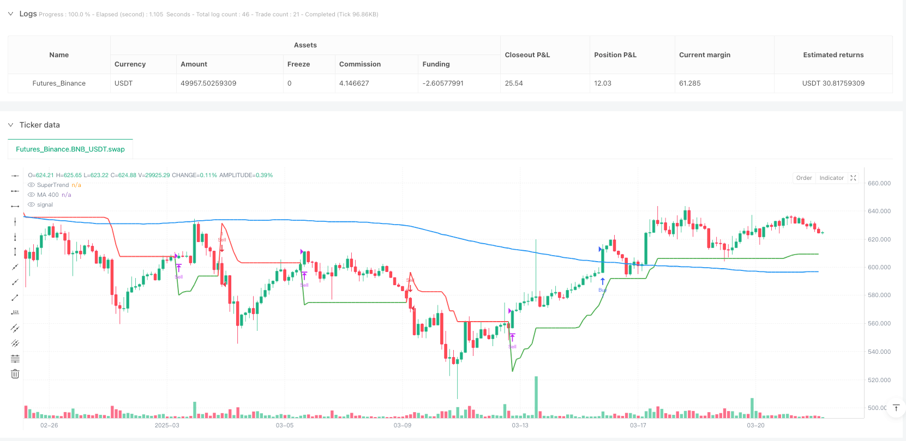
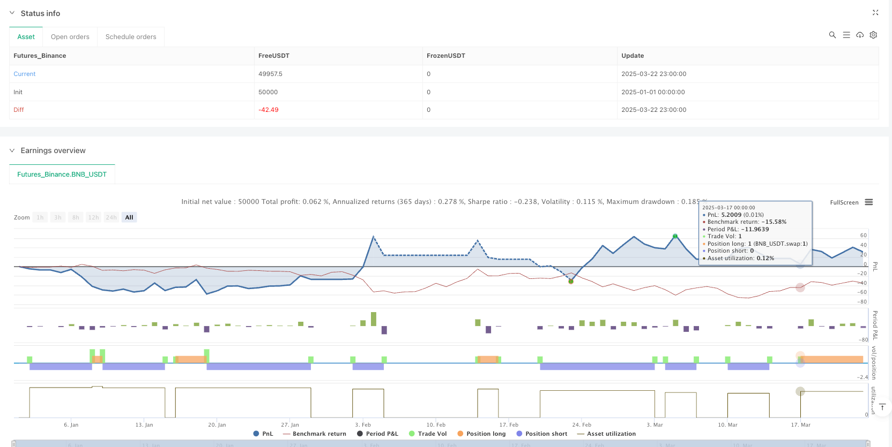

> Name

Long-term-Trend-and-Volatility-Recognition-Combined-Exponential-Moving-Average-SuperTrend-Quantitative-Trading-Strategy
> Author

ianzeng123

> Strategy Description





[trans]

#### Overview
The exponential moving average super trend quantitative trading strategy introduced in this article is a trading system that combines long-term trend analysis and volatility identification. This strategy mainly uses EMA 200 (200-period exponential moving average) to determine the long-term trend direction of the market, and combines it with the SuperTrend indicator to provide precise entry and exit signals. The strategy operates on the H2 (2-hour) time frame and generates trading signals by identifying price in relation to moving averages and the color changes of the SuperTrend indicator. The core of this strategy is to only trade when the long-term trend is consistent with the short-term volatility confirmation signal, thus increasing the probability of successful trading.
#### Strategy Principle
From the code analysis, the core principle of this strategy is based on the synergy of two main technical indicators:
1. **Moving Average (MA 200)**: The SMA (Simple Moving Average) used in the code is set to a period of 200. This indicator is used to determine the long-term trend of the market. When the price is above the MA 200, it indicates that the market is in a long-term uptrend; when the price is below the MA 200, it indicates that the market is in a long-term downtrend. `ma_400 = ta.sma(close, ma_length)` in the code implements this function.
2. **SuperTrend Indicator**: This is a trend following indicator based on ATR (average true range). In the code, the calculation of SuperTrend involves multiple steps:
   - Calculate ATR: `atr = ta.atr(period)`
   - Set upper and lower tracks: `up = hl - factor * atr` and `dn = hl + factor * atr`
   - Determine the trend based on the relationship between price and track: `trend := close > trendDown[1] ? 1 : close < trendUp[1] ? -1 : nz(trend[1], 1)`
   - Final SuperTrend line value: `superTrend = trend == 1 ? trendUp : trendDown`
The trading logic of the strategy is as follows:
- **Buy Signal**: The system generates a buy signal when the price is above MA 200 (long-term uptrend) and the SuperTrend indicator is green (value 1, short-term uptrend). The code is implemented through `longCondition = close > ma_400 and trend == 1`.
- **Sell Signal**: The system generates a sell signal when the price is below MA 200 (long-term downtrend) and the SuperTrend indicator is red (value -1, short-term downtrend). The code is implemented through `shortCondition = close < ma_400 and trend == -1`.
- **Closing logic**: When the SuperTrend trend changes (from 1 to -1 or from -1 to 1), the system will close the corresponding position. The code is implemented through `if (strategy.position_size > 0 and trend == -1)` ​​and `if (strategy.position_size < 0 and trend == 1)`.
#### Strategic Advantages
An in-depth analysis of the code of this strategy can summarize the following significant advantages:
1. **Double verification of trend confirmation**: The strategy uses two indicators, MA 200 and SuperTrend, for cross-validation. A signal will only be generated when both indicators confirm the trend direction at the same time, greatly reducing the possibility of false signals.
2. **Strong adaptability**: SuperTrend indicator is calculated based on ATR, and ATR can automatically adjust according to market volatility, allowing the strategy to maintain stable performance in different volatility environments. The `atr = ta.atr(period)` part of the code implements this adaptive feature.
3. **Clear entry and exit rules**: The strategy provides clear entry conditions and exit rules, reducing the impact of subjective judgment and helping to maintain trading discipline. Entry conditions are defined by `longCondition` and `shortCondition`, and exit rules are triggered by SuperTrend trend changes.
4. **Built-in risk control mechanism**: The strategy automatically closes positions when the trend reverses, effectively controlling the loss range of a single transaction. The `strategy.close` function in the code ensures timely exit from the market when the trend reverses.
5. **Visually intuitive**: The strategy plots the MA 200 and SuperTrend lines on the chart, and the color coding (green indicates an uptrend, red indicates a downtrend) allows traders to visually identify the market state. This is achieved through the `plot` function.
#### Strategy Risk
While this strategy has several advantages, the following potential risks can also be identified from code analysis:
1. **Lagging in trend reversal**: The moving average is a lagging indicator, which may produce delayed signals at trend turning points, resulting in insufficient timely entry or exit. In particular, the 200-period moving average responds slowly and may cause larger losses in fast markets.
2. **No fixed stop loss setting**: There is no clear stop loss strategy in the code, and it only relies on trend reversal signals to close positions, which may lead to large losses when the market gap (gap) or rapid changes. It is recommended to add a fixed stop loss point, such as the `strategy.exit` function to set the stop loss.
3. **Parameter Sensitivity**: The performance of SuperTrend largely depends on its parameter settings (ATR period and multiplier). The current code uses fixed parameters (ATR period 14, multiplier 3.0) which may not apply to all market conditions.
4. **Excessive Trading Risk**: In a consolidating market, MA 200 and SuperTrend may frequently send conflicting signals, resulting in multiple invalid trades and additional trading costs.
5. **Limitations of a single time frame**: The strategy is only analyzed on the H2 time frame and lacks multi-time frame confirmation, which may miss important turning points in the context of the larger trend.
#### Strategy optimization direction
Based on code analysis, the following are several potential optimization directions for this strategy:
1. **Dynamic parameter adjustment**: SuperTrend parameters can be automatically adjusted according to market volatility. For example, increase the ATR multiplier in high volatility markets and decrease the multiplier in low volatility markets. This can be achieved by adding a volatility condition:   
```
   volatility_condition = ta.atr(14) / close * 100
   dynamic_factor = volatility_condition > 2 ? 4.0 : 3.0
   
```

2. **Add Fixed Stop Loss and Profit Targets**: Set clear stop loss and take profit levels for each trade instead of relying solely on trend reversals. This can be achieved by adding the `strategy.exit` command:   
```
   strategy.exit("Exit Long", "Buy", stop=entry_price * 0.98, limit=entry_price * 1.04)
   
```

3. **Add filter conditions**: Introduce other indicators such as RSI or MACD as filters to reduce false signals. For example, only accept signals when the RSI is not at extreme levels:   
```
   rsi_value = ta.rsi(close, 14)
   valid_signal = rsi_value > 30 and rsi_value < 70
   longCondition := longCondition and valid_signal
   
```

4. **Multiple time frame analysis**: Combined with trend analysis of higher time frames (such as daily or weekly) to ensure that the trading direction is consistent with the larger trend. This requires using the `security` function to bring in higher time frame data.
5. **Trading volume confirmation**: Add trading volume analysis to ensure that signals are generated with the support of significant trading volume and improve signal reliability. You can check whether the trading volume is above average by:   
```
   volume_confirmation = volume > ta.sma(volume, 20)
   longCondition := longCondition and volume_confirmation
   
```

#### Summary
The Exponential Moving Average Super Trend Quantitative Trading Strategy is a complete trading system that combines long-term trend analysis and short-term volatility identification. By using the MA 200 to determine the long-term trend direction, combined with the SuperTrend indicator to provide precise entry and exit signals, this strategy is designed to capture significant trending moves.
The core advantage of the strategy is its double confirmation mechanism, which effectively reduces false signals, while the ATR-based SuperTrend indicator provides adaptive capabilities to market volatility. However, this strategy also has some potential risks, such as hysteresis, lack of fixed stop loss, parameter sensitivity, etc.
By introducing optimization measures such as dynamic parameter adjustment, fixed stop loss/take profit levels, additional filter conditions, multi-time frame analysis and transaction volume confirmation, the stability and profitability of the strategy can be further improved. Taken together, this is a trend following strategy with a solid foundation and clear logic, suitable for application in a market environment with moderate volatility.
Code analysis shows that the strategy logic itself is universal and can be applied to various trading markets and varieties. As a quantitative trading system, it provides a good starting point from which traders can further customize and optimize based on their own risk appetite and market environment. ||
#### Overview
The Exponential Moving Average SuperTrend Quantitative Trading Strategy introduced in this article is a trading system that combines long-term trend analysis with volatility recognition. The strategy primarily uses EMA 200 (200-period Exponential Moving Average) to determine the long-term trend direction of the market, and combines the SuperTrend indicator to provide precise entry and exit signals. The strategy operates on the H2 (2-hour) timeframe, generating trading signals by identifying the relationship between price and moving averages, as well as color changes in the SuperTrend indicator. The core of this strategy is to trade only when both the long-term trend and short-term volatility confirmation signals align, thereby increasing the success rate of trades.

#### Strategy Principles
From analyzing the code, the core principles of this strategy are built on the synergistic effect of two main technical indicators:

1. **Moving Average (MA 200)**: The code uses SMA (Simple Moving Average) set to 200 periods. This indicator is used to determine the long-term market trend. When the price is above MA 200, it indicates the market is in a long-term uptrend; when the price is below MA 200, it indicates the market is in a long-term downtrend. This functionality is implemented in the code with `ma_400 = ta.sma(close, ma_length)`.

2. **SuperTrend Indicator**: This is a trend-following indicator based on ATR (Average True Range). In the code, SuperTrend calculation involves several steps:
   - Calculating ATR: `atr = ta.atr(period)`
   - Setting upper and lower bands: `up = hl - factor * atr` and `dn = hl + factor * atr`
   - Determining trend based on price relationship with bands: `trend := close > trendDown[1] ? 1 : close < trendUp[1] ? -1 : nz(trend[1], 1)`
   - Final SuperTrend line value: `superTrend = trend == 1 ? trendUp : trendDown`

The trading logic of the strategy is as follows:
- **Buy Signal**: When the price is above MA 200 (long-term uptrend) and the SuperTrend indicator is green (value 1, short-term uptrend), the system generates a buy signal. This is implemented in the code with `longCondition = close > ma_400 and trend == 1`.
- **Sell Signal**: When the price is below MA 200 (long-term downtrend) and the SuperTrend indicator is red (value -1, short-term downtrend), the system generates a sell signal. This is implemented in the code with `shortCondition = close < ma_400 and trend == -1`.
- **Position Closing Logic**: When the SuperTrend trend changes (from 1 to -1 or from -1 to 1), the system closes the corresponding position. This is implemented in the code with `if (strategy.position_size > 0 and trend == -1)` and `if (strategy.position_size < 0 and trend == 1)`.

#### Strategy Advantages
Through in-depth analysis of the strategy's code, the following significant advantages can be summarized:

1. **Dual Verification of Trend Confirmation**: The strategy uses two indicators, MA 200 and SuperTrend, for cross-validation. Signals are only generated when both indicators confirm the trend direction, greatly reducing the possibility of false signals.

2. **Strong Adaptability**: The SuperTrend indicator is calculated based on ATR, which automatically adjusts according to market volatility, making the strategy maintain stable performance in different volatility environments. This adaptive feature is implemented in the code with `atr = ta.atr(period)`.

3. **Clear Entry and Exit Rules**: The strategy provides clear entry conditions and exit rules, reducing the impact of subjective judgment and helping maintain trading discipline. Entry conditions are defined by `longCondition` and `shortCondition`, and exit rules are triggered by SuperTrend trend changes.

4. **Built-in Risk Control Mechanism**: The strategy automatically closes positions when the trend reverses, effectively controlling the loss extent of a single trade. The `strategy.close` function in the code ensures timely exit from the market when the trend reverses.

5. **Visual Intuitiveness**: The strategy plots MA 200 and SuperTrend lines on the chart, with color coding (green for uptrend, red for downtrend) allowing traders to intuitively identify market conditions. This is implemented through the `plot` function.

#### Strategy Risks
Despite the many advantages of this strategy, the following potential risks can also be identified from the code analysis:

1. **Lag during Trend Reversals**: Moving averages are lagging indicators and may produce delayed signals at trend turning points, leading to untimely entries or exits. Especially the 200-period moving average reacts slowly and may cause significant losses in fast markets.

2. **No Fixed Stop Loss Setting**: There is no explicit stop-loss strategy in the code, relying only on trend reversal signals to close positions, which may lead to significant losses during market gaps or rapid changes. It is recommended to add fixed stop-loss levels, such as using the `strategy.exit` function to set stop-losses.

3. **Parameter Sensitivity**: The performance of SuperTrend largely depends on its parameter settings (ATR period and multiplier). The current code uses fixed parameters (ATR period 14, multiplier 3.0), which may not be suitable for all market conditions.

4. **Risk of Overtrading**: In consolidating markets, MA 200 and SuperTrend may frequently issue contradictory signals, leading to multiple ineffective trades and additional trading costs.

5. **Single Timeframe Limitation**: The strategy analyzes only on the H2 timeframe, lacking multi-timeframe confirmation, which may miss important turning points in the context of larger trends.

#### Strategy Optimization Directions
Based on code analysis, here are several potential optimization directions for this strategy:

1. **Dynamic Parameter Adjustment**: Automatically adjust SuperTrend parameters based on market volatility. For example, increase the ATR multiplier in high-volatility markets and decrease it in low-volatility markets. This can be implemented by adding volatility condition judgments:
   
```
   volatility_condition = ta.atr(14) / close * 100
   dynamic_factor = volatility_condition > 2 ? 4.0 : 3.0
   
```

2. **Add Fixed Stop Loss and Profit Targets**: Set clear stop-loss and take-profit levels for each trade, rather than relying solely on trend reversals. This can be implemented by adding the `strategy.exit` command:
   
```
   strategy.exit("Exit Long", "Buy", stop=entry_price * 0.98, limit=entry_price * 1.04)
   
```

3. **Add Filtering Conditions**: Introduce other indicators such as RSI or MACD as filters to reduce false signals. For example, only accept signals when RSI is not at extreme levels:
   
```
   rsi_value = ta.rsi(close, 14)
   valid_signal = rsi_value > 30 and rsi_value < 70
   longCondition := longCondition and valid_signal
   
```

4. **Multi-Timeframe Analysis**: Combine trend analysis from higher timeframes (such as daily or weekly) to ensure the trading direction aligns with the larger trend. This requires using the `security` function to introduce higher timeframe data.

5. **Volume Confirmation**: Add volume analysis to ensure signals are generated with significant volume support, increasing signal reliability. This can be done by checking if the volume is above the average level:
   
```
   volume_confirmation = volume > ta.sma(volume, 20)
   longCondition := longCondition and volume_confirmation
   
```

#### Summary
The Exponential Moving Average SuperTrend Quantitative Trading Strategy is a complete trading system that combines long-term trend analysis with short-term volatility recognition. By using MA 200 to determine the long-term trend direction and combining the SuperTrend indicator to provide precise entry and exit signals, this strategy aims to capture significant trending market conditions.

The core advantage of the strategy lies in its dual confirmation mechanism, effectively reducing false signals, while the ATR-based SuperTrend indicator provides adaptability to market volatility. However, the strategy also has some potential risks, such as lag, lack of fixed stop-loss, parameter sensitivity, etc.

By introducing dynamic parameter adjustment, fixed stop-loss/take-profit levels, additional filtering conditions, multi-timeframe analysis, and volume confirmation, the stability and profitability of the strategy can be further improved. Overall, this is a trend-following strategy with solid foundations and clear logic, suitable for application in moderately volatile market environments.

Code analysis shows that the strategy logic itself is universal and can be applied to various trading markets and instruments. As a quantitative trading system, it provides a good starting point, and traders can further customize and optimize it based on their risk preferences and market environment.[/trans]


> Source (PineScript)

``` pinescript
/*backtest
start: 2025-01-01 00:00:00
end: 2025-03-23 00:00:00
period: 3h
basePeriod: 3h
exchanges: [{"eid":"Futures_Binance","currency":"BNB_USDT"}]
*/

//@version=6
strategy("Moving Average + SuperTrend Strategy", overlay=true)

// === Indicator Settings ===
ma_length = input.int(200, title="Moving Average Length")
factor = input.float(3.0, title="SuperTrend Factor")
period = input.int(14, title="SuperTrend Period")

// === Calculate Moving Average (MA 400) ===
ma_400 = ta.sma(close, ma_length)

// === Calculate SuperTrend ===
src = close
hl = math.avg(high, low)
atr = ta.atr(period)

up = hl - factor * atr
dn = hl + factor * atr

trendUp = 0.0
trendDown = 0.0
trend = 0

trendUp := close[1] > trendUp[1] ? math.max(up, trendUp[1]) : up
trendDown := close[1] < trendDown[1] ? math.min(dn, trendDown[1]) : dn
trend := close > trendDown[1] ? 1 : close < trendUp[1] ? -1 : nz(trend[1], 1)

superTrend = trend == 1 ? trendUp : trendDown

// === Entry and Exit Conditions ===
longCondition = close > ma_400 and trend == 1
shortCondition = close < ma_400 and trend == -1

// === Execute Trades ===
if (longCondition)
    strategy.entry("Buy", strategy.long)

if (shortCondition)
    strategy.entry("Sell", strategy.short)

// === Exit Trades ===
if (strategy.position_size > 0 and trend == -1)
    strategy.close("Buy")

if (strategy.position_size < 0 and trend == 1)
    strategy.close("Sell")

// === Plot Indicators on the Chart ===
plot(ma_400, color=color.blue, linewidth=2, title="MA 400")
plot(superTrend, color=trend == 1 ? color.green : color.red, linewidth=2, title="SuperTrend")

```

> Detail

https://www.fmz.com/strategy/488023

> Last Modified

2025-03-24 14:42:13
