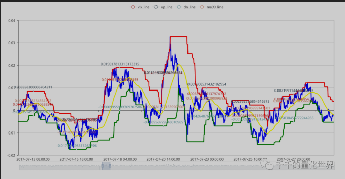
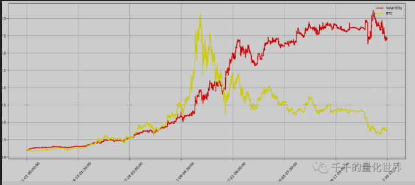
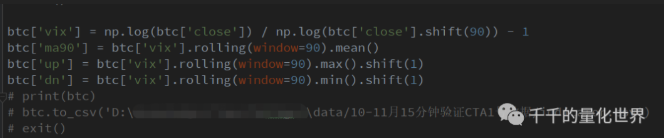
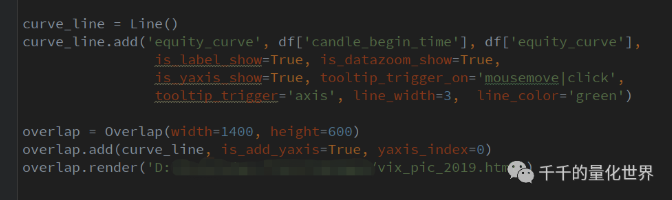

> Name

Lu Shen-Simple Volatility Strategy
> Author

Lentils
> Strategy Description

Complete T-Shen public account, Lv Shen’s special strategy translation.
The following is the reproduced content,
Please pay more attention to "Qianqian's Quantitative World" to get more strategy source codes!!
Also give yourself an advertisement~
Public account "Lengdouzi's Quantitative Log"
Give everyone a daily public execution and online quantified bankruptcy~
There are many more benefits for you~
this is just
Demo!!
Demo!!
Demo, hello!!
Dads!! Be careful when making real offers!!
--------

Make good use of volatility and outperform the BTC market is that simple!
Original Lu Yangyang Qianqian’s Quantitative World 3 days ago
"The research and development of quantitative strategies actually has two sides. It is very difficult for those who are just getting started. It is not only the code at the "technical" level, but also the strategic and logical thinking at the "strategic" level. Both are important and must not be biased. "


Hello, fellow friends of Qianqian Quantification! ! !


This article is the second issue of specially invited articles. Qianqian is honored to invite Master Lu Yangyang (WeChat ID LE_CHIFFRE1) to introduce to you: how to use the volatility factor to easily outperform the BTC market and achieve "dimensionality reduction strike"!
Lu Shen comes from a traditional quantitative investment institution and has been deeply involved in the currency exchange business. He has rich experience and unique insights in the quantitative field. The content of this issue of Lu Shen covers inspiration, coding implementation, personal insights, etc. It is full of useful information. Qianqian herself felt that she benefited a lot from reading it. She really admires and thanks Lu Shen. I strongly recommend everyone to read it carefully!
Now let’s give a round of applause to Lu Shen to introduce the volatility strategy to everyone.

01

—


introduction


Hello everyone, today I am honored to publish an article on the "Qianqian's Quantification" public account, and I would also like to thank Boss T (one of Qianqian's nicknames) for the invitation. This is my first time writing an article for Boss T. I am completely free to use my spare time after work. Please correct the quality and errors and include them in the article. Thank you all. 

Boss T said to write something quantitative, but he didn’t give any scope. He really didn’t know where to start. Then start with the topics you most enjoy discussing with others. Quantitative indicators and strategies (which can be assisted or automated). Of course, in the end we have to add a cliché: "Investment is risky, so you need to be cautious when entering the market." Strategies only provide ideas and reference for everyone, and you are responsible for your profits and losses. All profits and losses from using this strategy have nothing to do with myself and the main body of the "Qianqian Quantitative World" public account.

Now that the disclaimer is out of the way, let’s get down to business.


02

—


A simple volatility strategy


People who know me well know that personally, I don’t really like Alpha’s gameplay. Relatively speaking, I believe in Beta more and study Beta more. As for why, e.........mmmmm, I don't know how to answer~~, please make up your own mind. If you are interested, you can send a private message or leave a message to the author of the public account. If the logic is clear and distinctive, the author himself will send a small red envelope to everyone.
The research and development of quantitative strategies actually has two sides. It is very difficult for those who are just getting started. It is not only the code at the "technical" level, but also the strategic and logical thinking at the "strategic" level. Both are important and must not be taken in either direction. The strategy I will introduce to you today is actually inspired by a research report from Huatai many years ago. Please read it carefully and it is just an inspiration. The reason why I say this is because the logic of this strategy is completely different from what was mentioned in the research report. Let’s chat with Mr. T privately about the specific research report.
This strategy algorithm adopts the rolling yield fluctuation principle of the logarithmic price rise and fall in a certain period. Based on the fluctuation interval, it calculates the rolling highest value and the minimum value in a certain period. The highest value is used as the upper channel, and the minimum value is used as the lower channel. If it breaks through the upper channel, a position is opened. The rolling average of the upper and lower pipelines is used as the closing line. (Knock on the blackboard here!)
For the specific graphic visualization interface, please refer to the PPT below. This graphic was drawn by me using Pyecharts. Please contact Mr. T privately for the specific code.
  


In fact, this strategy was the one I used to build broad-based ETFs before. Of course, it was also used for index timing for stock trading. Later, I moved it directly to the currency circle. I was shocked to find that the parameters did not need to be changed in a real dimensionality reduction attack.


  


The figure below shows the performance of the backtest that year. The specific code logic screenshots are as follows:

  


The above is actually to calculate the indicator data through pandas after reading the data.

  


After the calculation is completed, the data can be output through the pd.to_csv() function and the pyecharts used in the screenshot above can be used for visual output (note: I am using an old version of pyecharts).


All the specific strategies, visualizations, and performance indicator codes are still privately chatted with Mr. T.


03

—

Random talk about quantification


Next I will mainly talk about two points. First: Some people have many questions or say why you people can publish the real strategy. Are you fake liars? Or is it really about saving all sentient beings? Haha~~. First of all, a good strategy is not afraid of disclosure. This is not a weapon development for war-level confrontation, which will determine life and death. Therefore, I and other organizations or individuals are not afraid of so-called strategic secrets, because in my opinion, CTA has no secrets. It’s just ideas that everyone thinks of and doesn’t think of. Secondly, this version is my oldest version. On this basis, I have made several upgrades, such as adding other conditional judgments, stop-profit and stop-loss, etc., and of course, it also includes parameter adjustments for other types of cycles, etc.


Second: Many people, whether they are newbies, already started, or even experienced players, need sources of inspiration, including stock factor mining, timing strategy ideas, etc. These often come from subjective experience, research reports, communication in the circle, etc. It is not ruled out that some purchased strategies on the market can be read and understood, and modified according to their own risk tolerance and specific needs.


Finally, to summarize, quantification is originally an imported product, and programmatic trading is a subset of quantification. As early as when I was in college (around 2009), people have been involved in TB, pyramid and other programs. If we continue to do it today, it can be said that these people who were the first to foresee and foresight have been there for 10 years, and this does not include those who "brought back" high-frequency strategies and systems from Wall Street. Therefore, quantitative strategies or programmatic strategies have been going on in China for some time, but in terms of current market share, participants, and policy support, quantification is still a very small part of the market, even though research reports on multi-factor analysis and strategy modeling are flying everywhere. Some people like to use brainless logic to compare this with the United States, believing that China's quantitative future development trends will be the same as those of the United States, with explosive growth and so on. However, this is not Ruixing’s “coffee and small pot of tea” business logic. China has Chinese characteristics, and the road ahead is still thorny and bumpy. Therefore, we have also gathered a large circle of institutional and individual investors, hoping that everyone can get to know, communicate and grow together, and make a small contribution to this industry.


Finally, I would like to thank the "Qianqian Quantification" public account for its trust in my profession and the invitation to write articles. If you have any specific code and strategy questions, please send a private message to me or Mr. T. I am also in Mr. T’s group.


Finally, thank you again Shen Lu for your wonderful explanation!
Friends who have not joined the quantitative discussion group, please join the group to receive learning materials! ! !
Thousands of deities guard the building!

  


Scan on WeChat
Follow this public account
> Strategy Arguments


|Argument|Default|Description|
|----|----|----|
|N|90|Index calculation period|
|Amount|100|Order quantity|

> Source (javascript)

``` javascript
/*backtest
start: 2019-04-18 00:00:00
end: 2020-04-17 23:59:00
period: 15m
exchanges: [{"eid":"Futures_BitMEX","currency":"XBT_USD"}]
*/

// 胖友们!! 实盘前请注意!! 此内容仅是吕神翻译demo, 上实盘请自行添加相关内容.
// 是Demo!!! 实盘谨慎!!!

// 初始化
exchange.SetContractType('XBTUSD')
var vix_arr = []
var vix_ma = []
var vix_ma_up = []
var vix_ma_dw = []
var LastBarTime = 0
var isFirst = true

function initVix() {
    records = _C(exchange.GetRecords)
    Log(records.length)
    if (records && records.length > 2 * N + 2) {
        // 初始化前N个vix值
        for (var i = -2; i < N - 1; i++) {
            Bar = records[records.length - N + i]
            lastNbar = records[records.length - N + i - N]
            Vix()
        }
    }
    // Log("vix_arr", vix_arr.length, vix_arr)
    // Log("vix_ma", vix_ma.length, vix_ma)
    // Log("vix_ma_up", vix_ma_up.length, vix_ma_up)
    // Log("vix_ma_dw", vix_ma_dw.length, vix_ma_dw)
}

// 获取交易所信息
function UpdateInfo() {
    account = _C(exchange.GetAccount)
    pos = _C(exchange.GetPosition)
    records = _C(exchange.GetRecords)
    Bar = records[records.length - 1]
    lastNbar = records[records.length - N]
    ticker = _C(exchange.GetTicker)
}

// 计算波动率及上下轨
function Vix() {
    // 当每K结束时计算
    if (LastBarTime !== Bar.Time) {
        // 当K达到计算根数开始计算vix_arr
        if (records && records.length > N) {
            // 获取vix 当前close自然对数 除以 前90根自然对数 减一
            vix = Math.log(Bar.Close) / Math.log(lastNbar.Close) - 1
            vix_arr.push(vix)
            //Log("vix_arr", vix_arr)
        }
        // 当vix_arr达到计算根数时开始计算vix_ma
        if (vix_arr && vix_arr.length > N) {
            // 获取对应周期vix算其移动平均值
            vix_ma = TA.MA(vix_arr, N)
            // 去除ma中的null值
            vix_ma = vix_ma.filter(function(val) {
                return !(!val || val === "");
            })
            //Log("vix_ma", vix_ma)
            // 获取上下通道
            vix_up = TA.Highest(vix_arr, N)
            vix_dw = TA.Lowest(vix_arr, N)
            vix_ma_up.push(vix_up)
            vix_ma_dw.push(vix_dw)
            // Log("vix_ma_up", vix_ma_up)
            //Log("vix_ma_dw", vix_ma_dw)
            // 限制所有数组长度
            if (vix_arr.length > 2000) {
                vix_arr.splice(0, 1);
            }
            if (vix_ma.length > 2000) {
                vix_ma.splice(0, 1);
            }
            if (vix_ma_up.length > 2000) {
                vix_ma_up.splice(0, 1);
            }
            if (vix_ma_dw.length > 2000) {
                vix_ma_dw.splice(0, 1);
            }
        }
        LastBarTime = Bar.Time
    }
}

// 画线
function PlotMA_Kline(records, isFirst) {
    //$.PlotRecords(records, "K")
    if (isFirst) {
        for (var i = records.length - 1 - N; i <= records.length - 1; i++) {
            if (vix_ma[i] !== null) {
                $.PlotLine("vix_arr", vix_arr[i], records[i].Time)
                $.PlotLine("vix_ma", vix_ma[i], records[i].Time)
                $.PlotLine("vix_ma_up", vix_ma_up[i], records[i].Time)
                $.PlotLine("vix_ma_dw", vix_ma_dw[i], records[i].Time)
            }
        }
        PreBarTime = records[records.length - 1].Time
    } else {
        if (PreBarTime !== records[records.length - 1].Time) {
            $.PlotLine("vix_arr", vix_arr[vix_arr.length - 2], records[records.length - 2].Time)
            $.PlotLine("vix_ma", vix_ma[vix_ma.length - 2], records[records.length - 2].Time)
            $.PlotLine("vix_ma_up", vix_ma_up[vix_ma_up.length - 2], records[records.length - 2].Time)
            $.PlotLine("vix_ma_dw", vix_ma_dw[vix_ma_dw.length - 2], records[records.length - 2].Time)
            PreBarTime = records[records.length - 1].Time
        }
        $.PlotLine("vix_arr", vix_arr[vix_arr.length - 1], records[records.length - 1].Time)
        $.PlotLine("vix_ma", vix_ma[vix_ma.length - 1], records[records.length - 1].Time)
        $.PlotLine("vix_ma_up", vix_ma_up[vix_ma_up.length - 1], records[records.length - 1].Time)
        $.PlotLine("vix_ma_dw", vix_ma_dw[vix_ma_dw.length - 1], records[records.length - 1].Time)
    }
}

// 交易逻辑
function onTick() {
    // 无仓位时
    if (pos.length == 0) {
        // Long 当前K线的收盘价 > 上轨 && 之前K线的收盘价 <= 上轨
        if (vix_arr[vix_arr.length - 1] > vix_ma_up[vix_ma_up.length - 1] &&
            vix_arr[vix_arr.length - 2] <= vix_ma_up[vix_ma_up.length - 2]) {
            exchange.SetDirection("buy")
            exchange.Buy(ticker.Sell, Amount)
            $.PlotFlag(new Date().getTime(), 'Buy', 'BK')
        }
        // Short 当前K线的收盘价 < 下轨 && 之前K线的收盘价 >= 下轨
        if (vix_arr[vix_arr.length - 1] < vix_ma_dw[vix_ma_dw.length - 1] &&
            vix_arr[vix_arr.length - 2] >= vix_ma_dw[vix_ma_dw.length - 2]) {
            exchange.SetDirection("sell")
            exchange.Sell(ticker.Buy, Amount)
            $.PlotFlag(new Date().getTime(), 'Sell', 'SK')
        }
    }
    // 多仓时
    if (pos.length > 0 && pos[0].Type == 0) {
        // 平多 当前K线的收盘价 < 中轨 && 之前K线的收盘价 >= 中轨
        if (vix_arr[vix_arr.length - 1] < vix_ma[vix_ma.length - 1] &&
            vix_arr[vix_arr.length - 2] >= vix_ma[vix_ma.length - 2]) {
            exchange.SetDirection("closebuy")
            exchange.Sell(ticker.Buy, pos[0].Amount)
            $.PlotFlag(new Date().getTime(), 'Sell', 'SBK')
        }
    }
    // 空仓时
    if (pos.length > 0 && pos[0].Type == 1) {
        // 平空 当前K线的收盘价 > 中轨 && 之前K线的收盘价 <= 中轨
        if (vix_arr[vix_arr.length - 1] > vix_ma[vix_ma.length - 1] &&
            vix_arr[vix_arr.length - 2] <= vix_ma[vix_ma.length - 2]) {
            exchange.SetDirection("closesell")
            exchange.Buy(ticker.Sell, pos[0].Amount)
            $.PlotFlag(new Date().getTime(), 'Buy', 'PSK')
        }
    }
}

function main() {
    initVix()
    while (1) {
        UpdateInfo()
        Vix()
        onTick()
        if (records) {
            PlotMA_Kline(records, isFirst)
            //Log('画线')
            isFirst = false
        }
        Sleep(5 * 1000)
    }
}
```

> Detail

https://www.fmz.com/strategy/200131

> Last Modified

2020-04-23 12:25:16
