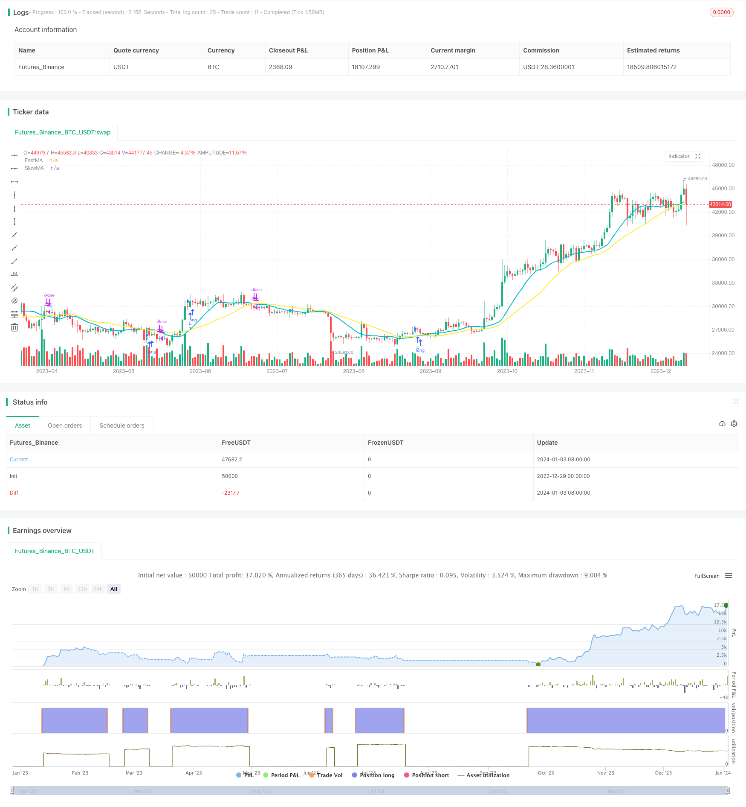

> Name

Adaptive-Backtest-Date-Range-Selection-Strategy-Based-on-Double-MA based on double MA superposition
> Author

ChaoZhang

> Strategy Description


[trans]

## Overview
The core idea of ​​this strategy is to implement a framework that can flexibly select the backtest time range, allowing users to automatically or manually set the start and end time of the backtest according to different needs.
The strategy provides four date range selection methods through input parameters: using all historical data, the most recent specified number of days, the most recent specified number of weeks, or manually specifying the date range. The strategy will dynamically set the backtest window according to the selected date range, while the trading logic remains unchanged, so that the differences in strategy performance under different time windows can be compared.
## Strategy Principle
This strategy consists of a backtest date range selection module and a double MA trading strategy module.
### Backtest date range selection module
1. Four date range selection methods are provided: all historical data (ALL), the most recently specified number of days (DAYS), the most recently specified number of weeks (WEEKS), and manually specified date range (MANUAL).
2. According to the selected range, dynamically set the start and end time of the backtest through timestamp conversion.
3. Use the time condition window() function to filter the K-line and perform backtesting only within the selected date range.
### Double MA trading strategy module
1. The fast MA period is fastMA, the default is 14; the slow MA period is slowMA, the default is 28.
2. When the fast MA crosses above the slow MA, go long; when the fast MA crosses below the slow MA, close the position.
3. Draw the curve of fast and slow MA.
## Strategic advantage analysis
1. You can flexibly choose different backtest time ranges without restrictions to meet different experimental needs.
2. The effects of different cycle parameters can be tested within the same time range, and the results are comparable.
3. Modifying the trading logic is simple and can be used as a framework for other strategies.
4. The double MA strategy is simple and easy to understand and easy to get started.
## Risk and solution analysis
1. The double MA strategy is relatively rough and has the problem of frequent buying and selling. You can consider adding a stop-loss mechanism and other optimizations.
2. Be careful when setting the date range manually to avoid using the wrong date. Prompt information can be displayed. 
3. If the full historical backtest time is too long, the test cycle will be increased. Consider increasing slippage or lowering fees for frequent transactions.
## Strategy optimization direction
1. Increase stop loss logic judgment and reduce the risk of loss.
2. Add stock pool filtering to select stocks with strong index correlation to improve stability.  
3. Add a filter for trading signals to filter out unstable signals within a certain period and reduce unnecessary transactions.
4. Test the performance of stocks related to different sub-indexes and find the best varieties.
## Summarize
As a general backtest date range framework, this strategy has the advantage of being flexible and customizable, and can meet the different testing needs of users. With simple and effective dual MA trading logic, strategies can be quickly verified and compared. Subsequent optimization can be done by adding filters, stop-loss logic, etc., bringing the strategy one step closer to actual application. Overall, this strategic framework has good expansibility and reference value.
||

## Overview

The core idea of this strategy is to implement a framework that can flexibly select the backtest date range to meet different needs of users, so that they can automatically or manually set the start and end times for backtest. 

The strategy provides four options for date range selection through input parameters: using all history data, recent specified days, recent specified weeks or manually specifying a date range. The strategy will dynamically set the backtest window based on the selected date range, while keeping the trading logic unchanged, so that the performance difference under different time windows can be compared.

## Strategy Principle  

The strategy consists of two modules: backtest date range selection and double MA trading strategy.

### Backtest Date Range Selection Module

1. Provides four options for date range selection: all history data (ALL), recent specified days (DAYS), recent specified weeks (WEEKS), manually specified date range (MANUAL).  
2. Dynamically sets the backtest start and end time based on timestamp conversion of the selected range.
3. Uses time condition window() function to filter candles and only do backtest within selected date range.

### Double MA Trading Strategy Module   

1. Fast MA period is fastMA, default 14; slow MA period is slowMA, default 28.  
2. Long when fast MA crosses over slow MA; close position when fast MA crosses below slow MA.
3. Plots fast and slow MA curves.  

## Analysis of Advantages

1. Flexibly selects different backtest date ranges without limitation to meet different experimental needs.  
2. Can test the effects of different period parameters within the same time frame with comparability of results.
3. Easy to modify trading logic to serve as framework for other strategies. 
4. Simple to understand double MA strategy, easy for beginners.

## Analysis of Risks and Solutions

1. Double MA strategy is crude with frequent buying/selling issues. Consider adding stop loss etc. for optimization.
2. Manually setting date range needs caution to avoid errors. Can show alert messages. 
3. Long history backtest increases test cycle. Can consider adding slippage or fees to reduce frequent trades.  

## Directions for Strategy Optimization

1. Add stop loss logic to lower risk of loss.  
2. Filter stocks with stocks pool by strong index relevance for higher stability. 
3. Add filters to remove unstable signals within certain periods to reduce unnecessary trades.  
4. Test performances of stocks indexes to find the best varieties.  

## Conclusion  

As a flexible and customizable framework for date range selection, the advantages are meeting different test needs of users. Combined with simple but effective double MA trading logic, it can quickly verify and compare strategies. Follow-up optimizations like adding filters or stop loss logic can make the strategy more practical for live trading. In summary, the strategy framework has good scalability and reference value.  
[/trans]

> Strategy Arguments


|Argument|Default|Description|
|----|----|----|
|v_input_1|14|FastMA|
|v_input_2|28|SlowMA|
|v_input_3|0|Date Range: WEEKS|DAYS|ALL|MANUAL|
|v_input_4|52|# Days or Weeks|
|v_input_5|9|From Month|
|v_input_6|15|From Day|
|v_input_7|2019|From Year|
|v_input_8|12|To Month|
|v_input_9|31|To Day|
|v_input_10|9999|To Year|


> Source (PineScript)

``` pinescript
/*backtest
start: 2022-12-29 00:00:00
end: 2024-01-04 00:00:00
period: 1d
basePeriod: 1h
exchanges: [{"eid":"Futures_Binance","currency":"BTC_USDT"}]
*/

//@version=4

strategy(title = "How To Auto Set Date Range", shorttitle = " ", overlay = true)

// Revision:        1
// Author:          @allanster 

// === INPUT MA ===
fastMA = input(defval = 14, title = "FastMA", type = input.integer, minval = 1, step = 1)
slowMA = input(defval = 28, title = "SlowMA", type = input.integer, minval = 1, step = 1)

// === INPUT BACKTEST RANGE ===
useRange     = input(defval = "WEEKS", title = "Date Range", type = input.string, confirm = false, options = ["ALL", "DAYS", "WEEKS", "MANUAL"])
nDaysOrWeeks = input(defval = 52, title = "# Days or Weeks", type = input.integer, minval = 1)
FromMonth    = input(defval = 9, title = "From Month", minval = 1, maxval = 12)
FromDay      = input(defval = 15, title = "From Day", minval = 1, maxval = 31)
FromYear     = input(defval = 2019, title = "From Year", minval = 2014)
ToMonth      = input(defval = 12, title = "To Month", minval = 1, maxval = 12)
ToDay        = input(defval = 31, title = "To Day", minval = 1, maxval = 31)
ToYear       = input(defval = 9999, title = "To Year", minval = 2014)

// === FUNCTION EXAMPLE ===
window() => true

// === LOGIC ===
buy  = crossover(sma(close, fastMA), sma(close, slowMA))         // buy when fastMA crosses over slowMA
sell = crossunder(sma(close, fastMA), sma(close, slowMA))        // sell when fastMA crosses under slowMA

// === EXECUTION ===
strategy.entry("L", strategy.long, when=window() and buy)        // buy long when "within window of time" AND crossover
strategy.close("L", when=window() and sell)                      // sell long when "within window of time" AND crossunder         

// === PLOTTING ===
plot(sma(close, fastMA), title = 'FastMA', color = color.aqua, linewidth = 2, style = plot.style_line)    // plot FastMA
plot(sma(close, slowMA), title = 'SlowMA', color = color.yellow, linewidth = 2, style = plot.style_line)  // plot SlowMA

```

> Detail

https://www.fmz.com/strategy/437748

> Last Modified

2024-01-05 12:12:10
