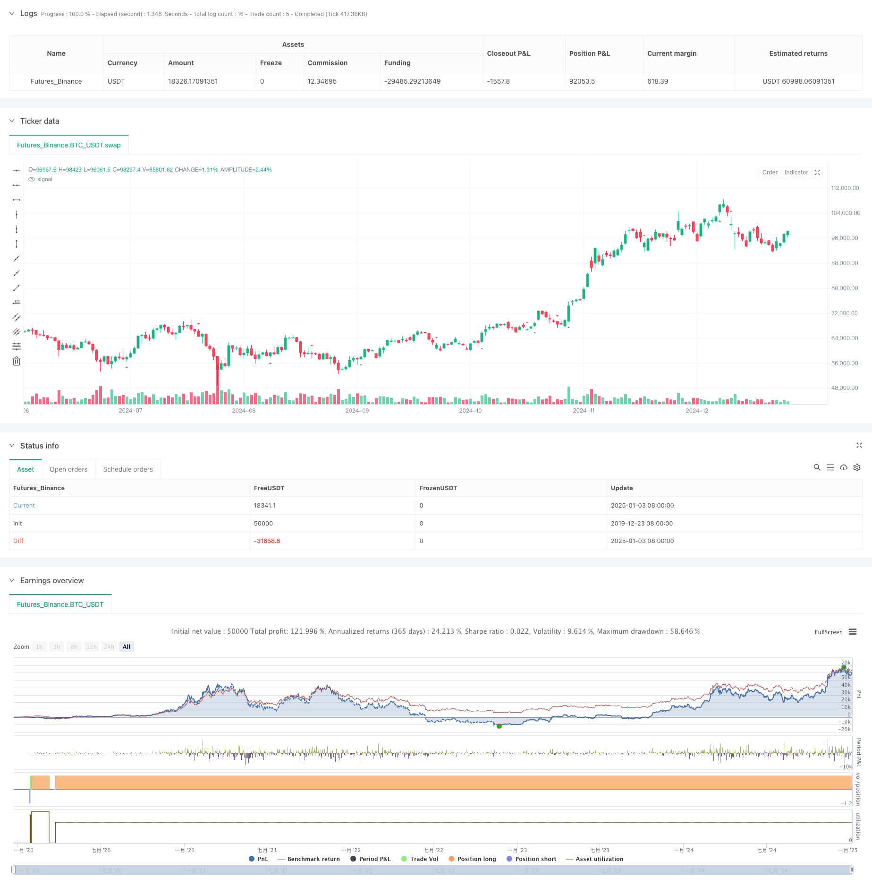

> Name

Advanced-MACD-Crossover-Trading-Strategy-with-Adaptive-Risk-Management
> Author

ChaoZhang

> Strategy Description



[trans]
#### Overview
This strategy is an advanced trading system based on the MACD (Moving Average Convergence Divergence) indicator, which achieves a comprehensive trading solution by combining MACD signals with dynamic risk management. This strategy not only focuses on the intersection of the MACD line and the signal line, but also incorporates histogram confirmation and optimizes trading results through flexible stop loss and profit setting. The strategy provides a full range of parameterized configurations, allowing it to adapt to different market environments and trading needs.
#### Strategy Principle
The core logic of the strategy is built on three main pillars:
1. The signal generation system monitors the intersection of the MACD line and the signal line and uses the MACD histogram as a trend confirmation indicator. When the MACD line crosses the signal line upward and the histogram is positive, the system generates a long signal; when the MACD line crosses the signal line downward and the histogram is negative, the system generates a short signal.
2. The risk management mechanism adopts dynamic stop loss setting, and determines the stop loss position by calculating the highest and lowest prices of a specific number of K-lines in the past, providing dynamic risk control for each transaction.
3. The profit target adopts a calculation method based on risk ratio, and the profit target position is automatically determined by setting the risk-return ratio to ensure that the risk-return ratio of each transaction remains consistent.
#### Strategic Advantages
1. Improved signal confirmation mechanism: By combining MACD crossover and histogram confirmation, the reliability of the signal is significantly improved
2. Flexible risk management: Dynamic stop loss settings can be automatically adjusted according to market fluctuations, providing better risk protection
3. Comprehensive parameterization configuration: trading direction, MACD parameters, stop loss period, risk-return ratio, etc. can be adjusted according to needs
4. Strong adaptability: the strategy can be applied to any time frame and suitable for different trading varieties
5. Clear visualization: The system provides a graphical display of trading signals to facilitate analysis and optimization.
#### Strategy Risk
1. Market fluctuation risk: In a violently volatile market, the MACD signal may lag behind, resulting in unsatisfactory entry timing.
2. False breakthrough risk: False MACD cross signals may be generated during market consolidation periods
3. Stop loss setting risks: A stop loss period that is too short may result in too frequent stop losses, and a stop loss period that is too long may result in excessive losses.
4. Parameter optimization risk: Over-optimizing parameters may lead to large deviations between the performance of the strategy in real trading and the backtest results.
#### Strategy optimization direction
1. Signal filtering: Add trading volume indicators or other technical indicators as auxiliary confirmation to improve signal quality
2. Dynamic parameters: Automatically adjust MACD parameters and stop loss settings according to market volatility to improve strategy adaptability
3. Risk management: Introduce a position management mechanism and adjust the transaction size according to the account net value and market fluctuations
4. Time filtering: Add trading time window settings to avoid trading during unfavorable market periods
5. Retracement control: Add a maximum retracement control mechanism to suspend trading when a specific retracement level is reached.
#### Summary
This strategy creates a robust trading system by combining the classic MACD indicator with modern risk management methods. Its advantages lie in the complete signal confirmation mechanism, flexible risk management, and strong parameter adjustability, making it suitable for different market environments. There is room for further improvement of the strategy through the suggested optimization directions. However, users need to pay attention to risk control, avoid over-optimization, and make appropriate adjustments according to the actual trading environment. ||
#### Overview
This strategy is an advanced trading system based on the MACD (Moving Average Convergence Divergence) indicator, combining MACD signals with dynamic risk management to create a comprehensive trading solution. The strategy not only focuses on MACD line and signal line crossovers but also incorporates histogram confirmation and flexible stop-loss and take-profit settings to optimize trading performance. It offers fully parameterized configuration options to adapt to different market conditions and trading requirements.

#### Strategy Principles
The core logic is built on three main pillars:
1. The signal generation system monitors MACD line crossovers with the signal line and uses the MACD histogram as trend confirmation. Long signals are generated when the MACD line crosses above the signal line with a positive histogram; short signals are generated when the MACD line crosses below with a negative histogram.
2. The risk management mechanism employs dynamic stop-loss settings, calculating stop-loss levels based on the highest and lowest prices of a specified number of previous candles, providing dynamic risk control for each trade.
3. Profit targets are calculated using a risk-ratio method, automatically determining take-profit levels based on a set risk-reward ratio, ensuring consistent risk-reward proportions for each trade.

#### Strategy Advantages
1. Comprehensive signal confirmation: Combining MACD crossovers with histogram confirmation significantly improves signal reliability
2. Flexible risk management: Dynamic stop-loss settings automatically adjust to market volatility, providing better risk protection
3. Extensive parameterization: Trading direction, MACD parameters, stop-loss periods, and risk-reward ratios can all be adjusted as needed
4. High adaptability: The strategy can be applied to any timeframe and is suitable for different trading instruments
5. Clear visualization: The system provides graphical display of trading signals for easy analysis and optimization

#### Strategy Risks
1. Market volatility risk: In highly volatile markets, MACD signals may lag, leading to suboptimal entry timing
2. False breakout risk: During ranging markets, false MACD crossover signals may occur
3. Stop-loss setting risk: Too short stop-loss periods may result in frequent stops, while too long periods may lead to excessive losses
4. Parameter optimization risk: Over-optimization of parameters may cause significant deviation between live trading and backtesting results

#### Strategy Optimization Directions
1. Signal filtering: Add volume indicators or other technical indicators as confirmation to improve signal quality
2. Dynamic parameters: Automatically adjust MACD parameters and stop-loss settings based on market volatility to enhance adaptability
3. Risk management: Introduce position sizing mechanisms to adjust trade size based on account equity and market volatility
4. Time filtering: Add trading time window settings to avoid trading during unfavorable market periods
5. Drawdown control: Add maximum drawdown control mechanisms to pause trading when specific drawdown levels are reached

#### Summary
This strategy creates a robust trading system by combining the classic MACD indicator with modern risk management methods. Its strengths lie in comprehensive signal confirmation, flexible risk management, and strong parameter adjustability, making it suitable for various market environments. Through the suggested optimization directions, the strategy has room for further improvement. However, users need to pay attention to risk control, avoid over-optimization, and make appropriate adjustments based on actual trading conditions.[/trans]


> Source (PineScript)

``` pinescript
/*backtest
start: 2019-12-23 08:00:00
end: 2025-01-04 08:00:00
period: 1d
basePeriod: 1d
exchanges: [{"eid":"Futures_Binance","currency":"BTC_USDT"}]
*/

//@version=5
strategy("Estrategia MACD", overlay=true)

// Parámetros entrada
direccion = input.string("ambas", "Dirección de operaciones", options=["larga", "corta", "ambas"])
velas_sl = input.int(3, "Velas para calcular Stop Loss", minval=1)
ratio = input.float(1.5, "Ratio Beneficio:Riesgo", minval=0.5)
rapida = input.int(12, "Periodo Media Rápida")
lenta = input.int(26, "Periodo Media Lenta")
senal = input.int(9, "Periodo Señal")

// Calcular MACD
[macdLinea, senalLinea, histograma] = ta.macd(close, rapida, lenta, senal)

// Señales
senal_larga = ta.crossover(macdLinea, senalLinea) and histograma > 0
senal_corta = ta.crossunder(macdLinea, senalLinea) and histograma < 0

// Gestión de riesgo
calcular_sl_largo() => ta.lowest(low, velas_sl)
calcular_sl_corto() => ta.highest(high, velas_sl)

calcular_tp(entrada, sl, es_larga) =>
    distancia = math.abs(entrada - sl)
    es_larga ? entrada + (distancia * ratio) : entrada - (distancia * ratio)

// Operaciones
sl_largo = calcular_sl_largo()
sl_corto = calcular_sl_corto()

if (direccion != "corta" and senal_larga and strategy.position_size == 0)
    entrada = close
    tp = calcular_tp(entrada, sl_largo, true)
    strategy.entry("Larga", strategy.long)
    strategy.exit("Salida Larga", "Larga", stop=sl_largo, limit=tp)

if (direccion != "larga" and senal_corta and strategy.position_size == 0)
    entrada = close
    tp = calcular_tp(entrada, sl_corto, false)
    strategy.entry("Corta", strategy.short)
    strategy.exit("Salida Corta", "Corta", stop=sl_corto, limit=tp)

// Visualización
plotshape(senal_larga and direccion != "corta", "Compra", location=location.belowbar, color=color.green, style=shape.triangleup, size=size.normal)
plotshape(senal_corta and direccion != "larga", "Venta", location=location.abovebar, color=color.red, style=shape.triangledown, size=size.normal)
```

> Detail

https://www.fmz.com/strategy/477604

> Last Modified

2025-01-06 16:34:49
