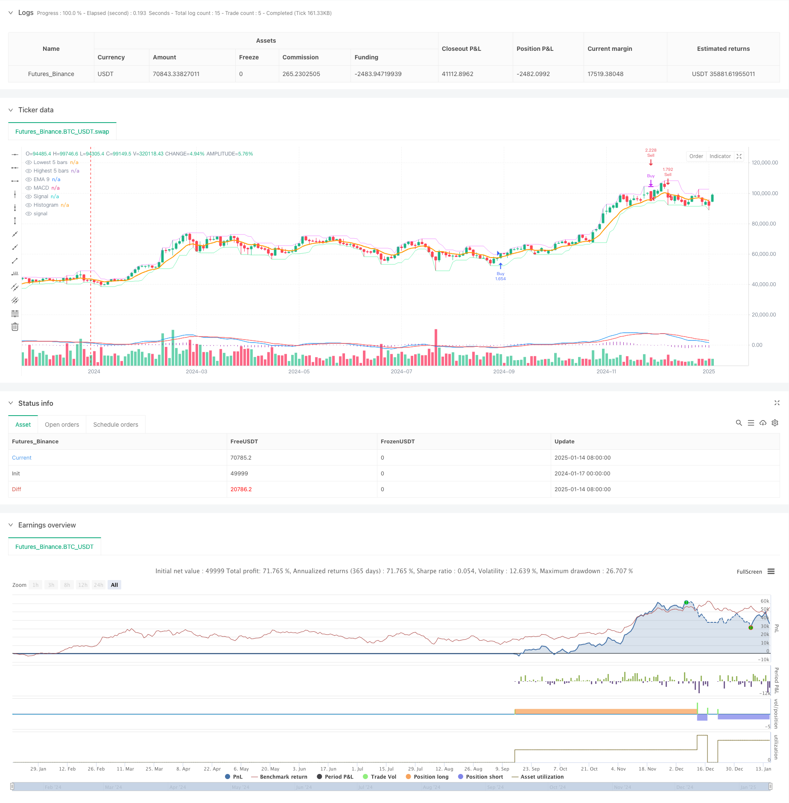

> Name

Dual-Crossover-Trend-Following-Strategy-EMA-and-MACD-Synergistic-Trading-System
> Author

ChaoZhang

> Strategy Description



[trans]
#### Overview
This strategy is a trend following trading system that combines the dual technical indicators of moving average and MACD. It mainly captures market trends through the intersection of the EMA9 moving average and the price, as well as the intersection of the fast line (DIF) and the slow line (DEA) in the MACD indicator. At the same time, the strategy adopts an adaptive stop-loss method based on the past 5 K lines, and uses a 3.5 times risk-to-return ratio to set a profit target, forming a complete trading system.
#### Strategy Principle
The core logic of the strategy is divided into two directions: long and short:
1. Long conditions: When the closing price breaks through EMA9 from bottom to top and the DIF line of MACD crosses the DEA line from bottom to top, the system sends a long signal.
2. Short selling conditions: When the closing price falls below EMA9 from top to bottom and the DIF line of MACD crosses the DEA line from top to bottom, the system sends a short selling signal.
3. Risk management:
   - The stop loss for long orders is set below the lowest point of the first 5 K lines
   - The stop loss for short orders is set above the highest point of the first 5 K lines
   - Profit target is 3.5 times stop loss distance
#### Strategic Advantages
1. Double confirmation mechanism: Through the cooperation of moving average and MACD, false signals can be effectively filtered and the accuracy of transactions can be improved.
2. Adaptive stop loss: The stop loss position is set based on recent price fluctuations, and the protection position can be automatically adjusted according to market volatility.
3. Clear risk-return ratio: A fixed risk-return setting of 3.5 times helps to achieve long-term stable profitability.
4. The strategy logic is clear: entry and exit conditions are clear and easy to understand and execute.
5. Strong adaptability: parameters can be adjusted according to different market conditions.
#### Strategy Risk
1. Risk of volatile market: In a volatile market, false breakthroughs may occur frequently, leading to continuous stop losses.
2. Slippage risk: In fast market conditions, the actual stop loss and profit prices may deviate from expectations.
3. Parameter sensitivity: The period settings of EMA and MACD have a great impact on strategy performance.
4. Trend dependence: The strategy may not perform well in a market environment without a clear trend.
#### Strategy optimization direction
1. Add trend filter: You can introduce longer period trend indicators and only open positions in the main trend direction.
2. Dynamic risk multiple: Automatically adjust the risk-return ratio based on market volatility.
3. Time filtering: Add trading time period filtering to avoid low liquidity periods.
4. Position management optimization: the position ratio can be dynamically adjusted according to signal strength.
5. Introduce volatility indicator: used to dynamically adjust stop loss distance.
#### Summary
This strategy builds a complete trend following trading system through double confirmation of technical indicators and strict risk management. Although there is a certain dependence on the market environment, through reasonable parameter optimization and risk management, the strategy shows good adaptability and stability. Subsequent optimization directions will mainly focus on the accuracy of trend identification and the dynamics of risk management to improve the overall performance of the strategy.
|| 

#### Overview
This strategy is a trend following trading system that combines EMA and MACD dual technical indicators. It captures market trends through the crossover of EMA9 with price and the crossover of MACD fast line (DIF) with slow line (DEA). The strategy employs an adaptive stop-loss based on the past 5 candles and uses a 3.5:1 reward-risk ratio for profit targets, forming a complete trading system.

#### Strategy Principle
The core logic is divided into long and short directions:
1. Long conditions: When the closing price breaks above EMA9 from below, and MACD's DIF line crosses above the DEA line, the system generates a long signal.
2. Short conditions: When the closing price breaks below EMA9 from above, and MACD's DIF line crosses below the DEA line, the system generates a short signal.
3. Risk management:
   - Long position stop-loss is set below the lowest point of the previous 5 candles
   - Short position stop-loss is set above the highest point of the previous 5 candles
   - Profit target is set at 3.5 times the stop-loss distance

#### Strategy Advantages
1. Dual confirmation mechanism: Through the synergy of EMA and MACD, effectively filters false signals and improves trading accuracy.
2. Adaptive stop-loss: Stop-loss positions based on recent price volatility automatically adjust according to market volatility.
3. Clear risk-reward ratio: Fixed 3.5:1 risk-reward setting helps achieve long-term stable profits.
4. Clear strategy logic: Entry and exit conditions are explicit, easy to understand and execute.
5. High adaptability: Parameters can be adjusted according to different market conditions.

#### Strategy Risks
1. Choppy market risk: Frequent false breakouts may occur in sideways markets, leading to consecutive stop-losses.
2. Slippage risk: In fast-moving markets, actual stop-loss and profit prices may deviate from expectations.
3. Parameter sensitivity: EMA and MACD period settings have significant impact on strategy performance.
4. Trend dependency: Strategy may not perform well in markets without clear trends.

#### Strategy Optimization Directions
1. Add trend filter: Introduce longer-period trend indicators to only trade in the main trend direction.
2. Dynamic risk multiplier: Automatically adjust risk-reward ratio based on market volatility.
3. Time filtering: Add trading time filters to avoid low liquidity periods.
4. Position management optimization: Dynamically adjust position size based on signal strength.
5. Introduce volatility indicators: For dynamic adjustment of stop-loss distances.

#### Summary
This strategy constructs a complete trend following trading system through technical indicator dual confirmation and strict risk management. Although there is some market environment dependency, the strategy shows good adaptability and stability through reasonable parameter optimization and risk management. Future optimization directions mainly focus on improving trend identification accuracy and risk management dynamics to enhance overall strategy performance.[/trans]


> Source (PineScript)

``` pinescript
/*backtest
start: 2024-01-17 00:00:00
end: 2025-01-16 00:00:00
period: 2d
basePeriod: 2d
exchanges: [{"eid":"Futures_Binance","currency":"BTC_USDT","balance":49999}]
*/

// =======================
// @version=6
strategy(title="MACD + EMA9 3 h",
     shorttitle="MACD+EMA9+StopTP_5candles",
     overlay=true,
     initial_capital=100000,    // Ajuste conforme desejar
     default_qty_type=strategy.percent_of_equity,
     default_qty_value=200)      // Ajuste % de risco ou quantidade

// ----- Entradas (Inputs) -----
emaLen          = input.int(9,     "Período da EMA 9", minval=1)
macdFastLen     = input.int(12,    "Período MACD Rápido", minval=1)
macdSlowLen     = input.int(26,    "Período MACD Lento",  minval=1)
macdSignalLen   = input.int(9,     "Período MACD Signal", minval=1)
riskMultiplier  = input.float(3.5, "Fator de Multiplicação do Risco (TP)")
lookbackCandles = input.int(5,     "Quantidade de candles p/ Stop", minval=1)

// ----- Cálculo da EMA -----
ema9 = ta.ema(close, emaLen)

// ----- Cálculo do MACD -----
[macdLine, signalLine, histLine] = ta.macd(close, macdFastLen, macdSlowLen, macdSignalLen)
// DIF cruza DEA para cima ou para baixo
macdCrossover   = ta.crossover(macdLine, signalLine)   // DIF cruza DEA p/ cima
macdCrossunder  = ta.crossunder(macdLine, signalLine)  // DIF cruza DEA p/ baixo

// ----- Condições de Compra/Venda -----

// Compra quando:
// 1) Preço cruza EMA9 de baixo pra cima
// 2) MACD cruza a linha de sinal para cima
buySignal = ta.crossover(close, ema9) and macdCrossover

// Venda quando:
// 1) Preço cruza EMA9 de cima pra baixo
// 2) MACD cruza a linha de sinal para baixo
sellSignal = ta.crossunder(close, ema9) and macdCrossunder

// ----- Execução das ordens -----

// Identifica o menor e o maior preço dos últimos 'lookbackCandles' candles.
// A função ta.lowest() e ta.highest() consideram, por padrão, a barra atual também.
// Se você quiser EXCLUIR a barra atual, use low[1] / high[1] dentro do ta.lowest() / ta.highest().
lowestLow5  = ta.lowest(low, lookbackCandles)
highestHigh5= ta.highest(high, lookbackCandles)

// >>> Quando há sinal de COMPRA <<<
if (buySignal)
    // Fecha posição vendida, se existir
    strategy.close("Sell")
    // Entra comprado
    strategy.entry("Buy", strategy.long)
    
    // STOP: abaixo do menor preço dos últimos 5 candles
    stopPrice = lowestLow5
    // Risco = (preço de entrada) - (stop)
    // Note que strategy.position_avg_price só fica disponível a partir da barra seguinte.
    // Por isso, o exit costuma funcionar corretamente apenas na barra seguinte.
    // Para fins de teste, podemos usar 'close' como proxy do "entry" (ou aceitar essa limitação).
    // A forma "correta" de usar strategy.position_avg_price seria via calc_on_order_fills = true,
    // mas isso pode exigir algumas configurações adicionais.
    risk = strategy.position_avg_price - stopPrice
    
    // Take Profit = entrada + 2,5 * risco
    takeProfitPrice = strategy.position_avg_price + riskMultiplier * risk

    // Registra a saída (stop e alvo) vinculada à posição "Buy"
    strategy.exit("Exit Buy", "Buy", stop=stopPrice, limit=takeProfitPrice)

// >>> Quando há sinal de VENDA <<<
if (sellSignal)
    // Fecha posição comprada, se existir
    strategy.close("Buy")
    // Entra vendido
    strategy.entry("Sell", strategy.short)
    
    // STOP: acima do maior preço dos últimos 5 candles
    stopPrice = highestHigh5
    // Risco = (stop) - (preço de entrada)
    risk = stopPrice - strategy.position_avg_price
    
    // Take Profit = entrada - 2,5 * risco
    takeProfitPrice = strategy.position_avg_price - riskMultiplier * risk

    // Registra a saída (stop e alvo) vinculada à posição "Sell"
    strategy.exit("Exit Sell", "Sell", stop=stopPrice, limit=takeProfitPrice)

// ----- Plotagens visuais -----
plot(ema9, color=color.orange, linewidth=2, title="EMA 9")

plot(macdLine,       color=color.new(color.blue, 0),   title="MACD")
plot(signalLine,     color=color.new(color.red, 0),    title="Signal")
plot(histLine,       color=color.new(color.purple, 0), style=plot.style_histogram, title="Histogram")

// Só para auxiliar na visualização, vamos plotar a linha do lowestLow5 e highestHigh5
plot(lowestLow5,    color=color.new(color.lime, 70),  style=plot.style_line, title="Lowest 5 bars")
plot(highestHigh5,  color=color.new(color.fuchsia,70),style=plot.style_line, title="Highest 5 bars")
```

> Detail

https://www.fmz.com/strategy/478727

> Last Modified

2025-01-17 16:06:16
