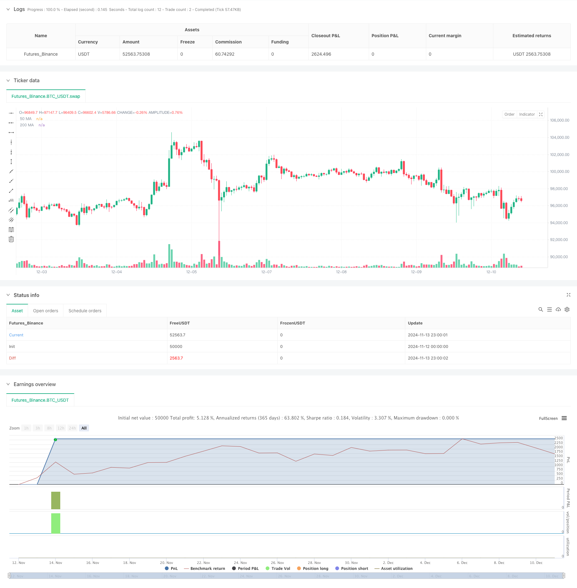

> Name

Dual-Moving-Average-and-MACD-Combined-Trend-Following-Dynamic-Take-Profit-Smart-Trading-System
> Author

ChaoZhang

> Strategy Description



[trans]
#### Overview
This strategy is a trend following system that combines dual moving averages and the MACD indicator. It uses the 50-period and 200-period moving averages to determine the trend direction, while using the MACD indicator to capture specific entry opportunities. The strategy adopts a dynamic stop-profit and stop-loss mechanism and uses multiple filtering conditions to improve transaction quality. This is a complete trading system that operates on the 15-minute time frame, with precise entry and exit rules.
#### Strategy Principle
The core logic of the strategy is based on the following key elements:
1. Trend judgment: Use the positional relationship between the 50-day moving average and the 200-day moving average to judge the overall trend. When the fast moving average is above the slow moving average, it is judged to be an upward trend, and vice versa.
2. Entry signal: After confirming the trend direction, use the crossover of the MACD indicator to trigger a specific entry signal. In an uptrend, enter the market to go long when the MACD line crosses the signal line; in a downtrend, enter the market to go short when the MACD line crosses below the signal line.
3. Transaction filtering: Multiple filtering mechanisms such as minimum trading interval, trend strength and MACD threshold are introduced to avoid excessive trading in volatile market environments.
4. Risk control: Use a fixed-point stop-loss and adjustable take-profit mechanism, and combine the moving average and the reverse signal of MACD as dynamic exit conditions.
#### Strategic Advantages
1. Combining trend tracking and momentum: By combining moving averages and MACD indicators, you can not only grasp the general trend, but also accurately locate the entry opportunity.
2. Complete risk management: Multiple stop-loss mechanisms are set up, including fixed stop-loss and dynamic stop-loss triggered by technical indicators.
3. Flexible parameter settings: Key parameters such as stop loss and profit points, moving average period, etc. can be flexibly adjusted according to market conditions.
4. Intelligent filtering mechanism: Reduce false signals and improve transaction quality through multiple filtering conditions.
5. Complete performance statistics: Built-in detailed transaction statistics function, including real-time calculation of key indicators such as winning rate and average profit and loss.
#### Strategy Risk
1. Shock market risk: Frequent false signals may occur in sideways shock markets. It is recommended to add trend confirmation indicators.
2. Slippage risk: Small-cycle trading is susceptible to slippage. It is recommended to appropriately relax the stop loss setting.
3. Parameter sensitivity: Strategy performance is more sensitive to parameter settings and requires sufficient parameter optimization.
4. Market environment dependence: The strategy performs better in strong trending markets, but the effect may be unstable in other market environments.
#### Strategy optimization direction
1. Dynamic stop loss optimization: The stop loss range can be dynamically adjusted according to the ATR indicator to make it more adaptable to market fluctuations.
2. Optimization of entry timing: Auxiliary indicators such as RSI can be added to confirm entry timing and improve trading accuracy.
3. Position management optimization: Introduce a dynamic position management system based on volatility to better control risks.
4. Market environment identification: Add a market environment identification module and use different parameter combinations under different market conditions.
#### Summary
This is a trend following trading system with reasonable design and complete logic. By combining classic technical indicators and modern risk management methods, this strategy not only grasps trends, but also focuses on risk control. Although there are some areas that need optimization, overall it is a trading strategy with practical value. It is recommended that traders conduct sufficient backtesting before using it in real trading, and make appropriate adjustments to the parameters according to the specific trading varieties and market environment. ||
#### Overview
This strategy is a trend following system that combines dual moving averages and MACD indicators. It uses 50-period and 200-period moving averages to determine trend direction while utilizing MACD indicator for specific entry timing. The strategy employs dynamic stop-loss and take-profit mechanisms, along with multiple filtering conditions to enhance trade quality. It is a complete trading system operating on a 15-minute timeframe with precise entry and exit rules.

#### Strategy Principles
The core logic is built on several key elements:
1. Trend Determination: Uses the relative position of 50MA and 200MA to judge overall trend, with uptrend confirmed when fast MA is above slow MA, and downtrend vice versa.
2. Entry Signals: After trend confirmation, uses MACD crossovers for specific entry signals. Enters long when MACD line crosses above signal line in uptrends; enters short when MACD line crosses below signal line in downtrends.
3. Trade Filtering: Incorporates multiple filtering mechanisms including minimum trade interval, trend strength, and MACD threshold to avoid overtrading in volatile market conditions.
4. Risk Control: Uses fixed-point stop-loss and adjustable take-profit mechanisms, combined with moving average and MACD reverse signals as dynamic exit conditions.

#### Strategy Advantages
1. Trend Following and Momentum Combination: Combines moving averages and MACD indicators to capture both major trends and precise entry timing.
2. Comprehensive Risk Management: Implements multiple stop-loss mechanisms, including fixed stops and technical indicator-triggered dynamic stops.
3. Flexible Parameter Settings: Key parameters such as stop-loss/take-profit points and MA periods can be adjusted according to market conditions.
4. Smart Filtering Mechanism: Reduces false signals through multiple filtering conditions to improve trade quality.
5. Complete Performance Statistics: Built-in detailed trade statistics including win rate and average profit/loss calculations in real-time.

#### Strategy Risks
1. Choppy Market Risk: May generate frequent false signals in sideways markets; consider adding trend confirmation indicators.
2. Slippage Risk: Short-term trading is susceptible to slippage; consider widening stop-loss settings.
3. Parameter Sensitivity: Strategy performance is sensitive to parameter settings, requiring thorough optimization.
4. Market Environment Dependency: Strategy performs well in strong trend markets but may be unstable in other market conditions.

#### Strategy Optimization Directions
1. Dynamic Stop-Loss Optimization: Can adjust stop-loss range dynamically based on ATR indicator to better adapt to market volatility.
2. Entry Timing Optimization: Can add RSI or other auxiliary indicators to confirm entry timing and improve trade accuracy.
3. Position Management Optimization: Introduce volatility-based dynamic position management system for better risk control.
4. Market Environment Recognition: Add market environment recognition module to use different parameter combinations under different market conditions.

#### Summary
This is a well-designed trend following trading system with complete logic. By combining classic technical indicators with modern risk management methods, the strategy balances trend capture with risk control. While there are areas for optimization, it is overall a practically valuable trading strategy. Traders are advised to conduct thorough backtesting before live implementation and adjust parameters according to specific trading instruments and market environments.[/trans]


> Source (PineScript)

``` pinescript
/*backtest
start: 2024-11-12 00:00:00
end: 2024-12-11 08:00:00
period: 1h
basePeriod: 1h
exchanges: [{"eid":"Futures_Binance","currency":"BTC_USDT"}]
*/

// This Pine Script™ code is subject to the terms of the Mozilla Public License 2.0 at https://mozilla.org/MPL/2.0/
// © WolfofAlgo

//@version=5
strategy("Trend Following Scalping Strategy", overlay=true, initial_capital=10000, default_qty_type=strategy.percent_of_equity, default_qty_value=200)

// Input Parameters
stopLossPips = input.float(5.0, "Stop Loss in Pips", minval=1.0)
takeProfitPips = input.float(10.0, "Take Profit in Pips", minval=1.0)
useFixedTakeProfit = input.bool(true, "Use Fixed Take Profit")

// Moving Average Parameters
fastMA = input.int(50, "Fast MA Period")
slowMA = input.int(200, "Slow MA Period")

// MACD Parameters
macdFastLength = input.int(12, "MACD Fast Length")
macdSlowLength = input.int(26, "MACD Slow Length")
macdSignalLength = input.int(9, "MACD Signal Length")

// Trade Filter Parameters (Adjusted to be less strict)
minBarsBetweenTrades = input.int(5, "Minimum Bars Between Trades", minval=1)
trendStrengthPeriod = input.int(10, "Trend Strength Period")
minTrendStrength = input.float(0.4, "Minimum Trend Strength", minval=0.1, maxval=1.0)
macdThreshold = input.float(0.00005, "MACD Threshold", minval=0.0)

// Variables for trade management
var int barsLastTrade = 0
barsLastTrade := nz(barsLastTrade[1]) + 1

// Calculate Moving Averages
ma50 = ta.sma(close, fastMA)
ma200 = ta.sma(close, slowMA)

// Calculate MACD
[macdLine, signalLine, _] = ta.macd(close, macdFastLength, macdSlowLength, macdSignalLength)

// Calculate trend strength (simplified)
trendDirection = ta.ema(close, trendStrengthPeriod) > ta.ema(close, trendStrengthPeriod * 2)
isUptrend = close > ma50 and ma50 > ma200
isDowntrend = close < ma50 and ma50 < ma200

// Calculate pip value
pointsPerPip = syminfo.mintick * 10

// Entry Conditions with Less Strict Filters
macdCrossUp = ta.crossover(macdLine, signalLine) and math.abs(macdLine - signalLine) > macdThreshold
macdCrossDown = ta.crossunder(macdLine, signalLine) and math.abs(macdLine - signalLine) > macdThreshold

// Long and Short Conditions
longCondition = close > ma50 and macdCrossUp and barsLastTrade >= minBarsBetweenTrades and isUptrend
shortCondition = close < ma50 and macdCrossDown and barsLastTrade >= minBarsBetweenTrades and isDowntrend

// Exit Conditions (made more lenient)
exitLongCondition = macdCrossDown or close < ma50
exitShortCondition = macdCrossUp or close > ma50

// Reset bars counter on new trade
if (longCondition or shortCondition)
    barsLastTrade := 0

// Calculate stop loss and take profit levels
longStopPrice = strategy.position_avg_price - (stopLossPips * pointsPerPip)
longTakeProfitPrice = strategy.position_avg_price + (takeProfitPips * pointsPerPip)
shortStopPrice = strategy.position_avg_price + (stopLossPips * pointsPerPip)
shortTakeProfitPrice = strategy.position_avg_price - (takeProfitPips * pointsPerPip)

// Plot Moving Averages
plot(ma50, "50 MA", color=color.blue)
plot(ma200, "200 MA", color=color.red)

// Plot Entry Signals
plotshape(longCondition, "Long Signal", shape.triangleup, location.belowbar, color.green, size=size.small)
plotshape(shortCondition, "Short Signal", shape.triangledown, location.abovebar, color.red, size=size.small)

// Strategy Entry Rules
if (longCondition and strategy.position_size == 0)
    strategy.entry("Long", strategy.long)

if (shortCondition and strategy.position_size == 0)
    strategy.entry("Short", strategy.short)

// Strategy Exit Rules
if (strategy.position_size > 0 and exitLongCondition)
    strategy.close("Long")

if (strategy.position_size < 0 and exitShortCondition)
    strategy.close("Short")

// Stop Loss and Take Profit Management
if (strategy.position_size > 0)
    strategy.exit("Long TP/SL", "Long", stop=longStopPrice, limit=useFixedTakeProfit ? longTakeProfitPrice : na)

if (strategy.position_size < 0)
    strategy.exit("Short TP/SL", "Short", stop=shortStopPrice, limit=useFixedTakeProfit ? shortTakeProfitPrice : na)

// Performance Metrics
var float totalTrades = 0
var float winningTrades = 0
var float totalProfitPips = 0
var float totalLossPips = 0

if (strategy.closedtrades > 0)
    totalTrades := strategy.closedtrades
    winningTrades := strategy.wintrades
    totalProfitPips := strategy.grossprofit / pointsPerPip
    totalLossPips := math.abs(strategy.grossloss) / pointsPerPip

// Display Stats
var label statsLabel = na
label.delete(statsLabel[1])

// Create performance stats text
var string stats = ""
if (strategy.closedtrades > 0)
    winRate = (winningTrades / math.max(totalTrades, 1)) * 100
    avgWin = totalProfitPips / math.max(winningTrades, 1)
    avgLoss = totalLossPips / math.max(totalTrades - winningTrades, 1)
    plRatio = avgWin / math.max(avgLoss, 1)
    
    stats := "Win Rate: " + str.tostring(winRate, "#.##") + "%\n" +
             "Avg Win: " + str.tostring(avgWin, "#.##") + " pips\n" +
             "Avg Loss: " + str.tostring(avgLoss, "#.##") + " pips\n" +
             "P/L Ratio: " + str.tostring(plRatio, "#.##") + "\n" +
             "Total Trades: " + str.tostring(totalTrades, "#")

statsLabel := label.new(x=bar_index, y=high, text=stats, style=label.style_label_down, color=color.new(color.blue, 80))

```

> Detail

https://www.fmz.com/strategy/474972

> Last Modified

2024-12-13 11:23:00
