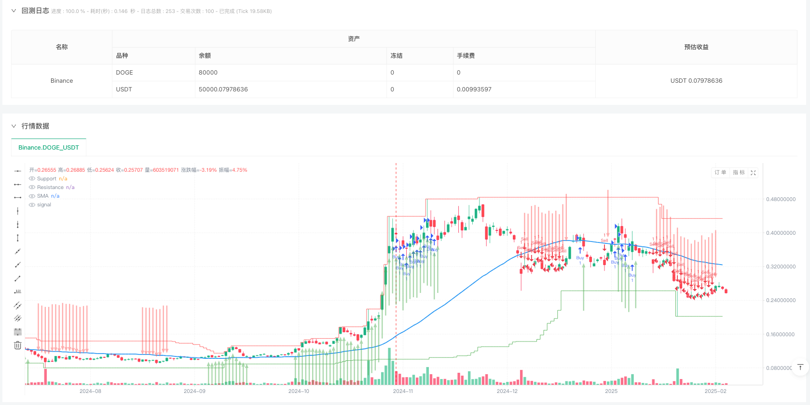
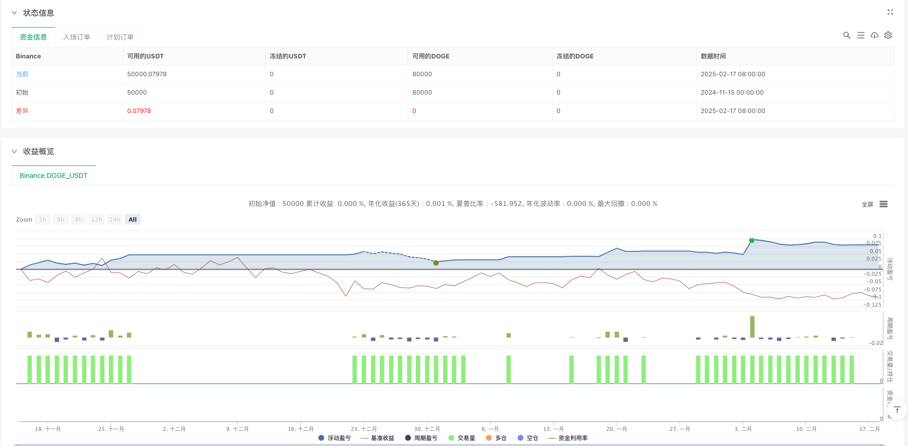

> Name

MACD-Based-Al-Brooks-Price-Action-Trend-Following-Strategy
> Author

ianzeng123

> Strategy Description





[trans]
#### Overview
This strategy is a trend following trading system based on Albrooks price action theory and the MACD indicator. It uses a combination of Moving Average (SMA) and MACD indicators to identify market trends and trade at the right time. The strategy uses a fixed risk-return ratio to manage the stop-loss and take-profit levels of each transaction to achieve effective risk control.
#### Strategy Principle
The core logic of the strategy includes the following key elements:
1. Trend judgment: Use the simple moving average (SMA) as the basis for trend judgment. When the price is above the SMA, it is judged to be an upward trend, and vice versa.
2. Entry signals:
   - Long conditions: the price is above the SMA, the MACD line is greater than 0 and crosses the signal line
   - Short selling conditions: the price is below the SMA, the MACD line is less than 0 and crosses the signal line
3. Risk management:
   - Use fixed percentage as stop loss buffer
   - Calculate the take-profit position based on the preset risk-benefit ratio
4. Exit mechanism: When the buy or sell signal disappears, existing positions will be automatically closed
#### Strategic Advantages
1. Reliability of trend tracking: It combines price action and technical indicators to improve the accuracy of trend judgment.
2. Scientific risk control: manage each transaction using a fixed risk-to-return ratio
3. Comprehensive signal confirmation: Reduce false signals through multiple condition confirmations
4. High degree of automation: including complete entry, exit and risk management mechanisms
5. Good visualization effect: Provides clear display of support and resistance levels
#### Strategy Risk
1. Trend reversal risk: Continuous false signals may be generated at trend turning points
2. Lagging risk: Both the moving average and MACD have a certain degree of lag.
3. Parameter sensitivity: The strategy effect is more sensitive to parameter settings.
4. Dependence on market environment: more losing transactions may occur in volatile markets
#### Strategy optimization direction
1. Signal filtering: You can add volume or volatility indicators to filter signals
2. Dynamic parameters: Change the fixed risk-return ratio to dynamic parameters based on market volatility
3. Time filtering: Increase the limit of trading time window to avoid trading in unsuitable time periods
4. Add market sentiment indicators: Introduce market sentiment indicators to assist in judging the strength of the trend
#### Summary
This is a complete trading system that combines classic price action theory with technical indicators. The strategy achieves relatively stable trading effects through strict signal confirmation mechanisms and risk management methods. Although there are some inherent risks, the stability and profitability of the strategy can be further improved through the suggested optimization directions. ||
#### Overview
This strategy is a trend-following trading system based on Al Brooks' price action theory and the MACD indicator. It identifies market trends by combining Simple Moving Average (SMA) and MACD indicators, executing trades at appropriate times. The strategy employs a fixed risk-reward ratio to manage stop-loss and take-profit levels for each trade, ensuring effective risk control.

#### Strategy Principles
The core logic includes the following key elements:
1. Trend Identification: Uses Simple Moving Average (SMA) as a benchmark for trend determination, identifying uptrends when price is above SMA and downtrends when below.
2. Entry Signals:
   - Long Entry: Price above SMA, MACD line above 0 and crosses above signal line
   - Short Entry: Price below SMA, MACD line below 0 and crosses below signal line
3. Risk Management:
   - Uses fixed percentage as stop-loss buffer
   - Calculates take-profit levels based on preset risk-reward ratio
4. Exit Mechanism: Automatically closes positions when buy or sell signals disappear

#### Strategy Advantages
1. Trend Following Reliability: Combines price action and technical indicators for improved trend accuracy
2. Scientific Risk Control: Implements fixed risk-reward ratio for trade management
3. Comprehensive Signal Confirmation: Reduces false signals through multiple condition verification
4. High Automation Level: Includes complete entry, exit, and risk management mechanisms
5. Excellent Visualization: Provides clear support and resistance level display

#### Strategy Risks
1. Trend Reversal Risk: May generate consecutive false signals at trend turning points
2. Lag Risk: Both moving average and MACD have inherent lag
3. Parameter Sensitivity: Strategy performance is sensitive to parameter settings
4. Market Environment Dependency: May generate more losing trades in ranging markets

#### Strategy Optimization Directions
1. Signal Filtering: Add volume or volatility indicators to filter signals
2. Dynamic Parameters: Convert fixed risk-reward ratio to dynamic parameters based on market volatility
3. Time Filtering: Add trading time window restrictions to avoid unfavorable trading periods
4. Market Sentiment Integration: Incorporate market sentiment indicators to assist in trend strength assessment

#### Summary
This is a complete trading system that combines classical price action theory with technical indicators. The strategy achieves relatively stable trading performance through strict signal confirmation mechanisms and risk management methods. While there are some inherent risks, the suggested optimization directions can further enhance the strategy's stability and profitability.[/trans]


> Source (PineScript)

``` pinescript
/*backtest
start: 2024-11-15 00:00:00
end: 2025-02-18 00:00:00
period: 1d
basePeriod: 1d
exchanges: [{"eid":"Binance","currency":"DOGE_USDT"}]
*/

// This Pine Script™ code is subject to the terms of the Mozilla Public License 2.0 at https://mozilla.org/MPL/2.0/
// © Abdulhossein

//@version=6
strategy(title="Al Brooks Price Action with MACD Signals", shorttitle="Al Brooks PA + MACD", overlay=true)

// Inputs
length = input.int(52, title="Moving Average Length", minval=1)
riskRewardRatio = input.float(2.0, title="Risk/Reward Ratio", minval=1.0)
stopLossBuffer = input.float(0.01, title="Stop Loss Buffer (in %)", minval=0.001)
candleType = input.string("Close", title="Candle Type", options=["Close", "Open"])

// Indicators
sma = ta.sma(close, length)
[macdLine, signalLine, _] = ta.macd(close, 12, 26, 9)
price = candleType == "Close" ? close : open

// Trend Conditions
uptrend = price > sma
downtrend = price < sma

// Buy/Sell Signals
buySignal = price > sma and macdLine > 0 and macdLine > signalLine
sellSignal = price < sma and macdLine < 0 and macdLine < signalLine

// Trade Execution
if (buySignal)
    longStopLoss = close * (1 - stopLossBuffer)
    longTakeProfit = close + (close - longStopLoss) * riskRewardRatio
    strategy.entry("Buy", strategy.long)
    strategy.exit("Take Profit", "Buy", limit=longTakeProfit, stop=longStopLoss)

if (sellSignal)
    shortStopLoss = close * (1 + stopLossBuffer)
    shortTakeProfit = close - (shortStopLoss - close) * riskRewardRatio
    strategy.entry("Sell", strategy.short)
    strategy.exit("Take Profit", "Sell", limit=shortTakeProfit, stop=shortStopLoss)

// Plot Signals
plotarrow(buySignal[2] ? 1 : na, colorup=color.new(color.green, 50), title="Buy Signal Arrow", offset=-1)
plotarrow(sellSignal[2] ? -1 : na, colordown=color.new(color.red, 50), title="Sell Signal Arrow", offset=-1)

// Close Positions
if (not buySignal and not sellSignal)
    strategy.close("Sell")
    strategy.close("Buy")

// Support and Resistance
support = ta.lowest(low, length)
resistance = ta.highest(high, length)
plot(support, title="Support", color=color.green, linewidth=1, style=plot.style_stepline)
plot(resistance, title="Resistance", color=color.red, linewidth=1, style=plot.style_stepline)
plot(sma, title="SMA", color=color.blue, linewidth=2)

// Alerts
alertcondition(buySignal[2], title="Buy Alert", message="Buy Signal Triggered")
alertcondition(sellSignal[2], title="Sell Alert", message="Sell Signal Triggered")
```

> Detail

https://www.fmz.com/strategy/482678

> Last Modified

2025-02-19 17:36:15
