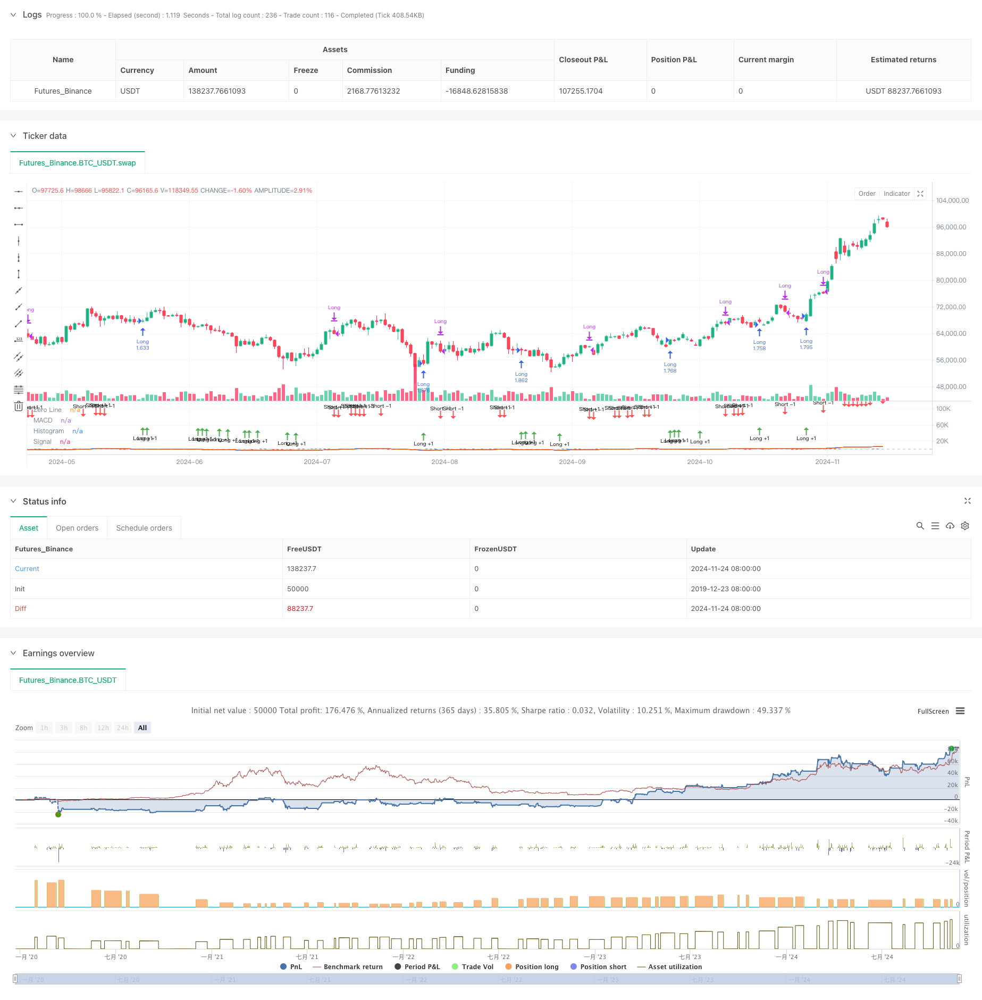

> Name

MACD Dynamic Oscillation Cross Prediction Strategy-MACD-Dynamic-Oscillation-Cross-Prediction-Strategy
> Author

ChaoZhang

> Strategy Description



[trans]
#### Overview
This strategy makes trading decisions based on the dynamic changing characteristics of MACD (Moving Average Convergence Divergence Index). The core of the strategy is to predict possible golden crosses and dead crosses by observing the changing trend of the MACD histogram, so as to plan transactions in advance. This strategy not only focuses on the traditional MACD indicator cross signal, but also pays attention to the dynamic change characteristics of the histogram, and obtains better entry opportunities by predicting the cross signal in advance.
#### Strategy Principle
The strategy uses an improved version of the MACD indicator system, including the calculation of the difference between the fast moving average (EMA12) and the slow moving average (EMA26), as well as a signal line based on 2 periods. The core trading logic is based on the following key points:
1. Determine the dynamic change of the trend by calculating the change rate of the histogram (hist_change)
2. When the histogram is negative and shows an upward trend for three consecutive periods, it is predicted that a golden cross signal may appear and enter the market early to do long positions.
3. When the histogram is positive and shows a downward trend for three consecutive periods, it is predicted that a dead cross signal may appear and the position is closed.
4. The strategy introduces a time filtering mechanism to only conduct transactions within a specified time range.
#### Strategic Advantages
1. Strong signal predictability: predict possible cross signals in advance by observing the dynamic changes of the histogram, effectively improving the timing of entry
2. Reasonable risk control: a handling fee of 0.1% and a transaction cost of 3 slippages are set, which is in line with the actual trading environment.
3. Flexible fund management: Use a percentage of the total account value for position management to effectively control risks
4. Excellent visualization effect: use different colors to mark the rise and fall of the histogram, and mark trading signals through arrows for easy analysis.
#### Strategy Risk
1. False breakthrough risk: Frequent false breakthrough signals may appear in a sideways and volatile market.
2. Lagging risk: Although a pre-judgment mechanism is adopted, MACD itself still has a certain lag.
3. Market environment dependence: The strategy performs better in markets with obvious trends, but may perform poorly in volatile markets.
4. Parameter sensitivity: The setting of fast and slow line periods has a greater impact on strategy performance
#### Strategy optimization direction
1. Introduce market environment filtering: you can add trend judgment indicators and use different trading parameters in different market environments.
2. Optimize position management: the position ratio can be dynamically adjusted according to signal strength
3. Improve the stop loss mechanism: add trailing stop loss or fixed stop loss to control retracement
4. Add signal confirmation mechanism: combine with other technical indicators for cross-validation to improve signal reliability
5. Optimize parameter selection: the adaptive parameter method can be used to dynamically adjust indicator parameters according to market conditions.
#### Summary
This strategy improves and optimizes the traditional MACD trading system by innovatively using the dynamic changing characteristics of the MACD histogram. The strategy's prediction mechanism can provide earlier entry signals, while strict trading conditions and risk control measures ensure the stability of the strategy. Through further optimization and improvement, this strategy is expected to achieve better performance in actual transactions. ||
#### Overview
This strategy bases trading decisions on the dynamic characteristics of the MACD (Moving Average Convergence Divergence) indicator. The core approach focuses on observing changes in the MACD histogram to predict potential golden and death crosses, allowing for early position establishment. The strategy goes beyond traditional MACD crossover signals by emphasizing the dynamic characteristics of the histogram to obtain better entry timing.

#### Strategy Principles
The strategy employs a modified MACD indicator system, incorporating the difference between fast (EMA12) and slow (EMA26) moving averages, along with a 2-period signal line. The core trading logic is based on several key points:
1. Calculating histogram rate of change (hist_change) to judge trend dynamics
2. Anticipating golden cross signals by entering long positions when the histogram is negative and shows an upward trend for three consecutive periods
3. Anticipating death cross signals by closing positions when the histogram is positive and shows a downward trend for three consecutive periods
4. Implementing a time filtering mechanism to trade only within specified time ranges

#### Strategy Advantages
1. Strong Signal Prediction: Anticipates potential crossover signals by observing histogram dynamics, improving entry timing
2. Reasonable Risk Control: Incorporates 0.1% commission and 3-point slippage, reflecting realistic trading conditions
3. Flexible Capital Management: Uses percentage-based position sizing relative to account equity for effective risk control
4. Excellent Visualization: Uses color-coded histograms and arrow markers for trade signals, facilitating analysis

#### Strategy Risks
1. False Breakout Risk: Frequent false signals may occur in ranging markets
2. Lag Risk: Despite predictive mechanisms, MACD retains some inherent lag
3. Market Environment Dependency: Strategy performs better in trending markets, potentially underperforming in ranging conditions
4. Parameter Sensitivity: Strategy performance is highly dependent on fast and slow line period settings

#### Optimization Directions
1. Market Environment Filtering: Add trend identification indicators to adjust trading parameters based on market conditions
2. Position Management Enhancement: Implement dynamic position sizing based on signal strength
3. Stop Loss Implementation: Add trailing or fixed stop losses to control drawdown
4. Signal Confirmation Enhancement: Incorporate additional technical indicators for cross-validation
5. Parameter Optimization: Implement adaptive parameters that adjust based on market conditions

#### Summary
This strategy innovatively utilizes the dynamic characteristics of the MACD histogram to improve upon traditional MACD trading systems. The predictive mechanism provides earlier entry signals, while strict trading conditions and risk control measures ensure strategy stability. With further optimization and refinement, this strategy shows promise for improved performance in actual trading conditions.[/trans]


> Source (PineScript)

``` pinescript
/*backtest
start: 2019-12-23 08:00:00
end: 2024-11-25 08:00:00
period: 1d
basePeriod: 1d
exchanges: [{"eid":"Futures_Binance","currency":"BTC_USDT"}]
*/

//@version=5
strategy(title="Demo GPT - Moving Average Convergence Divergence", shorttitle="MACD", commission_type=strategy.commission.percent, commission_value=0.1, slippage=3, default_qty_type=strategy.percent_of_equity, default_qty_value=100)

// Getting inputs
fast_length = input(title="Fast Length", defval=12)
slow_length = input(title="Slow Length", defval=26)
src = input(title="Source", defval=close)
signal_length = input.int(title="Signal Smoothing", minval=1, maxval=50, defval=2)  // Set smoothing line to 2
sma_source = input.string(title="Oscillator MA Type", defval="EMA", options=["SMA", "EMA"])
sma_signal = input.string(title="Signal Line MA Type", defval="EMA", options=["SMA", "EMA"])

// Date inputs
start_date = input(title="Start Date", defval=timestamp("2018-01-01T00:00:00"))
end_date = input(title="End Date", defval=timestamp("2069-12-31T23:59:59"))

// Calculating
fast_ma = sma_source == "SMA" ? ta.sma(src, fast_length) : ta.ema(src, fast_length)
slow_ma = sma_source == "SMA" ? ta.sma(src, slow_length) : ta.ema(src, slow_length)
macd = fast_ma - slow_ma
signal = sma_signal == "SMA" ? ta.sma(macd, signal_length) : ta.ema(macd, signal_length)
hist = macd - signal

// Strategy logic
isInDateRange = true

// Calculate the rate of change of the histogram
hist_change = hist - hist[1]

// Anticipate a bullish crossover: histogram is negative, increasing, and approaching zero
anticipate_long = isInDateRange and hist < 0 and hist_change > 0 and hist > hist[1] and hist > hist[2]

// Anticipate an exit (bearish crossover): histogram is positive, decreasing, and approaching zero
anticipate_exit = isInDateRange and hist > 0 and hist_change < 0 and hist < hist[1] and hist < hist[2]

if anticipate_long
    strategy.entry("Long", strategy.long)

if anticipate_exit
    strategy.close("Long")

// Plotting
hline(0, "Zero Line", color=color.new(#787B86, 50))
plot(hist, title="Histogram", style=plot.style_columns, color=(hist >= 0 ? (hist > hist[1] ? #26A69A : #B2DFDB) : (hist < hist[1] ? #FF5252 : #FFCDD2)))
plot(macd, title="MACD", color=#2962FF)
plot(signal, title="Signal", color=#FF6D00)

// Plotting arrows when anticipating the crossover
plotshape(anticipate_long, title="Long +1", location=location.belowbar, color=color.green, style=shape.arrowup, size=size.tiny, text="Long +1")
plotshape(anticipate_exit, title="Short -1", location=location.abovebar, color=color.red, style=shape.arrowdown, size=size.tiny, text="Short -1")

```

> Detail

https://www.fmz.com/strategy/473131

> Last Modified

2024-11-27 14:54:02
