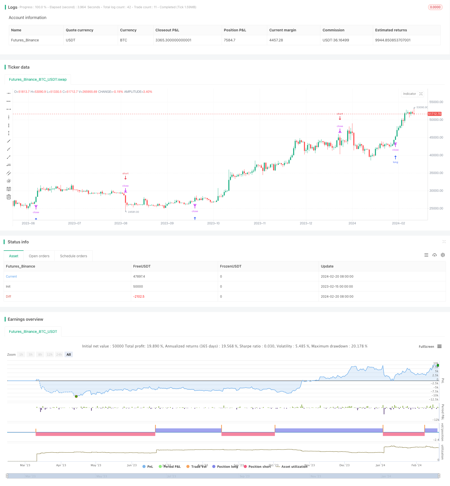

> Name

MACD Momentum-with-MA-Strategy
> Author

ChaoZhang

> Strategy Description


[trans]
### Overview
The Trend Catcher-MACD Momentum Composite Moving Average Strategy is an exquisite trading tool designed for traders who follow market trends. The strategy is built on a powerful combination of Average True Range (ATR), Simple Moving Average (SMA) and Moving Average Convergence Indicator (MACD), entered through filtering and precise confirmation of trading signals.
### Strategy Principles
#### ATR Stop Loss
Use the ATR indicator to dynamically adjust the stop loss price. The ATR length and ATR multiplier can be customized, and the strategy automatically adjusts with market fluctuations to provide balanced risk management.
#### SMA trend filter
Use SMA as a trend filter. By adjusting the SMA cycle parameters, users can align the strategy with the preferred market trend time frame, enhancing the adaptability of the strategy.
#### MACD confirmation signal
Integrate the MACD indicator to refine market entry signals. The strategy distinguishes potential long and short signals by comparing the MACD line to the signal line, ensuring trades are consistent with fundamental momentum.
#### Market entry logic
**Bull:** Go long when the price closes above the SMA and below the SMA in the previous period, and when the MACD line crosses the signal line. The entry price is set to the current price plus the ATR stop loss distance.
**Short:** Go short when the price closes below the SMA and above the SMA in the previous period, and when the MACD line crosses below the signal line. The entry price is set to the current price minus the ATR stop loss distance.
### Strategic Advantages
This strategy draws on the essence of market volatility, trends and momentum indicators to build a systematic market entry and risk management mechanism. The integration of its indicators improves the adaptability of the strategy under different market conditions and is an ideal tool for participating in trending markets.
By tracking market trend dynamics, trend catching strategies can assist traders in identifying profit opportunities. Adjust the parameters to match your personal trading style and watch how the strategy plays an important role in revealing favorable trading points in the market.
### Risk Analysis
The trend catching strategy relies on a combination of indicators to judge the market status, and there is a possibility of misjudgment under certain market conditions. Additionally, trend reversals may result in increased losses.
False signals can be reduced by appropriately adjusting parameters, or setting a looser stop loss distance. When abnormal market conditions occur, the strategy can also be suspended to avoid losses caused by abnormal fluctuations.
### Optimization ideas
#### Parameter optimization
You can test and optimize the ATR length, SMA period and MACD parameters to find the values ​​that best suit your style.
#### Add filter
Other indicators can be added as auxiliary filters, such as KDJ, OBV, etc., to improve the accuracy of the strategy. Or add additional conditions such as increased trading volume to avoid being trapped.
#### Stop loss strategy
Curve stop loss or oscillation stop loss can be set, and the stop loss distance can be adjusted in real time by tracking the price to reduce the risk of loss.
### Summarize
Trend Catcher-MACD Momentum Composite Average Strategy gathers the judgment of multiple indicators such as market fluctuations, trends and momentum to build an accurate market entry confirmation mechanism and risk control system. Parameter adjustment can be used to match personal trading methods to help seize market opportunities. This strategy deserves in-depth study and application by quantitative traders.
||

### Overview

The Trend Hunter - MACD Momentum with MA strategy is an exquisite trading tool designed for traders seeking to capitalize on trending markets. Built on the robust combination of Average True Range (ATR), Simple Moving Average (SMA) and Moving Average Convergence Divergence (MACD), it filters and confirms trade entries with precision.  

### Strategy Logic 

#### ATR Stop Loss

Utilizes the ATR indicator to dynamically tune stop levels, adapting to market volatility by customizing ATR Length and Multiplier, providing balanced risk management.

#### SMA Trend Filter 

Employs SMA as a trend filter. By tuning SMA Period, users align the strategy timeframe with their preferred market trend, enhancing adaptability.

#### MACD Entry Confirmation

Incorporates MACD to refine entry signals by comparing the MACD line against its signal line, ensuring alignment with momentum.

#### Entry Logic

**Long:** Triggered when price closes above SMA, having closed below in the prior period, with MACD line crossing above signal line. Entry set at current price plus ATR stop distance.

**Short:** Triggered when price closes below SMA, after closing above in previous period, with MACD line falling below signal line. Entry set at current price minus ATR stop distance.

### Advantages

This strategy harnesses volatility, trend and momentum dynamics to construct systematic entry and risk rules. Its blend of indicators enhances adaptability across various market conditions, making it an ideal tool for trend-following.

By tracking trend momentum, the Trend Hunter aids in uncovering profit opportunities. Fine-tuning parameters to match trading style allows observing how the strategy plays a vital role in signaling favorable trading junctures.

### Risk Analysis

The strategy relies on indicator combinations to gauge market conditions, risking misjudgments in certain situations. Trend reversals may also lead to increased losses. 

Lowering false signals through parameter adjustments or wider stop distances provides solutions. Pausing strategies during abnormal volatility also averts anomalies.

### Optimization Paths

#### Parameter Tuning

Testing and optimizing ATR Length, SMA Period and MACD inputs finds ideal values matching trading style.

#### More Filters 

Adding indicators like KDJ, OBV etc as auxiliary filters improves accuracy. Extra conditions like volume spikes also prevent whipsaws.

#### Stop Loss Strategies

Trailing or volatility stops that dynamically adjust stop distance minimizes losses by tracking prices.

### Conclusion

The Trend Hunter strategy amalgamates volatility, trend and momentum dynamics into a precise entry confirmation and risk management system. Parameter adjustments cater to individual trading styles, aiding in capitalizing on opportunities. Worthwhile for quants to further explore and apply.

[/trans]

> Strategy Arguments


|Argument|Default|Description|
|----|----|----|
|v_input_1|20|ATR Length|
|v_input_2|0.75|ATR Multiplier|
|v_input_3|32|SMA Period|
|v_input_4|12|MACD Short Term|
|v_input_5|26|MACD Long Term|
|v_input_6|9|MACD Signal Smoothing|


> Source (PineScript)

``` pinescript
/*backtest
start: 2023-02-15 00:00:00
end: 2024-02-21 00:00:00
period: 1d
basePeriod: 1h
exchanges: [{"eid":"Futures_Binance","currency":"BTC_USDT"}]
*/

//@version=5
strategy("trend_hunter", overlay=true)

length = input(20, title="ATR Length")
numATRs = input(0.75, title="ATR Multiplier")
atrs = ta.sma(ta.tr, length) * numATRs

// Trend Filter
smaPeriod = input(32, title="SMA Period")
sma = ta.sma(close, smaPeriod)

// MACD Filter
macdShortTerm = input(12, title="MACD Short Term")
macdLongTerm = input(26, title="MACD Long Term")
macdSignalSmoothing = input(9, title="MACD Signal Smoothing")

[macdLine, signalLine, _] = ta.macd(close, macdShortTerm, macdLongTerm, macdSignalSmoothing)

// Long Entry with Trend and MACD Filter
longCondition = close > sma and close[1] <= sma[1] and macdLine > signalLine
strategy.entry("Long", strategy.long, stop=close + atrs, when=longCondition, comment="Long")

// Short Entry with Trend and MACD Filter
shortCondition = close < sma and close[1] >= sma[1] and macdLine < signalLine
strategy.entry("Short", strategy.short, stop=close - atrs, when=shortCondition, comment="Short")

//plot(strategy.equity, title="equity", color=color.red, linewidth=2, style=plot.style_area)

```

> Detail

https://www.fmz.com/strategy/442565

> Last Modified

2024-02-22 17:51:19
