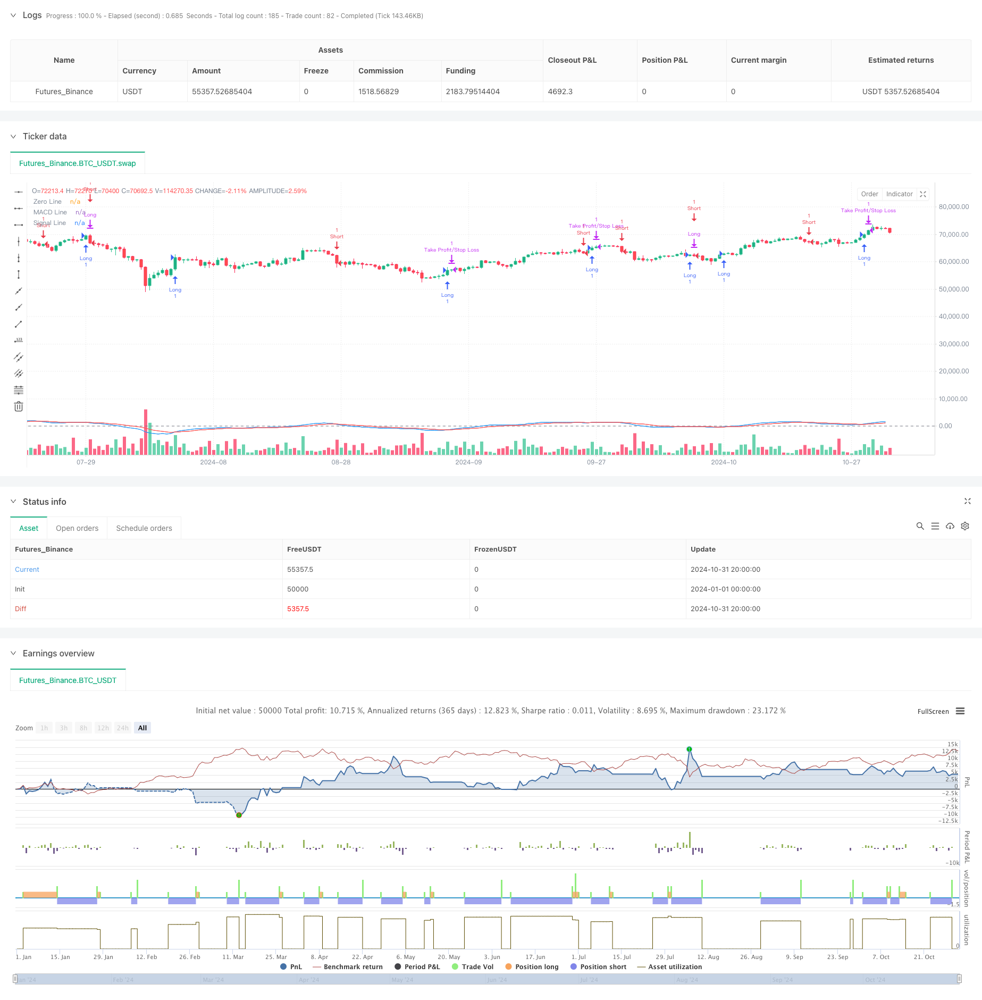

> Name

MACD-Multi-Interval-Dynamic-Stop-Loss-and-Take-Profit-Trading-System
> Author

ChaoZhang

> Strategy Description



[trans]

#### Overview
This strategy is an automated trading system based on the MACD indicator, combined with a dynamic stop-profit and stop-loss mechanism. The core of the strategy is to determine the trading signal through the intersection of the MACD line and the signal line. At the same time, it integrates risk management functions such as percentage stop loss, target profit, and trailing stop loss, realizing fully automated trading. This strategy uses the difference between fast and slow moving averages to calculate the MACD indicator, and identifies market trend transition points through the intersection of signal lines to make corresponding trading decisions.
#### Strategy Principle
The core logic of the strategy includes the following key parts:
1. MACD indicator calculation: Use the 12th and 26th as the default fast and slow moving average periods, and the 9th as the signal line smoothing period.
2. Entry signal: When the MACD line breaks through the signal line from below, the system generates a long signal; when the MACD line falls below the signal line from above, the system generates a short signal.
3. Risk management: Integrated triple protection mechanism:
   - Fixed stop loss level: 1% below the entry price
   - Profit target: 2% above the entry price
   - Trailing stop: 1.5% dynamic trailing stop distance
#### Strategic Advantages
1. Systematic trading: Completely automated trading decision-making process to avoid human emotional interference.
2. Multiple risk control: Through the triple mechanism of fixed stop loss, target profit and trailing stop loss, comprehensive risk management is achieved.
3. Adjustable parameters: All key parameters can be optimized and adjusted according to different market conditions.
4. Trend tracking: It can effectively capture the conversion points of market trends and improve the success rate of transactions.
#### Strategy Risk
1. Volatile market risk: Frequent false signals may occur in a volatile market.
2. Slippage risk: When the market fluctuates violently, the actual transaction price may deviate from the ideal price.
3. Parameter sensitivity: There may be significant differences in optimal parameters under different market environments.
4. Systemic risk: Sudden changes in the market may cause stop loss to be ineffective.
#### Strategy optimization direction
1. Add market environment filtering:
   - Added volatility indicator to screen trading opportunities
   - Combined with trading volume to confirm signal validity
2. Optimization parameter adaptation:
   - Implement dynamic adjustment mechanism of parameters
   - Automatically select optimal parameters based on market characteristics
3. Improve risk control:
   - Added fund management module
   - Develop a more sophisticated stop-loss mechanism
#### Summary
This strategy builds a robust automated trading system through the cross signals of the MACD indicator and a complete risk management system. Although there is some room for optimization, the basic framework is already relatively complete. Through continuous optimization and improvement, this strategy is expected to maintain stable performance in different market environments. When applying in real market, it is recommended to conduct sufficient backtest verification and adjust parameter settings according to specific market characteristics.
|| 

#### Overview
This strategy is an automated trading system based on the MACD indicator, incorporating dynamic stop-loss and take-profit mechanisms. The core strategy determines trading signals through MACD line and signal line crossovers, while integrating percentage-based stop-loss, profit targets, and trailing stops for risk management. The strategy calculates the MACD indicator using the difference between fast and slow moving averages, identifying market trend reversal points through signal line crossovers to make corresponding trading decisions.

#### Strategy Principles
The core logic includes several key components:
1. MACD Calculation: Uses default periods of 12 and 26 days for fast and slow moving averages, with a 9-day signal line smoothing period.
2. Entry Signals: The system generates long signals when the MACD line crosses above the signal line; short signals are generated when the MACD line crosses below the signal line.
3. Risk Management: Incorporates three protection mechanisms:
   - Fixed Stop Loss: 1% below entry price
   - Profit Target: 2% above entry price
   - Trailing Stop: 1.5% dynamic trailing stop distance

#### Strategy Advantages
1. Systematic Trading: Fully automated trading decision process, avoiding emotional interference.
2. Multiple Risk Controls: Achieves comprehensive risk management through fixed stops, profit targets, and trailing stops.
3. Adjustable Parameters: All key parameters can be optimized for different market conditions.
4. Trend Following: Effectively captures market trend reversal points, improving trading success rate.

#### Strategy Risks
1. Choppy Market Risk: May generate frequent false signals in sideways markets.
2. Slippage Risk: Actual execution prices may deviate from ideal prices during high volatility.
3. Parameter Sensitivity: Optimal parameters may vary significantly across different market environments.
4. Systemic Risk: Sudden market changes may cause stop-loss failures.

#### Strategy Optimization Directions
1. Add Market Environment Filters:
   - Incorporate volatility indicators to screen trading opportunities
   - Confirm signal validity with volume analysis
2. Optimize Parameter Adaptation:
   - Implement dynamic parameter adjustment mechanisms
   - Automatically select optimal parameters based on market characteristics
3. Enhance Risk Control:
   - Add money management module
   - Develop more sophisticated stop-loss mechanisms

#### Summary
This strategy constructs a robust automated trading system through MACD crossover signals and comprehensive risk management. While there is room for optimization, the basic framework is already well-developed. Through continuous optimization and improvement, the strategy has the potential to maintain stable performance across different market environments. For live trading implementation, it is recommended to conduct thorough backtesting and adjust parameters according to specific market characteristics.

[/trans]


> Source (PineScript)

``` pinescript
/*backtest
start: 2024-01-01 00:00:00
end: 2024-11-01 00:00:00
period: 12h
basePeriod: 12h
exchanges: [{"eid":"Futures_Binance","currency":"BTC_USDT"}]
*/

// This Pine Script™ code is subject to the terms of the Mozilla Public License 2.0 at https://mozilla.org/MPL/2.0/
// © traderhub


//@version=5
strategy("MACD Strategy with Settings", overlay=true)

// Параметры MACD в контрольной панели
fastLength = input.int(12, title="Fast Length", minval=1, maxval=50)
slowLength = input.int(26, title="Slow Length", minval=1, maxval=50)
signalSmoothing = input.int(9, title="Signal Smoothing", minval=1, maxval=50)

// Параметры риска
stopLossPerc = input.float(1, title="Stop Loss (%)", step=0.1) // Стоп-лосс в процентах
takeProfitPerc = input.float(2, title="Take Profit (%)", step=0.1) // Тейк-профит в процентах
trailStopPerc = input.float(1.5, title="Trailing Stop (%)", step=0.1) // Трейлинг-стоп в процентах

// Вычисляем MACD
[macdLine, signalLine, _] = ta.macd(close, fastLength, slowLength, signalSmoothing)

// Показываем MACD и сигнальную линию на графике
plot(macdLine, color=color.blue, title="MACD Line")
plot(signalLine, color=color.red, title="Signal Line")
hline(0, "Zero Line", color=color.gray)

// Условия для покупки и продажи
longCondition = ta.crossover(macdLine, signalLine) // Покупка при пересечении MACD вверх сигнальной линии
shortCondition = ta.crossunder(macdLine, signalLine) // Продажа при пересечении MACD вниз сигнальной линии

// Расчет стоп-лосса и тейк-профита
var float longStopLevel = na
var float longTakeProfitLevel = na

if (longCondition)
    longStopLevel := strategy.position_avg_price * (1 - stopLossPerc / 100)
    longTakeProfitLevel := strategy.position_avg_price * (1 + takeProfitPerc / 100)
    strategy.entry("Long", strategy.long)

if (strategy.position_size > 0)
    // Установка стоп-лосса и тейк-профита
    strategy.exit("Take Profit/Stop Loss", "Long", stop=longStopLevel, limit=longTakeProfitLevel, trail_offset=trailStopPerc)

// Закрытие позиции при медвежьем сигнале
if (shortCondition)
    strategy.close("Long")
    strategy.entry("Short", strategy.short)

```

> Detail

https://www.fmz.com/strategy/473353

> Last Modified

2024-11-29 15:01:33
