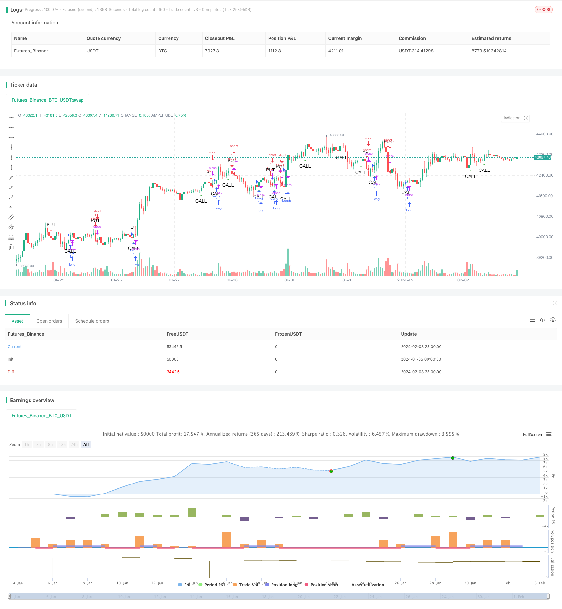

> Name

MACD-Volume-Reversal-Trading-Strategy MACD-Volume-Reversal-Trading-Strategy
> Author

ChaoZhang

> Strategy Description


[trans]
## Overview
The MACD Volume Reversal trading strategy is a strategy that uses a combination of the Moving Average Convergence Divergence (MACD) indicator and trading volume data to identify potential reversal points or continuation points in stock prices. The name of this strategy reflects its essence of using a combination of MACD and volume energy to detect reversal patterns. It can help traders improve their profit opportunities while using trading volume to filter out false signals.
## Strategy Principle
Core part:
1. The MACD indicator is used to identify trend reversal points. When the indicator breaks through the signal line in the downward direction, it is a bullish signal, and when it breaks through in the upward direction, it is a bearish signal.
2. Volume is used to confirm MACD signals. An entry signal will only be triggered when trading volume increases significantly. This helps filter out false signals.
3. Use a stop-profit mechanism. Take profit when the position reaches the preset profit level.
Specific implementation process:
1. Calculate the MACD indicator and its signal lines with custom parameters.
2. Identify the MACD downward breakthrough signal line (bear signal), and at the same time, the trading volume increases significantly compared with the previous K line (volume can be amplified). Short as a bullish signal.
3. Identify the MACD upward breakthrough signal line (bull signal), and at the same time, the trading volume increases significantly compared with the previous K line (volume can be amplified). Go long as a bearish signal.
4. The take-profit level after entry is set to the entry price multiplied by the preset profit ratio. Once reached, the take-profit level is automatically taken.
## Advantage Analysis
- By combining MACD and trading volume, some false signals can be filtered out and unnecessary losses can be avoided.
- MACD can better reflect short-term overbought and oversold phenomena, and with the confirmation of trading volume, it can seize reversal opportunities.
- Adopt standardized MACD parameter settings for user convenience.
- Parameters can be adjusted to match different varieties and trading styles.
## Risk Analysis
1. MACD is a lagging indicator and there is a certain lag. When the breakthrough signal appears, the market may have changed to a certain extent.
2. Increased trading volume may also lead to misjudgments. For example, in the gap market, rising trading volume may be an invalid breakthrough.
3. The strength and time of the rebound are difficult to predict, and even short-term profits may be pushed up or down again.
**Solution:**
1. Combine with more technical indicators, such as Bollinger Bands, RSI, etc., to judge the reliability of the MACD signal.
2. Optimize MACD parameters to make them closer to current market characteristics.
3. Use conservative stop loss to prevent further expansion of losses.
## Optimization direction
1. Optimize the MACD parameter combination according to the trading type and cycle to improve the accuracy of the indicator.
2. Add more technical indicators for combination, such as KDJ, Bollinger Bands, etc. to improve the winning rate.
3. A dynamic amplification factor can be set for trading volume conditions to make it more adaptable to market changes.
4. Optimize the take-profit retracement ratio to improve profitability.
## Summarize
The MACD volume reversal trading strategy requires additional trading volume confirmation when the MACD reversal signal appears, which can improve the accuracy of the signal, help grasp key reversal points, and avoid unnecessary losses due to false signals. The strategy is simple and clear, easy to master, and has certain practical guiding significance. However, traders still need to combine more indicators in real trading to verify signals to control risks. Through continuous optimization testing and risk control, this strategy can achieve stable excess returns.
||

## Overview

The MACD Volume Reversal Trading Strategy is a technique that combines the Moving Average Convergence Divergence (MACD) indicator with volume data to identify potential trend reversal or continuation points in financial markets. The name reflects how the strategy utilizes the combination of MACD and volume to detect reversal patterns. It can help traders increase profit opportunities while using volume to filter out false signals.

## Strategy Logic

Core components:

1. The MACD indicator is used to identify potential trend reversals. Bearish crossovers (MACD line crossing below signal line) are bullish signals, while bullish crossovers are bearish signals.  

2. Volume is used to confirm MACD signals. Trading signals are only triggered when there is a significant surge in volume. This helps to filter out false signals.

3. A take profit mechanism exits positions once a predefined profit target is reached.

Implementation process:

1. Compute MACD indicator and signal line with custom parameters.  

2. Identify MACD bearish crossover (bear signal) along with significant increase of volume compared to previous bar. Trigger short entry signal.

3. Identify MACD bullish crossover (bull signal) with volume expansion. Trigger long entry. 

4. Set take profit levels at entry price multiplied by profit ratio preset. Auto exit when take profit reached.

## Advantage Analysis 

- Combining MACD and volume filters out some false signals and avoids unnecessary losses.

- MACD reflects overbought/oversold conditions well in short term. Volume confirmation allows capturing reversals.

- Standardized MACD settings facilitate usage.

- Adjustable parameters match different products and trading styles.

## Risk Analysis

1. MACD is a lagging indicator, with certain delays. Trend may have moved considerably once signal triggers.  

2. Volume surges could be misinterpreted. For example, gap openings with spikes in volume might be invalid moves.

3. Difficult to predict strength and duration of mean reversions. Profits could be erased by new pushing highs/lows.

**Solutions:**

1. Incorporate more technical indicators like Bollinger Bands, RSI to assess reliability of MACD signals.

2. Optimize MACD parameters to better fit market conditions.  

3. Employ conservative stop loss to limit further losses.

## Optimization Directions 

1. Optimize MACD combinations based on product and timeframe to improve accuracy.

2. Add more technical indicators like KDJ, Bollinger Bands for combinational signals.

3. Set dynamic volume multiplier to adapt to changing market conditions.  

4. Enhance profit ratio and drawdown ratios.

## Conclusion

The MACD Volume Reversal Trading Strategy improves signal accuracy by requiring additional volume confirmation for MACD reversals. It helps capturing key reversal points while avoiding unnecessary losses from false signals. The strategy is simple and easy to implement, providing practical trade guidance. However, traders still need to incorporate more indicators for validation and risk control in live trading. With continuous optimization, testing and risk management, this strategy can achieve consistent excess returns.

[/trans]

> Strategy Arguments


|Argument|Default|Description|
|----|----|----|
|v_input_1|3|Fast Length|
|v_input_2|10|Slow Length|
|v_input_3|16|Signal Smoothing|
|v_input_4|10|Take Profit (%)|
|v_input_5|true|Volume Multiplier|


> Source (PineScript)

``` pinescript
/*backtest
start: 2024-01-05 00:00:00
end: 2024-02-04 00:00:00
period: 1h
basePeriod: 15m
exchanges: [{"eid":"Futures_Binance","currency":"BTC_USDT"}]
*/

//@version=5
strategy("MACD Anti-Pattern Detector with Volume", shorttitle="MACD-APD-Vol", overlay=true)

// MACD settings
fastLength = input(3, title="Fast Length")
slowLength = input(10, title="Slow Length")
signalSmoothing = input(16, title="Signal Smoothing")
takeProfitPct = input(10.0, title="Take Profit (%)") / 100
volumeMultiplier = input(1.0, title="Volume Multiplier")

[macd, signal, _] = ta.macd(close, fastLength, slowLength, signalSmoothing)

// Detect anti-patterns with volume confirmation
bullishAntiPattern = ta.crossunder(macd, signal) and volume > volume[1] * volumeMultiplier
bearishAntiPattern = ta.crossover(macd, signal) and volume > volume[1] * volumeMultiplier

// Entry conditions
if (bullishAntiPattern)
    strategy.entry("Short", strategy.short)

if (bearishAntiPattern)
    strategy.entry("Long", strategy.long)

// Take profit conditions
strategy.exit("Take Profit Long", "Long", limit=strategy.position_avg_price * (1 + takeProfitPct))
strategy.exit("Take Profit Short", "Short", limit=strategy.position_avg_price * (1 - takeProfitPct))

// Highlight anti-patterns
plotshape(series=bullishAntiPattern, title="Bullish Anti-Pattern", style=shape.triangledown, location=location.abovebar, color=color.red, size=size.small, text="PUT")
plotshape(series=bearishAntiPattern, title="Bearish Anti-Pattern", style=shape.triangleup, location=location.belowbar, color=color.green, size=size.small, text="CALL")

```

> Detail

https://www.fmz.com/strategy/441047

> Last Modified

2024-02-05 10:26:23
