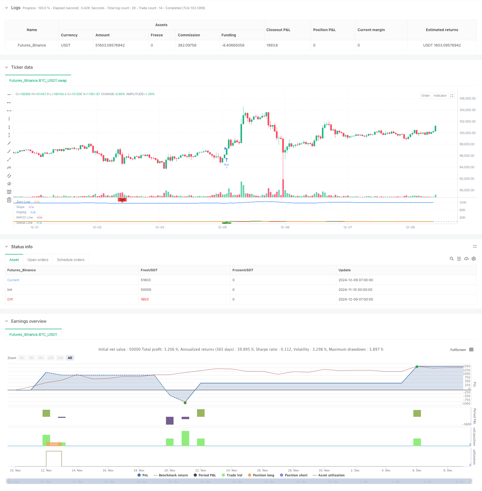

> Name

MACD-and-Linear-Regression-Dual-Signal-Intelligent-Trading-Strategy
> Author

ChaoZhang

> Strategy Description



[trans]
#### Overview
This strategy is an intelligent trading system that combines MACD (moving average convergence divergence indicator) and linear regression slope (LRS). The strategy optimizes the calculation of the MACD indicator through a combination of multiple moving average methods, and introduces linear regression analysis to enhance the reliability of trading signals. This strategy allows traders to flexibly choose to use a single indicator or a combination of dual indicators to generate trading signals, and is equipped with a stop-profit and stop-loss mechanism to control risks.
#### Strategy Principle
The core of the strategy is to capture market trends through optimized MACD and linear regression indicators. The MACD part uses a combination of four moving average methods, SMA, EMA, WMA and TEMA, to enhance the sensitivity to price trends. The linear regression part determines the direction and strength of the trend by calculating the slope and position of the regression line. A buy signal can be confirmed based on a golden cross in MACD, an uptrend in linear regression, or a combination of the two. Likewise, sell signals can also be configured flexibly. The strategy also includes percentage-based take-profit and stop-loss settings to effectively manage the risk-reward ratio of each trade.
#### Strategic Advantages
1. Flexibility of indicator combination: you can choose to use a single indicator or a combination of dual indicators according to market conditions
2. Improved MACD calculation: Improved trend identification accuracy through multiple moving average methods
3. Objective trend confirmation: Using linear regression provides trend judgment supported by mathematical statistics.
4. Improved risk management: integrated stop-profit and stop-loss mechanisms
5. Strong parameter adjustability: key parameters can be optimized according to different market characteristics
#### Strategy Risk
1. Parameter sensitivity: Different market environments may require frequent adjustment of parameters
2. Signal delay: There is a certain lag in moving average indicators.
3. Not applicable to volatile markets: false signals may occur in sideways volatile markets.
4. Opportunity cost caused by double confirmation: Strict double indicator confirmation may miss some good trading opportunities
#### Strategy optimization direction
1. Increase market environment identification: introduce volatility indicators to distinguish trend and volatile markets
2. Dynamic parameter adjustment: automatically adjust the parameters of MACD and linear regression according to market conditions
3. Optimize take profit and stop loss: introduce dynamic take profit and stop loss, automatically adjust according to market volatility
4. Increase trading volume analysis: combine trading volume indicators to improve signal credibility
5. Introduce time period analysis: consider multi-time period confirmation to improve transaction accuracy
#### Summary
This strategy creates a trading system that combines flexibility and reliability by combining improved versions of classic indicators with statistical methods. Its modular design allows traders to flexibly adjust strategy parameters and signal confirmation mechanisms according to different market environments. Through continuous optimization and improvement, the strategy is expected to maintain stable performance in various market environments. ||
#### Overview
This strategy is an intelligent trading system that combines MACD (Moving Average Convergence Divergence) and Linear Regression Slope (LRS). It optimizes MACD calculation through multiple moving average methods and incorporates linear regression analysis to enhance signal reliability. The strategy allows traders to flexibly choose between single or dual indicator combinations for generating trading signals and includes stop-loss and take-profit mechanisms for risk control.

#### Strategy Principles
The strategy's core lies in capturing market trends through optimized MACD and linear regression indicators. The MACD component utilizes a combination of SMA, EMA, WMA, and TEMA calculations to enhance price trend sensitivity. The linear regression component evaluates trend direction and strength through regression line slope and position analysis. Buy signals can be generated based on MACD crossovers, linear regression uptrends, or a combination of both. Similarly, sell signals can be flexibly configured. The strategy includes percentage-based stop-loss and take-profit settings for effective risk-reward management.

#### Strategy Advantages
1. Indicator combination flexibility: Ability to choose between single or dual indicators based on market conditions
2. Enhanced MACD calculation: Improved trend identification through multiple moving average methods
3. Objective trend confirmation: Statistically supported trend judgment through linear regression
4. Comprehensive risk management: Integrated stop-loss and take-profit mechanisms
5. Strong parameter adaptability: Key parameters can be optimized for different market characteristics

#### Strategy Risks
1. Parameter sensitivity: Different market environments may require frequent parameter adjustments
2. Signal delay: Moving average indicators have inherent lag
3. Ineffective in ranging markets: May generate false signals in sideways markets
4. Opportunity cost of dual confirmation: Strict dual-indicator confirmation may miss some good trading opportunities

#### Strategy Optimization Directions
1. Add market environment recognition: Introduce volatility indicators to distinguish between trending and ranging markets
2. Dynamic parameter adjustment: Automatically adjust MACD and linear regression parameters based on market conditions
3. Optimize stop-loss and take-profit: Implement dynamic levels based on market volatility
4. Incorporate volume analysis: Integrate volume indicators to improve signal reliability
5. Include timeframe analysis: Consider multiple timeframe confirmation to enhance trading accuracy

#### Summary
This strategy creates a flexible and reliable trading system by combining improved versions of classic indicators with statistical methods. Its modular design allows traders to adjust strategy parameters and signal confirmation mechanisms according to different market environments. Through continuous optimization and improvement, the strategy shows promise for maintaining stable performance across various market conditions.[/trans]


> Source (PineScript)

``` pinescript
/*backtest
start: 2024-11-10 00:00:00
end: 2024-12-09 08:00:00
period: 1h
basePeriod: 1h
exchanges: [{"eid":"Futures_Binance","currency":"BTC_USDT"}]
*/

//@version=6
strategy('SIMPLIFIED MACD & LRS Backtest by NHBProd', overlay=false)

// Function to calculate TEMA (Triple Exponential Moving Average)
tema(src, length) =>
    ema1 = ta.ema(src, length)
    ema2 = ta.ema(ema1, length)
    ema3 = ta.ema(ema2, length)
    3 * (ema1 - ema2) + ema3

// MACD Calculation Function
macdfx(src, fast_length, slow_length, signal_length, method) =>
    fast_ma = method == 'SMA' ? ta.sma(src, fast_length) :
              method == 'EMA' ? ta.ema(src, fast_length) :
              method == 'WMA' ? ta.wma(src, fast_length) :
              tema(src, fast_length)
    slow_ma = method == 'SMA' ? ta.sma(src, slow_length) :
              method == 'EMA' ? ta.ema(src, slow_length) :
              method == 'WMA' ? ta.wma(src, slow_length) :
              tema(src, slow_length)
    macd = fast_ma - slow_ma
    signal = method == 'SMA' ? ta.sma(macd, signal_length) :
             method == 'EMA' ? ta.ema(macd, signal_length) :
             method == 'WMA' ? ta.wma(macd, signal_length) :
             tema(macd, signal_length)
    hist = macd - signal
    [macd, signal, hist]

// MACD Inputs
useMACD = input(true, title="Use MACD for Signals")
src = input(close, title="MACD Source")
fastp = input(12, title="MACD Fast Length")
slowp = input(26, title="MACD Slow Length")
signalp = input(9, title="MACD Signal Length")
macdMethod = input.string('EMA', title='MACD Method', options=['EMA', 'SMA', 'WMA', 'TEMA'])

// MACD Calculation
[macd, signal, hist] = macdfx(src, fastp, slowp, signalp, macdMethod)

// Linear Regression Inputs
useLR = input(true, title="Use Linear Regression for Signals")
lrLength = input(24, title="Linear Regression Length")
lrSource = input(close, title="Linear Regression Source") 
lrSignalSelector = input.string('Rising Linear', title='Signal Selector', options=['Price Above Linear', 'Rising Linear', 'Both'])

// Linear Regression Calculation
linReg = ta.linreg(lrSource, lrLength, 0)
linRegPrev = ta.linreg(lrSource, lrLength, 1)
slope = linReg - linRegPrev

// Linear Regression Buy Signal
lrBuySignal = lrSignalSelector == 'Price Above Linear' ? (close > linReg) :
              lrSignalSelector == 'Rising Linear' ? (slope > 0 and slope > slope[1]) :
              lrSignalSelector == 'Both' ? (close > linReg and slope > 0) : false

// MACD Crossover Signals
macdCrossover = ta.crossover(macd, signal)

// Buy Signals based on user choices
macdSignal = useMACD and macdCrossover
lrSignal = useLR and lrBuySignal

// Buy condition: Use AND condition if both are selected, OR condition if only one is selected
buySignal = (useMACD and useLR) ? (macdSignal and lrSignal) : (macdSignal or lrSignal)

// Plot MACD
hline(0, title="Zero Line", color=color.gray)
plot(macd, color=color.blue, title="MACD Line", linewidth=2)
plot(signal, color=color.orange, title="Signal Line", linewidth=2)
plot(hist, color=hist >= 0 ? color.green : color.red, style=plot.style_columns, title="MACD Histogram")

// Plot Linear Regression Line and Slope
plot(slope, color=slope > 0 ? color.purple : color.red, title="Slope", linewidth=2)
plot(linReg,title="lingreg")
// Signal Plot for Visualization
plotshape(buySignal, style=shape.labelup, location=location.bottom, color=color.new(color.green, 0), title="Buy Signal", text="Buy")

// Sell Signals for Exiting Long Positions
macdCrossunder = ta.crossunder(macd, signal)  // MACD Crossunder for Sell Signal
lrSellSignal = lrSignalSelector == 'Price Above Linear' ? (close < linReg) :
               lrSignalSelector == 'Rising Linear' ? (slope < 0 and slope < slope[1]) :
               lrSignalSelector == 'Both' ? (close < linReg and slope < 0) : false

// User Input for Exit Signals: Select indicators to use for exiting trades
useMACDSell = input(true, title="Use MACD for Exit Signals")
useLRSell = input(true, title="Use Linear Regression for Exit Signals")

// Sell condition: Use AND condition if both are selected to trigger a sell at the same time, OR condition if only one is selected
sellSignal = (useMACDSell and useLRSell) ? (macdCrossunder and lrSellSignal) : 
             (useMACDSell ? macdCrossunder : false) or 
             (useLRSell ? lrSellSignal : false)

// Plot Sell Signals for Visualization (for exits, not short trades)
plotshape(sellSignal, style=shape.labeldown, location=location.top, color=color.new(color.red, 0), title="Sell Signal", text="Sell")

// Alerts
alertcondition(buySignal, title="Buy Signal", message="Buy signal detected!")
alertcondition(sellSignal, title="Sell Signal", message="Sell signal detected!")

// Take Profit and Stop Loss Inputs
takeProfit = input.float(10.0, title="Take Profit (%)")  // Take Profit in percentage
stopLoss = input.float(0.10, title="Stop Loss (%)")        // Stop Loss in percentage

// Backtest Date Range
startDate = input(timestamp("2024-01-01 00:00"), title="Start Date")
endDate = input(timestamp("2025-12-12 00:00"), title="End Date")
inBacktestPeriod = true
// Entry Rules (Only Long Entries)
if (buySignal and inBacktestPeriod)
    strategy.entry("Buy", strategy.long)

// Exit Rules (Only for Long Positions)
strategy.exit("Exit Buy", from_entry="Buy", limit=close * (1 + takeProfit / 100), stop=close * (1 - stopLoss / 100))

// Exit Long Position Based on Sell Signals
if (sellSignal and inBacktestPeriod)
    strategy.close("Buy", comment="Exit Signal")

```

> Detail

https://www.fmz.com/strategy/474684

> Last Modified

2024-12-11 15:46:20
