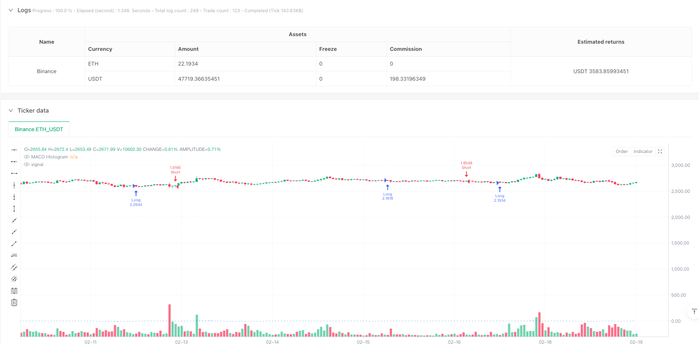
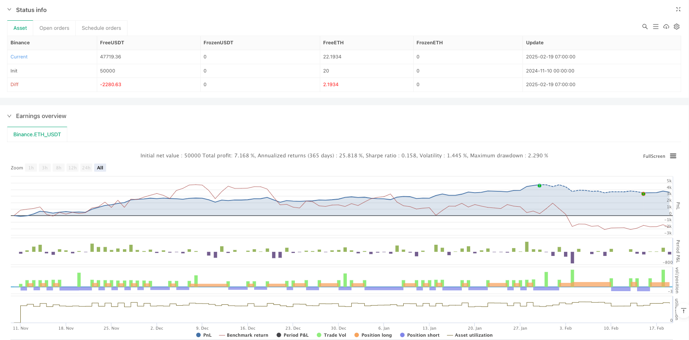

> Name

Momentum-Divergence-Trend-Reversal-Quantitative-Strategy-Based-on-MACD-Histogram
> Author

ianzeng123

> Strategy Description





[trans]
#### Overview
This strategy is a trend reversal trading system based on MACD histogram momentum divergence. It captures market reversal signals by analyzing the relationship between changes in K-line patterns and changes in momentum on the MACD histogram. The core idea of ​​the strategy is to conduct reverse trades when the market shows signs of momentum fading, so as to make early arrangements when the trend is about to reverse.
#### Strategy Principles
The trading logic of the strategy is divided into two directions: short and long:
Short selling conditions: When a large positive line appears (the closing price is higher than the opening price), and its entity is larger than the previous K line, and the MACD histogram shows a downward trend for three consecutive periods, it indicates that the upward momentum is weakening, and the system issues a short signal.
Long conditions: When a large negative line appears (the closing price is lower than the opening price), and its entity is larger than the previous K line, and the MACD histogram shows an upward trend for three consecutive periods, it indicates that the downward momentum is weakening, and the system sends a long signal.
Position management adopts the counterparty signal closing mechanism, that is, when a trading signal in the opposite direction occurs, the current position will be closed. The strategy does not set stop loss and take profit, and relies entirely on signals to manage positions.
#### Strategic Advantages
1. Clear signals: The strategy takes into account K-line patterns and technical indicators at the same time, providing more reliable trading signals.
2. Reversal capture: By monitoring momentum changes, market turning points can be discovered early.
3. Controllable risk: Using the counterparty signal closing mechanism to avoid continuing to hold unfavorable positions when the trend changes.
4. Simple operation: clear trading rules, easy to execute and backtest.
5. Adaptable: The strategy can be applied to different markets and time periods.
#### Strategy Risk
1. Risk of false breakthrough: The market may have a false breakthrough, resulting in false signals.
2. Risk of volatile markets: In a volatile market, frequent trend changes may lead to continuous stop losses.
3. Slippage risk: Large transactions may face significant slippage when liquidity is insufficient.
4. Excessive trading risk: Signals are more frequent, which may result in higher transaction costs.
5. Market environment dependence: The strategy performs better in the trending market, but may not be effective in other market environments.
#### Strategy optimization direction
1. Introduce trend filters: Add trend judgment indicators, such as moving average systems, to filter out false signals in volatile markets.
2. Optimize the stop-loss mechanism: set a reasonable stop-loss position to control the risk of a single transaction.
3. Improve the profit-taking mechanism: dynamically adjust the profit-taking point according to market volatility.
4. Add transaction filtering conditions: such as volume confirmation, volatility filtering, etc. to improve signal quality.
5. Optimize position management: Introduce a dynamic position management mechanism and adjust the position ratio according to market conditions.
#### Summary
This strategy captures market reversal opportunities by combining K-line patterns and MACD histogram momentum changes. It has the characteristics of simple operation and clear signals. Although there are certain risks, the stability and profitability of the strategy can be significantly improved through reasonable optimization and risk management measures. The strategy is particularly suitable for market environments with obvious trends and can be used as an important part of the trading system. ||
#### Overview
This strategy is a trend reversal trading system based on MACD histogram momentum divergence. It captures market reversal signals by analyzing the relationship between candlestick pattern changes and MACD histogram momentum changes. The core idea is to take counter-trend positions when signs of momentum decay appear, thereby positioning ahead of potential trend reversals.

#### Strategy Principle
The trading logic is divided into short and long directions:
Short Entry: When a large bullish candle appears (close above open) with a body larger than the previous candle, and the MACD histogram shows a declining trend for three consecutive periods, indicating weakening upward momentum, the system generates a short signal.
Long Entry: When a large bearish candle appears (close below open) with a body larger than the previous candle, and the MACD histogram shows an ascending trend for three consecutive periods, indicating weakening downward momentum, the system generates a long signal.
Position management uses counter-signal exit mechanism, closing positions when opposite trading signals appear. The strategy doesn't set stop-loss or take-profit levels, relying entirely on signals for position management.

#### Strategy Advantages
1. Clear Signals: The strategy considers both candlestick patterns and technical indicators, providing more reliable trading signals.
2. Reversal Detection: By monitoring momentum changes, it can identify market turning points early.
3. Controlled Risk: Using counter-signal exits prevents holding unfavorable positions during trend changes.
4. Simple Operation: Trading rules are clear, easy to execute and backtest.
5. High Adaptability: The strategy can be applied to different markets and timeframes.

#### Strategy Risks
1. False Breakout Risk: Markets may exhibit false breakouts, leading to incorrect signals.
2. Choppy Market Risk: Frequent trend changes in range-bound markets may result in consecutive losses.
3. Slippage Risk: Large trades may face significant slippage in low liquidity conditions.
4. Overtrading Risk: Frequent signals may generate high transaction costs.
5. Market Environment Dependency: Strategy performs better in trending markets but may underperform in other conditions.

#### Strategy Optimization Directions
1. Implement Trend Filters: Add trend identification indicators, such as moving average systems, to filter false signals in choppy markets.
2. Optimize Stop-Loss Mechanism: Set reasonable stop-loss levels to control per-trade risk.
3. Improve Take-Profit Mechanism: Dynamically adjust profit-taking levels based on market volatility.
4. Add Trading Filters: Such as volume confirmation and volatility filters to improve signal quality.
5. Enhance Position Management: Introduce dynamic position sizing mechanisms to adjust exposure based on market conditions.

#### Summary
This strategy captures market reversal opportunities by combining candlestick patterns and MACD histogram momentum changes, featuring simple operation and clear signals. While certain risks exist, the strategy's stability and profitability can be significantly enhanced through appropriate optimization and risk management measures. It is particularly suitable for trending market environments and can serve as an important component of a trading system.[/trans]


> Source (PineScript)

``` pinescript
/*backtest
start: 2024-11-10 00:00:00
end: 2025-02-19 08:00:00
period: 1h
basePeriod: 1h
exchanges: [{"eid":"Binance","currency":"ETH_USDT"}]
*/

//@version=5
strategy("MACD Momentum Reversal Strategy", overlay=true, initial_capital=100000, default_qty_type=strategy.percent_of_equity, default_qty_value=10)

// === MACD Calculation ===
fastLength   = input.int(12, "MACD Fast Length")
slowLength   = input.int(26, "MACD Slow Length")
signalLength = input.int(9, "MACD Signal Length")
[macdLine, signalLine, histLine] = ta.macd(close, fastLength, slowLength, signalLength)

// === Candle Properties ===
bodySize      = math.abs(close - open)
prevBodySize  = math.abs(close[1] - open[1])
candleBigger  = bodySize > prevBodySize

bullishCandle = close > open
bearishCandle = close < open

// === MACD Momentum Conditions ===
// For bullish candles: if the MACD histogram (normally positive) is decreasing over the last 3 bars,
// then the bullish momentum is fading – a potential short signal.
macdLossBullish = (histLine[2] > histLine[1]) and (histLine[1] > histLine[0])

// For bearish candles: if the MACD histogram (normally negative) is increasing (moving closer to zero)
// over the last 3 bars, then the bearish momentum is fading – a potential long signal.
macdLossBearish = (histLine[2] < histLine[1]) and (histLine[1] < histLine[0])

// === Entry Conditions ===
// Short entry: Occurs when the current candle is bullish and larger than the previous candle,
// while the MACD histogram shows fading bullish momentum.
enterShort = bullishCandle and candleBigger and macdLossBullish

// Long entry: Occurs when the current candle is bearish and larger than the previous candle,
// while the MACD histogram shows fading bearish momentum.
enterLong  = bearishCandle and candleBigger and macdLossBearish

// === Plot the MACD Histogram for Reference ===
plot(histLine, title="MACD Histogram", color=color.blue, style=plot.style_histogram)

// === Strategy Execution ===
// Enter positions based on conditions. There is no stop loss or take profit defined;
// positions remain open until an opposite signal occurs.
if (enterShort)
    strategy.entry("Short", strategy.short)

if (enterLong)
    strategy.entry("Long", strategy.long)

// Exit conditions: close an existing position when the opposite signal appears.
if (strategy.position_size > 0 and enterShort)
    strategy.close("Long")

if (strategy.position_size < 0 and enterLong)
    strategy.close("Short")

```

> Detail

https://www.fmz.com/strategy/483020

> Last Modified

2025-02-21 09:25:50
