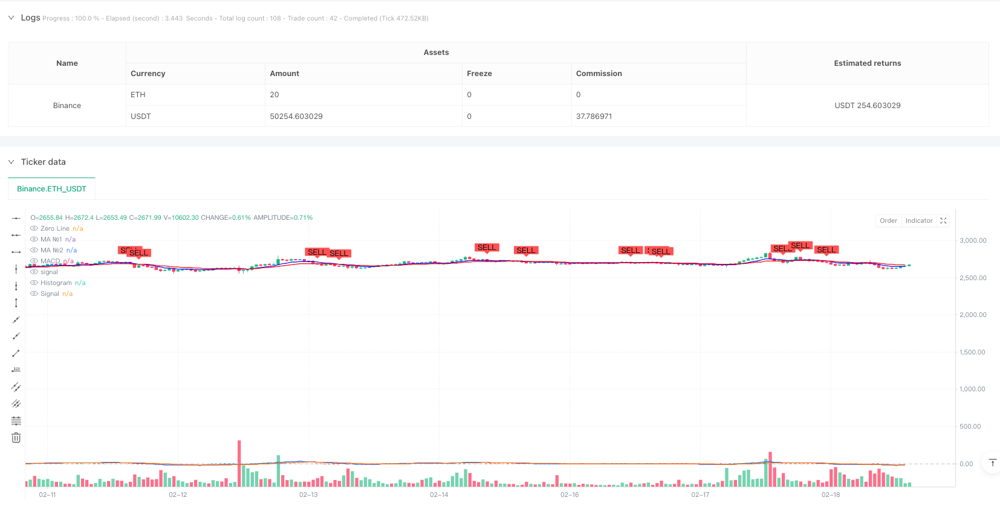
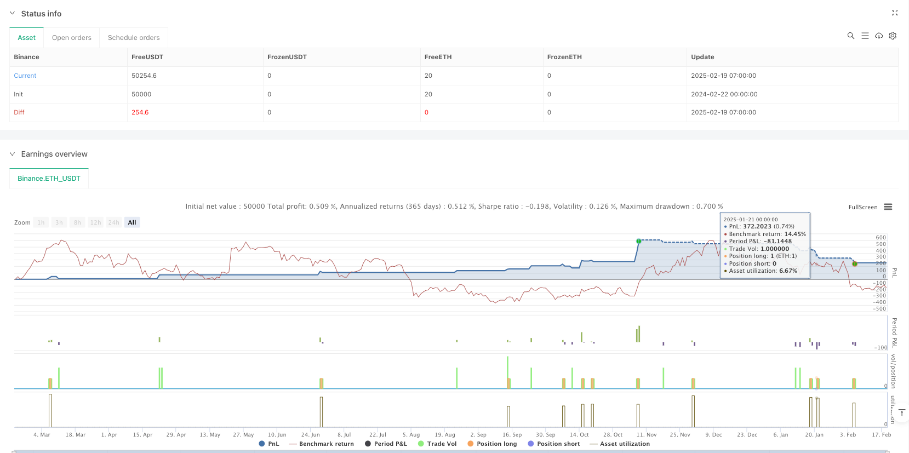

> Name

Multi-Period-Moving-Average-Ribbon-and-MACD-Crossover-Strategy-System
> Author

ianzeng123

> Strategy Description





[trans]
#### Overview
This strategy is a trading system that combines multi-period moving average bands and the MACD indicator. The strategy mainly determines market trends and trading opportunities through the intersection of short-term and long-term moving averages and the signals of the MACD indicator. This strategy integrates intraday trading reset logic, which can effectively prevent overnight risks.
#### Strategy Principle
The core logic of the strategy contains three main parts: the moving average band system, the MACD indicator system and the intraday trading reset mechanism. The moving average band consists of two moving averages with different periods (9 and 21). You can choose from a variety of moving average types including SMA, EMA, SMMA, WMA and VWMA. The MACD system uses the standard 12/26/9 parameter settings and uses the difference between the fast and slow lines and the signal line to determine trend momentum. The buy signal needs to meet both the short-term moving average crossing the long-term moving average and the MACD line crossing the signal line, while the sell signal is triggered when any reverse crossover occurs. The signal status is reset at the beginning of each trading day to ensure the continuity and security of trading.
#### Strategic Advantages
1. Signal confirmation is doubly reliable: it combines trend following and momentum indicators to significantly reduce the risk of false signals.
2. Flexible parameter configuration: supports multiple types of moving averages and can be optimized according to different market characteristics
3. Improved risk control: including intraday trading reset mechanism, effectively avoiding overnight risks
4. Outstanding visualization effect: It integrates clear buying and selling signal marks and moving average band display to facilitate trading decisions.
#### Strategy Risk
1. Trend turning lag: Due to the use of the moving average system, the market may react slowly when the market turns rapidly.
2. Not applicable to volatile markets: Frequent false signals may occur in sideways volatile markets.
3. Difficulty of parameter optimization: There may be significant differences in optimal parameters under different market environments
4. Impact of execution delays: In highly volatile markets, there may be a large price difference between signal confirmation and actual execution.
#### Strategy optimization direction
1. Introduce volatility filtering: It is recommended to add ATR or volatility indicators to adjust the signal trigger threshold in a high volatility environment
2. Optimize the signal confirmation mechanism: consider increasing trading volume confirmation or price pattern confirmation to improve signal reliability
3. Improve risk management: It is recommended to add dynamic stop loss and profit targets to improve the risk-return ratio of the strategy
4. Market environment adaptation: parameters can be dynamically adjusted according to different market conditions to improve strategy adaptability
#### Summary
This strategy builds a relatively complete trading system by combining moving average bands and MACD indicators. Although there is a certain degree of hysteresis risk, through reasonable parameter optimization and risk management, the strategy can achieve good results in trending markets. It is recommended that traders conduct sufficient backtesting before using it in real markets and adjust parameter settings according to specific market characteristics. ||
#### Overview
This strategy is a trading system that combines multi-period moving average ribbons with the MACD indicator. The strategy primarily determines market trends and trading opportunities through the crossover of short-term and long-term moving averages along with MACD signals. It incorporates daily trading reset logic to effectively prevent overnight risks.

#### Strategy Principles
The core logic consists of three main components: the moving average ribbon system, MACD indicator system, and intraday trading reset mechanism. The moving average ribbon comprises two different period lines (9 and 21), with options for various types including SMA, EMA, SMMA, WMA, and VWMA. The MACD system uses standard 12/26/9 parameters, utilizing the difference between fast and slow lines along with a signal line to judge trend momentum. Buy signals require both the short-term MA crossing above the long-term MA and the MACD line crossing above the signal line, while sell signals trigger upon either reverse crossing. Signal states reset at the start of each trading day, ensuring trading continuity and safety.

#### Strategy Advantages
1. Dual signal confirmation reliability: Combines trend following and momentum indicators, significantly reducing false signal risks
2. Flexible parameter configuration: Supports multiple types of moving averages, allowing optimization for different market characteristics
3. Comprehensive risk control: Includes intraday trading reset mechanism, effectively avoiding overnight risks
4. Outstanding visualization: Integrates clear buy/sell signal markers and ribbon display, facilitating trading decisions

#### Strategy Risks
1. Trend reversal lag: Due to the use of moving averages, response might be slow during rapid market turns
2. Ineffective in ranging markets: May generate frequent false signals in sideways, volatile markets
3. Parameter optimization challenges: Optimal parameters may vary significantly across different market environments
4. Execution delay impact: Significant price differences may occur between signal confirmation and actual execution in highly volatile markets

#### Strategy Optimization Directions
1. Introduce volatility filtering: Recommend adding ATR or volatility indicators to adjust signal trigger thresholds in high volatility environments
2. Optimize signal confirmation mechanism: Consider adding volume confirmation or price pattern confirmation to improve signal reliability
3. Enhance risk management: Suggest incorporating dynamic stop-loss and profit targets to improve the strategy's risk-reward ratio
4. Market environment adaptation: Consider dynamic parameter adjustment based on different market states to improve strategy adaptability

#### Summary
This strategy constructs a relatively comprehensive trading system by combining moving average ribbons and MACD indicators. While there are certain lag risks, the strategy can achieve good results in trending markets through proper parameter optimization and risk management. Traders are advised to conduct thorough backtesting before live implementation and adjust parameters according to specific market characteristics.[/trans]


> Source (PineScript)

``` pinescript
/*backtest
start: 2024-02-22 00:00:00
end: 2025-02-19 08:00:00
period: 1h
basePeriod: 1h
exchanges: [{"eid":"Binance","currency":"ETH_USDT"}]
*/

//@version=6
strategy("Daily MA Ribbon + MACD Crossover with Buy/Sell Signals", overlay=true)

// === Daily Reset Logic ===
var bool newDay = false  // Initialize newDay as a boolean variable
newDay := bool(ta.change(time("D")))  // Cast the result of ta.change to boolean

// === Moving Average Ribbon ===
ma(source, length, type) =>
    type == "SMA" ? ta.sma(source, length) :
     type == "EMA" ? ta.ema(source, length) :
     type == "SMMA (RMA)" ? ta.rma(source, length) :
     type == "WMA" ? ta.wma(source, length) :
     type == "VWMA" ? ta.vwma(source, length) :
     na

// MA1 (Short-term MA)
show_ma1   = input(true, "MA №1", inline="MA #1")
ma1_type   = input.string("EMA", "", inline="MA #1", options=["SMA", "EMA", "SMMA (RMA)", "WMA", "VWMA"])
ma1_source = input(close, "", inline="MA #1")
ma1_length = input.int(9, "", inline="MA #1", minval=1)  // Short-term MA (e.g., 9-period)
ma1_color  = input(color.blue, "", inline="MA #1")
ma1 = ma(ma1_source, ma1_length, ma1_type)
plot(show_ma1 ? ma1 : na, color = ma1_color, title="MA №1")

// MA2 (Long-term MA)
show_ma2   = input(true, "MA №2", inline="MA #2")
ma2_type   = input.string("EMA", "", inline="MA #2", options=["SMA", "EMA", "SMMA (RMA)", "WMA", "VWMA"])
ma2_source = input(close, "", inline="MA #2")
ma2_length = input.int(21, "", inline="MA #2", minval=1)  // Long-term MA (e.g., 21-period)
ma2_color  = input(color.red, "", inline="MA #2")
ma2 = ma(ma2_source, ma2_length, ma2_type)
plot(show_ma2 ? ma2 : na, color = ma2_color, title="MA №2")

// === MACD ===
fast_length = input(12, "Fast Length")
slow_length = input(26, "Slow Length")
signal_length = input.int(9, "Signal Smoothing", minval=1, maxval=50)
sma_source = input.string("EMA", "Oscillator MA Type", options=["SMA", "EMA"])
sma_signal = input.string("EMA", "Signal Line MA Type", options=["SMA", "EMA"])

// Calculate MACD
fast_ma = sma_source == "SMA" ? ta.sma(close, fast_length) : ta.ema(close, fast_length)
slow_ma = sma_source == "SMA" ? ta.sma(close, slow_length) : ta.ema(close, slow_length)
macd = fast_ma - slow_ma
signal = sma_signal == "SMA" ? ta.sma(macd, signal_length) : ta.ema(macd, signal_length)
hist = macd - signal

// Plot MACD
hline(0, "Zero Line", color = color.new(#787B86, 50))
plot(hist, title = "Histogram", style = plot.style_columns, color = (hist >= 0 ? (hist[1] < hist ? #26A69A : #B2DFDB) : (hist[1] < hist ? #FFCDD2 : #FF5252)))
plot(macd, title = "MACD", color = #2962FF)
plot(signal, title = "Signal", color = #FF6D00)

// === Buy/Sell Signal Logic ===
// Condition 1: MA1 (Short-term) crosses above MA2 (Long-term)
ma_crossover = ta.crossover(ma1, ma2)

// Condition 2: MACD line crosses above Signal line
macd_crossover = ta.crossover(macd, signal)

// Buy Signal: Both conditions must be true
buy_signal = ma_crossover and macd_crossover

// Sell Signal: MA1 crosses below MA2 or MACD crosses below Signal
sell_signal = ta.crossunder(ma1, ma2) or ta.crossunder(macd, signal)

// Reset signals at the start of each new day
if (newDay)
    buy_signal := false
    sell_signal := false

// Plot Buy/Sell Signals
plotshape(buy_signal, title="Buy Signal", location=location.belowbar, color=color.green, style=shape.labelup, text="BUY")
plotshape(sell_signal, title="Sell Signal", location=location.abovebar, color=color.red, style=shape.labeldown, text="SELL")

// Strategy Entry/Exit
if (buy_signal)
    strategy.entry("Buy", strategy.long)

if (sell_signal)
    strategy.close("Buy", comment="Sell")
```

> Detail

https://www.fmz.com/strategy/483047

> Last Modified

2025-02-21 10:51:25
