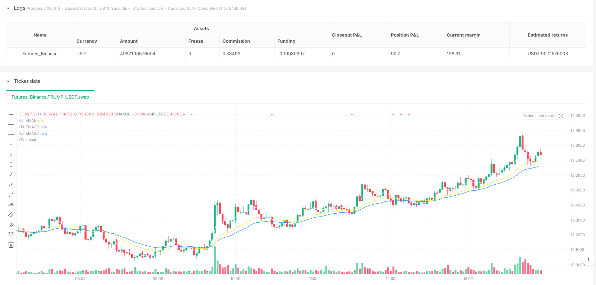
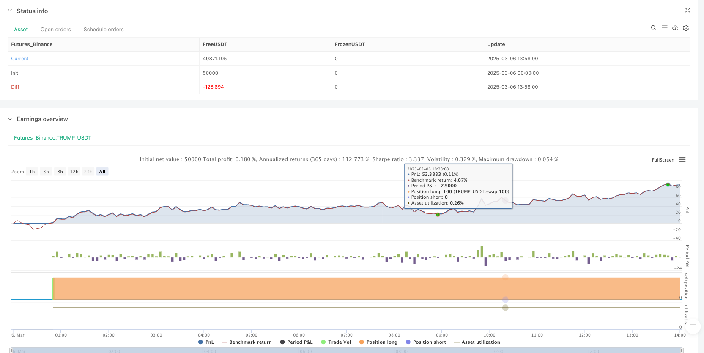

> Name

Multi-Timeframe-EMA-and-MACD-Enhanced-Trend-Quantification-Trading-Strategy
> Author

ianzeng123

> Strategy Description





[trans]## Overview
This strategy is a quantitative trading system based on a combination of the exponential moving average (EMA) and the moving average convergence divergence indicator (MACD). This strategy mainly uses the golden cross signals of the 5-day EMA and the 20-day EMA as the basis for entry, and combines the position relationship between the price and the 30-day EMA and the market trading time conditions for filtering to form a complete short-term trading system. The strategy design focuses on trend confirmation and risk control, and makes trading decisions more objective and disciplined through fixed-amount take-profit and stop-loss settings.
## Strategy Principle
The core logic of this strategy is based on three exponential moving averages of different periods (5-day, 20-day and 30-day EMA), and the trend direction is judged by observing the cross relationship and relative position between them. Specifically, when the short-term 5-day EMA crosses the mid-cycle 20-day EMA upwards, and the price remains above the long-term 30-day EMA, the system generates a long signal. This design fully takes into account the principle of multiple time frame analysis to ensure that the trading direction is consistent with the main trend.
In addition, the strategy also adds a trading time filter to only execute trades during the regular trading hours from 9:30 am to 4:00 pm EST. This time filtering mechanism helps avoid periods of poor market liquidity and abnormal volatility and improves the success rate of transactions.
In terms of money management, the strategy uses a fixed number of positions to enter the market and manages risk through a fixed amount of take-profit and stop-loss ratios. The system sets a fixed profit target of $2,000 and a stop loss level of 1,000 points. This design keeps the risk-return characteristics of each transaction consistent and is conducive to long-term stable performance.
##
 strategic advantage
1. **Multiple confirmation mechanism**: By combining the synergy of short, medium and long three-period EMA, this strategy can effectively filter out false breakthroughs and market noise to ensure the reliability of trading signals. When the 5-day EMA crosses the 20-day EMA and the price is above the 30-day EMA, it indicates that the short-term, mid-term and long-term trends are all upward, increasing the probability of successful trades.
2. **Accurate market time filtering**: The strategy only runs during normal trading hours, avoiding periods of limited liquidity such as before and after the market, reducing the possibility of slippage and unfavorable transactions. This feature is particularly important for short-term trading within the day, and can effectively avoid risks caused by abnormal market volatility.
3. **Clear risk management framework**: Through fixed-amount take-profit and stop-loss settings, the risk exposure of each transaction is strictly controlled. This method is more suitable for specific market environments than percentage stop loss, especially when prices fluctuate violently, and can better protect the safety of funds.
4. **Visual trading signals**: The strategy clearly displays EMA crossing points and entry signals through graphical markers, allowing traders to intuitively identify potential trading opportunities and improve decision-making efficiency. These visual aids are extremely valuable for real-time transaction monitoring.
5. **Strategy logic is simple and efficient**: Compared with complex multi-indicator systems, this strategy maintains logic simplicity, reduces the risk of overfitting, and provides sufficient market insight. The simple design also means less computational burden, making it suitable for high-frequency trading environments.
## Strategy Risk
1. **EMA crossover lag**: EMA crossover signals are essentially lagging indicators, which may lead to late entry in a rapidly changing market and miss the best price area. Especially in highly volatile markets, waiting for the 5-day EMA to cross-confirm with the 20-day EMA may make the entry price far away from the ideal area.
2. **Fixed Stop Loss Risk**: The strategy uses a fixed amount of stop loss instead of dynamic adjustment according to market volatility. When the market environment changes, the stop loss may be too tight or too loose. For example, in the event of a sudden increase in volatility, fixed stops may be easily triggered, resulting in unnecessary losses.
3. **Market Condition Dependence**: This strategy performs best in clearly trending markets, but may produce frequent false signals in range-bound or highly volatile market environments. When the market lacks directionality, moving average crossovers can lead to consecutive losing trades.
4. **Lack of trading volume confirmation**: Although there are signal conditions related to drawing trading volume in the strategy code, trading volume is not used as a filter condition in actual trading decisions, which may lead to a weak trend in a low trading volume environment.
5. **Single direction trading restrictions**: The current strategy design only optimizes the long conditions and lacks complete support for the short market, limiting the scope of application in a bear market environment.
## Strategy optimization direction
1. **Introducing a dynamic stop loss mechanism**: The stop loss level can be dynamically adjusted based on market volatility indicators (such as ATR), making the stop loss more intelligent and adaptable. For example, you can set your stop loss as a multiple of ATR, automatically increasing the stop loss distance during periods of high volatility, and tightening the stop loss during periods of low volatility.
2. **Integrated volume conditions**: It is recommended to use volume breakthroughs as additional confirmation conditions, and only trigger trading signals when the EMA crossover occurs against a heavy volume background. The specific implementation can be judged by comparing the relationship between the current trading volume and the N-day average trading volume.
3. **Add trend strength filter**: Introduce trend strength indicators such as ADX (Average Trend Index), and only allow entry when the trend is strong enough (such as ADX>25), which helps avoid false signals generated in weak trends or volatile markets.
4. **Improve the balance of long and short strategies**: Expand the strategy to support short trading. When the 5-day EMA crosses the 20-day EMA and the price is lower than the 30-day EMA, a short signal is generated to achieve trading capabilities under all market conditions.
5. **Add backtest optimization framework**: Introduce a parameter optimization mechanism to automatically test different combinations of EMA periods, stop loss and take profit levels, and find the optimal parameter settings under different market environments. For example, you can test various combination effects of the short-period EMA in the 3-8 day range and the medium-period EMA in the 15-30 day range.
6. **Integrate market sentiment indicators**: Consider using market sentiment indicators such as VIX as additional filtering conditions to adjust or suspend trading during periods of extreme market sentiment to avoid taking excessive risks in abnormal market environments.
## Summarize
This quantitative trading strategy based on multi-period index moving average and market time filtering combines the golden cross of the 5-day EMA and the 20-day EMA with price position judgment to form a trading system with clear logic and clear execution. This strategy is particularly suitable for short- and medium-term trend trading. Its advantages include a complete signal confirmation mechanism and a clear risk control framework. However, it also has inherent limitations such as moving average lag and dependence on market conditions.
By introducing optimization measures such as dynamic stop loss, volume confirmation, and trend strength filtering, the strategy is expected to further improve stability and adaptability. For quantitative traders, this strategy framework provides a good starting point that can be adjusted and expanded accordingly according to personal risk preferences and market environment to form a more personalized and efficient trading system. The strategy's simple design and clear logic also make it an ideal teaching tool for learning quantitative trading, helping traders understand the basic principles of trend following and risk management. || ## Overview
This strategy is a quantitative trading system based on the combination of Exponential Moving Averages (EMA) and Moving Average Convergence Divergence (MACD). The strategy primarily uses the golden cross signal between the 5-day EMA and 20-day EMA as the entry basis, while incorporating the price's position relative to the 30-day EMA and market trading time conditions as filters, forming a complete short-term trading system. The strategy design focuses on trend confirmation and risk control, making trading decisions more objective and disciplined through fixed-amount take-profit and stop-loss settings.

## Strategy Principles

The core logic of this strategy is based on three different period Exponential Moving Averages (5-day, 20-day, and 30-day EMA), judging trend direction by observing their crossover relationships and relative positions. Specifically, when the short-period 5-day EMA crosses above the medium-period 20-day EMA, and the price remains above the long-period 30-day EMA, the system generates a long signal. This design fully considers the principles of multi-timeframe analysis, ensuring that the trading direction remains consistent with the main trend.

Additionally, the strategy incorporates trading time filter conditions, only executing trades during regular trading hours from 9:30 AM to 4:00 PM Eastern Time in the United States. This time filtering mechanism helps to avoid periods of poor market liquidity and abnormal volatility, improving the success rate of trades.

In terms of fund management, the strategy adopts a fixed quantity of positions to enter the market and manages risk through fixed-amount take-profit and stop-loss ratios. The system sets a fixed profit target of $2,000 and a stop-loss level of 1,000 points, which ensures that the risk-reward characteristics of each trade remain consistent, contributing to long-term stable performance.

## Strategy Advantages

1. **Multiple Confirmation Mechanisms**: By combining the synergistic effects of short, medium, and long-period EMAs, the strategy can effectively filter out false breakouts and market noise, ensuring the reliability of trading signals. When the 5-day EMA crosses above the 20-day EMA and the price is above the 30-day EMA, it indicates that short-term, medium-term, and long-term trends are all rising, increasing the probability of successful trades.

2. **Precise Market Time Filtering**: The strategy only operates during normal trading hours, avoiding limited liquidity periods such as pre-market and after-hours, reducing the possibility of slippage and unfavorable executions. This feature is particularly important for intraday short-term trading and can effectively avoid risks brought by abnormal market volatility.

3. **Clear Risk Management Framework**: Through fixed-amount take-profit and stop-loss settings, the risk exposure of each trade is strictly controlled. This method is more suitable for specific market environments compared to percentage-based stop-losses, especially in situations of violent price fluctuations, better protecting fund safety.

4. **Visualized Trading Signals**: The strategy clearly displays EMA crossover points and entry signals through graphic markers, allowing traders to intuitively identify potential trading opportunities and improve decision-making efficiency. These visual aids are valuable for real-time trading monitoring.

5. **Concise and Efficient Strategy Logic**: Compared to complex multi-indicator systems, this strategy maintains logical simplicity, reducing the risk of overfitting while providing sufficient market insight. The concise design also means less computational burden, suitable for high-frequency trading environments.

## Strategy Risks

1. **Lagging Nature of Moving Average Crossovers**: EMA crossover signals are inherently lagging indicators, which may lead to delayed entry timing in rapidly changing markets, missing the optimal price zones. Especially in highly volatile markets, waiting for confirmation of the 5-day EMA crossing the 20-day EMA may result in entry prices far from the ideal area.

2. **Fixed Stop-Loss Risk**: The strategy employs a fixed-amount stop-loss rather than dynamically adjusting based on market volatility, which may result in stop-losses that are too tight or too loose when market conditions change. For example, in cases of suddenly expanded volatility, fixed stop-loss points may be easily triggered, causing unnecessary losses.

3. **Market Condition Dependency**: This strategy performs best in clearly trending markets but may generate frequent false signals in range-bound or highly volatile market environments. When the market lacks directionality, moving average crossovers may lead to consecutive losing trades.

4. **Lack of Volume Confirmation**: Although there are volume-related signal conditions plotted in the strategy code, trading decisions do not use volume as a filter condition, potentially leading to entries into weak trends in low-volume environments.

5. **Single-Direction Trading Limitation**: The current strategy design is only optimized for long conditions, lacking complete support for short markets, limiting its application range in bearish market environments.

## Strategy Optimization Directions

1. **Introduce Dynamic Stop-Loss Mechanism**: Stop-loss levels can be dynamically adjusted based on market volatility indicators (such as ATR), making the stop-loss more intelligent and adaptive. For example, the stop-loss can be set as a multiple of ATR, automatically increasing the stop-loss distance during high-volatility periods and tightening it during low-volatility periods.

2. **Integrate Volume Conditions**: It is recommended to use volume breakouts as an additional confirmation condition, triggering trading signals only when EMA crossovers occur against a background of increased volume. This can be specifically implemented by comparing the relationship between current volume and N-day average volume.

3. **Add Trend Strength Filters**: Introduce trend strength indicators such as ADX (Average Directional Index), only allowing entries when the trend is strong enough (e.g., ADX > 25), helping to avoid false signals generated in weak trends or oscillating markets.

4. **Perfect Long-Short Strategy Balance**: Extend the strategy to support short trading, generating short signals when the 5-day EMA crosses below the 20-day EMA and the price is below the 30-day EMA, achieving trading capabilities under all market conditions.

5. **Add Backtesting Optimization Framework**: Introduce parameter optimization mechanisms to automatically test combinations of different EMA periods, stop-loss, and take-profit levels, finding optimal parameter settings under different market environments. For example, testing various combinations of short-period EMAs in the range of 3-8 days and medium-period EMAs in the range of 15-30 days.

6. **Integrate Market Sentiment Indicators**: Consider using market sentiment indicators such as VIX as additional filter conditions, adjusting or suspending trading during periods of extreme market sentiment to avoid taking excessive risks in abnormal market environments.

## Summary

This quantitative trading strategy based on multi-period exponential moving averages and market time filtering forms a logically clear and precisely executable trading system through the golden cross of the 5-day EMA and 20-day EMA combined with price position judgment. The strategy is particularly suitable for medium to short-term trend trading, with advantages in comprehensive signal confirmation mechanisms and clear risk control frameworks, but also inherent limitations such as moving average lag and market condition dependency.

By introducing optimization measures such as dynamic stop-losses, volume confirmation, and trend strength filtering, the strategy has the potential to further enhance stability and adaptability. For quantitative traders, this strategy framework provides a good starting point that can be adjusted and expanded according to personal risk preferences and market environments to form a more personalized and efficient trading system. The concise design and clear logic of the strategy also make it an ideal educational tool for learning quantitative trading, helping traders understand the basic principles of trend following and risk management.[/trans]


> Source (PineScript)

``` pinescript
/*backtest
start: 2025-03-06 00:00:00
end: 2025-03-06 14:00:00
period: 2m
basePeriod: 2m
exchanges: [{"eid":"Futures_Binance","currency":"TRUMP_USDT"}]
*/

//@version=5
strategy("EMA MACD Long Scalper", overlay=true)

// Input parameters
ema1Length = input.int(5, "EMA1", minval=1)
ema2Length = input.int(20, "EMA2", minval=1)
ema3Length = input.int(30, "EMA3", minval=1)
positionSize = input.int(100, "Position Size (Shares)", minval=1)
stopLossPct = 1000// 0.5% stop loss

takeProfitDollar = 2000// Take profit at $1,000
marketHoursCondition = hour(time, "America/New_York") >= 9 and minute(time, "America/New_York") >=30 and hour(time, "America/New_York") < 16


// Calculate EMA and SMA
ema1 = ta.ema(close, ema1Length)
ema2 = ta.ema(close, ema2Length)
ema3 = ta.ema(close, ema3Length)

// Cross Shape Conditions
EMABullcross = ta.crossover(ema1, ema2)
EMABearCross = ta.crossunder (ema1, ema2)

//Plot EMA
plot(ema1, "EMA5", color=color.white, linewidth=1, transp=0)
plot(ema2, "EMA20", color=color.yellow, linewidth=1, transp=0)
plot(ema3, "EMA30", color=color.blue, linewidth=1, transp=0)
plotshape(EMABullcross ? low : na, title='EMA Crossover Above', style=shape.triangleup, color=color.new(color.green, 0), location=location.bottom, size=size.tiny)
plotshape(EMABearCross ? low : na, title='EMA Crossover Above', style=shape.triangledown, color=color.new(color.red, 0), location=location.top, size=size.tiny)
// Crossover signals
longCondition = ta.crossover(ema1, ema2) and close > ema3 and marketHoursCondition


// Variables to track entry prices
var float entryPrice = na

// Strategy execution
if (longCondition)
    entryPrice := close
    strategy.entry("Long", strategy.long, qty=positionSize)


// Take profit calculation
longTakeProfitLevel = entryPrice + (takeProfitDollar / positionSize)
shortTakeProfitLevel = entryPrice - (takeProfitDollar / positionSize)

// Stop loss calculation
longStopLossLevel = entryPrice - (stopLossPct / positionSize)
shortStopLossLevel = entryPrice * (1 + stopLossPct / 100)

// Exit conditions
strategy.exit("TP Long", from_entry="Long", limit=longTakeProfitLevel, stop=longStopLossLevel)
strategy.exit("TP Short", from_entry="Short", limit=shortTakeProfitLevel, stop=shortStopLossLevel)

// Plot signals
plotshape(longCondition, title="Long Signal", location=location.belowbar, color=color.green, style=shape.triangleup, size=size.small)

```

> Detail

https://www.fmz.com/strategy/486563

> Last Modified

2025-03-14 09:24:01
