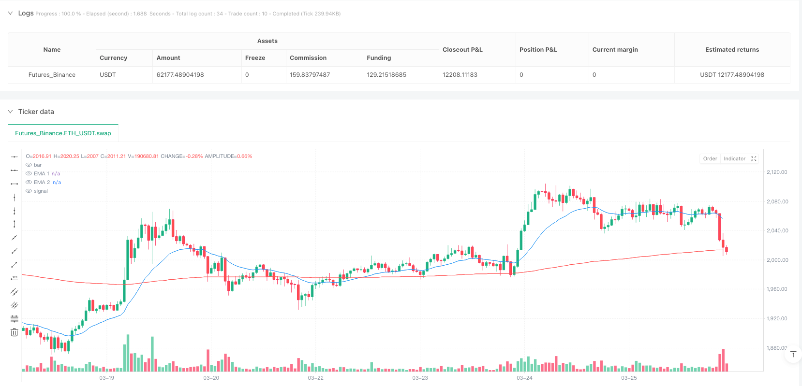
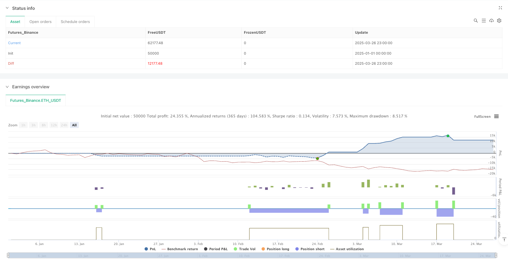

> Name

Multiple Moving Average Reversion MACD Trend Confirmation Strategy-Multiple-EMA-Reversion-MACD-Trend-Confirmation-Strategy
> Author

ianzeng123

> Strategy Description





[trans]
#### Overview
The multiple moving average regression MACD trend confirmation strategy is a trend trading system that combines the moving average system, price regression and MACD indicators. The core concept of this strategy is to look for trading opportunities when the price returns to the long-term moving average (200/250 moving average), and use the MACD indicator as an entry confirmation signal. The strategy also uses multiple hidden moving averages as auxiliary screening conditions, as well as dynamic stop loss and fixed risk-reward ratio settings based on ATR, forming a complete trading system.
#### Strategy Principle
This strategy trades based on the following core principles:
1. Trend judgment: Use the relative position of the 20 moving average and the 250 moving average to judge the overall market trend. When the 20-day moving average is above the 250-day moving average, the market is considered to be in an upward trend; when the 20-day moving average is below the 250-day moving average, the market is considered to be in a downward trend.
2. Price return: The strategy only looks for entry opportunities when the price returns to near the long-term moving average (250-day moving average), which is based on the mean reversion theory that "price will eventually return to the moving average."
3. Entry conditions: Use MACD crossover as the entry trigger signal, combined with moving average position filtering.
4. Hidden moving average screening: The strategy uses three additional "hidden moving averages" (2-day, 100-day, and 300-day moving averages) to create an entry window that requires price to be between specific moving averages.
5. Risk management: Use dynamic stop loss based on ATR, the default is 5 times the ATR value, and automatically calculate the profit target through the preset risk-reward ratio (default 1.5).
Long entry conditions:
- 20 EMA is above 250 EMA (confirming uptrend)
- The 2-day EMA is above the 300-day EMA and the 2-day EMA is below the 100-day MA (confirming the price reversion zone)
- MACD crosses signal line (confirming momentum shift)
Short entry conditions:
- 20 EMA is below 250 EMA (confirming downtrend)
- The 2-day MA is below the 300-day MA and the 2-day MA is above the 100-day MA (confirming the price reversion zone)
- MACD line crosses below signal line (confirming momentum shift)
#### Strategic Advantages
1. Combining trend following and callbacks: The strategy not only respects the mid- to long-term trend direction (judged by the 20/250 moving average), but also captures better entry points when prices fall back, reducing the risk of chasing highs or buying lows.
2. Precise entry area: Through the combined screening of multiple moving averages, a relatively precise entry window is created, reducing false signals.
3. Dynamic risk management: ATR-based stop loss setting enables the strategy to automatically adjust risk exposure based on market volatility, setting looser stops in high-volatility markets and setting tighter stops in low-volatility markets.
4. Systematic profit target: Automatically calculate the target price through the preset risk-return ratio, avoiding subjective judgment.
5. Signal screening mechanism: Cross-validation of multiple conditions (moving average position + MACD crossover) reduces the possibility of false signals.
6. Visual assistance: The strategy is marked with a background color when the entry conditions are met, allowing traders to intuitively identify entry opportunities.
#### Strategy Risk
1. Moving average lag: The moving average is essentially a lagging indicator. In a rapidly changing market, it may not be able to respond to price changes in a timely manner, resulting in delayed entry and exit signals. Solution: You can consider adjusting the moving average parameters, such as using a shorter-term EMA1 or using a higher-weighted moving average such as the Hull moving average.
2. Complex conditions lead to scarce trading opportunities: The superposition of multiple entry conditions may cause actual trading signals to be relatively scarce, especially in volatile markets. Solution: You can optimize entry conditions according to different market conditions, or add additional entry logic.
3. Limitations of the fixed risk-reward ratio: The preset fixed risk-return ratio may not be suitable for all market environments. It may make profits prematurely when the trend is strong, and it may make it difficult to achieve the target price in a volatile market. Solution: You can consider dynamically adjusting the risk-reward ratio or implementing a batch profit strategy.
4. Sensitive to parameter changes: The strategy uses multiple moving averages and MACD parameters, and over-optimization may lead to the risk of over-fitting. Solution: Conduct a robustness test to ensure that the strategy performance remains stable when parameters change slightly.
5. Lack of market environment filtering: The strategy does not have a mechanism to identify the overall market environment (such as trend strength, volatility range, etc.) and may generate signals under unsuitable market conditions. Solution: Add market environment filters, such as the ADX indicator to determine trend strength, or volatility threshold control.
#### Strategy optimization direction
1. Dynamically adjust the risk-reward ratio: The risk-reward ratio can be automatically adjusted based on market volatility or trend strength, such as using a higher risk-reward ratio in strong trending markets and using a lower risk-reward ratio in volatile markets. This can better adapt to different market environments and improve the adaptability of the strategy.
2. Add market environment filtering: Introduce additional indicators such as ADX (average trend indicator) to judge the strength of the trend, and only execute transactions when the trend is clear. You can also judge the volatility environment based on the VIX or ATR range to avoid trading in excessively volatile or insufficiently volatile markets.
3. Profit-in-batch strategy: You can implement a profit-in-batch strategy, such as closing a portion of the position when the 0.5R, 1R and final targets are reached. This can not only lock in part of the profit, but also allow some positions to continue to obtain potential profits.
4. Improve the moving average system: You can try to use adaptive moving averages such as KAMA (Kaufman Adaptive Moving Average) or Hull moving average instead of the standard EMA to reduce the average lag and improve the response speed to price changes.
5. Integrate trading volume confirmation: Add trading volume confirmation conditions when generating entry signals, such as requiring MACD crosses to be accompanied by an increase in trading volume to improve signal reliability.
6. Add time filter: You can add a time filter to avoid trading during periods of greater volatility or poor liquidity, such as one hour before the market opens or closes.
7. Optimize the stop loss mechanism: You can implement a trailing stop loss instead of a fixed stop loss, especially after the profit reaches a certain level, this can maximize the protection of existing profits.
#### Summary
The multiple moving average regression MACD trend confirmation strategy is a comprehensive trading system that integrates a variety of technical analysis methods. Its core advantage is that it combines trend judgment, price regression theory, momentum confirmation and systematic risk management. The strategy identifies the overall trend direction through the moving average system, finds entry points with high winning rates through the mechanism of price returning to the vicinity of the long-term moving average, and uses MACD as a momentum confirmation signal to reduce false signals.
This strategy is particularly suitable for mid- to long-term trend markets, and can capture opportunities to continue to develop in the trend direction after price corrections in a strong trend environment. However, the strategy also has potential risks such as moving average lag and scarce trading opportunities, and needs to be optimized through market environment filtering and dynamic risk management.
By adding a market environment filtering mechanism, dynamically adjusting the risk-reward ratio, and improving the moving average system, this strategy is expected to further improve stability and adaptability and become a more comprehensive and effective trading system. For investors pursuing systematic trading, this strategy that combines multiple technical indicators and has a complete risk management mechanism provides a trading framework worth considering.
||
#### Overview
The Multiple EMA Reversion MACD Trend Confirmation Strategy is a trend trading system that combines a multi-EMA approach, price reversion, and MACD indicator. The core concept involves seeking trading opportunities when price reverts to the vicinity of a long-term moving average (200/250 EMA) and using the MACD indicator as an entry confirmation signal. The strategy employs also multiple hidden EMAs as auxiliary filtering conditions, along with ATR-based dynamic stop-loss and a fixed risk-reward ratio setup, forming a complete trading system.
#### Strategy Principles
This strategy executes trades based on the following core principles:
1. Trend Determination: Uses the relative position of the 20 EMA to the 250 EMA to determine the overall market trend. When the 20 EMA is above the 250 EMA, the market is considered to be in an uptrend; when the 20 EMA is below the 250 EMA, the market is considered to be in a downtrend.
2. Price Reversion: The strategy only looks for entry opportunities when the price reverts to the vicinity of the long-term moving average (250-day EMA), based on the mean reversion theory that "prices eventually return to their mean."
3. Entry Conditions: Uses MACD crossovers as entry trigger signals, combined with EMA positioning filters.
4. Hidden EMA Filtering: The strategy uses three additional "hidden EMAs" (2-day, 100-day, and 300-day EMAs) to create an entry window, requiring the price to be between specific EMAs.
5. Risk Management: Uses ATR-based dynamic stop-loss, defaulting to 5 times the ATR value, and automatically calculates profit targets using a preset risk-reward ratio (default 1.5).

Long Entry Conditions:
- 20 EMA is above the 250 EMA (confirming uptrend)
- 2-day EMA is above the 300-day EMA and the 2-day EMA is below the 100-day EMA (confirming price reversion zone)
- MACD line crosses above the signal line (confirming momentum shift)

Short Entry Conditions:
- 20 EMA is below the 250 EMA (confirming downtrend)
- 2-day EMA is below the 300-day EMA and the 2-day EMA is above the 100-day EMA (confirming price reversion zone)
- MACD line crosses below the signal line (confirming momentum shift)

#### Strategy Advantages
1. Combination of Trend Following and Pullbacks: The strategy respects the medium to long-term trend direction (determined by 20/250 EMAs) while capturing better entry points during price pullbacks, reducing the risk of chasing highs or catching falling knives.
2. Precise Entry Zones: Through the combination of multiple EMAs, the strategy creates a relatively precise entry window, reducing false signals.
3. Dynamic Risk Management: ATR-based stop-loss settings allow the strategy to automatically adjust risk exposure according to market volatility, setting wider stops in highly volatile markets and tighter stops in less volatile conditions.
4. Systematic Profit Targets: Automatically calculates target prices through preset risk-reward ratios, avoiding subjective judgment.
5. Signal Filtering Mechanism: Cross-validation of multiple conditions (EMA positions + MACD crossovers) reduces the possibility of false signals.
6. Visual Assistance: The strategy marks entry conditions with background colors, allowing traders to visually identify entry opportunities.

#### Strategy Risks
1. EMA Lag: EMAs are inherently lagging indicators and may not respond to price changes in time during rapidly changing markets, leading to delayed entry and exit signals. Solution: Consider adjusting EMA parameters, such as adopting a shorter-term EMA1 or using higher-weighted moving averages like Hull moving averages.
2. Complex Conditions Leading to Scarce Trading Opportunities: The stacking of multiple entry conditions may result in relatively few actual trading signals, especially in range-bound markets. Solution: Optimize entry conditions based on different market conditions, or add additional entry logic.
3. Limitations of Fixed Risk-Reward Ratios: Preset fixed risk-reward ratios may not be suitable for all market environments, potentially leading to premature profit-taking in strong trends and unattainable targets in range-bound markets. Solution: Consider dynamically adjusting risk-reward ratios, or implementing a scaled profit-taking strategy.
4. Sensitivity to Parameter Changes: The strategy uses multiple EMA and MACD parameters, and excessive optimization may lead to overfitting risk. Solution: Conduct robustness testing to ensure strategy performance remains stable with small parameter changes.
5. Lack of Market Environment Filtering: The strategy lacks mechanisms to identify overall market conditions (such as trend strength, volatility range, etc.), and may generate signals under unsuitable market conditions. Solution: Add market environment filters, such as ADX indicators to determine trend strength, or volatility thresholds.

#### Strategy Optimization Directions
1. Dynamic Adjustment of Risk-Reward Ratios: Risk-reward ratios can be automatically adjusted based on market volatility or trend strength, using higher risk-reward ratios in strong trend markets and lower ones in range-bound markets. This can better adapt to different market environments and improve strategy adaptability.
2. Add Market Environment Filtering: Introduce additional indicators such as ADX (Average Directional Index) to determine trend strength, executing trades only when trends are clear. VIX or ATR ranges can also be used to judge volatility environments, avoiding trading in excessively volatile or insufficiently volatile markets.
3. Scaled Profit-Taking Strategy: Implement a scaled profit-taking strategy, such as closing portions of positions at 0.5R, 1R, and final targets respectively, both securing partial profits and allowing the remaining position to capture potential gains.
4. Improve the EMA System: Try using adaptive moving averages such as KAMA (Kaufman's Adaptive Moving Average) or Hull moving averages instead of standard EMAs, reducing lag and improving responsiveness to price changes.
5. Integrate Volume Confirmation: Add volume confirmation conditions when generating entry signals, such as requiring increased volume during MACD crossovers, improving signal reliability.
6. Add Time Filters: Add time filters to avoid trading during periods of high volatility or poor liquidity, such as an hour before market opening or closing.
7. Optimize Stop-Loss Mechanisms: Implement trailing stops instead of fixed stops, especially after profits reach certain levels, maximizing the protection of existing profits.

#### Summary
The Multiple EMA Reversion MACD Trend Confirmation Strategy is a comprehensive trading system that integrates multiple technical analysis methods. Its core advantages lie in combining trend determination, price reversion theory, momentum confirmation, and systematic risk management. The strategy identifies overall trend direction through the EMA system, seeks high-probability entry points through price reversion to long-term EMAs, and uses MACD as a momentum confirmation signal to reduce false signals.

This strategy is particularly suitable for medium to long-term trending markets, capturing opportunities for price pullbacks to continue developing along the trend direction in strong trend environments. However, the strategy also faces potential risks such as EMA lag and scarce trading opportunities, which need to be optimized through market environment filtering, dynamic risk management, and other methods.

By adding market environment filtering mechanisms, dynamically adjusting risk-reward ratios, and improving the EMA system, this strategy has the potential to further enhance stability and adaptability, becoming a more comprehensive and effective trading system. For investors pursuing systematic trading, this strategy, which combines multiple technical indicators and possesses complete risk management mechanisms, provides a trading framework worth considering.
[/trans]


> Source (PineScript)

``` pinescript
/*backtest
start: 2025-01-01 00:00:00
end: 2025-03-27 00:00:00
period: 1h
basePeriod: 1h
exchanges: [{"eid":"Futures_Binance","currency":"ETH_USDT"}]
*/

//@version=5
strategy("Price Near 200 EMA", overlay=true, default_qty_type=strategy.percent_of_equity, default_qty_value=100)

// === User Inputs ===
ema1Length = input(20, title="EMA 1 Length")     // Main EMA (Trend)
ema2Length = input(250, title="EMA 2 Length")    // Long-term EMA
macdFastLength = input(12, title="MACD Fast Length")
macdSlowLength = input(26, title="MACD Slow Length")
macdSignalLength = input(9, title="MACD Signal Length")

rrRatio = input.float(1.5, title="Risk to Reward Ratio", minval=1, step=0.1)
atrMultiplier = input.float(5, title="ATR Multiplier for SL", minval=1, step=0.1)  // Default to 5x ATR
atrLength = input(14, title="ATR Length")  // User-defined ATR length

// === Hidden EMA Lengths (Hardcoded) ===
ema3Length = 2    // Fast EMA (Hidden)
ema4Length = 100  // Medium EMA (Hidden)
ema5Length = 300  // Long EMA (Hidden)

// === EMA Calculations ===
ema1 = ta.ema(close, ema1Length)  // 20 EMA
ema2 = ta.ema(close, ema2Length)  // 250 EMA
ema3 = ta.ema(close, ema3Length)  // 2 EMA (Hidden)
ema4 = ta.ema(close, ema4Length)  // 100 EMA (Hidden)
ema5 = ta.ema(close, ema5Length)  // 300 EMA (Hidden)

// === MACD Calculation ===
[macdLine, signalLine, _] = ta.macd(close, macdFastLength, macdSlowLength, macdSignalLength)
macdBullish = ta.crossover(macdLine, signalLine)
macdBearish = ta.crossunder(macdLine, signalLine)

// === ATR for Dynamic Stop Loss ===
atrValue = ta.atr(atrLength)

// === Long Conditions ===
bullishCondition1 = ema1 > ema2
bullishCondition2 = ema3 > ema5 and ema3 < ema4
bullishEntry = bullishCondition1 and bullishCondition2 and macdBullish

// === Short Conditions ===
bearishCondition1 = ema1 < ema2
bearishCondition2 = ema3 < ema5 and ema3 > ema4
bearishEntry = bearishCondition1 and bearishCondition2 and macdBearish

// === Calculate Stop Loss and Target Using ATR ===
longStopLoss = close - atrValue * atrMultiplier
longTargetPrice = close + (close - longStopLoss) * rrRatio

shortStopLoss = close + atrValue * atrMultiplier
shortTargetPrice = close - (shortStopLoss - close) * rrRatio

// === Entry and Exit Logic ===
if bullishEntry
    strategy.entry("Buy", strategy.long)
    strategy.exit("TP Long", "Buy", limit=longTargetPrice, stop=longStopLoss, comment="SL/TP Long")

if bearishEntry
    strategy.entry("Sell", strategy.short)
    strategy.exit("TP Short", "Sell", limit=shortTargetPrice, stop=shortStopLoss, comment="SL/TP Short")

// === Plotting Only Visible EMAs ===
plot(ema1, title="EMA 1", color=color.blue)
plot(ema2, title="EMA 2", color=color.red)

// === Background Highlight for Entries ===
bgcolor(bullishEntry ? color.new(color.green, 90) : na, title="Bullish Background")
bgcolor(bearishEntry ? color.new(color.red, 90) : na, title="Bearish Background")

```

> Detail

https://www.fmz.com/strategy/488523

> Last Modified

2025-03-28 15:40:36
