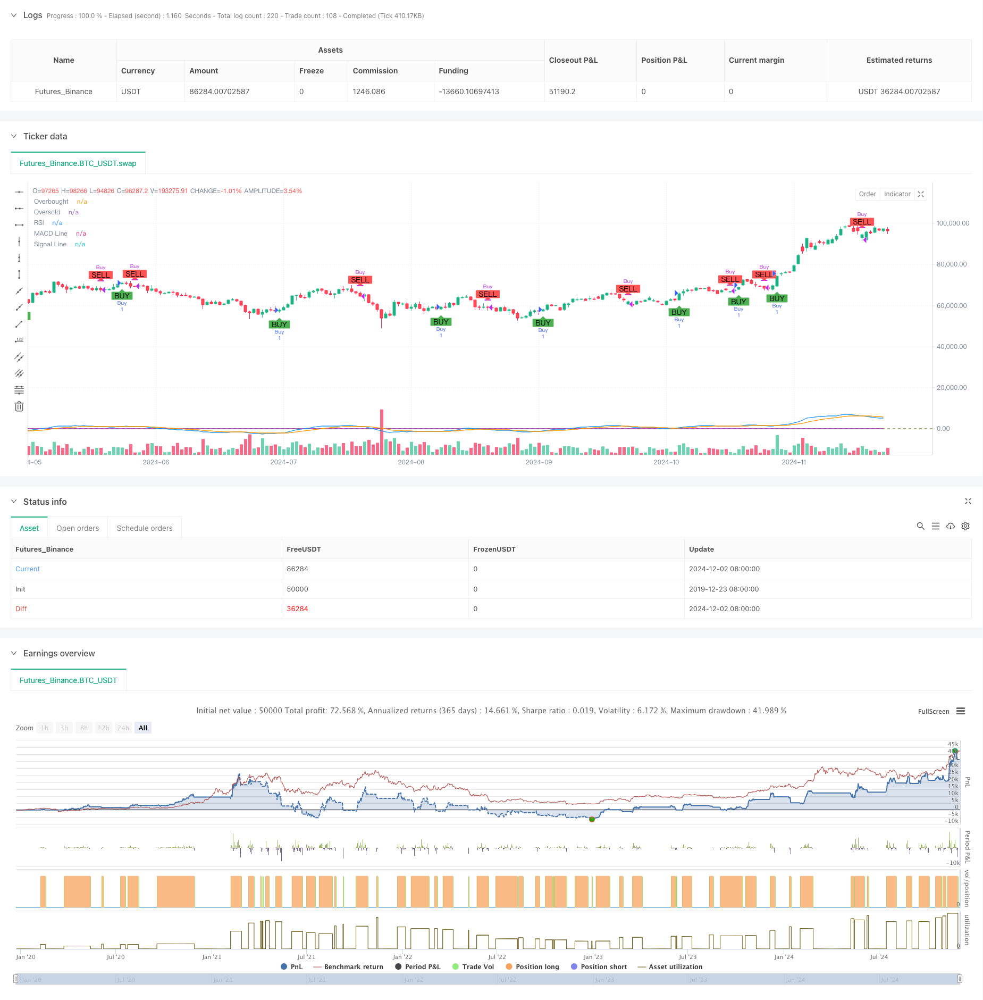

> Name

MACD-RSI-Dynamic-Crossover-Quantitative-Trading-System-MACD-RSI-Dynamic-Crossover-Quantitative-Trading-System
> Author

ChaoZhang

> Strategy Description



[trans]
#### Overview
This strategy is a quantitative trading system that combines the Moving Average Convergence Divergence Index (MACD) and the Relative Strength Index (RSI). This strategy identifies market trend turning points by analyzing the cross signals and overbought and oversold levels of these two technical indicators to make trading decisions. The system uses programmed trading to execute, and can automatically capture market opportunities and conduct transactions.
#### Strategy Principle
The core logic of the strategy is based on two main technical indicators: MACD and RSI. The MACD indicator calculates the difference between the fast moving average (12 periods) and the slow moving average (26 periods), and then compares it with the signal line (9 periods moving average) to determine the trend direction. The RSI indicator is used to determine whether the market is overbought or oversold by calculating the relative strength of 14 periods.
When the MACD line crosses the signal line upwards and the RSI is below 70 (overbought level), the system generates a buy signal; when the MACD line crosses the signal line downwards and the RSI is above 30 (oversold level), the system generates a sell signal. This double confirmation mechanism can effectively filter out false signals.
#### Strategic Advantages
1. High signal reliability: Combined with MACD and RSI two indicators for cross confirmation, the impact of false signals is greatly reduced.
2. Strong parameter adjustability: The strategy allows for flexible adjustment of various parameters of MACD and RSI to adapt to different market environments.
3. High degree of automation: The strategy is completely programmed and can automatically execute transactions to reduce human emotional interference.
4. Good visualization effect: clearly mark the buying and selling signals on the chart to facilitate analysis and backtesting.
5. Improved risk control: Using RSI overbought and oversold levels as an auxiliary judgment, additional risk control is provided.
#### Strategy Risk
1. Volatile market risk: Frequent trading signals may occur in a volatile market, increasing transaction costs.
2. Lagging risk: Due to the use of moving average calculations, there is a certain lag in the signal, and the best entry point may be missed.
3. Parameter sensitivity: The optimal parameters may differ under different market environments and require regular adjustment.
4. False breakthrough risk: False breakthrough signals may appear when market volatility increases.
#### Strategy optimization direction
1. Introduce volatility indicators: Consider adding ATR or volatility indicators to dynamically adjust parameters.
2. Optimize the signal confirmation mechanism: other technical indicators such as trading volume can be added as signal confirmation conditions.
3. Add trend filter: Introduce a longer period moving average as a trend filter.
4. Improve the stop loss mechanism: Design a more flexible stop loss strategy, such as trailing stop loss or time stop loss.
5. Optimize position management: dynamically adjust position size according to signal strength and market environment.
#### Summary
The MACD-RSI dynamic cross quantitative trading system is an automated trading strategy that combines classic indicators of technical analysis. Through the dual mechanism of MACD trend judgment and RSI overbought and oversold confirmation, the market turning point can be effectively captured. The strategy has the advantages of high reliability and strong adjustability, but it also needs to pay attention to risks such as market shock and signal lag. There is still a lot of room for improvement in the strategy by introducing other technical indicators and optimizing the signal confirmation mechanism. In practical applications, it is recommended that investors adjust parameters according to the specific market environment and use them in conjunction with other analysis methods. ||
#### Overview
This strategy is a quantitative trading system that combines the Moving Average Convergence Divergence (MACD) and Relative Strength Index (RSI) indicators. The strategy identifies market trend reversal points by analyzing the crossover signals of these two technical indicators and overbought/oversold levels to make trading decisions. The system executes trades programmatically, automatically capturing market opportunities.

#### Strategy Principles
The core logic is based on two main technical indicators: MACD and RSI. The MACD indicator calculates the difference between fast (12-period) and slow (26-period) moving averages, comparing it with a signal line (9-period moving average) to determine trend direction. The RSI indicator calculates the relative strength over 14 periods to determine if the market is overbought or oversold.

Buy signals are generated when the MACD line crosses above the signal line and RSI is below 70 (overbought level). Sell signals are generated when the MACD line crosses below the signal line and RSI is above 30 (oversold level). This dual confirmation mechanism effectively filters out false signals.

#### Strategy Advantages
1. High Signal Reliability: Combining MACD and RSI crossover confirmation significantly reduces the impact of false signals.
2. Strong Parameter Adaptability: The strategy allows flexible adjustment of MACD and RSI parameters to adapt to different market conditions.
3. High Automation Level: Fully programmatic strategy execution reduces emotional interference.
4. Good Visualization: Clear buy/sell signals marked on charts facilitate analysis and backtesting.
5. Comprehensive Risk Control: RSI overbought/oversold levels provide additional risk control measures.

#### Strategy Risks
1. Choppy Market Risk: May generate frequent trading signals in sideways markets, increasing transaction costs.
2. Lag Risk: Signal generation has inherent delay due to moving average calculations, potentially missing optimal entry points.
3. Parameter Sensitivity: Optimal parameters may vary in different market environments, requiring periodic adjustment.
4. False Breakout Risk: False breakthrough signals may occur during increased market volatility.

#### Optimization Directions
1. Incorporate Volatility Indicators: Consider adding ATR or volatility indicators for dynamic parameter adjustment.
2. Enhance Signal Confirmation: Add volume or other technical indicators as additional confirmation conditions.
3. Add Trend Filters: Introduce longer-period moving averages as trend filters.
4. Improve Stop Loss Mechanism: Design more flexible stop-loss strategies, such as trailing stops or time-based exits.
5. Optimize Position Management: Dynamically adjust position sizes based on signal strength and market conditions.

#### Summary
The MACD-RSI Dynamic Crossover Quantitative Trading System is an automated trading strategy combining classic technical analysis indicators. Through the dual mechanism of MACD trend judgment and RSI overbought/oversold confirmation, it effectively captures market turning points. The strategy offers high reliability and strong adaptability, but traders must be mindful of choppy market and signal lag risks. There is significant room for improvement through the introduction of additional technical indicators and signal confirmation optimization. In practical application, investors should adjust parameters based on specific market conditions and combine with other analysis methods.[/trans]


> Source (PineScript)

``` pinescript
/*backtest
start: 2019-12-23 08:00:00
end: 2024-12-03 00:00:00
period: 1d
basePeriod: 1d
exchanges: [{"eid":"Futures_Binance","currency":"BTC_USDT"}]
*/

//@version=5
strategy("MACD + RSI Strategy", overlay=true)

// MACD settings
fastLength = input.int(12, title="MACD Fast Length")
slowLength = input.int(26, title="MACD Slow Length")
signalSmoothing = input.int(9, title="MACD Signal Smoothing")

// RSI settings
rsiLength = input.int(14, title="RSI Length")
rsiOverbought = input.float(70, title="RSI Overbought Level")
rsiOversold = input.float(30, title="RSI Oversold Level")

// Calculate MACD
[macdLine, signalLine, _] = ta.macd(close, fastLength, slowLength, signalSmoothing)

// Calculate RSI
rsi = ta.rsi(close, rsiLength)

// Generate buy and sell signals
buySignal = ta.crossover(macdLine, signalLine) and rsi < rsiOverbought
sellSignal = ta.crossunder(macdLine, signalLine) and rsi > rsiOversold

// Plot buy and sell signals on chart
plotshape(series=buySignal, location=location.belowbar, color=color.green, style=shape.labelup, text="BUY")
plotshape(series=sellSignal, location=location.abovebar, color=color.red, style=shape.labeldown, text="SELL")

// Strategy entry and exit
if buySignal
    strategy.entry("Buy", strategy.long)
if sellSignal
    strategy.close("Buy")

// Plot MACD and Signal Line
plot(macdLine, color=color.blue, title="MACD Line")
plot(signalLine, color=color.orange, title="Signal Line")

// Plot RSI
hline(rsiOverbought, "Overbought", color=color.red)
hline(rsiOversold, "Oversold", color=color.green)
plot(rsi, color=color.purple, title="RSI")
```

> Detail

https://www.fmz.com/strategy/473935

> Last Modified

2024-12-04 15:13:26
