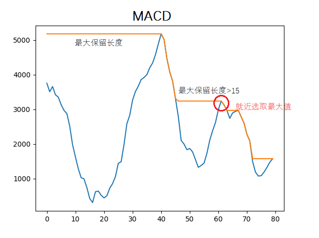
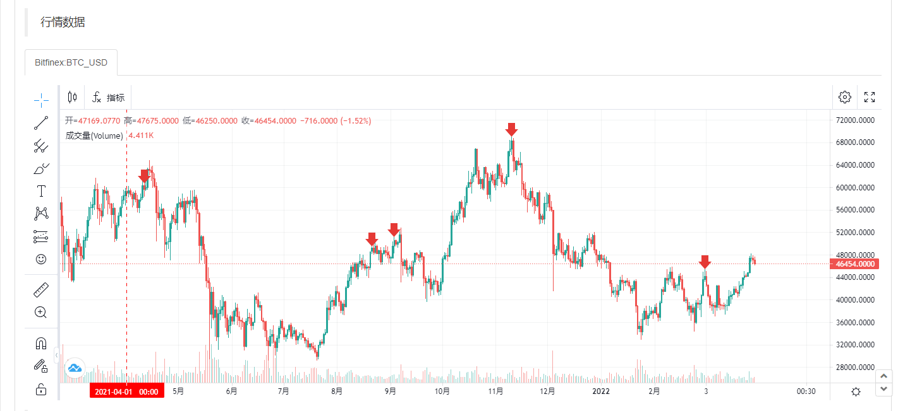

> Name

MACD top escape strategy
> Author

program

> Strategy Description

**Introduction:** Sell and hold the currency when MACD volume and price divergence
**Principle implementation:** Starting from the current macd value, traverse forward to find the closing price of the k-line corresponding to the index greater than the current macd value, lock the corresponding k-line price to the maximum value within the current closing k-line range, and trigger selling if the current price is greater than the highest price in the area.
Traverse macd data forward. When the maximum retention length is greater than 15, select the nearest macd maximum value.
 
**Backtest data:**
 
**Note:** The strategy only supports spot prices and can be run in multiple currencies at the same time. The source code is for reference only. Please run with caution during real-time operations.
> Strategy Arguments


|Argument|Default|Description|
|----|----|----|
|num|0.1|Sale quantity|

> Source (python)

``` python
'''backtest
start: 2023-01-01 00:00:00
end: 2023-05-12 00:00:00
period: 1d
basePeriod: 1h
exchanges: [{"eid":"Bitfinex","currency":"BTC_USD","stocks":10}]
'''


# from matplotlib import pyplot as plt
# plt.figure()

class ExitTop(object):
    def __init__(self,index):
        self.index = index 
        self.totestlist = [] # MACD数据
        self.klist = [] # k线数据
        self.toplus = []
        self.tocpn = []
        self.Sell = False
    
    # 获取k线及MACD数据
    def GetRecord(self) -> bool:
        self.totestlist = []
        self.klist = []
        self.toplus = []
        self.tocpn = []
        records = exchanges[self.index].GetRecords()
        macd = TA.MACD(records, 12, 26, 9)
        # 判断DIF是否大于DEA
        if not macd[0][-2] > macd[1][-2] and macd[0][-3] < macd[1][-3] or not macd[0][-2] > macd[1][-2] and macd[0][-4] < macd[1][-4]:
            return False
        self.totestlist = macd[0][len(macd[0])-80:]
        # 封装k线数据
        for get in range(len(records)):
            self.klist.append(records[get]["Close"])
        self.klist = self.klist[len(self.klist)-80:]
        return True
    
    def mepath(self):
        if not self.GetRecord():
            return False
        # 向前遍历发现最大值
        maxsign = -1000000000000
        for i in range(len(self.totestlist)-1,-1,-1):
            if self.totestlist[i] > maxsign:
                maxsign = self.totestlist[i]
                self.tocpn.append([1,i])
            else:
                if len(self.tocpn) > 0:
                    self.tocpn[-1][0] = self.tocpn[-1][0]+1
            self.toplus.insert(0,maxsign)
        sign = False
        shorttime = [0,0] # 步长 , 索引
        for i in range(len(self.tocpn)):
            if self.tocpn[i][0] > 15 and sign == False:
                shorttime = [self.tocpn[i][0],self.tocpn[i][1]]
                sign = True
        # 如果最大索引不是自己
        if shorttime[1] < len(self.klist)-4:
            # 锁定区域内最高价格
            are = max(self.klist[shorttime[1]:-4])
            # 判断是否存在大于当前macd值,如果当前价格大于区域内最高价格
            if self.totestlist[-2]+300 < self.totestlist[shorttime[1]] and self.klist[-2] >= are:
                return True
            return False
        return False
    
    def main(self):
        result = self.mepath()
        if result == True and self.Sell == False:
            exchanges[self.index].Sell(-1, num)
            self.Sell = True
        elif result == False:
            if self.Sell == True:
                self.Sell = False
        # plt.plot(self.totestlist)
        # plt.plot(self.toplus)
        # LogStatus(plt)


def main():
    transaction = []
    for index in range(len(exchanges)):
        transaction.append(ExitTop(index))
    while True:
        for tran in range(len(transaction)):
            transaction[tran].main()
            Sleep(1000*60)
```

> Detail

https://www.fmz.com/strategy/356399

> Last Modified

2023-05-13 21:21:01
