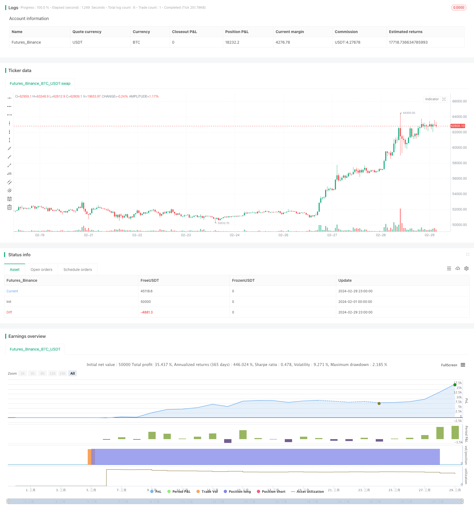

> Name

Multi-Timeframe-Trend-Trading-Strategy-Based-on-MACD-ADX-and-EMA200 based on MACDADX and EMA200
> Author

ChaoZhang

> Strategy Description


[trans]

## Overview
This strategy is based on MACD, ADX and EMA200 indicators, and conducts trend trading in multiple time frames by judging the current market trend and momentum. The main idea of ​​the strategy is to use the MACD indicator to judge the market trend, the ADX indicator to confirm the trend strength, EMA200 as the trend filter condition, and use multiple time frames for trading at the same time to obtain more trading opportunities and a better return-to-risk ratio.
## Strategy Principle
1. Calculate the 200-day exponential moving average (EMA200) as the trend filter condition.
2. Calculate MACD indicators, including MACD lines, signal lines and histograms, to determine market trends.
3. Calculate true volatility (ATR) and directional movement indicator (ADX) to confirm trend strength.
4. Bull entry conditions: the closing price is above EMA200, the MACD line is above the signal line and below 0, and ADX is greater than or equal to 25.
5. Short entry conditions: the closing price is below EMA200, the MACD line is below the signal line and above 0, and ADX is greater than or equal to 25.
6. Use ATR to calculate the distance between stop loss and take profit. Set stop loss to 1% and take profit to 1.5%.
7. When the long conditions are met, go long in the form of stop orders and limit orders; when the short conditions are met, go short in the form of stop orders and limit orders.
8. Test the strategy under different time frames, such as 15 minutes, 30 minutes, 1 hour, etc., to find the optimal trading time frame.
## Advantage Analysis
1. Combining multiple indicators for trading decisions helps improve the reliability and stability of the strategy.
2. Using multi-time frame trading, you can capture trends at different levels and obtain more trading opportunities.
3. Use ATR to calculate stop loss and take profit distances, which can dynamically adjust positions and control risks.
4. Reasonable stop-loss and take-profit settings can help improve the strategy’s profit-risk ratio.
5. The code structure is clear and easy to understand and optimize.
## Risk Analysis
1. The strategy relies on trending markets and may not perform well in volatile markets.
2. The parameter settings of multiple indicators may need to be optimized according to different markets and assets, otherwise it may lead to poor strategy performance.
3. The stop loss and take profit settings are fixed and may not adapt to market changes, resulting in increased losses or reduced profits.
4. Multi-time frame trading may increase trading frequency, resulting in increased transaction costs.
Solution:
1. Introduce adaptive parameter optimization and automatically adjust indicator parameters according to market changes.
2. Dynamically adjust stop loss and take profit, such as using trailing stop loss or variable take profit.
3. Consider transaction costs during backtesting and choose the optimal time frame and trading frequency.
## Optimization direction
1. Introduce other trend confirmation indicators, such as Bollinger Bands, moving average systems, etc., to improve the accuracy of trend judgment.
2. Optimize stop loss and take profit settings, such as using dynamic stop loss and take profit or volatility-based stop loss and take profit.
3. Add more filtering conditions to trading signals, such as trading volume, market sentiment, etc., to improve signal quality.
4. Carry out parameter optimization for different markets and assets to find the optimal parameter combination.
5. Consider introducing machine learning algorithms to adapt to market changes and improve the adaptability and stability of the strategy.
Through the above optimization, the robustness and profitability of the strategy can be improved and better adapted to different market environments.
## Summarize
This strategy combines indicators such as MACD, ADX and EMA200 to conduct trend trading under multiple time frames, which has certain advantages and feasibility. The key to the strategy lies in trend judgment and trend strength confirmation. Through the joint action of multiple indicators, trend opportunities can be better captured. At the same time, the strategy adopts fixed stop loss and take profit, which helps control risks. However, the strategy also has some limitations, such as its adaptability to volatile markets may be poor, and fixed stop-loss and take-profit may not be able to adapt to market changes. In the future, you can consider introducing more trend confirmation indicators, optimizing stop-loss and take-profit methods, adding filter conditions, optimizing parameters, and introducing machine learning algorithms to continuously improve the performance of the strategy. In general, this strategy has clear ideas and simple implementation. It can be used as a basic strategy for further optimization and improvement, and has certain reference value in practical applications.
|| 

## Overview

This strategy is based on the MACD, ADX, and EMA200 indicators, aiming to capture trend trading opportunities across multiple timeframes by analyzing current market trends and momentum. The main idea behind the strategy is to use the MACD indicator to determine market trends, the ADX indicator to confirm trend strength, and the EMA200 as a trend filter. By employing multiple timeframes, the strategy seeks to obtain more trading opportunities and better risk-reward ratios.

## Strategy Principles

1. Calculate the 200-day Exponential Moving Average (EMA200) as a trend filter.
2. Calculate the MACD indicator, including the MACD line, signal line, and histogram, to determine market trends.
3. Calculate the Average True Range (ATR) and Average Directional Index (ADX) to confirm trend strength.
4. Long entry condition: Close price above EMA200, MACD line above signal line and below 0, ADX greater than or equal to 25.
5. Short entry condition: Close price below EMA200, MACD line below signal line and above 0, ADX greater than or equal to 25.
6. Use ATR to calculate stop loss and take profit distances, with stop loss set at 1% and take profit set at 1.5%.
7. When long conditions are met, enter long positions using stop and limit orders; when short conditions are met, enter short positions using stop and limit orders.
8. Test the strategy across different timeframes, such as 15-minute, 30-minute, 1-hour, etc., to find the optimal trading timeframe.

## Advantage Analysis

1. Combining multiple indicators for trading decisions helps improve the reliability and stability of the strategy.
2. Employing multiple timeframes allows the strategy to capture trends at different levels and obtain more trading opportunities.
3. Using ATR to calculate stop loss and take profit distances enables dynamic position sizing and risk management.
4. Reasonable stop loss and take profit settings help improve the strategy's risk-reward ratio.
5. The code structure is clear and easy to understand and optimize.

## Risk Analysis

1. The strategy relies on trending markets and may underperform in choppy markets.
2. The parameter settings for multiple indicators may need to be optimized for different markets and assets; otherwise, the strategy may perform poorly.
3. Fixed stop loss and take profit settings may not adapt to market changes, leading to increased losses or reduced profits.
4. Trading across multiple timeframes may increase trading frequency and transaction costs.

Solutions:
1. Introduce adaptive parameter optimization to automatically adjust indicator parameters based on market changes.
2. Implement dynamic stop loss and take profit adjustments, such as trailing stops or variable take profits.
3. Consider trading costs during backtesting and select the optimal timeframe and trading frequency.

## Optimization Directions

1. Incorporate other trend confirmation indicators, such as Bollinger Bands, moving average systems, etc., to improve the accuracy of trend identification.
2. Optimize stop loss and take profit settings, such as using dynamic or volatility-based stop loss and take profit.
3. Add more filtering conditions to trading signals, such as volume, market sentiment, etc., to improve signal quality.
4. Perform parameter optimization for different markets and assets to find the optimal parameter combinations.
5. Consider introducing machine learning algorithms to adapt to market changes and enhance the adaptability and stability of the strategy.

Through these optimizations, the strategy's robustness and profitability can be improved, enabling it to better adapt to different market environments.

## Summary

By combining the MACD, ADX, and EMA200 indicators, this strategy aims to capture trend trading opportunities across multiple timeframes, demonstrating certain advantages and feasibility. The key to the strategy lies in trend identification and trend strength confirmation, which can be achieved through the combined action of multiple indicators. The strategy also employs fixed stop loss and take profit levels to help control risk. However, the strategy has some limitations, such as potential underperformance in choppy markets and the inability of fixed stop loss and take profit levels to adapt to market changes. 

Future improvements can include introducing more trend confirmation indicators, optimizing stop loss and take profit methods, adding filtering conditions, performing parameter optimization, and introducing machine learning algorithms to continuously enhance the strategy's performance. Overall, the strategy has a clear logic and simple implementation, making it a suitable foundation for further optimization and improvement. It offers valuable insights for practical applications in real-world trading.

[/trans]


> Source (PineScript)

``` pinescript
/*backtest
start: 2024-02-01 00:00:00
end: 2024-02-29 23:59:59
period: 1h
basePeriod: 15m
exchanges: [{"eid":"Futures_Binance","currency":"BTC_USDT"}]
*/

// This Pine Script™ code is subject to the terms of the Mozilla Public License 2.0 at https://mozilla.org/MPL/2.0/
// © colemanrumsey

//@version=5
strategy("15-Minute Trend Trading Strategy", overlay=true)

// Exponential Moving Average (EMA)
ema200 = ta.ema(close, 200)

// MACD Indicator
[macdLine, signalLine, _] = ta.macd(close, 12, 26, 9)
macdHistogram = macdLine - signalLine

// Calculate True Range (TR)
tr = ta.tr

// Calculate +DI and -DI
plusDM = high - high[1]
minusDM = low[1] - low

atr14 = ta.atr(14)
plusDI = ta.wma(100 * ta.sma(plusDM, 14) / atr14, 14)
minusDI = ta.wma(100 * ta.sma(minusDM, 14) / atr14, 14)

// Calculate Directional Movement Index (DX)
dx = ta.wma(100 * math.abs(plusDI - minusDI) / (plusDI + minusDI), 14)

// Calculate ADX
adxValue = ta.wma(dx, 14)

// Long Entry Condition
longCondition = close > ema200 and (macdLine > signalLine) and (macdLine < 0) and (adxValue >= 25)

// Short Entry Condition
shortCondition = close < ema200 and (macdLine < signalLine) and (macdLine > 0) and (adxValue >= 25)

// Calculate ATR for Stop Loss
atrValue = ta.atr(14)

// Initialize Take Profit and Stop Loss
var float takeProfit = na
var float stopLoss = na

// Calculate Risk (Stop Loss Distance)
risk = close - low[1]  // Using the previous candle's low as stop loss reference

// Strategy Orders
if longCondition
    stopLoss := close * 0.99  // Set Stop Loss 1% below the entry price
    takeProfit := close * 1.015 // Set Take Profit 1.5% above the entry price
    strategy.entry("Buy", strategy.long, stop=stopLoss, limit=takeProfit)

if shortCondition
    stopLoss := close * 1.01 // Set Stop Loss 1% above the entry price
    takeProfit := close * 0.985 // Set Take Profit 1.5% below the entry price
    strategy.entry("Sell", strategy.short, stop=stopLoss, limit=takeProfit)

// Plot EMA
// plot(ema200, color=color.blue, linewidth=1, title="200 EMA")

// Plot MACD Histogram
// plot(macdHistogram, color=macdHistogram > 0 ? color.green : color.red, style=plot.style_columns, title="MACD Histogram")

// Display ADX Value
// plot(adxValue, color=color.purple, title="ADX Value")

```

> Detail

https://www.fmz.com/strategy/445785

> Last Modified

2024-03-22 10:50:35
