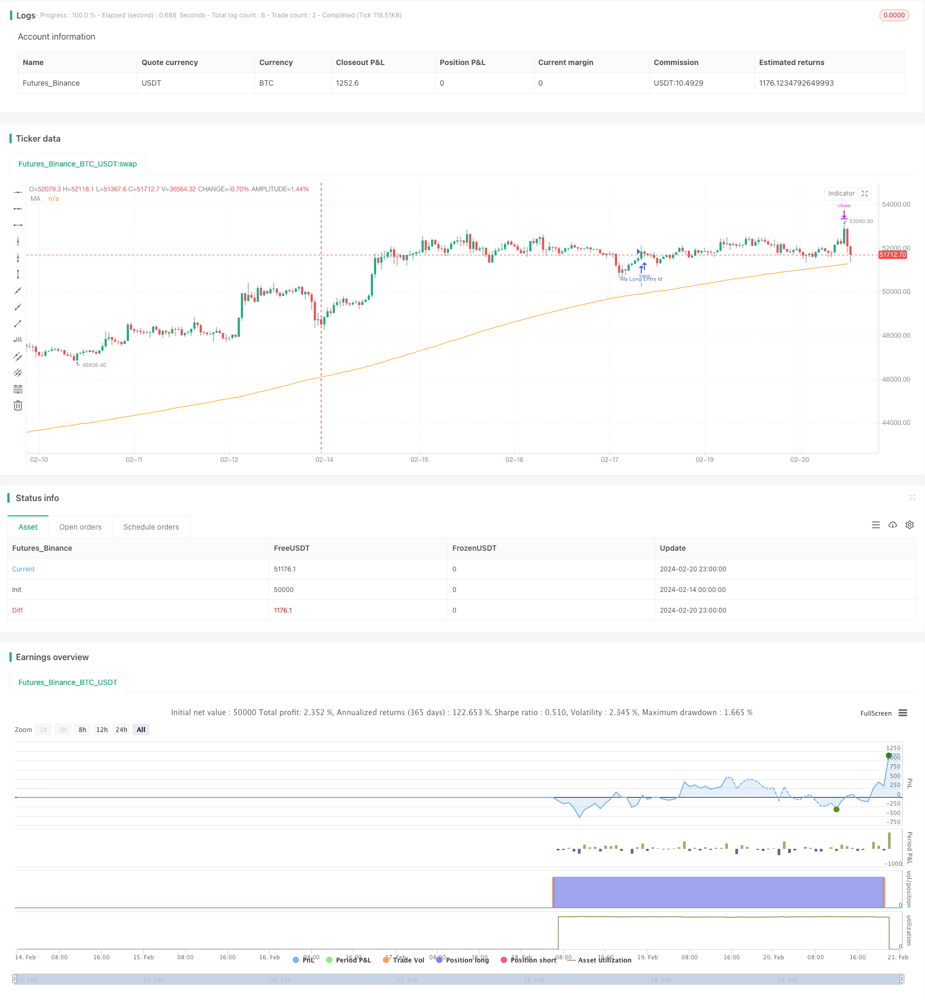

> Name

MACD Quantitative Strategy Dual-Moving-Average-Crossover-MACD-Quantitative-Strategy
> Author

ChaoZhang

> Strategy Description


[trans]
## Overview
This strategy forms the MACD indicator by calculating the difference between the fast moving average and the slow moving average, and then combines it with the signal line to determine the trend of the financial market and the overbought and oversold areas. It goes long when the MACD and the signal line form a long cross and the price is higher than the 200-day moving average, and goes short when a short cross is formed and the price is lower than the 200-day moving average. It is a typical double cross moving average breakthrough strategy.
## Strategy Principle
The basic principle is to calculate the difference between the fast moving average and the slow moving average to form the MACD indicator to determine the market trend direction, and then use the signal line to determine the overbought and oversold areas. When MACD and the signal line form a golden cross, it is a long signal to go long, and when a dead cross is formed, it is a short signal to go short. At the same time, the signal is filtered based on the relationship between the price and the 200-day moving average. Only when the price is higher than the 200-day moving average, the golden cross will be long, and when the price is lower than the 200-day moving average, the dead cross will be short, thereby avoiding confusing signals during a strong trend.
The specific calculation method is:
1. Subtract the slow moving average (26-day EMA) from the fast moving average (12-day EMA) to get MACD
2. MACD’s 9-day EMA gets the signal line
3. MACD minus the signal line to get the MACD histogram
When MACD crosses above the signal line and MACD and the signal line are both below 0, it is a golden cross long signal. When MACD crosses below the signal line and both MACD and the signal line are above 0, it is a dead cross short signal. At the same time, only when the price is higher than the 200-day moving average, go long on the golden cross, and only when the price is lower than the 200-day moving average, go short on the dead cross.
## Strategic Advantages
1. The use of dual indicator judgment avoids the limitations of single indicator judgment and improves the accuracy of signals.
2. Double filtering combined with the relationship between price and moving average to avoid confusing signals in strong trends
3. There is a large space for parameter optimization, and the moving average parameters can be adjusted to adapt to different market environments.
4. Conservative parameter settings result in fewer signals but higher accuracy
5. Strategic ideas that are easy to understand and implement
## Strategy Risk
1. When the market fluctuates violently, indicator judgment will be affected and produce wrong signals.
2. The hysteresis of the moving average system itself will affect the timeliness of the strategy
3. There are few signals and it is easy to miss trend opportunities.
4. There is a risk of over-optimization in PARAMETERS optimization
5. The retracement control and stop-loss exit mechanisms need to be improved.
Risks can be reduced by appropriately shortening the moving average period, adding other indicator judgments, and adding stop loss measures.
## Strategy optimization direction
1.tested on different timeframes from 15m upto 1D, where optimal results where on 4H timeframe in terms of risk adjusted returns
2.optimize fast ma and slow ma so that macd represents cycle, I found 7-21 performs good for 15m chart

3.also tested hull moving average for MACD which gave good results

4.stoploss can also be trailed for better risk management 

## Summary
Generally speaking, this strategy is very simple and practical. It uses dual indicator judgment and price filtering to generate high-probability trading signals with high marginal profit margins. It uses the classic parameter combination of MACD and will not over-optimize. There is still a lot of room for optimization. Strategy performance can be further improved by adjusting the combination of moving average parameters, adding other indicator judgments and stop-loss measures. Overall, it is a typical quantitative strategy based on fundamentals.
||

## Overview
This strategy generates the MACD indicator by calculating the difference between the fast and slow moving average lines, and judges the trend and overbought/oversold areas of the financial markets together with the signal line. It goes long when the MACD and signal line form a golden cross while the price is above the 200-day MA, and goes short when forms a dead cross while the price is below the 200-day MA. This belongs to a typical dual moving average crossover breakout strategy.

## Strategy Logic  
The basic logic is using the MACD indicator generated from the fast and slow MA difference to determine the market trend direction, and the signal line to judge the overbought/oversold levels. When MACD and signal line form a golden cross, it is a long signal to go long. When forms a dead cross, it is a short signal to go short. Meanwhile, it uses the price's relationship with the 200-day MA to filter the signals, only taking long signals when price is above 200-day MA and short signals when price is below 200-day MA, so as to avoid whipsaws during strong trends.

The specific calculation method is:
1. Fast Moving Average (12-day EMA) minus Slow Moving Average (26-day EMA) to get MACD
2. The 9-day EMA of MACD to get the signal line
3. MACD minus signal line to get the MACD histogram

When MACD crosses above signal line while they are both below 0, it is a golden cross long signal. When MACD crosses below signal line while they are both above 0, it is a dead cross short signal. Meanwhile, only taking long when price is above 200-day MA, and short when price is below 200-day MA.  

## Advantages
1. Using dual indicator system avoids the limitations of single indicator and improves accuracy 
2. Combining price action and MA double filters avoids whipsaws during strong trends
3. Large parameter optimization space to adapt to different market environments 
4. Conservative parameter setting leads to fewer but higher quality signals
5. Simple and easy-to-implement strategy logic

## Risks
1. Market volatility may cause errors in indicator judgement
2. Lagging nature of MAs affects strategy timeliness  
3. Fewer signals may miss trend opportunities  
4. Over-optimization risks when optimizing parameters
5. Lack of drawdown control and stop loss mechanisms

Can lower risks by shortening MA periods, adding other indicators, and adding stop loss.

## Optimization Directions
1.Tested on different timeframes from 15m upto 1D, optimal results on 4H in risk adjusted returns

2.Optimize fast and slow MA so MACD captures cycles, 7-21 good for 15m

3.Hull MA for MACD gave good results 

4.Trailing stoploss improves risk management

## Conclusion  
This is overall a very simple and practical strategy, generating high probability trading signals through dual indicator system and price filtering. It has relatively high margin of profit, uses the classic MACD parameter combination to avoid over-optimization. There is still large room for optimization by adjusting the MA parameters, adding other indicators and stop loss mechanisms to further improve performance. Overall it is a typical quantitative strategy based on fundamentals.

[/trans]

> Strategy Arguments


|Argument|Default|Description|
|----|----|----|
|v_input_1|12|Fast Length|
|v_input_2|26|Slow Length|
|v_input_3_close|0|Source: close|high|low|open|hl2|hlc3|hlcc4|ohlc4|
|v_input_4|9|Signal Smoothing|
|v_input_5|false|Simple MA (Oscillator)|
|v_input_6|false|Simple MA (Signal Line)|
|v_input_7|200|movinga 2|
|v_input_8|2|Short Take Profit (%)|
|v_input_9|2|Long Take Profit (%)|
|v_input_10|2|stoploss in %|


> Source (PineScript)

``` pinescript
/*backtest
start: 2024-02-14 00:00:00
end: 2024-02-21 00:00:00
period: 1h
basePeriod: 15m
exchanges: [{"eid":"Futures_Binance","currency":"BTC_USDT"}]
*/

// This source code is subject to the terms of the Mozilla Public License 2.0 at https://mozilla.org/MPL/2.0/
// © Hurmun

//@version=4
strategy("Simple MACD strategy ", overlay=true, margin_long=100, margin_short=100)


fast_length = input(title="Fast Length", type=input.integer, defval=12)
slow_length = input(title="Slow Length", type=input.integer, defval=26)
src = input(title="Source", type=input.source, defval=close)
signal_length = input(title="Signal Smoothing", type=input.integer, minval = 1, maxval = 50, defval = 9)
sma_source = input(title="Simple MA (Oscillator)", type=input.bool, defval=false)
sma_signal = input(title="Simple MA (Signal Line)", type=input.bool, defval=false)
// Plot colors
col_grow_above = #26A69A
col_grow_below = #FFCDD2
col_fall_above = #B2DFDB
col_fall_below = #EF5350
col_macd = #0094ff
col_signal = #ff6a00
// Calculating
fast_ma = sma_source ? sma(src, fast_length) : ema(src, fast_length)
slow_ma = sma_source ? sma(src, slow_length) : ema(src, slow_length)
macd = fast_ma - slow_ma
signal = sma_signal ? sma(macd, signal_length) : ema(macd, signal_length)
hist = macd - signal


movinga2 = input(title="movinga 2", type=input.integer, defval=200)

movinga200 = sma(close, movinga2)

plot(movinga200, "MA", color.orange)
longCondition = crossover(macd, signal) and macd < 0 and signal < 0 and close > movinga200
if (longCondition)
    strategy.entry("My Long Entry Id", strategy.long)

shortCondition = crossunder(macd, signal) and macd > 0 and signal > 0 and close < movinga200
if (shortCondition)
    strategy.entry("My Short Entry Id", strategy.short)
    
shortProfitPerc = input(title="Short Take Profit (%)", minval=0.0, step=0.1, defval=2) / 100
longProfitPerc = input(title="Long Take Profit (%)", minval=0.0, step=0.1, defval=2) / 100
    
stoploss = input(title="stoploss in %", minval = 0.0, step=1, defval=2) /100

longStoploss = strategy.position_avg_price * (1 - stoploss)
longExitPrice  = strategy.position_avg_price * (1 + longProfitPerc)

shortExitPrice = strategy.position_avg_price * (1 - shortProfitPerc)
shortStoploss = strategy.position_avg_price * (1 + stoploss)
    
if (strategy.position_size > 0 )
    strategy.exit(id="XL TP", limit=longExitPrice, stop=longStoploss)


if (strategy.position_size < 0 )
    strategy.exit(id="XS TP", limit=shortExitPrice, stop=shortStoploss)
```

> Detail

https://www.fmz.com/strategy/442516

> Last Modified

2024-02-22 15:32:42
