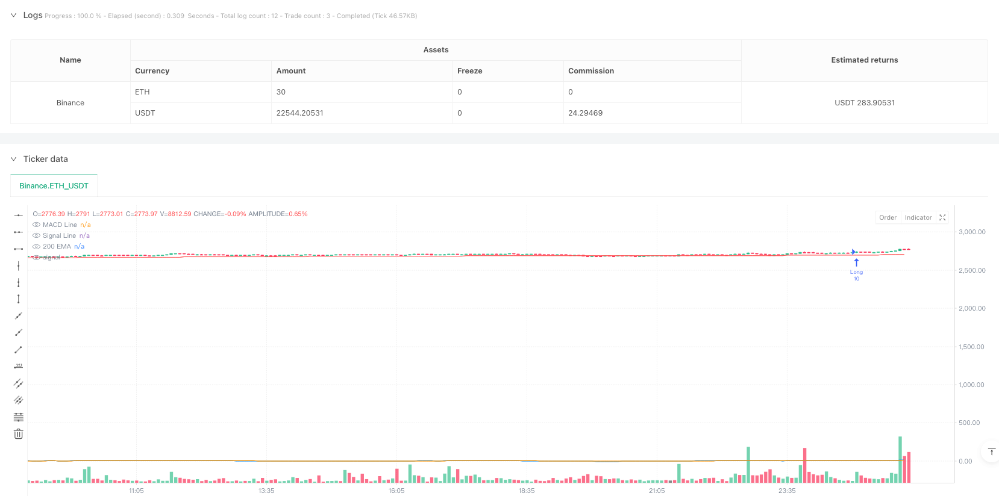
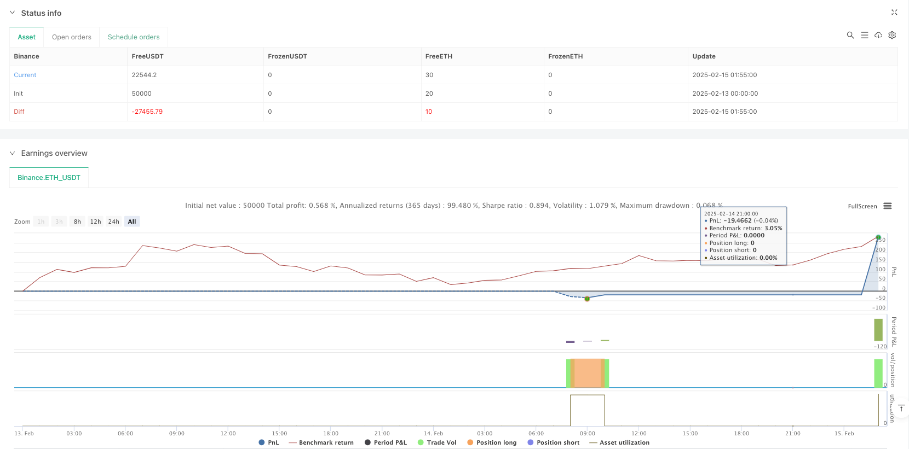

> Name

Multi-timeframe-MACD-Crossover-Continuation-Strategy-with-EMA-Trend-Filter
> Author

ianzeng123

> Strategy Description





[trans]
#### Overview
This strategy is a multi-time zone trading system based on the MACD indicator and moving averages. It combines the MACD indicator with two time periods of 1 minute and 3 minutes, and uses the 200-period EMA as a trend filter to trade by capturing the persistence of market trends. The strategy incorporates risk management mechanisms, including stop loss setting and dynamic adjustment functions to move to the breakeven point.
#### Strategy Principle
The core logic of the strategy is based on the following key elements:
1. Use the MACD indicator with two time periods of 1 minute and 3 minutes to confirm the continuity of the trend
2. Use the 200-period EMA as the basis for judging the main trend
3. Filter trading signals based on the relationship between price and moving average position
4. Trade based on trading session filters
The specific trading signal generation rules are as follows:
- Bull signal: The MACD line is above the zero line and crosses the signal line upwards. At the same time, the 3-minute MACD confirms the trend and the price is above the EMA200.
- Short signal: The MACD line is below the zero line and crosses the signal line downwards, while the 3-minute MACD confirms the trend and the price is below the EMA200
#### Strategic Advantages
1. Multiple time period confirmation improves the accuracy of transactions
2. Combined with trend filters to reduce false signals
3. Contains a complete risk control mechanism
4. Use time filters to avoid trading during inactive periods
5. Dynamic breakeven point adjustment protects earned profits
6. The strategy logic is clear and easy to adjust and optimize.
#### Strategy Risk
1. Possible risk of slippage in highly volatile markets
2. The multiple confirmation mechanism may result in missing some trading opportunities.
3. Fixed stop loss levels may not be flexible enough in certain market environments
4. The impact of transaction costs on strategy returns needs to be considered
5. May face large retracements in highly volatile markets
Risk control suggestions:
- Adjust stop loss distance according to market fluctuations
- Consider increasing profit targets to ensure profitability
- Trading is suspended during the release of important economic data
- Regularly evaluate and adjust strategy parameters
#### Strategy optimization direction
1. Dynamically adjust MACD parameters:
- Adaptively adjust according to market volatility
- Consider using an adaptive moving average
2. Improve time filter:
- Refined trading period divisions
- Optimize trading time based on volume analysis
3. Optimize the stop loss mechanism:
-Introduction of dynamic stop loss
- Set stop loss distance based on ATR
4. Enhanced trend filtering:
- Added more technical indicator confirmations
- Consider introducing price action analysis
#### Summary
This strategy builds a relatively complete trading system through the combination of multi-time period MACD indicators and EMA trend filters. Its advantage lies in the completeness of the multiple confirmation mechanism and risk management, but it also requires attention to adaptability issues in different market environments. With the suggested optimization direction, the strategy is expected to further improve profitability while maintaining its stability. ||
#### Overview
This strategy is a multi-timeframe trading system based on the MACD indicator and moving averages. It combines MACD indicators from 1-minute and 3-minute timeframes, along with a 200-period EMA as a trend filter, to capture market trend continuations. The strategy includes risk management mechanisms, including stop-loss settings and dynamic break-even adjustments.

#### Strategy Principles
The core logic of the strategy is based on several key elements:
1. Using MACD indicators from both 1-minute and 3-minute timeframes to confirm trend continuation
2. Using 200-period EMA as the main trend determination reference
3. Combining price and moving average relationships to filter trading signals
4. Trading based on session time filters

Specific signal generation rules:
- Long signals: MACD line crosses above signal line above zero, confirmed by 3-minute MACD, price above EMA200
- Short signals: MACD line crosses below signal line below zero, confirmed by 3-minute MACD, price below EMA200

#### Strategy Advantages
1. Multi-timeframe confirmation improves trading accuracy
2. Trend filter reduces false signals
3. Includes comprehensive risk control mechanisms
4. Time filters avoid trading during inactive sessions
5. Dynamic break-even adjustments protect acquired profits
6. Clear strategy logic, easy to adjust and optimize

#### Strategy Risks
1. Slippage risk in high volatility markets
2. Multiple confirmation requirements may miss some trading opportunities
3. Fixed stop-loss points may lack flexibility in certain market conditions
4. Need to consider the impact of trading costs on strategy returns
5. Potential for significant drawdowns in volatile markets

Risk control suggestions:
- Adjust stop-loss distance based on market volatility
- Consider adding profit targets to secure gains
- Pause trading during major economic data releases
- Regularly evaluate and adjust strategy parameters

#### Strategy Optimization Directions
1. Dynamic MACD parameter adjustment:
- Self-adaptive adjustment based on market volatility
- Consider using adaptive moving averages

2. Improve time filters:
- Refine trading session divisions
- Optimize trading times using volume analysis

3. Optimize stop-loss mechanism:
- Introduce dynamic stop-loss
- Set stop-loss distances based on ATR

4. Enhance trend filtering:
- Add more technical indicators for confirmation
- Consider incorporating price action analysis

#### Summary
This strategy constructs a relatively complete trading system through the combination of multi-timeframe MACD indicators and EMA trend filters. Its strengths lie in its multiple confirmation mechanisms and comprehensive risk management, while attention needs to be paid to its adaptability in different market environments. Through the suggested optimization directions, the strategy has the potential to further improve its profitability while maintaining stability.[/trans]


> Source (PineScript)

``` pinescript
/*backtest
start: 2025-02-13 00:00:00
end: 2025-02-15 02:00:00
period: 5m
basePeriod: 5m
exchanges: [{"eid":"Binance","currency":"ETH_USDT"}]
*/

//@version=5
strategy("NQ MACD Continuation Backtest", overlay=true)

// MACD Settings
fastLength = 12
slowLength = 26
signalLength = 9

// 1-minute MACD
[macdLine, signalLine, _] = ta.macd(close, fastLength, slowLength, signalLength)

// 3-minute MACD for trend filter
[htfMacd, htfSignal, _] = request.security(syminfo.tickerid, "3", ta.macd(close, fastLength, slowLength, signalLength), lookahead=barmerge.lookahead_on)

// 200 EMA
ema200 = ta.ema(close, 200)

// Time Filters
inSession = (hour(time, "America/New_York") >= 9 and (hour(time, "America/New_York") > 9 or minute(time, "America/New_York") >= 45)) and (hour(time, "America/New_York") < 22 or (hour(time, "America/New_York") == 22 and minute(time, "America/New_York") == 30))
notRestricted = (hour(time, "America/New_York") >= 6 and hour(time, "America/New_York") < 22)

// Track Previous MACD Crosses
var bool bullishCrossed = false
var bool bearishCrossed = false
if (ta.crossover(macdLine, signalLine) and macdLine > 0)
    bullishCrossed := true
if (ta.crossunder(macdLine, signalLine) and macdLine < 0)
    bearishCrossed := true

// Define Continuation Signals with EMA and 3-Min MACD Filter
bullishContinuation = (ta.crossover(macdLine, signalLine) and macdLine > 0 and signalLine > 0 and htfMacd > htfSignal and bullishCrossed and close > ema200)
bearishContinuation = (ta.crossunder(macdLine, signalLine) and macdLine < 0 and signalLine < 0 and htfMacd < htfSignal and bearishCrossed and close < ema200)

// Entry Conditions with SL and 10 Contracts
if (bullishContinuation and inSession and notRestricted)
    strategy.entry("Long", strategy.long, qty=10, stop=close - 7 * syminfo.mintick)
if (bearishContinuation and inSession and notRestricted)
    strategy.entry("Short", strategy.short, qty=10, stop=close + 7 * syminfo.mintick)

// Break-Even Adjustment
if (strategy.position_size > 0 and close >= strategy.position_avg_price + 5 * syminfo.mintick)
    strategy.exit("BreakEvenLong", from_entry="Long", stop=strategy.position_avg_price)
if (strategy.position_size < 0 and close <= strategy.position_avg_price - 5 * syminfo.mintick)
    strategy.exit("BreakEvenShort", from_entry="Short", stop=strategy.position_avg_price)

// Display Indicators on Chart
plot(macdLine, color=color.blue, title="MACD Line")
plot(signalLine, color=color.orange, title="Signal Line")
plot(ema200, color=color.red, title="200 EMA")
```

> Detail

https://www.fmz.com/strategy/483031

> Last Modified

2025-02-27 17:17:57
