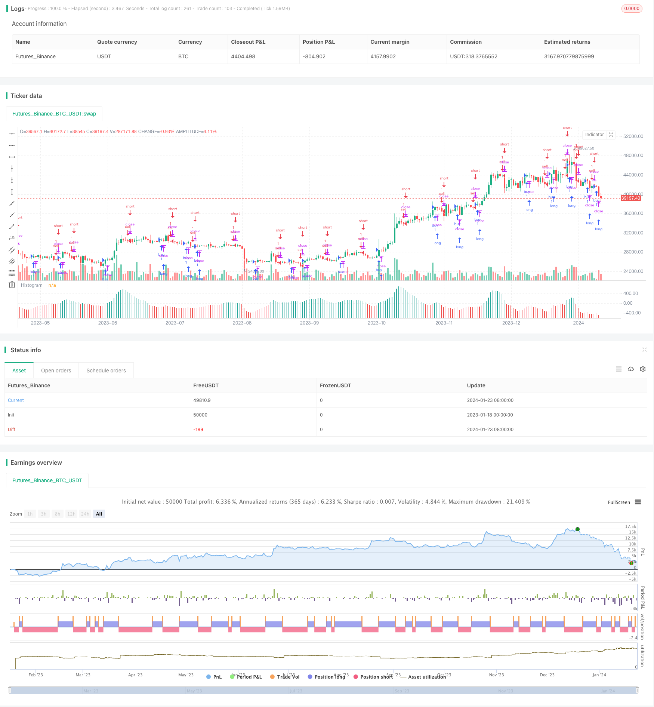

> Name

This-strategy-makes-trading-decisions-based-on-the-trend-of-MACD-Histogram
> Author

ChaoZhang

> Strategy Description


 [trans]
## Overview
This strategy makes trading decisions based on the Histogram of the MACD indicator. It uses the uptrend and downtrend of the Histogram to generate buy and sell signals. When the Histogram continues to rise or fall for a certain period, a corresponding signal is generated.
## Strategy Principle
This strategy uses the fast line, slow line and Histogram of the MACD indicator. First calculate the fast EMA and slow EMA. Then the fast line is subtracted from the slow line to get MACD, and MACD is subtracted from its moving average Signal to get the Histogram.
When the Histogram's continuous upward trend reaches the set period, a buy signal is generated. This indicates that MACD is accelerating upward beyond its signal line, predicting that prices may rise.
When the Histogram's continuous downward trend reaches the set period, a sell signal is generated. This indicates that MACD is accelerating downward below its signal line, predicting a possible price decline.
## Advantage Analysis
This strategy has the following advantages:
1. Using the trend of MACD Histogram, you can seize the turning point of price changes and enhance the probability of profit.
2. Combined with the periodic conditions of Histogram's continuous rise or fall, some noise transactions can be filtered out and unnecessary losses can be reduced.
3. Allows customization of MACD parameters and Histogram trend cycles, which can be adjusted to suit different varieties and trading periods.
4. The strategy logic is simple and clear, easy to understand and modify, and is also easy to use in combination with other indicators or strategies.
## Risk Analysis
There are also some risks with this strategy:
1. When the price is in a volatile range, erroneous signals may be generated and need to be filtered in combination with trend indicators and other indicators.
2. After the Histogram rises or falls, the MACD line may not be able to break through the signal line, making it impossible to exit with a profit. Stop loss needs to be set to control risks.
3. Actual transaction issues such as transaction costs and slippage are not considered, and profits may be reduced during real trading.
4. Improper parameter settings (such as MACD cycle, Histogram trend cycle, etc.) may lead to poor strategy effects and need to be optimized for varieties and time periods.
These risks can be controlled and reduced by combining with trend indicators, setting stop loss mechanisms, optimizing parameters, etc.
## Optimization direction
This strategy can be optimized from the following directions:
1. Combine with other indicators to determine the general trend direction and avoid trading in a volatile range. For example, the 20-day line determines the medium and long-term trend, etc.
2. Add a stop loss mechanism. For example, stop loss when MACD falls below the signal line again.
3. Optimize MACD parameters to adapt to varieties with different cycles. For example, the period parameters can be shortened for high-frequency data.
4. Optimize the minimum number of cycles for Histogram to continuously rise or fall to balance signal frequency and reliability.
5. The strategic logic of tracking signals after a Breakout attempt fails. That is, the Histogram is inverted and then the reverse signal is tracked.
6. Combine with other indicators, such as volume and energy indicators, volatility indicators, etc. to judge market heat and filter signals.
## Summarize
The MACD Histogram Trend strategy realizes the judgment of the turning point of price changes by capturing the trend changes of the Histogram. Combined with parameter optimization and combined indicator judgment, error signals can be effectively filtered out. MACD Histogram is a very important auxiliary judgment tool in quantitative trading. This strategy provides a simple and practical trading idea.
||

## Overview

This strategy makes trading decisions based on the trend of MACD Histogram. It utilizes the upward and downward trends of Histogram to generate buy and sell signals. When the Histogram continues to rise or fall for a certain period, corresponding signals are generated.

## Strategy Logic

The strategy uses the fast line, slow line and Histogram of the MACD indicator. First calculate the fast EMA and slow EMA. Then subtract slow EMA from fast EMA to get MACD, and subtract Signal which is the moving average of MACD to get Histogram.

When the Histogram continues to rise for the set period, a buy signal is generated. This indicates that MACD is accelerating to break through its signal line upward, predicting that prices may rise.

When the Histogram continues to decline for the set period, a sell signal is generated. This indicates that MACD is accelerating to break through its signal line downward, predicting that prices may fall.


## Advantage Analysis  

The strategy has the following advantages:

1. Utilizing the trending characteristic of MACD Histogram, it can capture the turning points of price changes and enhance profitability.

2. Combining with the condition of consecutive rise or fall of Histogram, some noisy trades can be filtered out to reduce unnecessary losses.

3. Allowing customization of MACD parameters and Histogram trend period, it can be adjusted to suit different products and trading sessions.

4. The strategy logic is simple and clear, easy to understand and modify, and also convenient to combine with other indicators or strategies.

## Risk Analysis

The strategy also has some risks:

1. Wrong signals may occur when prices are oscillating in range. Trend indicators need to be combined to filter.

2. After Histogram rises or falls, MACD line may fail to break through the signal line, unable to profitably exit. Stop loss should be set to control risk.

3. Trading cost and slippage are not considered. Actual profit may decrease in live trading.

4. Improper parameter settings (e.g. MACD period, Histogram trend period) may worsen strategy performance. Parameters need to be optimized for products and sessions.

These risks can be controlled and reduced through methods like combining with trend indicators, setting stop loss mechanism, optimizing parameters etc.

## Optimization Directions

The strategy can be optimized in the following aspects:

1. Combine other indicators to determine overall trend direction, avoiding trading in oscillating ranges. E.g. 20-day line for medium-long term trend.

2. Add stop loss mechanism. E.g. stop loss when MACD re-breaks signal line downwards.  

3. Optimize MACD parameters to suit products of different frequencies. E.g. shorten period parameters for high-frequency data.

4. Optimize minimum period of consecutive Histogram rise or fall, balancing signal frequency and reliability.  

5. Try logic of trailing signals after breakout failure. I.e. trailing reverse signal after Histogram reversal.

6. Combine other indicators like volume or volatility indicators to gauge market heat and filter signals.

## Conclusion
In conclusion, the MACD Histogram Trend strategy realizes judgment of price change turning points by capturing Histogram trend changes. Combining parameter optimization and combo indicators can effectively filter out wrong signals. As an important auxiliary judgment tool in quantitative trading, this strategy provides a simple and practical trading idea using MACD Histogram.

[/trans]

> Strategy Arguments


|Argument|Default|Description|
|----|----|----|
|v_input_1|2017|Year|
|v_input_2|12|Fast Length|
|v_input_3|26|Slow Length|
|v_input_4|true|Trend of Histogram Number|
|v_input_5_close|0|Source: close|high|low|open|hl2|hlc3|hlcc4|ohlc4|
|v_input_6|9|Signal Smoothing|
|v_input_7|false|Simple MA(Oscillator)|
|v_input_8|false|Simple MA(Signal Line)|


> Source (PineScript)

``` pinescript
/*backtest
start: 2023-01-18 00:00:00
end: 2024-01-24 00:00:00
period: 1d
basePeriod: 1h
exchanges: [{"eid":"Futures_Binance","currency":"BTC_USDT"}]
*/

//@version=4
//study(title="Histogram Strategy by Sedkur", shorttitle="Histogram Strategy by Sedkur")
strategy (title="Histogram Trends Strategy by Sedkur", shorttitle="Histogram Trends Strategy by Sedkur")


/// Getting inputs
dyear = input(title="Year", type=input.integer, defval=2017, minval=1950, maxval=2500)
fast_length = input(title="Fast Length", type=input.integer, defval=12)
slow_length = input(title="Slow Length", type=input.integer, defval=26)
hist_length = input(title="Trend of Histogram Number", type=input.integer, defval=1, minval=1, maxval=100)
//buyh = input(title="Buy histogram value", type=input.float, defval=0.0, minval=-1000, maxval=1000, step=0.1)
//sellh = input(title="Sell histogram value", type=input.float, defval=0.0, minval=-1000, maxval=1000, step=0.1)
src = input(title="Source", type=input.source, defval=close)
signal_length = input(title="Signal Smoothing", type=input.integer, minval = 1, maxval = 50, defval = 9)
sma_source = input(title="Simple MA(Oscillator)", type=input.bool, defval=false)
sma_signal = input(title="Simple MA(Signal Line)", type=input.bool, defval=false)

// Plot colors
col_grow_above = #26A69A
col_grow_below = #FFCDD2
col_fall_above = #B2DFDB
col_fall_below = #EF5350
col_macd = #0094ff
col_signal = #ff6a00

/// Calculating
fast_ma = sma_source ? sma(src, fast_length) : ema(src, fast_length)
slow_ma = sma_source ? sma(src, slow_length) : ema(src, slow_length)
macd = fast_ma - slow_ma
signal = sma_signal ? sma(macd, signal_length) : ema(macd, signal_length)
hist = macd - signal

plot(hist, title="Histogram", style=plot.style_columns, color=(hist>=0 ? (hist[1] < hist ? col_grow_above : col_fall_above) : (hist[1] < hist ? col_grow_below : col_fall_below) ), transp=0 )
//plot(macd, title="MACD", color=col_macd, transp=0)
//plot(signal, title="Signal", color=col_signal, transp=0)

//bullish = hist[1] <= hist and buyh<=hist?true:false
//bearish = hist[1] >= hist and sellh>=hist?true:false
bull=0
bear=0


for i=0 to hist_length
    if (hist[i+1] <= hist[i])
        bull:=bull+1
bullish = bull==hist_length+1?true:false   

for j=0 to hist_length
    if (hist[j+1] >= hist[j])
        bear:=bear+1
bearish = bear==hist_length+1?true:false 


//bullish = hist[1] <= hist and hist[2] <= hist and hist[3] <= hist and hist[4] <= hist and hist[5] <= hist?true:false
//bearish = hist[1] >= hist and hist[2] >= hist and hist[3] >= hist and hist[4] >= hist and hist[5] >= hist?true:false

strategy.entry("buy", strategy.long, comment="buy", when = bullish and year>=dyear)
strategy.entry("sell", strategy.short, comment="sell", when = bearish and year>=dyear)

```

> Detail

https://www.fmz.com/strategy/439978

> Last Modified

2024-01-25 14:31:57
