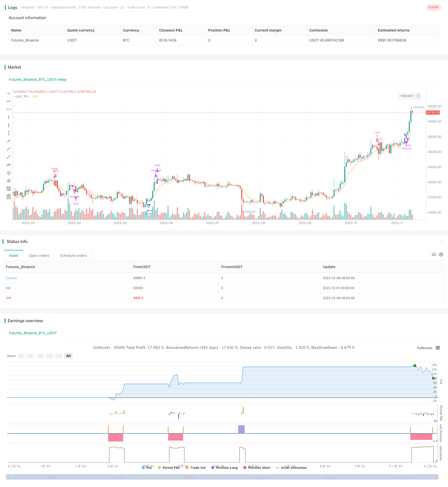

> Name

MACD-Moving-Average-Bull-Bear-Conversion-Strategy MACD-Moving-Average-Bull-Bear-Conversion-Strategy
> Author

ChaoZhang

> Strategy Description


[trans]

## Overview
The MACD moving average bull-bear conversion strategy determines whether the market trend has turned by calculating the DIFF and DEA moving averages of the MACD indicator, and then generates trading signals. When DIFF crosses DEA above, go long; when DIFF crosses DEA below, go short. This strategy also combines price EMA moving average filtering to avoid false breakthroughs.
## Strategy Principle
This strategy is mainly based on the DIFF and DEA moving averages of the MACD indicator. MACD stands for Exponential Moving Average Difference and consists of DIFF, DEA and MACD lines. Among them, the DIFF line represents the difference between the short-term EMA moving average and the long-term EMA moving average. The DEA line is the EMA moving average of DIFF, which is used to verify the DIFF line signal. The MACD line is the difference between DIFF minus DEA, which represents the divergence.
When DIFF breaks through DEA ​​upwards, it means that the short-term moving average begins to strengthen, and the market enters a long position. When DIFF falls below DEA, it means that the short-term moving average begins to weaken, and the market enters a short position. Therefore, this strategy goes long when DIFF crosses DEA above and short when it crosses below.
At the same time, the strategy also combines the price EMA to filter out false breakthroughs. Only go long when DIFF breaks through DEA ​​upward and the price is lower than the last long price; go short only when DIFF breaks through DEA ​​downward and the price is higher than the last short price.
## Advantage Analysis
The MACD moving average bull-bear conversion strategy combines the MACD indicator and the price EMA moving average to avoid false signals generated only by the MACD indicator and improve the trading effect. This strategy determines that market trends change quickly and is suitable for short-term operations.
The advantages are mainly reflected in:
1. Use the MACD indicator to determine trend transition points and capture market turning opportunities.
2. Filter based on price EMA to reduce the chance of false breakthroughs
3. Trading signals are generated quickly and are suitable for short-term operations.
4. Trend tracking is realized and mid-term profits from the trend can be obtained
5. Adopt trend conversion operation ideas, which is in line with the thinking mode of most traders
## Risk Analysis
There are also some risks in the MACD moving average bull-bear conversion strategy, which are mainly reflected in:
1. The MACD indicator is prone to generating false signals and requires the price EMA filter for verification, but it will also miss part of the movement.
2. Pay close attention to the DIFF and DEA moving averages. Improper adjustment of parameters will also increase false signals.
3. The breakthrough signal only determines one K line, and there may be a trap phenomenon.
4. The strategy uses the cross of DIFF and DEA as the main trading signal. If the market is unclear and cross signals are generated frequently, the trading frequency will increase.
These risks can mainly be optimized from the following aspects:
1. Adjust MACD parameters to reduce false signals
2. Increase filter strength and reduce the probability of quilt cover
3. Add position filtering and limit trading frequency
## Optimization direction
The MACD moving average bull-bear conversion strategy also has room for optimization, which can be optimized from the following dimensions:
1. Optimize MACD parameters, DIFF and DEA periods are adjustable;
2. Add position time filtering and reduce transaction frequency;
3. Add stop-loss and stop-profit strategies to control single profit and loss;
4. Combine with other indicator filters, such as BOLL upper and lower rails, KD, etc.;
5. Increase trend judgment and avoid counter-trend transactions;
6. Exit strategy or take-profit strategy templates can be developed based on this strategy framework.
## Summarize
The MACD moving average bull-bear conversion strategy uses DIFF and DEA crosses to determine the timing of the market entering the long and short positions, and cooperates with the price EMA to filter out false signals, achieving the effect of quickly judging market trend transitions. This strategy uses simple and clear trading logic to quickly determine the conversion point, and is suitable for short-term and mid-term operations. The next step can be to optimize parameters, enhance filters, control transaction frequency, etc. to make the strategy more stable.
||


## Overview  

The MACD Moving Average Bull Bear Conversion Strategy calculates the DIFF and DEA lines of the MACD indicator to determine whether the market trend has reversed, thereby generating trading signals. It goes long when DIFF crosses above DEA and goes short when DIFF crosses below DEA. The strategy also incorporates price EMA filters to avoid false breakouts.

## Strategy Logic   

The strategy is mainly based on the DIFF and DEA lines of the MACD indicator. MACD stands for Moving Average Convergence Divergence, consisting of the DIFF, DEA and MACD lines. Among them, DIFF represents the difference between short-term EMA and long-term EMA, DEA is the EMA of DIFF used to verify DIFF signals, and MACD represents the difference between DIFF and DEA, used to identify divergences.   

When DIFF breaks above DEA, it means the short-term moving average starts strengthening and the market turns bullish. When DIFF breaks below DEA, it suggests the short-term moving average turns weak and the market becomes bearish. Therefore, this strategy goes long when DIFF crosses above DEA and goes short when crossing below.   

In addition, the strategy incorporates price EMA filters to avoid false breakouts. It only goes long when DIFF breaks above DEA and price is below the previous long price, and only goes short when DIFF breaks below DEA and price is above previous short price.  

## Advantage Analysis  

The MACD Moving Average Bull Bear Conversion Strategy combines the MACD indicator and price EMA filters to avoid false signals generated solely by the MACD, thus improving trading performance. This strategy quickly identifies market trend changes and is suitable for short-term trading.  

The main advantages include:  

1. Using MACD to identify trend reversal points and capture turning points  
2. Incorporating price EMA filters to reduce false breakout opportunities  
3. Fast signal generation suitable for short-term trading  
4. Implementing trend following to capture mid-term trend profits  
5. Aligns with most traders' thinking pattern of trading at conversion points  

## Risk Analysis   

The MACD Moving Average Bull Bear Conversion Strategy also has some risks:   

1. MACD is prone to generating false signals, requiring price EMA filters but will also miss some moves  
2. Need to closely monitor DIFF and DEA lines, improper parameter tuning increases false signals  
3. Breakout signals only consider 1 bar, with the risk of being whipsawed   
4. Strategy mainly relies on DIFF/DEA crossover for signals, can increase trade frequency if signals are too frequent  

The main ways to optimize risks are:  

1. Adjust MACD parameters to reduce false signals
2. Enhance filter strength to lower whipsaw occurrence   
3. Add filters on position holding to limit trade frequency  

## Optimization Directions   

The MACD Moving Average Bull Bear Conversion Strategy can be further optimized in the following dimensions:  

1. Optimize MACD parameters of DIFF/DEA periods  
2. Add timing filters to lower trading frequency  
3. Incorporate stop loss/profit take strategies to control profit targets  
4. Add other indicator filters like BOLL bands and KD  
5. Incorporate trend bias to avoid counter-trend trading
6. Develop exit strategies or profit taking templates based on this strategy framework  

## Conclusion   

The MACD Moving Average Bull Bear Conversion Strategy identifies bullish/bearish market entry by DIFF and DEA crossover signals, and uses price EMA filters to remove false signals, effectively determining market trend reversal points. With simple and clear logic, it quickly identifies conversion points suitable for short-term and mid-term trading. Next steps to optimize include adjusting parameters, enhancing filters, and controlling trade frequency to make the strategy more robust.  

[/trans]


> Source (PineScript)

``` pinescript
/*backtest
start: 2022-12-01 00:00:00
end: 2023-12-07 00:00:00
period: 1d
basePeriod: 1h
exchanges: [{"eid":"Futures_Binance","currency":"BTC_USDT"}]
*/

//@version=3
strategy("macd_strategy", 
          shorttitle="macd", 
          overlay=true, 
          pyramiding=1, 
          max_bars_back=5000, 
          calc_on_order_fills = false, 
          calc_on_every_tick=true, 
          default_qty_type=strategy.percent_of_equity, 
          default_qty_value=100, 
          commission_type =strategy.commission.percent, 
          commission_value=0.00075)
[diff, dea, _] = macd(close, 12, 26, 7)
dea_close = ema(diff, 3)
price = ema(close, 9)
plot(price)
cross_over_price = na
cross_over_signal = na
cross_over_price := cross_over_price[1]
cross_over_signal := cross_over_signal[1]

cross_under_price = na
cross_under_signal = na
cross_under_price := cross_under_price[1]
cross_under_signal := cross_under_signal[1]
if (crossover(diff,dea))
    cross_over_price := price[1]
    cross_over_signal := diff
if (crossunder(diff,dea))
    cross_under_price := price[1]
    cross_under_signal := diff
if dea > 0
    cross_over_price = na
    cross_over_signal = na
else
    cross_under_price = na
    cross_under_signal = na
if diff > 0
    if cross_under_price > cross_under_price[1]*1 and cross_under_signal < cross_under_signal[1]*0.95
        strategy.entry("S", strategy.short,  comment="S")
else
    if cross_over_price < cross_over_price[1]*1 and cross_over_signal > cross_over_signal[1]*0.95
        strategy.entry("B", strategy.long,  comment="B")
// strategy.exit("exit_s", "S", stop = strategy.position_avg_price*1.05, when=strategy.position_size < 0)
// strategy.exit("exit_b", "B", stop = strategy.position_avg_price*0.95, when=strategy.position_size > 0)
strategy.close_all(when=(strategy.position_size < 0 and (dea < 0 or diff > cross_under_signal*1 or crossover(diff, dea)) or (strategy.position_size > 0 and (dea > 0 or diff < cross_over_signal*1 or crossunder(diff, dea)))))
```

> Detail

https://www.fmz.com/strategy/434702

> Last Modified

2023-12-08 15:29:41
