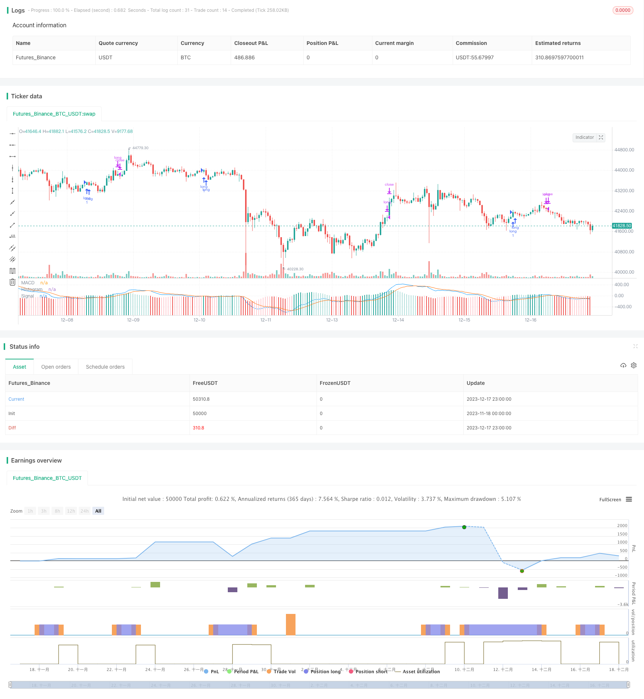

> Name

Use MACD quantitative trading strategy MACD-Quantitative-Trading-Strategy
> Author

ChaoZhang

> Strategy Description



[trans]

#### Overview
This strategy uses the MACD indicator to construct long-term trading signals, go long when the MACD indicator is below a specific level, and take advantage of reversal trading opportunities to make profits.
#### Strategy Principle
A long signal is generated when the MACD indicator line is lower than the SIGNAL signal line and the absolute value of MACD is lower than -0.00025. After going long, if the MACD line crosses the SIGNAL line again, the position will be closed.
This strategy uses the MACD indicator to detect the oversold range. According to the moving average theory, there is a probability of stock price reversal in the short term, and a long signal is established based on this probability.
#### Strategic Advantages
1. Using the MACD indicator to determine the oversold range has certain reliability.
2. Simple trading signals and rules, easy to implement.
3. Hold long-term positions and infrequently trade to reduce transaction costs and slippage losses.
#### Strategy Risk
1. Reverse the risk of failure. If there is no reversal, you will lose money.
2. Improper parameters lead to failure. Improper setting of MACD parameters can lead to false signals.
This risk can be reduced by optimizing parameters.
#### Strategy optimization
1. Optimize MACD parameters and find the best parameter combination.
2. Test different holding times to find the best holding period.
3. Add a stop loss mechanism.
#### Summary
This strategy uses the MACD indicator to determine the reversal probability formed in the oversold range to establish a long signal and make profits through long-term positions. MACD parameter optimization and stop loss mechanism increase reliability. Overall, a quantitative strategy that is easy to understand and implement is constructed using relatively simple indicators and rules.
||

#### Overview
This strategy uses the MACD indicator to build long position trading signals when the MACD is below a certain level to take advantage of mean reversion opportunities.  

#### Strategy Logic
A long signal is generated when the MACD line is below the SIGNAL line and the absolute value of MACD is below -0.00025. After taking a long position, if the MACD line crosses above the SIGNAL line again, the position will be closed.

This strategy utilizes the MACD indicator to detect oversold zones. According to the theory of moving averages, there is a probability of mean reversion in the short term, and a long signal is established based on this probability.

#### Advantages
1. Utilizes the MACD indicator to judge oversold levels, which has a certain reliability. 
2. Simple trading signals and rules that are easy to implement.
3. Long holding periods means less frequent trading, reducing transaction costs and slippage.

#### Risks
1. Risk of failed mean reversion. It will lead to losses if no reversion happens.  
2. Invalid signals from poor MACD parameter selection.

This risk can be reduced through parameter optimization.

#### Enhancements  
1. Optimize MACD parameters to find best combinations.
2. Test different holding periods to find optimal duration.  
3. Add stop loss mechanisms.

#### Summary
This strategy utilizes the probability of mean reversions from oversold levels identified by the MACD indicator to generate long signals, and profits through long holding periods. Optimizing MACD parameters and adding stop losses improves reliability. In summary, it uses relatively simple indicators and rules to construct an easy to understand and implement quantitative strategy.

[/trans]

> Strategy Arguments


|Argument|Default|Description|
|----|----|----|
|v_input_1|12|Fast Length|
|v_input_2|26|Slow Length|
|v_input_3_close|0|Source: close|high|low|open|hl2|hlc3|hlcc4|ohlc4|
|v_input_4|9|Signal Smoothing|
|v_input_5|false|Simple MA(Oscillator)|
|v_input_6|false|Simple MA(Signal Line)|


> Source (PineScript)

``` pinescript
//@version=3
strategy(title="MACD - EURUSD", shorttitle="MACD EURUSD")

// Getting inputs
fast_length = input(title="Fast Length",  defval=12)
slow_length = input(title="Slow Length",  defval=26)
src = input(title="Source", defval=close)
signal_length = input(title="Signal Smoothing",  minval = 1, maxval = 50, defval =9)
sma_source = input(title="Simple MA(Oscillator)", type=bool, defval=false)
sma_signal = input(title="Simple MA(Signal Line)", type=bool, defval=false)

// Plot colors
col_grow_above = #26A69A
col_grow_below = #FFCDD2
col_fall_above = #B2DFDB
col_fall_below = #EF5350
col_macd = #0094ff
col_signal = #ff6a00

// Calculating
fast_ma = sma_source ? sma(src, fast_length) : ema(src, fast_length)
slow_ma = sma_source ? sma(src, slow_length) : ema(src, slow_length)
macd = fast_ma - slow_ma
signal = sma_signal ? sma(macd, signal_length) : ema(macd, signal_length)
hist = macd - signal

plot(hist, title="Histogram", style=columns, color=(hist>=0 ? (hist[1] < hist ? col_grow_above : col_fall_above) : (hist[1] < hist ? col_grow_below : col_fall_below) ), transp=0 )
plot(macd, title="MACD", color=col_macd, transp=0)
plot(signal, title="Signal", color=col_signal, transp=0)

longCond = crossover(macd, signal) and macd < -0.00025
exitLong = crossover(macd, hist)


strategy.entry("long", strategy.long,  when=longCond==true)
strategy.close("long", when=exitLong==true)
```

> Detail

https://www.fmz.com/strategy/435884

> Last Modified

2023-12-19 15:11:57
