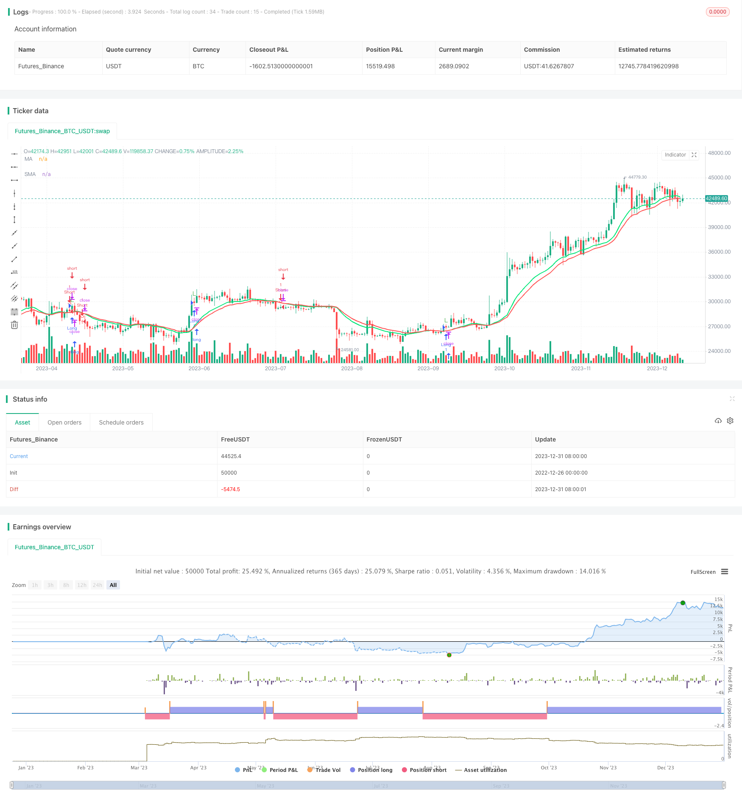

> Name

Momentum-Crossover-Moving-Average-and-MACD-Filter-Heikin-Ashi-Candlestick-Strategy
> Author

ChaoZhang

> Strategy Description



[trans]

## Overview
This strategy uses Heiken Ash candle technology, supplemented by moving average cross signals and MACD indicators to filter, to build a trend following strategy. The strategy can capture market trends in different time periods, use moving average crossovers to generate trading signals, and then filter out false signals through the MACD indicator, showing a high profitability in backtests.
## Strategy Principle
This strategy mainly uses three major technical indicators:
1. Heiken Ash Candle Technique. This technique creates "shadowless" candles by modifying the closing price. This can show the true trend of prices more clearly and filter out excessive market noise.
2. Exponential Moving Average (EMA). Fast EMA is used to capture short-term trends, and slow EMA is used to determine the long-term trend direction. A buy signal is generated when the fast EMA crosses above the slow EMA; a sell signal is generated when the fast EMA crosses below the slow EMA.
3. MACD indicator. This indicator combines the fast and slow EMA. When the main line of MACD is higher than the Signal line, it is a bullish signal. When the main line is lower than the Signal line, it is a bearish signal.
The trading signals for this strategy come from the golden cross and dead cross of fast EMA and slow EMA. In order to filter out false Signals, the strategy introduces the MACD indicator to assist in judgment. The final trading signal will only be generated when the MACD indicator sends a signal in the same direction, which greatly reduces the probability of wrong transactions.
Specifically, when the fast EMA crosses above the slow EMA (golden cross) and the MACD main line is above the Signal line (a bullish signal) at the same time, a buy signal is generated; when the fast EMA crosses below the slow EMA (a dead cross) and the MACD main line is below the Signal line (a bearish signal) at the same time, a sell signal is generated.
This filtering method that combines moving average crossover and MACD indicators can effectively identify key turning points in the market and capture price trends.
## Strategic Advantages
This strategy has the following outstanding advantages:
1. The probability of catching trend signals is greatly increased. The trend can be judged more clearly using the Heiken Ash candle technique. The signal generated by the crossover system of the two moving averages is also very effective. When combined with MACD filtering, the reliability is higher.
2. The risk of retracement is small. As an auxiliary judgment indicator, MACD can avoid the risk of stop loss to a certain extent and effectively reduce the loss of closing positions.
3. There are many adjustable parameters. The cycle of Heiken Ash candles, the speed cycle of the moving average system, and the parameters of MACD can all be adjusted according to the market, making the strategy more adaptable to different market conditions.
4. The implementation is relatively simple and clear. The price is represented by Heiken Ash candles, supplemented by common indicators for judgment. It is easy to program and implement, and the code is concise and easy to understand.
5. Funds are used more efficiently. The strategy adopts trend following rules, which can make funds operate in the mainstream direction of the market most of the time, effectively utilizing the amount of funds to generate profits.

## Strategy Risk
This strategy also has some possible risks:
1. When the market fluctuates violently, large losses may occur. When there is a large gap in price or a rapid reversal in a short period of time, stop loss measures may be breached, causing losses beyond expectations.
2. MACD filters out the possibility of misjudgment. As an auxiliary indicator, MACD may also cause misjudgments, which may lead to wrong strategies to open or close positions.
3. Parameter settings are too rigid. Fixed parameter combinations may not be able to adapt to the changing market and may miss good trading opportunities.
4. Transaction frequency may be too high. The method of establishing positions following the trend may result in frequent transactions, increased transaction costs and slippage losses.

In order to avoid and reduce the above risks, the following measures can be taken:
1. Set a stop loss position to limit a single loss. At the same time, do not excessively chase the rise and kill the fall, and control the size of the position.
2. Adjust the parameters of MACD to reduce the probability of auxiliary indicators sending wrong signals. Other indicators can also be introduced for multiple verification.
3. Establish a parameter optimization mechanism. Machine learning and other methods are used to automatically optimize parameter combinations to make the strategy more adaptable.
4. Appropriately relax the trigger conditions of trading signals and reduce the frequency of transactions. You can also set a minimum price change before triggering a transaction.
## Strategy optimization
This strategy also has a lot of room for optimization, which can be started from the following aspects:
1. Period optimization of Heiken Ashe candles. You can test longer or shorter candle periods to find time periods that better express market trends.
2. Parameter adjustment of the moving average system. Modify the period parameters of fast and slow EMA to find the best parameter combination.
3. Multi-parameter optimization of MACD indicator. Adjust the parameters of MACD's fast and slow moving averages and Signal line to find the optimal parameters.
4. Strengthening of the strategic risk management module. Set up more scientific stop-loss and take-profit rules, and also add modules such as position control and fund management.
5. Add more auxiliary indicators. For example, other indicators such as KD and RSI can be introduced for multi-factor verification to improve signal quality.
6. Apply machine learning technology. Use methods such as neural networks and genetic algorithms to optimize strategy parameters in real time to make the strategy more adaptable.
Through the iterative combination of technical indicators, continuous optimization of parameters, and strengthening of risk control modules, this strategy can be further improved to achieve more stable and efficient profits.
## Summarize
This strategy combines Heiken Ash candles and moving average crossover systems to capture market trends, and uses the MACD indicator for auxiliary filtering, which can effectively identify key turning points and generate highly reliable trading signals. The strategy has excellent backtest performance and has the advantages of high profit probability, low retracement risk, and strong adjustability. At the same time, we also need to pay attention to risk control and guard against the impact of extreme market conditions. Through continuous optimization and improvement, this strategy has the potential to become an efficient strategy for quantitative trading.
||

## Overview

This strategy utilizes the Heikin-Ashi candlestick technique combined with moving average crossover signals and MACD indicator for filtration to construct a trend-following strategy. The strategy can capture market trends in different timeframes, generating trading signals through moving average crossovers, and then filtering out false signals via the MACD indicator, demonstrating high profitability in backtests.

## Strategy Logic  

The strategy mainly leverages three major technical indicators:

1. Heikin-Ashi Candlesticks. It modifies the closing price to construct "shadowless" candlestick bars, which can more clearly exhibit true price trends, filtering out excessive market noise.

2. Exponential Moving Average (EMA). The fast EMA captures short-term trends while the slow EMA judges long-term trend directions. A buy signal is generated when the fast EMA crosses above the slow EMA; A sell signal is generated when the fast EMA crosses below the slow EMA.

3. MACD Indicator. It combines fast and slow EMAs. When the MACD line is above the signal line, it is a bullish signal; when below, it's a bearish signal.

The trading signals of this strategy come from the golden/dead cross of the fast and slow EMAs. To filter out false signals, the MACD indicator is introduced for auxiliary judgment. Only when the MACD gives out a signal that aligns with the EMA crossover will the final trading signal be triggered, which greatly reduces the probability of wrong trades. 

Specifically, when the fast EMA crosses above the slow EMA (golden cross) and the MACD line goes above the signal line (bullish signal) simultaneously, a buy signal is generated; when the fast EMA crosses below the slow EMA (dead cross) and the MACD line goes below the signal line (bearish signal) at the same time, a sell signal is generated.

This combination of moving average crossover and MACD filtration can effectively identify key inflection points in the market and capture price trends accordingly.

## Advantages  

The strategy has the following outstanding edges:

1. Greatly improved probability of capturing trend signals. The Heikin-Ashi technique offers clearer trend judgment, while the strength of crossover signals from the two EMAs is also powerful. The reliability is even higher after integrating the MACD filter.

2. Relatively small drawdown risk. The MACD, serving as an auxiliary indicator, can mitigate stop-loss risks to some extent and effectively reduce unwanted liquidation losses. 

3. More tunable parameters. The periods of Heikin-Ashi candlesticks, fast/slow EMAs of the moving average system, parameters of the MACD etc. can all be adjusted based on market conditions to make the strategy more adaptive.

4. Simple and clear implementation. Using Heikin-Ashi candles to denote prices and aided with common indicators for determination, it is easy to program, with neat and concise codes that are intuitive to understand.

5. Higher capital usage efficiency. By trend-following, most of the time the strategy can align capital movements with the main market direction and generate returns more effectively.

## Risks

The strategy also has the following potential risks:

1. Severe whipsaws in the market may lead to heavy losses. When prices gap significantly or reverse rapidly in the short-term, stop-loss measures could fail, incurring losses way beyond expectations.

2. Possibilities of MACD misjudgment. MACD as an auxiliary indicator can also make wrong calls, resulting in the strategy wrongly establishing or closing positions.

3. Inflexible parameter settings. Fixed parameter combinations may not adapt to the ever-changing market, thus missing good trading opportunities. 

4. Potentially high trading frequency. Trend-following methods could induce frequent trades, increasing costs and slippage losses.

To mitigate and reduce the above risks, the following measures can be adopted:

1. Set stop-loss points to limit losses for single trades. Also, avoid over-chasing trends and control position sizes.  

2. Adjust MACD parameters to decrease incorrect signal probabilities. More indicators can also be introduced for multi-confirmation.

3. Build parameter optimization mechanisms. Employ machine learning etc. to auto-tune parameter combinations for higher adaptivity.  

4. Appropriately relax trigger conditions for trading signals to reduce trading frequency, or set minimum price change thresholds.

## Optimization

Great potential lies in further optimization of the strategy, including:
  
1. Optimize Heikin-Ashi candlestick durations. Test longer or shorter periods to find the ones that best exhibit market trends.

2. Adjust parameters of the moving average system. Modify periods of the fast/slow EMAs to discover optimal parameter sets. 

3. Multi-parameter optimization of the MACD. Fine-tune parameters of the fast/slow EMAs and MACD signal line to locate superior configurations. 

4. Reinforce risk management modules. Devise more scientific stop-loss/take-profit rules, integrate position sizing, capital management etc.

5. Introduce more auxiliary indicators. Add other indicators like KD, RSI for multi-factor confirmation, improving signal quality.

6. Employ machine learning techniques. Leverage neural networks, genetic algorithms etc. to real-time optimize strategy parameters for higher adaptivity.

With iterative combinations of technical indicators, continuous parameter optimizations, stronger risk control modules etc., significant performance boosts of the strategy can be expected for more steady and efficient profitability.

## Conclusion  

This strategy captures market trends by combining Heikin-Ashi candles and moving average crossovers, aided by MACD filtration for detecting high-reliability turning points and trading signals. Backtested results are outstanding, with edges like high winning probability, low drawdowns, high tunability. Meanwhile, risk control also needs attention to hedge impacts from extreme market moves. With continuous improvements and optimization, the strategy demonstrates great potential as a highly effective quantitative trading strategy.

[/trans]

> Strategy Arguments


|Argument|Default|Description|
|----|----|----|
|v_input_1|15|Heikin Ashi Candle Time Frame|
|v_input_2|false|Heikin Ashi Candle Time Frame Shift|
|v_input_3|300|Time frame (Minutes. Not lower than chart)|
|v_input_4|false|Heikin Ashi EMA Time Frame Shift|
|v_input_5|16|Heikin Ashi EMA Period|
|v_input_6|false|Heikin Ashi EMA Shift|
|v_input_7|21|Slow EMA Period|
|v_input_8|false|Slow EMA Shift|
|v_input_9|false|With MACD filter|
|v_input_10|60|MACD Time Frame|
|v_input_11|true|MACD Shift|


> Source (PineScript)

``` pinescript
/*backtest
start: 2022-12-26 00:00:00
end: 2024-01-01 00:00:00
period: 1d
basePeriod: 1h
exchanges: [{"eid":"Futures_Binance","currency":"BTC_USDT"}]
*/

//@version=2
//Heikin Ashi Strategy  V1 by nachobuey

strategy("Heikin Ashi Strategy  V2",shorttitle="HAS V2",overlay=true)
res = input(title="Heikin Ashi Candle Time Frame",  defval="15")
hshift = input(0,title="Heikin Ashi Candle Time Frame Shift")
//res1 = input(title="Heikin Ashi EMA Time Frame", type=resolution, defval="180")
res1   = input(title="Time frame (Minutes. Not lower than chart)",defval="300")
mhshift = input(0,title="Heikin Ashi EMA Time Frame Shift")
fama = input(16,"Heikin Ashi EMA Period")
test = input(0,"Heikin Ashi EMA Shift")
sloma = input(21,"Slow EMA Period")
slomas = input(0,"Slow EMA Shift")
macdf = input(false,title="With MACD filter")
res2 = input(title="MACD Time Frame",  defval="60")
macds = input(1,title="MACD Shift")


//Heikin Ashi Open/Close Price
ha_t = heikinashi(syminfo.tickerid)
ha_open = request.security(ha_t, res, open[hshift])
ha_close = request.security(ha_t, res, close[hshift])
mha_close = request.security(ha_t, res1, close[mhshift])

//macd
[macdLine, signalLine, histLine] = macd(close, 12, 26, 9)
macdl = request.security(ha_t,res2,macdLine[macds])
macdsl= request.security(ha_t,res2,signalLine[macds])

//Moving Average
fma = ema(mha_close[test],fama)
sma = ema(ha_close[slomas],sloma)
plot(fma,title="MA",color=lime,linewidth=2,style=line)
plot(sma,title="SMA",color=red,linewidth=2,style=line)


//Strategy
golong =  crossover(fma,sma) and (macdl > macdsl or macdf == false )
goshort =   crossunder(fma,sma) and (macdl < macdsl or macdf == false )


strategy.entry("Long",strategy.long,when = golong)
strategy.entry("Short",strategy.short,when = goshort)

plotchar(golong,char="L", color=green)
plotchar(goshort,char="S", color=red)

alertcondition(golong, "HAS GO LONG", "OPEN LONG")
alertcondition(goshort, "HAS GO SHORT", "OPEN SHORT")


```

> Detail

https://www.fmz.com/strategy/437400

> Last Modified

2024-01-02 12:18:03
