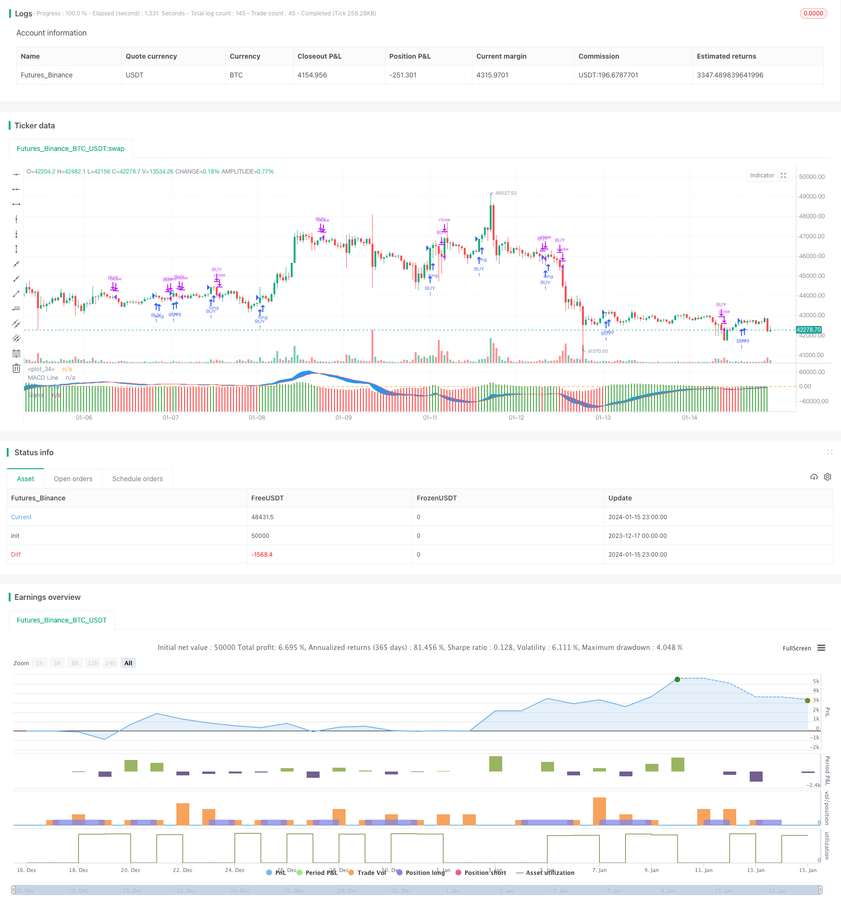

> Name

MACD indicator drives OBV indicator quantitative trading strategy MACD-Indicator-Driven-OBV-Quant-Trading-Strategy
> Author

ChaoZhang

> Strategy Description



[trans]
### Overview
This strategy calculates the MACD indicator of the OBV indicator and determines the trend and turning point of the OBV energy to drive trading decisions. The basic idea is that when the MACD histogram of OBV breaks through the 0 axis from the negative area and enters the positive area, a buy signal is generated; and when it falls below the 0 axis from the positive area and enters the negative area, a sell signal is generated.
### Strategy Principles
The core indicator of this strategy is the MACD indicator of OBV. The OBV indicator can reflect the volume trend of the stock. It determines whether the rising volume can strengthen or weaken by counting the relationship between the changing direction of the closing price and the changing trading volume within a period of time. The MACD indicator can display the difference between different moving averages and reflect the momentum of price changes. Therefore, by combining the OBV volume energy indicator and the MACD momentum indicator, the changing trend of volume energy can be judged more clearly.
Specifically, this strategy first calculates the OBV indicator, which calculates the OBV volume energy line by counting the relationship between the closing price change direction and trading volume within a period of time. Then, calculate its MACD indicator based on the OBV energy line, including MACD line, signal line and histogram bar chart. Finally, when the macd histogram breaks through the 0 axis from the negative area and enters the positive area, a buy signal is generated; when the histogram falls below the 0 axis from the positive area and enters the negative area, a sell signal is generated.
In this way, MACD can be used to visually display the momentum characteristics of OBV volume energy, judge the changing trend of volume energy, and use MACD breakthroughs to send trading signals, which can improve the accuracy of trading decisions.
### Advantage Analysis
This strategy combines OBV volume energy analysis and MACD momentum indicator to more accurately judge volume energy changes and price trends, and can effectively filter ALSE signals. Specific advantages include:
1. The OBV indicator can determine the balance of power between buyers and sellers and the trend of volume and energy changes.
2. MACD histogram can clearly identify the turning point of OBV volume and energy
3. The trading signals are relatively clear and are less likely to cause misjudgments.
4. There are many configurable transaction parameters and clear transaction rules.
### Risk Analysis
This strategy also has some risks, mainly focusing on the following aspects:
1. Both OBV and MACD are sensitive to trading volume. If there is abnormally high trading volume, it will be misleading.
2. Improper setting of Parameters will also affect the effectiveness of the strategy
3. When switching between long and short, the change in OBV volume and energy may lag behind, causing the trading signal to lag behind.
To address these risks, the following measures can be taken:
1. Filter transaction volume and eliminate abnormal data
2. Set parameters carefully and consider the market environment.
3. Appropriately adjust parameter settings, such as MACD cycle, to make trading signals timely
### Optimization direction
There is room for further optimization of this strategy. The main directions are:
1. Combine other indicators for combined trading to improve the strategy effect.
2. Add a stop-loss mechanism to control risks
3. Optimize parameter settings to better meet the needs of different market environments
Through continuous testing and optimization, this strategy can become a stable and efficient quantitative trading strategy.
### Summarize
This strategy is a typical quantitative strategy that combines volume analysis and momentum indicators to determine price trends and send trading signals. It can clearly identify the turning point of price fluctuations, the trading signals are relatively reliable, and under the premise of reasonable parameter settings, better strategic effects can be obtained. But it also has some risks, which require continuous optimization to improve results and reduce risks. In general, this strategy provides a typical idea for quantitative trading strategies and is worthy of further research and application.
||

### Overview

This strategy generates trading signals by calculating the MACD indicator of the OBV indicator to determine the trend and inflection points of OBV momentum. The core idea is to generate buy signals when the OBV MACD histogram breaks through the 0-axis from the negative region to the positive region, and to generate sell signals when it breaks through the 0-axis from the positive region to the negative region.

### Strategy Principle  

The core indicator of this strategy is the MACD indicator of OBV. The OBV indicator can reflect the momentum trend of a stock by statistically analyzing the relationship between the changing directions of closing prices and trading volumes over a period of time to determine whether the upward momentum is strengthening or weakening. The MACD indicator shows the difference between different moving averages to reflect the momentum of price changes. Therefore, by combining the OBV momentum indicator and the MACD momentum indicator, the change trend of momentum can be more clearly judged.

Specifically, this strategy first calculates the OBV indicator, which calculates the OBV momentum line by statistically analyzing the relationship between the changing directions of closing prices and trading volumes over a period of time. Then, based on the OBV momentum line, its MACD indicator is calculated, including the MACD line, signal line and histogram. Finally, when the macd histogram breaks through the 0-axis from the negative region to the positive region, a buy signal is generated; when the histogram breaks through the 0-axis from the positive region to the negative region, a sell signal is generated. 

By this means, the MACD intuitively displays the momentum characteristics of the OBV volume, and judges the trend of volume changes. The penetration of MACD is used to issue transaction signals, which can improve the accuracy of transaction decisions.

### Advantage Analysis

This strategy combines OBV volume analysis and MACD momentum indicators for relatively accurate judgments on volume and price trend changes, which can effectively filter out FALSE signals. The specific advantages are:

1. OBV indicator can determine the strength contrast between buyers and sellers and the trend of volume changes  
2. MACD histogram can clearly identify the inflection points of OBV momentum
3. Trading signals are clear and less likely to misjudge  
4. There are more configurable trading parameters and the trading rules are clear

### Risk Analysis  

The strategy also has some risks, mainly in the following aspects:

1. Both OBV and MACD are sensitive to trading volume. Abnormal high trading volumes can be misleading
2. Improper Parameters settings may also affect strategy performance  
3. When switching between long and short, OBV volume changes may lag, resulting in lagging trading signals  

To cope with these risks, the following measures can be taken:

1. Filter out abnormal data by screening trading volumes  
2. Set parameters prudently and take market conditions into consideration
3. Properly adjust parameter settings such as MACD cycles to generate timely trading signals  

### Optimization Directions

There is still room for further optimization of this strategy, mainly in the following directions:

1. Combine with other indicators for portfolio trading to improve strategy performance  
2. Add stop-loss mechanisms to control risks
3. Optimize parameter settings to meet the needs of different market environments  

By continuous testing and optimization, this strategy can become a stable and efficient quantitative trading strategy.  

### Summary  

This strategy is a typical quantitative strategy that combines volume analysis and momentum indicators to determine price trends and generate trading signals. It can clearly identify the inflection points of price fluctuations, and the trading signals are relatively reliable. With reasonable parameter settings, good strategy results can be obtained. But it also has some risks that need to be reduced by continuous optimization to improve performance. In general, this strategy provides a typical idea for quantitative trading strategies which is worth researching and applying.

[/trans]

> Strategy Arguments


|Argument|Default|Description|
|----|----|----|
|v_input_1|12|fastLength|
|v_input_2|26|slowLength|
|v_input_3|9|signalLength|
|v_input_4|6|monthfrom|
|v_input_5|12|monthuntil|
|v_input_6|true|dayfrom|
|v_input_7|31|dayuntil|


> Source (PineScript)

``` pinescript
/*backtest
start: 2023-12-17 00:00:00
end: 2024-01-16 00:00:00
period: 1h
basePeriod: 15m
exchanges: [{"eid":"Futures_Binance","currency":"BTC_USDT"}]
*/

//@version=3

strategy(title = "MACD of OBV", overlay = false)

//////////////////////// OBV ///////////////////////////

src = close
obv = cum(change(src) > 0 ? volume : change(src) < 0 ? -volume : 0*volume)


//////////////////////// OBV   //////////////////////////

//////////////// MACD OF OBV ////////////////////////////

sourcemacd = obv 

fastLength = input(12, minval=1), slowLength=input(26,minval=1)
signalLength=input(9,minval=1)


fastMA = ema(sourcemacd, fastLength)
slowMA = ema(sourcemacd, slowLength)

macd = fastMA - slowMA
signal = ema(macd, signalLength)
delta=macd-signal

swap1 = delta>0?green:red

plot(delta,color=swap1,style=columns,title='Histo',histbase=0,transp=20)
p1 = plot(macd,color=blue,title='MACD Line')
p2 = plot(signal,color=red,title='Signal')
fill(p1, p2, color=blue)
hline(0)


/////////////////////////MACD OF OBV //////////////////////////


// Conditions


longCond = na
sellCond = na
longCond :=  crossover(delta,0)
sellCond :=  crossunder(delta,0)


monthfrom =input(6)
monthuntil =input(12)
dayfrom=input(1)
dayuntil=input(31)


if (  longCond ) 
    strategy.entry("BUY", strategy.long, stop=close, oca_name="TREND",  comment="BUY")
    
else
    strategy.cancel(id="BUY")


if ( sellCond  ) 

    strategy.close("BUY")


```

> Detail

https://www.fmz.com/strategy/439112

> Last Modified

2024-01-17 18:01:36
