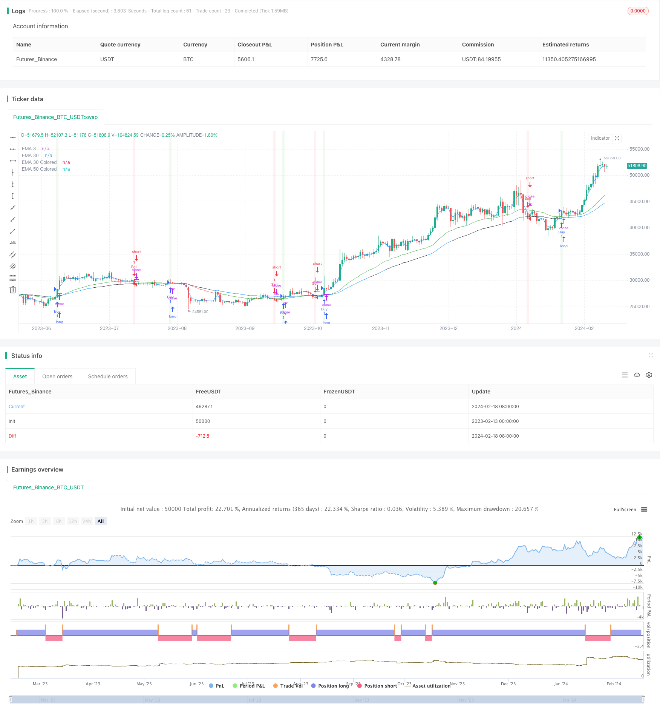

> Name

A-Combined-RSI-Strategy-with-Moving-Average-and-MACD
> Author

ChaoZhang

> Strategy Description


[trans]
## Overview
This strategy uses a combination of moving averages, MACD indicators, and RSI indicators to identify stock price trends and achieve profit by buying low and selling high. A buy signal is generated when the short-term moving average crosses the long-term moving average and the closing price is above the 50-day moving average. A sell signal is generated when the short-term moving average crosses below the long-term moving average and the price closes below the 50-day moving average. In addition, this strategy will also use the RSI indicator to determine whether it is in the overbought and oversold area to correct the entry signal, and use the histogram of the MACD indicator to correct the mid- and long-term trend judgment.
## Strategy Principle
This strategy mainly relies on the dual moving average strategy, that is, when the short-term moving average (3-day EMA) crosses the long-term moving average (30-day EMA), a buy signal is generated, and when the short-term moving average crosses below the long-term moving average, a sell signal is generated. This is a common technique for judging short-term and long-term trends in stock prices.
In addition, this strategy also introduces the 50-day moving average. Only when the price is higher than the 50-day moving average, a buy signal is generated, and when the price is lower than the 50-day moving average, a sell signal is generated. This is to avoid frequent trading and filter out some false signals.
In addition, the RSI indicator is used to determine whether it is overbought or oversold. If the RSI is above 70, it is considered an overbought zone, and even a strong short-term rally may face a correction. If the RSI is below 30, it is considered an oversold zone, and a rebound may occur even if the short-term decline is severe. Therefore, this strategy will correct the entry signal and only enter the market if it is not overbought or oversold.
Finally, the MACD histogram is used to determine mid- to long-term trends. If the MACD histogram > 0, it means that the medium and long term is an upward trend, and the entry signal is more credible at this time; if the MACD histogram < 0, it means that the medium and long term is a downward trend, and even if a short-term buy signal is generated, it may face adjustments.
## Strategic Advantages
The biggest advantage of this strategy is the combination of multiple indicators, making entry and exit signals more accurate and reliable. A single indicator is prone to produce false signals, but this strategy uses moving averages to determine short-term trends, RSI to determine overbought and oversold, and MACD to determine medium- and long-term trends, greatly increasing the probability of success for each transaction.
Another advantage is the ability to trade both trend and counter-trend trades. Follow the trend, follow the momentum is the creed of all trend traders. However, advanced strategies will not stick to the trend, and appropriate counter-trend transactions can also obtain generous excess returns. This strategy still chooses to enter the market against the trend in non-overbought and oversold areas, which adds vitality to the strategy.
## Strategy Risk
The main risk of this strategy comes from unexpected events leading to rapid adjustments. It is difficult for any quantitative strategy to deal with violent price swings caused by major negative or positive news. At this time, the stop loss point may be breached, causing large losses. In addition, policy risks will also have an impact on strategies.
Another risk is that short- and medium-term adjustments in the long trend will cause stop-loss exits. Even if it is still a bull market in the medium and long term, long positions may be stopped during short-term adjustments. At this time, the subsequent rising market was missed.
## Strategy optimization
This strategy can be optimized from the following dimensions:
1. Parameter optimization. You can test more combinations of parameters to find optimal parameters.
2. Add more indicators. You can test and add Bollinger Bands, KDJ and other other indicators to enrich multi-indicator combinations and improve signal quality.
3. Optimize the stop loss mechanism. You can test more advanced stop loss methods such as trailing stop loss and range breakout stop loss to reduce the probability of the stop loss being hit.
4. Adapt to more market environments. Some parameters of the strategy can be optimized to achieve stable returns in more types of markets.
## Summarize
This strategy achieves the generation of high-quality signals by using a combination of moving averages, RSI indicators and MACD indicators, avoiding the limitations of a single indicator, making every buying and selling decision highly confident. At the same time, the strategy also takes into account trend trading and counter-trend trading. While ensuring that you can take advantage of the trend, you can also choose efficient counter-trend operations at critical times. Overall, this strategy is robust, efficient, and a great quantitative strategy.
||

## Overview  

This strategy identifies price trends and makes buy low sell high decisions by combining moving averages, the MACD indicator and the RSI indicator. It generates buy signals when the short period moving average crosses above the long period moving average and the close price is above the 50-day moving average. It generates sell signals when the opposite happens. In addition, the strategy uses the RSI indicator to avoid overbought and oversold zones, and the MACD histogram to determine the intermediate-to-long term trend.

## Strategy Logic

The core of this strategy relies on the dual moving average crossover system, which generates buy and sell signals when a short period EMA (3-day) crosses over a long period EMA (30-day). This is a common technique to determine short-term and long-term trend of the price.  

In addition, the strategy incorporates a 50-day moving average line to avoid frequent trading, using it as a filter for trade signals. Only above the 50-day line will buy signals trigger, and vice versa.

Moreover, the RSI indicator identifies overbought (above 70) and oversold (below 30) scenarios. The strategy will skip taking positions even if MA crossover signals emerge in these irrational zones. 

Finally, the MACD histogram is used to determine the intermediate-to-long term trend of the market. With MACD histogram > 0, the background is uptrend so buy signals are more reliable. When MACD histogram < 0, the background is downtrend so buy signals may face corrections soon.

## Pros

The biggest advantage of this strategy is the combinational use of multiple indicators, which makes every trading decision highly confident and reliable. False signals can happen to individual indicators quite often, while this strategy improves accuracy by confirming signals in terms of short-term trend, long-term trend, overbought/oversold status, intermediate trend, etc.

Another advantage is that it combines trend trading and mean reversion trading. Following the trend is pivotal for trend traders, but advanced strategies won't be rigid about it. Taking contrarian positions in rational zones can also lead to lucrative excess returns. 

## Risks 

Major risks come from sudden price shocks due to significant news events, which may penetrate stop loss points and incur big losses. Policy changes can also create disruptions to the strategy performances.  

Another risk is being stopped out during temporary pullbacks in an intermediate-to-long term bull market. The strategy may fail to capture the full upside potentials if stopped out prematurally.

## Enhancements

The strategy can be optimized in the following dimensions:

1. Parameter optimization to find the optimal combinations. 

2. Incorporate more indicators like Bollinger Bands and KDJ to enrich the model.

3. Test more advanced stop loss mechanisms like trailing stop loss and volatility stop loss.

4. Optimize parts of the strategy to adapt to more types of markets.

## Conclusion

In conclusion, by combining moving averages, RSI and MACD, this strategy manages to generate high-quality signals and avoid limitations of single indicators. It makes every trade confidently by confirming the trend. Also, the strategy balances trend trading and contrarian trading, excelling in both chasing the momentum and taking anticyclical positions when appropriate. It is a solid and efficient quantitative strategy overall.

[/trans]

> Strategy Arguments


|Argument|Default|Description|
|----|----|----|
|v_input_int_1|14|RSI Length|
|v_input_int_2|70|RSI Overbought Level|
|v_input_int_3|30|RSI Oversold Level|
|v_input_1|3|EMA 3 Length|
|v_input_2|30|EMA 30 Length|
|v_input_3|50|EMA 50 Length|


> Source (PineScript)

``` pinescript
/*backtest
start: 2023-02-13 00:00:00
end: 2024-02-19 00:00:00
period: 1d
basePeriod: 1h
exchanges: [{"eid":"Futures_Binance","currency":"BTC_USDT"}]
*/

//@version=5
strategy('sachin 3.30 ', overlay=true)

// Input parameters
length = input.int(14, title='RSI Length', minval=1)
overbought = input.int(70, title='RSI Overbought Level', minval=0, maxval=100)
oversold = input.int(30, title='RSI Oversold Level', minval=0, maxval=100)
ema3_length = input(3, title='EMA 3 Length')
ema30_length = input(30, title='EMA 30 Length')
ema50_length = input(50, title='EMA 50 Length')

// Calculate EMAs
ema3 = ta.ema(close, ema3_length)
ema30 = ta.ema(close, ema30_length)
ema50 = ta.ema(close, ema50_length)

// Calculate RSI
rsiValue = ta.rsi(close, length)

// Calculate MACD
[macdLine, signalLine, hist] = ta.macd(close, 12, 26, 9)

var float buyPrice = na

// Buy condition: EMA 3 crosses above EMA 30 and price is above EMA 50
buyCondition = ta.crossover(ema3, ema30) and close > ema50
if (buyCondition)
    buyPrice := close
    strategy.entry('Buy', strategy.long)

// Exit long position when close is below EMA30 and below the low of the previous 3 candles after the buy entry
exitLongCondition = close < ema30 and close < ta.lowest(low, 3) and close < buyPrice
if (exitLongCondition)
    strategy.close('BuyExit')

// Sell condition: EMA 3 crosses below EMA 30 and price is below EMA 50
sellCondition = ta.crossunder(ema3, ema30) and close < ema50
if (sellCondition)
    strategy.entry('Sell', strategy.short)

// Exit short position when close is above EMA30 and above the high of the previous 3 candles after the sell entry
exitShortCondition = close > ema30 and close > ta.highest(high, 3)
if (exitShortCondition)
    strategy.close('SellExit')

// Plot EMAs on the chart
plot(ema3, color=color.new(color.blue, 0), title='EMA 3')
plot(ema30, color=color.new(color.red, 0), title='EMA 30')

// Change color of EMA 50 based on MACD histogram
ema50Color = hist > 0 ? color.new(color.blue, 0) : hist < 0 ? color.new(color.black, 0) : color.new(color.blue, 0)
plot(ema50, color=ema50Color, title='EMA 50 Colored')

// Change color of EMA 30 based on RSI trend
ema30Color = rsiValue > oversold ? color.new(color.green, 0) : rsiValue < overbought ? color.new(color.red, 0) : color.new(color.blue, 0)
plot(ema30, color=ema30Color, title='EMA 30 Colored')

// Highlight Buy and Sell signals on the chart
bgcolor(buyCondition ? color.new(color.green, 90) : na)
bgcolor(sellCondition ? color.new(color.red, 90) : na)

// Plotting Buy and Sell Signals on the Chart until strategy exit
barcolor(strategy.position_size > 0 and rsiValue > overbought ? color.new(color.yellow, 0) : strategy.position_size < 0 and rsiValue < oversold ? color.new(color.black, 0) : na)

```

> Detail

https://www.fmz.com/strategy/442233

> Last Modified

2024-02-20 14:28:59
