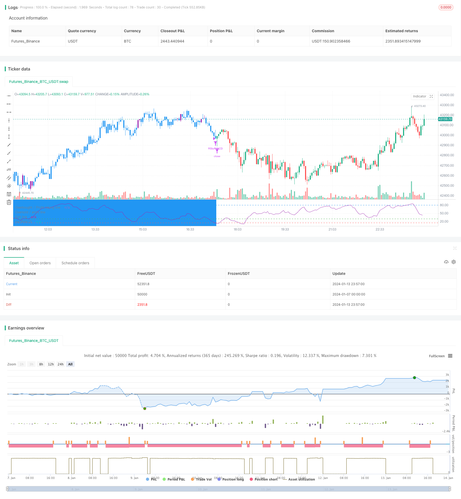

> Name

RSI Reversal Strategy for MACD Indicator RSI-of-MACD-Reversal-Strategy
> Author

ChaoZhang

> Strategy Description


 [trans]
## Overview
This strategy determines buy and sell signals based on the RSI value of the MACD indicator. Buy when the RSI value exceeds the overbought line or oversold range, and stop loss or take profit when the RSI value falls below the oversold range.
## Strategy Principle
This strategy combines the advantages of the MACD indicator and the RSI indicator.
First, calculate the three curves of the MACD indicator, including the DIF line, DEA line and MACD line. Then calculate the RSI indicator on the MACD line to form the RSI of MACD.
When the RSI of MACD indicator exceeds the oversold range of 30 or 35, a buy signal is generated, indicating that the MACD line has entered the oversold zone and the stock price trend has begun to reverse and rise. When the RSI of MACD indicator falls below the oversold range of 15 again, a sell signal is generated, indicating the end of the trend reversal.
This strategy also sets a partial take-profit. When the RSI of MACD indicator exceeds the overbought zone of 80, you can sell part of the position to lock in part of the profit.
## Advantage Analysis
- Use the MACD indicator to determine trend reversal points
- Use RSI indicator to determine overbought and oversold areas to filter false signals
- Combined with dual indicator judgment, accurately find the buying and selling point
- Set up a partial take-profit to prevent losses from expanding
## Risk Analysis
- The MACD indicator parameters are improperly set and the trend cannot be accurately judged.
- The RSI indicator parameters are improperly set and cannot accurately determine overbought and oversold.
- Some take-profit settings are too aggressive and may miss larger gains.
Solution:
- Optimize MACD parameters and find the best parameter combination
- Optimize RSI parameters and improve accuracy
- Appropriately relax some of the profit-taking conditions to pursue greater profits
## Optimization direction
This strategy can also be optimized from the following directions:
1. Add stop-loss strategies to further control downside risks
2. Add a position management module to gradually expand the position as the price moves.
3. Integrate machine learning models and use historical data for training to further improve the accuracy of buying and selling point judgments.
4. Try to run it in a shorter period such as 15 minutes or 5 minutes to further increase the frequency of the strategy.
## Summarize
The overall design of this strategy is clear, and the core idea is to use MACD reversal combined with RSI filtering to determine buying and selling points. Through parameter optimization, stop loss management, risk control and other means, it can be built into a very practical quantitative trading strategy.
||

## Overview

This strategy is based on the RSI values of the MACD indicator to determine buy and sell signals. It buys when the RSI exceeds the overbought line or range, and sells or stops profit/loss when the RSI breaks below the overbought range.

## Strategy Principle  

This strategy combines the advantages of both the MACD and RSI indicators.  

First, the three curves of the MACD indicator are calculated, including the DIF, DEA and MACD lines. Then the RSI indicator is calculated on the MACD line to form the RSI of MACD.  

When the RSI of MACD indicator exceeds the overbought range of 30 or 35, a buy signal is generated, indicating the MACD line has entered the oversold range and the price trend has started to reverse upwards. When the RSI of MACD indicator breaks below the overbought range of 15 again, a sell signal is generated, indicating the trend reversal has ended.

The strategy also sets partial profit taking. When the RSI of MACD indicator exceeds the overbought level of 80, part of the position can be sold to lock in partial profits.

## Advantage Analysis

- Utilize MACD indicator to determine trend reversal points  
- Utilize RSI indicator to determine overbought/oversold levels to filter fake signals
- Combination of dual indicators for accurate buy/sell points
- Partial profit taking set to prevent enlarged losses

## Risk Analysis  

- Inaccurate judgement of trend if improper MACD parameters  
- Inaccurate judgement of overbought/oversold zones if improper RSI parameters
- Potentially missing greater upside if profit taking too aggressive  

Solutions:

- Optimize MACD parameters to find best combination
- Optimize RSI parameters to improve accuracy 
- Relax profit taking criteria properly to target greater returns

## Optimization Directions  

The strategy can also be optimized in the following aspects:

1. Add stop loss strategy to further control downside risks
2. Add position sizing module to gradually ramp up positions as price moves 
3. Integrate machine learning models trained on historical data to further improve buy/sell point accuracy
4. Attempt running on shorter timeframes like 15m or 5m to improve strategy frequency

## Conclusion

The overall strategy design philosophy is clear, with the core idea of using MACD reversal combined with RSI filter to determine buy/sell points. With parameter optimization, stop loss management, risk control measures etc., it can be shaped into a very practical quant trading strategy.

[/trans]

> Strategy Arguments


|Argument|Default|Description|
|----|----|----|
|v_input_1|12|Fast Length|
|v_input_2|21|Slow Length|
|v_input_3|9|Signal Length|
|v_input_4|14|RSI of MACD Length|
|v_input_5|10|Risk % of capital|
|v_input_6|3|Stop Loss|
|v_input_7|false|Take Profit|


> Source (PineScript)

``` pinescript
/*backtest
start: 2024-01-07 00:00:00
end: 2024-01-14 00:00:00
period: 3m
basePeriod: 1m
exchanges: [{"eid":"Futures_Binance","currency":"BTC_USDT"}]
*/

// This source code is subject to the terms of the Mozilla Public License 2.0 at https://mozilla.org/MPL/2.0/
// © mohanee

//@version=4

strategy(title="RSI of MACD Strategy[Long only]",  shorttitle="RSIofMACD" , overlay=false, pyramiding=1,     default_qty_type=strategy.percent_of_equity,  default_qty_value=20, initial_capital=10000, currency=currency.USD)  //default_qty_value=10, default_qty_type=strategy.fixed,

	

/////////////////////////////////////////////////////////////////////////////////


// MACD Inputs ///
fastLen = input(12, title="Fast Length")
slowLen = input(21, title="Slow Length")
sigLen  = input(9, title="Signal Length")

rsiLength  = input(14, title="RSI of MACD Length")


riskCapital = input(title="Risk % of capital", defval=10, minval=1)
stopLoss=input(3,title="Stop Loss",minval=1)

takeProfit=input(false, title="Take Profit")


[macdLine, signalLine, _] = macd(close, fastLen, slowLen, sigLen)

rsiOfMACD = rsi(macdLine, rsiLength)
emaSlow = ema(close, slowLen)


//drawings
/////////////////////////////////////////////////////////////////////////////////


obLevelPlot = hline(80, title="Overbought / Profit taking line",  color=color.blue , linestyle=hline.style_dashed)
osLevelPlot = hline(30, title="Oversold / entry line", color=color.green, linestyle=hline.style_dashed)

exitLinePlot = hline(15, title="Exit line", color=color.red, linestyle=hline.style_dashed)


plot(rsiOfMACD, title = "rsiOfMACD" ,  color=color.purple)


//drawings
/////////////////////////////////////////////////////////////////////////////////


//Strategy Logic 
/////////////////////////////////////////////////////////////////////////////////

//Entry--
//Echeck how many units can be purchased based on risk manage ment and stop loss
qty1 = (strategy.equity  * riskCapital / 100 ) /  (close*stopLoss/100)  

//check if cash is sufficient  to buy qty1  , if capital not available use the available capital only
qty1:= (qty1 * close >= strategy.equity ) ? (strategy.equity / close) : qty1


strategy.entry(id="RSIofMACD", long=true,   qty=qty1,  when =  ( crossover(rsiOfMACD, 30) or crossover(rsiOfMACD, 35)  ) and close>=emaSlow )


bgcolor(abs(strategy.position_size)>=1 ? color.blue : na , transp=70)


barcolor(abs(strategy.position_size)>=1 and  ( crossover(rsiOfMACD, 30) or crossover(rsiOfMACD, 35) ) ? color.purple : abs(strategy.position_size)>=1 ? color.blue : na  )


//partial exit
strategy.close(id="RSIofMACD", comment="PExit Profit is "+tostring(close - strategy.position_avg_price,  "###.##")  ,  qty=strategy.position_size/3, when= takeProfit and abs(strategy.position_size)>=1 and close > strategy.position_avg_price and crossunder(rsiOfMACD,80) )

//Close All
strategy.close(id="RSIofMACD", comment="Close All   Profit is "+tostring(close - strategy.position_avg_price,  "###.##"), when=abs(strategy.position_size)>=1 and crossunder(rsiOfMACD,15) ) //and close > strategy.position_avg_price )


//Strategy Logic 
/////////////////////////////////////////////////////////////////////////////////


```

> Detail

https://www.fmz.com/strategy/438785

> Last Modified

2024-01-15 12:33:14
