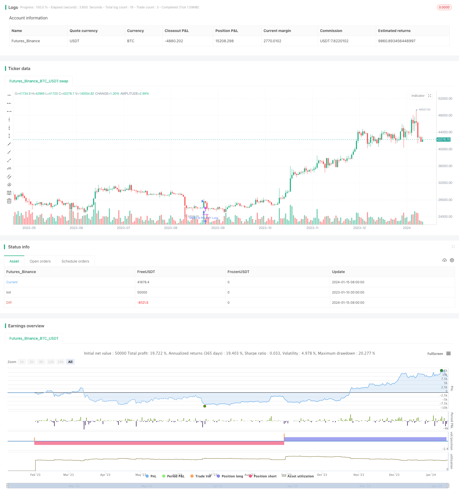

> Name

Quantitative-Trading-Strategy-Integrating-MACD-RSI-and-RVOL
> Author

ChaoZhang

> Strategy Description


 [trans]

This strategy combines the signals of three indicators, Moving Average Convergence Index (MACD), Relative Strength Index (RSI) and Relative Volume (RVOL), to form buy and sell trading signals to discover stock price reversal points and realize automated trading.
### Overview
The three-index cross optimization trading strategy comprehensively takes advantage of the three indicators of MACD, RSI and RVOL to form a stable trading signal. It has strong reliability and stability in timing of entry and exit.
MACD is used to determine price reversal and trend direction. RSI is used to determine overbought and oversold areas. RVOL is used to determine changes in trading volume. The intersection of the three forms a powerful trading signal.
This strategy is suitable for medium and long-term position trading, and can also be used for short-term trading. It can reduce the stop loss probability and enhance the profit probability.
### Strategy Principles
1. MACD judgment
- MACD is the fast moving average minus the slow moving average. When MACD crosses the signal line above, it is a buy signal, and when it crosses below the signal line, it is a sell signal.
2. RSI judgment
- RSI greater than 70 is an overbought zone, and less than 30 is an oversold zone. RSI crossing above 30 is a buy signal, and below 70 is a sell signal.
3. RVOL determination
- RVOL is the current volume divided by the average volume over a period. An RVOL greater than 2 is a signal of high volume. An RVOL less than 5 is a low volume signal.
4. Trading signal generation
- A buy signal is generated when RSI crosses above 30, MACD crosses above the signal line and RVOL is above 2.
- A sell signal is generated when RSI crosses below 70, MACD crosses below the signal line and RVOL falls below 5.
This strategy needs to meet two judgment conditions at the same time to generate a trading signal, which can effectively avoid false signals and enhance stability.
### Advantage Analysis
1. Reduce the probability of false signals
- Two judgment conditions need to be met at the same time to generate a signal, which can filter out some noise, avoid the generation of false signals, and increase the reliability of the signal.
2. Seize the reversal point
- MACD is very sensitive to price reversals, and RSI determines overbought and oversold areas. The combination of the two can capture key price reversal points.
3. Powerful practicality
- This strategy comprehensively considers the three most important judgment indicators, is very practical, and can be widely applied to different market environments.
4. Easy to optimize and upgrade
- The parameters of each part of the strategy can be adjusted independently, and more indicators can be added, which is highly scalable.
5. High degree of automation
- The strategy can be connected to the trading interface with no-code to realize fully automated trading and greatly reduce manual intervention.
### Risk Analysis
1. Risks of parameter optimization
- The parameters of MACD, RSI and RVOL need to be optimized for different market environments, otherwise the results will be affected.
2. Risks of changes in market environment
- The effect may be better in a bull market, but may be compromised in a bear market. The general environment needs to be considered.
3. Transaction frequency risk
- Pursuing high-frequency trading will increase transaction costs and slippage risks. Frequencies need to be balanced.
4. Stop loss risk
- Without setting a stop loss, there is a greater risk of loss. It is necessary to optimize and add a stop loss mechanism.

In order to control risks, it is recommended to add an adaptive stop loss mechanism and optimize parameters to adapt to different market conditions. Test strategy effectiveness in more than one market to increase stability.
### Optimization direction
This strategy can also be optimized from the following aspects:
1. Add a stop loss strategy
- It is recommended to add an adaptive stop-loss strategy and stop the loss when the loss reaches a certain level.
2. Add judgment indicators
- More indicators can be introduced, such as Bollinger Bands, KDJ, etc., to form more stable trading signals.
3. Parameter adaptive optimization
- Implement adaptive optimization of indicator parameters through machine learning and other methods.
4. Industry and market testing
- Test the stability of the strategy in more different industries and markets to ensure its applicability.
5. Strategy combination
- Use it in combination with other stable strategies to find the optimal strategy ratio.

Through stop loss, parameter optimization, indicator optimization and combination optimization, the strategy effect and stability can be further improved.
### Summarize
The three-index cross optimization trading strategy comprehensively considers the signals of the three indicators MACD, RSI and RVOL to form a powerful buy and sell judgment system. It enhances the stability and Profitability of trading signals, can effectively identify price reversal points, is suitable for medium and long-term positions and short-term transactions, and has strong practicality. After adding adaptive stop loss and parameter optimization, the strategy can be made more robust and worthy of recommendation.
||

### Strategy Name: Optimized Trading Strategy with Triple Crossover 

This strategy integrates the signals of Moving Average Convergence Divergence (MACD), Relative Strength Index (RSI) and Relative Volume (RVOL) to form buy and sell trading signals for detecting price reversal points and automated trading.

### Overview

The Optimized Trading Strategy with Triple Crossover takes advantage of MACD, RSI and RVOL to form stable trading signals. It has strong reliability and stability in timing entries and exits.

MACD judges price reversal and trend direction. RSI judges overbought and oversold levels. RVOL judges abnormal trading volume. Their crossover forms powerful trading signals.

The strategy applies to mid-long term position holding and short-term trading. It reduces stop loss probability and improves profitability probability.

### Strategy Principle 

1. MACD Judgment

 - MACD is fast moving average minus slow moving average. MACD crossing above signal line gives buy signal, while crossing below gives sell signal.

2. RSI Judgment

 - RSI above 70 is overbought zone, below 30 is oversold zone. RSI breaking 30 upwards gives buy signal, breaking 70 downwards gives sell signal.  

3. RVOL Judgment

 - RVOL is current volume divided by average volume over a period. RVOL greater than 2 signals high trading volume. RVOL less than 5 signals low trading volume.

4. Trading Signal Generation

 - When RSI breaks 30 upwards, MACD crosses above signal line, and RVOL is higher than 2, it triggers buy signal.

 - When RSI breaks 70 downwards, MACD crosses below signal line, and RVOL is lower than 5, it triggers sell signal.

The strategy requires at least 2 judgment conditions to generate trading signals, which avoids false signals effectively and improves stability.

### Advantage Analysis  

1. Reducing False Signal Probability

 - Requiring at least 2 judgment conditions filters out some noise and avoids false signals, improving signal reliability.  

2. Capturing Reversal Points

 - MACD is sensitive to price reversal. Combining with RSI on overbought/oversold area catches key reversal points precisely.

3. Strong Practicability

 - Comprehensively considering 3 most important indicators, the strategy has extremely strong practicability for varying market environments.

4. Easy to Optimize and Upgrade

 - Each component can adjust parameters separately. More indicators can be added flexibly. 

5. High Level of Automation

 - The strategy can connect trading APIs for fully automated trading, requiring minimal manual intervention.

### Risk Analysis

1. Parameter Optimization Risk

 - MACD, RSI and RVOL parameters need optimization for different market conditions, otherwise it impacts effectiveness.

2. Market Environment Change Risk

 - It may work better in bull market but less effective in bear market. Market regimes matter.

3. Trading Frequency Risk 

 - High trading frequency increases costs and slippage risks. Frequency needs balance. 

4. Stop Loss Risk

 - Without stop loss mechanism, it poses larger loss risks. Stop loss optimization is a must.

To control risks, adaptive stop loss, parameter tuning for varying markets, and testing across markets are recommended to enhance stability. 

### Optimization Directions

The strategy can be further optimized in the following aspects:

1. Adding Stop Loss Strategies

 - An adaptive stop loss strategy is advised to stop losses when they reach certain levels.

2. Increasing Judgment Indicators

 - More indicators like Bollinger Bands and KDJ can be added to form more stable signals.

3. Adaptive Parameter Optimization

 - Indicator parameters can be automatically optimized through machine learning algorithms.

4. Industry and Market Testing

 - Testing stability across more markets and industries to ensure applicability.

5. Strategy Ensemble

 - Ensemble with other stable strategies to find optimal combinations.

With stop loss, parameter optimization, indicator optimization, and ensemble optimization, strategy effectiveness and stability can be further improved.

### Summary

The Optimized Trading Strategy with Triple Crossover comprehensively considers the signals from MACD, RSI, and RVOL to build a robust system for buy/sell judgments. It enhances trading signal stability and profitability to effectively identify price reversal points. Applicable for mid-long term position holding and short-term trading, it demonstrates good practicability. With adaptive stop loss and parameter optimization added, it becomes more robust and outstanding for recommendation.  
[/trans]

> Strategy Arguments


|Argument|Default|Description|
|----|----|----|
|v_input_1|14|length|
|v_input_2|30|overSold|
|v_input_3|70|overBought|
|v_input_4|12|fastLength|
|v_input_5|26|slowlength|
|v_input_6|9|MACDLength|
|v_input_7|14|RVOL Length|


> Source (PineScript)

``` pinescript
/*backtest
start: 2023-01-10 00:00:00
end: 2024-01-16 00:00:00
period: 1d
basePeriod: 1h
exchanges: [{"eid":"Futures_Binance","currency":"BTC_USDT"}]
*/

// This source code is subject to the terms of the Mozilla Public License 2.0 at https://mozilla.org/MPL/2.0/
// © BobBarker42069

//@version=4
strategy("MACD, RSI, & RVOL Strategy", overlay=true)

length = input( 14 )
overSold = input( 30 )
overBought = input( 70 )
price = close
vrsi = rsi(price, length)
co = crossover(vrsi, overSold)
cu = crossunder(vrsi, overBought)
fastLength = input(12)
slowlength = input(26)
MACDLength = input(9)
MACD = ema(close, fastLength) - ema(close, slowlength)
aMACD = ema(MACD, MACDLength)
delta = MACD - aMACD

RVOLlen = input(14, minval=1, title="RVOL Length")
av = sma(volume, RVOLlen)
RVOL = volume / av


if (not na(vrsi)) 
	if ((co and crossover(delta, 0)) or (co and crossover(RVOL, 2)) or (crossover(delta, 0) and crossover(RVOL, 2)))
		strategy.entry("MACD & RSI BUY Long", strategy.long, comment="BUY LONG")

		
	if ((cu and crossunder(delta, 0)) or (cu and crossunder(RVOL, 5)) or (crossunder(delta, 0) and crossunder(RVOL, 5)))
		strategy.entry("MACD & RSI SELL Short", strategy.short, comment="SELL LONG")
	
		
//plot(strategy.equity, title="equity", color=color.red, linewidth=2, style=plot.style_areabr)
```

> Detail

https://www.fmz.com/strategy/439081

> Last Modified

2024-01-17 15:50:35
