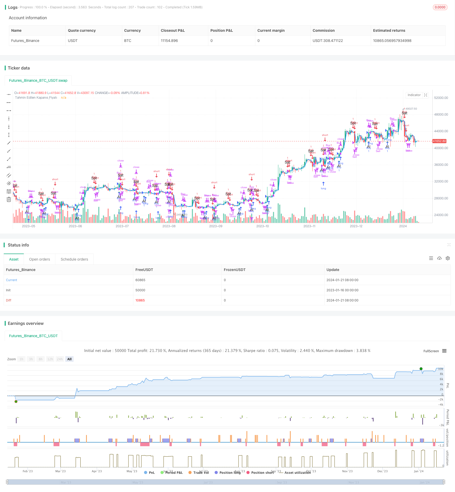

> Name

Trend-Following-Trading-Strategy-Based-on-MACD-and-RSI
> Author

ChaoZhang

> Strategy Description


 [trans]
## Overview
This strategy implements trend following trading by calculating MACD and RSI indicators, combined with trend and overbought and oversold filters. This strategy is suitable for medium and long-term trading. It can effectively filter out false breakthroughs, confirm the trend direction, establish a position in the early stage of trend development, and then use methods such as trailing stop loss to lock in profits.
## Principle
This strategy is mainly based on two indicators, MACD and RSI, to generate trading signals.
MACD is the moving average difference indicator, which consists of the difference value (DIF), the signal line (DEA) and the divergence column. In this strategy, DIFF is the difference between the 5-day exponential moving average and the 13-day exponential moving average, and DEA is the 5-day exponential moving average of DIFF. A buy signal is generated when DIFF crosses above DEA, and a sell signal is generated when it crosses below.
RSI refers to the Relative Strength Index, which determines whether the market is overbought or oversold by comparing the average number of days with rising closing prices to the average number of days with falling closing prices over a period of time. In this strategy, the RSI period is set to 14. When the RSI is greater than 70, it is an overbought zone, and when it is less than 30, it is an oversold zone.
Combining MACD trading signals and RSI filter signals, when MACD generates a buy signal but RSI does not enter the overbought zone, go long; when MACD generates a sell signal but RSI does not enter the oversold zone, go short.
In addition, this strategy will also determine whether the current K line is different from the previous K line in color. If they are the same, the trading signal will be skipped. This design is mainly to filter out false breakthroughs.
After entering the market, the strategy will determine whether the closing price of the next K line is higher/lower than the opening price. If the conditions are met, it proves that the trend has been verified, and the position will be closed at this time to take profit.
## Advantages
- Using MACD trading signals and RSI filtering, you can effectively locate the development direction of the trend and avoid unnecessary losses caused by false breakthroughs
- Trailing stop-loss design locks in profits and avoids losses to the account due to withdrawals
- Combined with trend indicators and overbought and oversold indicators, it realizes trend tracking and hedging against the market.
## Risks and Solutions
This strategy mainly involves the following risks:
1. MACD trading signals may generate more noise, leading to too frequent trading. The solution is to appropriately adjust the parameters of MACD and smooth the curve.
2. Improper RSI filter settings may result in missed trading opportunities. The solution is to test more appropriate RSI parameters.
3. Improper setting of trailing stop may result in premature stop loss or too large stop loss range. The solution is to adjust your stop loss based on market volatility and personal risk appetite.
4. Severe price fluctuations in the short term may result in huge losses. The solution is to use options or other financial instruments for hedging.
## Optimization direction
This strategy can be optimized from the following aspects:
1. Optimize MACD parameters, smooth MACD curve, and reduce noise signals
2. Optimize or improve the RSI filter and improve the FILTER effect
3. Try other indicators to confirm signals, such as KD, Bollinger Bands, etc.
4. Optimize the stop loss strategy and implement dynamic tracking stop loss
5. Use machine learning and other methods to optimize parameters
6. Combine stock index futures, options and other tools for hedging
## Summary
This strategy comprehensively uses the MACD indicator and RSI indicator to achieve trend judgment, overbought and oversold filtering and stop loss tracking, which can effectively control trading risks. This strategy has a large space for optimization, and it is expected to achieve better trading results through parameter adjustment, introduction of new indicators and other means.
||

## Overview
This strategy calculates the MACD and RSI indicators to identify trend directions and overbought/oversold situations for trend following trading. It is suitable for medium-to-long term trading, filtering out false breakouts effectively and establishing positions at early trend development, locking in profits later with trailing stop loss.  

## Principles 
The strategy mainly utilizes the MACD and RSI indicators to generate trading signals.

MACD stands for Moving Average Convergence Divergence. It consists of the DIFF line, DEA line and histogram. In this strategy, DIFF is the difference between 5-day EMA and 13-day EMA of the closing price, while DEA is the 5-day EMA of DIFF. The buy and sell signals are generated when DIFF crosses above and below DEA respectively.  

RSI stands for Relative Strength Index. It reflects overbought/oversold situations by comparing the average gains and losses over a period. This strategy sets the RSI period as 14. RSI above 70 suggests overbought conditions while below 30 oversold.

By combining the MACD trading signals and RSI filters, the strategy goes long when MACD gives buy signals and RSI is not overbought. It goes short when MACD sells and RSI not oversold.

In addition, the strategy checks if the current bar's color differs from the previous one, skipping the signal if same color to avoid false breakout. 

After entry, the strategy anticipates the next bar's closing price to be higher/lower than open price to validate the trend, closing position for profit if the condition is met.

## Strengths
- MACD signals and RSI filters effectively locate trend direction, avoiding unnecessary losses from false breakouts
- The trailing stop loss design locks in profits, preventing pullbacks from erasing gains  
- The integration of trending and oscillating indicators realizes both trend following and reversal prevention

## Risks & Solutions
The main risks of this strategy include:

1. MACD may generate excessive noise and lead to over-trading. Solution: Optimize MACD parameters to smooth the curve.  

2. Improper RSI filter settings may cause missing trades. Solution: Test more appropriate RSI periods.

3. Improper stop loss placement may stop out prematurely or too loosely. Solution: Adjust based on market volatility and personal risk preference.  

4. Extreme price swings may result in huge losses in short term. Solution: Hedge with options or other instruments.

## Optimization Directions 
The strategy can be improved in the following aspects:

1. Optimize MACD parameters to reduce noisy signals

2. Enhance RSI filter for better effectiveness 

3. Test other confirming indicators like KD, Bollinger Bands etc

4. Implement dynamic trailing stop loss

5. Utilize machine learning for parameter optimization

6. Incorporate stock index futures, options for hedging

## Conclusion
This strategy combines MACD and RSI for trend identification, overbought/oversold filtering and trailing stop loss, effectively controlling trading risks. Much room remains for improving performance by parameter tuning, new indicator adoption etc.

[/trans]


> Source (PineScript)

``` pinescript
/*backtest
start: 2023-01-16 00:00:00
end: 2024-01-22 00:00:00
period: 1d
basePeriod: 1h
exchanges: [{"eid":"Futures_Binance","currency":"BTC_USDT"}]
*/

//@version=5
strategy("Al-Sat Sinyali ve Teyidi", overlay=true)

// MACD (Hareketli Ortalama Yakınsaklık Sapma)
[macdLine, signalLine, _] = ta.macd(close, 5, 13, 5)

// RSI (Göreceli Güç Endeksi)
rsiValue = ta.rsi(close, 14)

// RSI Filtresi
rsiOverbought = rsiValue > 70
rsiOversold = rsiValue < 30

// MACD Sinyalleri
buySignalMACD = ta.crossover(macdLine, signalLine) and not rsiOverbought
sellSignalMACD = ta.crossunder(macdLine, signalLine) and not rsiOversold

// Al-Sat Stratejisi
if (buySignalMACD and close[1] != close) // Al sinyali ve bir önceki mumdan farklı renkte ise
    strategy.entry("Buy", strategy.long)

if (sellSignalMACD and close[1] != close) // Sat sinyali ve bir önceki mumdan farklı renkte ise
    strategy.entry("Sell", strategy.short)

// Teyit için bir sonraki mumu bekleme
strategy.close("Buy", when=ta.crossover(close, open))
strategy.close("Sell", when=ta.crossunder(close, open))

// Varsayımsal bir sonraki mumun kapanış fiyatını hesapla
nextBarClose = close[1]
plot(nextBarClose, color=color.blue, linewidth=2, title="Tahmin Edilen Kapanış Fiyatı")

// Görselleştirmeyi devre dışı bırakma
plot(na)

// Al-Sat Etiketleri
plotshape(series=buySignalMACD, title="Al Sinyali", color=color.green, style=shape.triangleup, location=location.belowbar, size=size.small, text="Al")
plotshape(series=sellSignalMACD, title="Sat Sinyali", color=color.red, style=shape.triangledown, location=location.abovebar, size=size.small, text="Sat")

```

> Detail

https://www.fmz.com/strategy/439717

> Last Modified

2024-01-23 12:03:23
