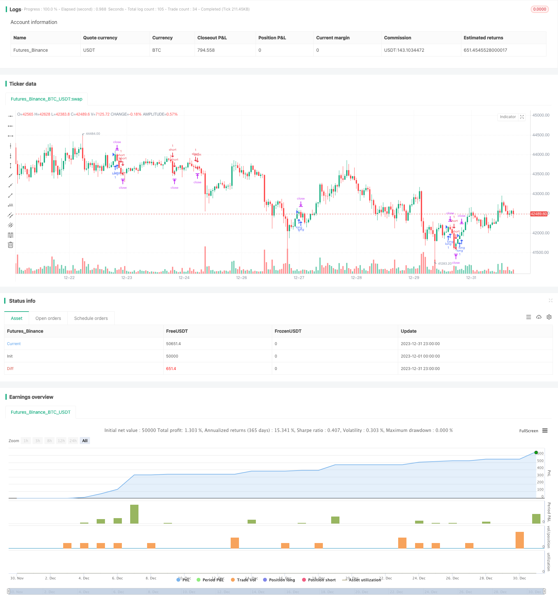

> Name

Time-and-Space-Optimized-Multi-Timeframe-MACD-Strategy
> Author

ChaoZhang

> Strategy Description


 [trans]
### Overview
This strategy achieves a high winning rate exchange rate trading strategy by optimizing the parameters of the MACD indicator, combining moving averages, price actions and specific trading times.
### Strategy Principles
1. Use 3 K lines to determine the price trend. If the closing prices of the last three K lines are all higher than the opening price, it is judged to be an upward trend; if the closing prices of the last three K lines are lower than the opening price, it is judged to be a down trend.
2. Calculate the difference between fast line, slow line and MACD. The fast line parameter is 12, the slow line parameter is 26, and the signal line parameter is 9.
3. The trading time is set to 09:00-09:15 every day. During this time period, you will enter the market if the following conditions are met:
    - Go long when the MACD difference crosses 0 during an uptrend
    - Go short when the MACD difference crosses below 0 in a downtrend
4. The take profit is set to 0.3 points and the stop loss is set to 100 points.
5. All positions will be closed during the 21:00-21:15 time period.
### Strategic Advantages
1. Use a combination of multiple time frame indicators to comprehensively judge the trend direction and improve decision-making accuracy.
2. Optimize the trading time period to avoid times of severe market fluctuations and reduce unnecessary stop loss risks.
3. Set a reasonable take-profit and stop-loss ratio to lock in profits to the greatest extent and avoid losses from expanding.
4. Overall, the strategy has a high winning rate and is suitable for short-term frequent trading.
### Strategy Risk
1. The trading time of the strategy is relatively fixed. If you cannot enter the market in time, you may miss the trading opportunity.
2. The MACD indicator can easily produce misleading signals. If you cannot determine a clear upward or downward trend, you should operate with caution.
3. The unreasonable setting of stop-profit and stop-loss points may cause an imbalance in the profit and loss ratio, and parameters need to be adjusted according to different varieties.
4. Overall, the strategic risk is small. However, in the case of high leverage, excessive positions will also cause large losses.
### Strategy optimization direction
1. It can be combined with other indicators to determine the trend and avoid MACD from generating false signals. For example, it can be used in combination with Bollinger Bands, RSI and other indicators.
2. You can optimize the ratio of take profit and stop loss, and calculate the optimal parameters through backtest data.
3. You can expand the trading varieties to which the strategy is applicable and evaluate the parameter adjustment effects of different varieties.
4. Machine learning algorithms can be introduced to select optimal parameters according to different market conditions and achieve dynamic adjustments.
### Summarize
Generally speaking, this strategy is very suitable for junior traders. The strategy has clear ideas, large room for parameter optimization, and controllable risks. By customizing the opening time and reasonably setting the profit and loss ratio, a higher profit rate can be obtained. It can be further optimized in the future to dynamically adjust the strategy parameters to adapt to more complex market environments.
||

### Overview

This strategy optimizes the parameters of the MACD indicator, combines with moving average, price action and specific trading times to achieve a high win rate forex trading strategy.

### Strategy Logic

1. Use 3 K-lines to judge the price trend. If the closing prices of the last 3 K-lines are higher than the opening prices, it is judged as an upward trend; if the closing prices of the last 3 K-lines are lower than the opening prices, it is judged as a downward trend.

2. Calculate fast line, slow line and MACD difference. The fast line parameter is 12, the slow line parameter is 26, and the signal line parameter is 9.  

3. The trading time is set to 09:00-09:15 every day. Within this time period, enter the market if the following conditions are met:
    - Go long when the uptrend coincides with the MACD difference crossing above 0
    - Go short when the downtrend coincides with the MACD difference crossing below 0

4. The take profit is set to 0.3 pips, and the stop loss is set to 100 pips.  

5. Close all positions during 21:00-21:15.

### Advantages of the Strategy

1. Using a combination of multi timeframe indicators to comprehensively judge the trend direction and improve decision accuracy.

2. Optimize trading time to avoid periods of high market volatility, reducing unnecessary stop loss risk.  

3. Set reasonable ratios for take profit and stop loss to maximize profit locking and avoid loss magnification.

4. Overall, the strategy has a very high win rate and is suitable for frequent short-term trading.

### Risks of the Strategy

1. The trading time is relatively fixed, may miss trading opportunities if unable to enter the market in time.

2. MACD indicator is prone to misleading signals. Trade cautiously if clear uptrend or downtrend cannot be determined. 

3. Take profit and stop loss may be set unreasonably, resulting in profit loss imbalance. Parameters need to be adjusted according to different products. 

4. Overall risk is small. But excessively large positions under high leverage can still lead to huge losses.

### Directions for Strategy Optimization 

1. Combine with other indicators to determine the trend, avoiding misleading signals from the MACD. For example, combine Bollinger Bands, RSI etc.

2. Optimize take profit/stop loss ratios by calculating optimal parameters from backtest data.

3. Expand the trading varieties applicable to the strategy, evaluate parameter tuning effects on different products.  

4. Introduce machine learning algorithms to select optimal parameters dynamically based on varying market conditions.

### Conclusion

Overall this strategy is well suited for novice traders. The logic is clear, optimization space is large, and risks are controllable. By customizing opening times and setting reasonable profit loss ratios, high returns can be achieved. Further optimizations can be made to dynamically adjust parameters and adapt to more complex market environments.

[/trans]

> Strategy Arguments


|Argument|Default|Description|
|----|----|----|
|v_input_1_close|0|Source: close|high|low|open|hl2|hlc3|hlcc4|ohlc4|
|v_input_2|true|From Day|
|v_input_3|true|From Month|
|v_input_4|2000|From Year|
|v_input_5|31|To Day|
|v_input_6|12|To Month|
|v_input_7|2021|To Year|
|v_input_8|0.0003|tp|
|v_input_9|true|sl|


> Source (PineScript)

``` pinescript
/*backtest
start: 2023-12-01 00:00:00
end: 2023-12-31 23:59:59
period: 1h
basePeriod: 15m
exchanges: [{"eid":"Futures_Binance","currency":"BTC_USDT"}]
*/

// This source code is subject to the terms of the Mozilla Public License 2.0 at https://mozilla.org/MPL/2.0/
// © exlux99

//@version=4
strategy("Very high win rate strategy", overlay=true)


//

fast_length =12
slow_length= 26
src = close
signal_length = 9
sma_source = false
sma_signal = false

// Calculating
fast_ma = sma_source ? sma(src, fast_length) : ema(src, fast_length)
slow_ma = sma_source ? sma(src, slow_length) : ema(src, slow_length)
macd = fast_ma - slow_ma
signal = sma_signal ? sma(macd, signal_length) : ema(macd, signal_length)
hist = macd - signal

//ma

len=10
srca = input(close, title="Source")
out = hma(srca, len)

fromDay = input(defval = 1, title = "From Day", minval = 1, maxval = 31)
fromMonth = input(defval = 1, title = "From Month", minval = 1, maxval = 12)
fromYear = input(defval = 2000, title = "From Year", minval = 1970)
 //monday and session 
// To Date Inputs
toDay = input(defval = 31, title = "To Day", minval = 1, maxval = 31)
toMonth = input(defval = 12, title = "To Month", minval = 1, maxval = 12)
toYear = input(defval = 2021, title = "To Year", minval = 1970)

startDate = timestamp(fromYear, fromMonth, fromDay, 00, 00)
finishDate = timestamp(toYear, toMonth, toDay, 00, 00)
time_cond = true


timeinrange(res, sess) => time(res, sess) != 0

// = input('0900-0915', type=input.session, title="My Defined Hours")
myspecifictradingtimes = '0900-0915'
exittime = '2100-2115'

optionmacd=true


entrytime = time(timeframe.period, myspecifictradingtimes) != 0
exit = time(timeframe.period, exittime) != 0     

if(time_cond and optionmacd )
    if(close > open and close[1] > open[1] and close[2] > open[2] and entrytime  and crossover(hist,0))
        strategy.entry("long",1)
    if(close< open and close[1] < open[1] and close[2] < open[2] and entrytime and crossunder(hist,0))
        strategy.entry("short",0)      


tp = input(0.0003, title="tp")
//tp = 0.0003
sl = input(1.0 , title="sl")
//sl = 1.0
strategy.exit("closelong", "long" , profit = close * tp / syminfo.mintick, loss = close * sl / syminfo.mintick, alert_message = "closelong")
strategy.exit("closeshort", "short" , profit = close * tp / syminfo.mintick, loss = close * sl / syminfo.mintick, alert_message = "closeshort")

```

> Detail

https://www.fmz.com/strategy/440299

> Last Modified

2024-01-29 10:15:34
