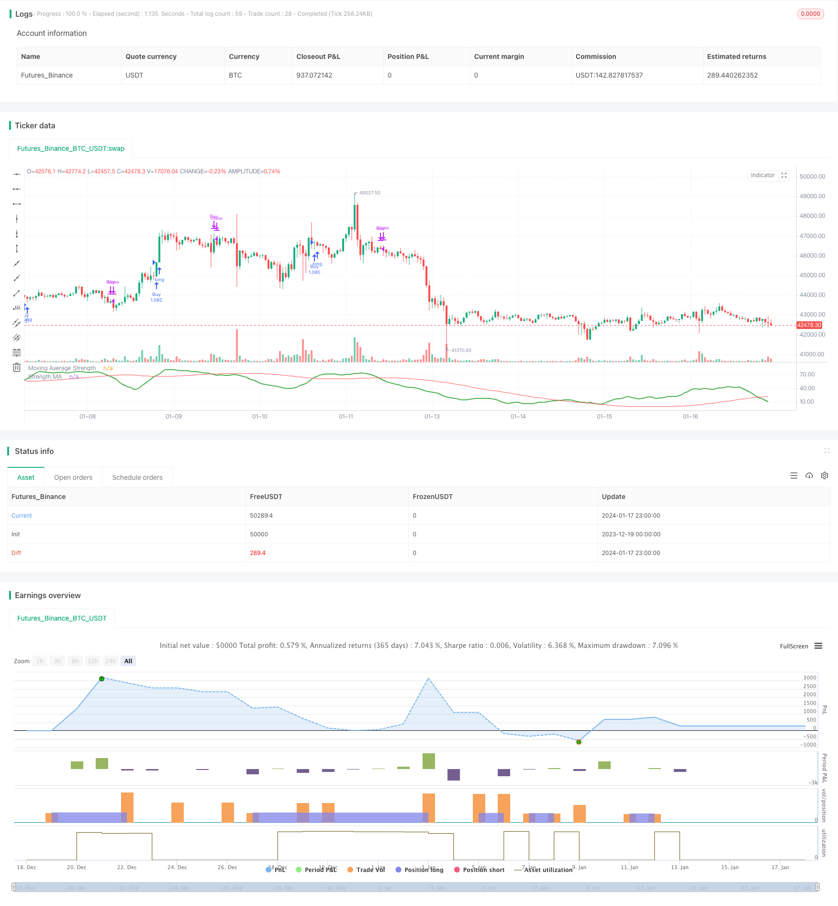

> Name

Quantitative-Strategy-of-MA-Strength-Trend-TrackingQuantitative-Strategy-of-MA-Strength-Trend-Tracking
> Author

ChaoZhang

> Strategy Description


 [trans]

## Overview
This strategy calculates the strength of the moving average (MA) in multiple time periods, evaluates the strength of the market trend, and realizes the judgment and tracking of the trend. When the short-term MA indicator continues to rise, a high score is recorded, forming the "MA Strength" indicator. When the indicator crosses its own long-term MA, a buy signal is generated. The strategy can be configured with long-term and short-term MA combinations to track trends in different cycles.
## Strategy Principle
1. Calculate multiple sets of MAs such as the 5th, 10th, and 20th to determine whether the price breaks through each MA upward. Breakthroughs are scored, and the points form "MA strength".  
2. Apply the moving average to the "MA Strength" to form a moving average indicator, judge whether the moving average is long or short, and generate trading signals.  
3. Configurable tracking cycle parameters: number of short-term MA groups, long-term moving average cycle, opening conditions, etc.
This strategy mainly determines the long and short position of the moving average indicator, and reflects the average strength of the MA line group through the moving average indicator. The MA line group focuses on judging the direction and strength of the trend, and the moving average indicator judges the continuity.
## Advantage Analysis
1. Multidimensional model for assessing trend strength. A single MA line cannot determine that the strength is sufficient; this strategy measures multiple MA breakthroughs to ensure that the strength is sufficient before sending a signal, which is highly reliable.  
2. Configurable tracking period. Adjusting short-term MA parameters can capture trends at different levels; adjusting long-term MA parameters can control the rhythm of exits. Users can adjust the cycle according to the market.   
3. Only go long to avoid false trades and track the long-term upward trend. The strategy is only long, and only chases the rise but not the fall, which can reduce reversal losses.
## Risk Analysis
1. There is a risk of retracement. When the short-term moving average crosses below the long-term moving average, there is a greater risk of retracement. Stop loss can be used to reduce single losses.  
2. There is a risk of reversal. There will inevitably be adjustments in the long-term operation of the market, and strategies must stop losses in time. It is recommended to combine band, channel and other technologies to determine the end of the major cycle and control the risk of reversal.  
3. Parameter risk. Improper parameter configuration may result in incorrect signals. Parameters should be adjusted to suit different varieties to ensure parameter stability.
## Optimization direction
1. Combine with more indicators to filter entry. You can consider combining trading volume and sending signals under volume verification to avoid false breakthroughs. 
2. Add stop loss method. Trailing stop loss and curve stop loss can reduce losses during callbacks. Take-profit methods can also be considered to lock in profits and avoid reversals.  
3. Consider allocating futures and foreign exchange varieties. MA line breakthroughs are more suitable for trending varieties. It can evaluate the parameter stability of different futures varieties and select the best varieties.
## Summarize
This strategy determines the price trend by calculating the MA strength indicator, and uses the moving average crossover as the signal source for trend tracking. The advantage of the strategy is to accurately judge the strength of the trend and have high reliability. The main risks lie in trend reversals and parameter adjustments. By optimizing the accuracy of entry signals, adding stop loss methods, and selecting appropriate varieties, you can obtain better returns.
||

## Overview  

This strategy evaluates the strength of market trends by calculating the strength of moving averages (MA) across different timeframes, and tracks trends accordingly. When short-term MAs consecutively rally upwards, they score higher and form a “MA Strength” indicator. When this indicator crosses over its own long-term MA, buy signals are generated. The strategy allows users to configure MA combinations across short and long terms to track trends over customized cycles.

## Strategy Logic   

1. Calculate the 5-day, 10-day, 20-day MAs etc. Judge if prices break above each MA, breakouts score points which accumulate into a “MA Strength” indicator.   
2. Apply moving average on the “MA Strength”, forming a MA indicator to determine long/short signals.
3. Users can configure cycle parameters like: short-term MA combination, long-term MA period, entry conditions etc.  

The core of this strategy is to determine the long/short condition of the MA indicator, which reflects the average strength of the MA combination. The MA combination comprehensively judges the trend, while the MA indicator determines persistence.  

## Advantage Analysis

1. Multi-dimensional model to evaluate trend strength. A single MA line cannot determine sufficient strength; this strategy measures multi-MA breakouts to ensure strength before signaling, ensuring reliability.   
2. Customizable cycle tracking. Adjusting short-term MA parameters can capture trends across different levels; adjusting long-term MA parameters controls exit pace. Users can configure cycles based on market conditions.  
3. Long only avoids wrong kills and tracks persistent uptrends. By only going long instead of shorting, losses from trend reversals can be avoided.  

## Risk Analysis  

1. Retracement risks exist when short-term MA crosses below long-term MA, which can be large losses. Stop loss methods should be used to limit losses.
2. Reversal risks are inevitable in long-term trends, requiring timely stop loss exiting. It is recommended to judge cycle highs using techniques like channels to control reversal risks.   
3. Parameter risk. Improper parameter tuning can lead to wrong signals. Parameters should be optimized and stabilized for different products.  

## Optimization Directions  

1. Additional filter signals with more indicators. Volume can be used to avoid false breakouts by only signaling on volume confirmation.  
2. Add stop loss methods. Moving stop loss, curve stop loss can reduce retracement losses. Consider take profit methods to lock in profits and avoid reversals.
3. Consider futures and forex products. MA breakouts better suit trending products. Evaluate parameter stability across products to select the optimal.  

## Conclusion  

This strategy judges price trends by calculating a MA strength indicator and uses MA crosses as signal source to track trends. Its advantage lies in accurately determining trend strength for reliability. Main risks come from trend reversals and parameter tuning. By optimizing signal accuracy, adding stop losses, selecting suitable products, good returns can be obtained.

[/trans]

> Strategy Arguments


|Argument|Default|Description|
|----|----|----|
|v_input_1|0|Moving Average Type: ema|sma|hma|rma|vwma|wma|
|v_input_2|10|LookbackPeriod|
|v_input_3|0|Moving Average Type: hma|sma|ema|rma|vwma|wma|
|v_input_4|200|IndexMAPeriod|
|v_input_5|true|considerTrendDirection|
|v_input_6|true|considerTrendDirectionForExit|
|v_input_7|true|offset|
|v_input_8|0|Trade Direction: strategy.direction.long|strategy.direction.all|strategy.direction.short|
|v_input_9|timestamp(01 Jan 2010 00:00 +0000)|Start Time|
|v_input_10|timestamp(01 Jan 2099 00:00 +0000)|End Time|


> Source (PineScript)

``` pinescript
/*backtest
start: 2023-12-19 00:00:00
end: 2024-01-18 00:00:00
period: 1h
basePeriod: 15m
exchanges: [{"eid":"Futures_Binance","currency":"BTC_USDT"}]
*/

// This source code is subject to the terms of the Mozilla Public License 2.0 at https://mozilla.org/MPL/2.0/
// © HeWhoMustNotBeNamed

//@version=4
strategy("MA Strength Strategy", overlay=false, initial_capital = 20000, default_qty_type = strategy.percent_of_equity, default_qty_value = 100, commission_type = strategy.commission.percent, pyramiding = 1, commission_value = 0.01)
MAType = input(title="Moving Average Type", defval="ema", options=["ema", "sma", "hma", "rma", "vwma", "wma"])
LookbackPeriod = input(10, step=10)

IndexMAType = input(title="Moving Average Type", defval="hma", options=["ema", "sma", "hma", "rma", "vwma", "wma"])
IndexMAPeriod = input(200, step=10)

considerTrendDirection = input(true)
considerTrendDirectionForExit = input(true)
offset = input(1, step=1)
tradeDirection = input(title="Trade Direction", defval=strategy.direction.long, options=[strategy.direction.all, strategy.direction.long, strategy.direction.short])
i_startTime = input(defval = timestamp("01 Jan 2010 00:00 +0000"), title = "Start Time", type = input.time)
i_endTime = input(defval = timestamp("01 Jan 2099 00:00 +0000"), title = "End Time", type = input.time)
inDateRange = true

f_getMovingAverage(source, MAType, length)=>
    ma = sma(source, length)
    if(MAType == "ema")
        ma := ema(source,length)
    if(MAType == "hma")
        ma := hma(source,length)
    if(MAType == "rma")
        ma := rma(source,length)
    if(MAType == "vwma")
        ma := vwma(source,length)
    if(MAType == "wma")
        ma := wma(source,length)
    ma
    

f_getMaAlignment(MAType, includePartiallyAligned)=>
    ma5 = f_getMovingAverage(close,MAType,5)
    ma10 = f_getMovingAverage(close,MAType,10)
    ma20 = f_getMovingAverage(close,MAType,20)
    ma30 = f_getMovingAverage(close,MAType,30)
    ma50 = f_getMovingAverage(close,MAType,50)
    ma100 = f_getMovingAverage(close,MAType,100)
    ma200 = f_getMovingAverage(close,MAType,200)

    upwardScore = 0.0
    upwardScore := close > ma5? upwardScore+1.10:upwardScore
    upwardScore := ma5 > ma10? upwardScore+1.10:upwardScore
    upwardScore := ma10 > ma20? upwardScore+1.10:upwardScore
    upwardScore := ma20 > ma30? upwardScore+1.10:upwardScore
    upwardScore := ma30 > ma50? upwardScore+1.15:upwardScore
    upwardScore := ma50 > ma100? upwardScore+1.20:upwardScore
    upwardScore := ma100 > ma200? upwardScore+1.25:upwardScore
    
    upwards = close > ma5 and ma5 > ma10 and ma10 > ma20 and ma20 > ma30 and ma30 > ma50 and ma50 > ma100 and ma100 > ma200
    downwards = close < ma5 and ma5 < ma10 and ma10 < ma20 and ma20 < ma30 and ma30 < ma50 and ma50 < ma100 and ma100 < ma200
    trendStrength = upwards?1:downwards?-1:includePartiallyAligned ? (upwardScore > 6? 0.5: upwardScore < 2?-0.5:upwardScore>4?0.25:-0.25) : 0
    [trendStrength, upwardScore]
    
includePartiallyAligned = true
[trendStrength, upwardScore] = f_getMaAlignment(MAType, includePartiallyAligned)

upwardSum = sum(upwardScore, LookbackPeriod)

indexSma = f_getMovingAverage(upwardSum,IndexMAType,IndexMAPeriod)

plot(upwardSum, title="Moving Average Strength", color=color.green, linewidth=2, style=plot.style_linebr)
plot(indexSma, title="Strength MA", color=color.red, linewidth=1, style=plot.style_linebr)
buyCondition = crossover(upwardSum,indexSma) and (upwardSum > upwardSum[offset] or not considerTrendDirection) 
sellCondition = crossunder(upwardSum,indexSma) and (upwardSum < upwardSum[offset]  or not considerTrendDirection)

exitBuyCondition = crossunder(upwardSum,indexSma)
exitSellCondition = crossover(upwardSum,indexSma) 
strategy.risk.allow_entry_in(tradeDirection)
strategy.entry("Buy", strategy.long, when= inDateRange and buyCondition, oca_name="oca_buy")
strategy.close("Buy", when = considerTrendDirectionForExit? sellCondition : exitBuyCondition)
strategy.entry("Sell", strategy.short, when= inDateRange and sellCondition, oca_name="oca_sell")
strategy.close( "Sell", when = considerTrendDirectionForExit? buyCondition : exitSellCondition)

```

> Detail

https://www.fmz.com/strategy/439373

> Last Modified

2024-01-19 16:50:13
