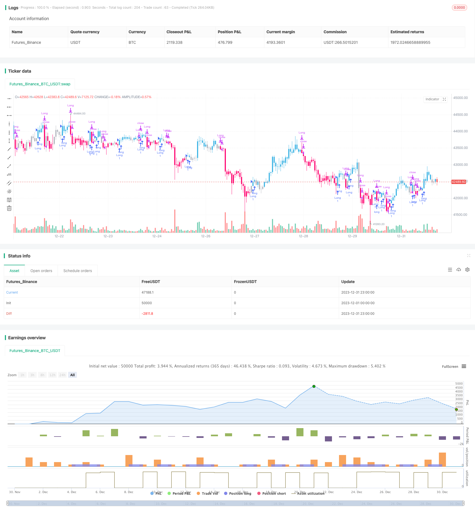

> Name

True-Relative-Movement-Moving-Average-Strategy
> Author

ChaoZhang

> Strategy Description


 [trans]
## Overview
The True Relative Movement Moving Average (TRMA) strategy is a trend following strategy that combines the Relative Strength Index (RSI) and the True Strength Index (TSI). It uses the RSI and TSI indicators for buy and sell signals, supplemented by moving averages for strategy optimization.
## Strategy Principle
The strategy is mainly divided into the following parts:
1. TSI calculation
The TSI indicator is obtained by calculating the exponential smoothing value of the price change rate through double exponential smoothing, and then dividing it by the exponential smoothing value of the absolute value of the price change rate. Among them, the long-term is 25 days, the short-term is 5 days, and the signal line is 14 days.
2. RSI calculation
Use the closing price as the price input and the RSI indicator with a length of 5.
3. Signal judgment
A buy signal occurs when the TSI crosses above its signal line and the RSI crosses above 50. A sell signal occurs when the TSI crosses below its signal line and the RSI crosses below 50.
4. K line color
Color the K-line according to signal judgment to assist judgment.
5. Strategy parameters
Set parameters such as position ratio and funds.
## Advantage Analysis
This strategy combines two indicators, TSI and RSI, to effectively determine market trends and overbought and oversold conditions, thereby generating trading signals. Compared with using TSI or RSI alone, more false signals can be filtered out. In addition, compared with the default parameters, this strategy uses more aggressive TSI and RSI parameter settings to obtain earlier and high-quality trading signals.
## Risk Analysis
This strategy mainly involves the following risks:
1. Parameter optimization risks. Under different markets, different varieties, and different cycles, the optimal parameters of TSI and RSI may be different and need to be optimized according to specific circumstances.
2. Trend reversal risk. The strategy itself focuses on trends. Once an emergency occurs that causes short-term adjustments or medium- and long-term trend reversals, the strategy will face greater losses.
3. Risk of frequent signals. Compared with the default parameters, this strategy uses more aggressive parameter settings, which may produce more frequent trading signals, resulting in higher transaction costs and implementation difficulty.
## Optimization direction
This strategy can be optimized from the following aspects:
1. Combine with indicators such as moving averages to further filter signals to reduce the problem of frequent trading.
2. Test the optimal combination of TSI and RSI parameters under different markets and varieties to find the best parameter settings.
3. Add a stop loss strategy to control the risk of single loss.
4. Optimize position management, increase positions when the trend is strong, and reduce positions when the trend weakens.
## Summarize
The TRMMA strategy combines TSI and RSI indicators to determine the timing of buying and selling, and has a strong ability to capture trends. Compared with using TSI or RSI alone, it can effectively filter out false signals. The stability of the strategy can be further enhanced through parameter optimization, stop loss strategies, position management, etc. This strategy is suitable for investors who have a certain quantitative foundation and pursue high returns.
||

## Overview

The True Relative Movement Moving Average (TRMMA) strategy is a trend-following strategy that combines the Relative Strength Index (RSI) and True Strength Index (TSI). It uses the indicators of RSI and TSI to generate buy and sell signals, with moving averages for strategy optimization.  

## Principles  

The strategy consists of the following main parts:

1. TSI Calculation
Calculate the exponential smoothed value of the rate of price changes through double exponential smoothing, then divide it by the exponential smoothed value of the absolute rate of price changes to obtain the TSI indicator. The long term is 25 days, the short term is 5 days, and the signal line is 14 days.

2. RSI Calculation
RSI indicator with close price as input and length of 5 days.  

3. Signal Judgment 
A buy signal is generated when TSI crosses above its signal line and RSI crosses above 50. A sell signal is generated when TSI crosses below its signal line and RSI crosses below 50.

4. Candlestick Coloring
Color the candlesticks based on signals to assist judgment.  

5. Strategy Parameters
Set parameters like position ratio and capital.

## Advantage Analysis   

The strategy combines the TSI and RSI indicators to effectively judge market trends and overbought/oversold situations, thus generating trading signals. Compared with using TSI or RSI alone, it can filter out more false signals. In addition, compared with the default parameters, this strategy adopts a more aggressive setting of TSI and RSI parameters to obtain earlier and higher quality trading signals.

## Risk Analysis

The main risks of this strategy include:  

1. Parameter optimization risk. The optimal parameters of TSI and RSI may differ across markets, products, and timeframes. Parameters need to be optimized for specific situations.  

2. Trend reversal risk. The strategy itself focuses on trends. Sudden events that cause short-term adjustments or medium-to-long term trend reversals will result in greater losses for the strategy.   

3. Frequent signal risk. Compared with default parameters, this strategy uses a more aggressive parameter setting, which may generate more frequent trading signals, bringing higher trading costs and implementation difficulties.   

## Optimization Directions  

The strategy can be optimized in the following aspects:

1. Further filter signals by combining with moving averages and other indicators to reduce frequent trading.  

2. Test the optimal combination of TSI and RSI parameters in different markets and products to find the best parameter settings.   

3. Increase stop loss strategies to control the risk of single loss.  

4. Optimize position management, increase positions when the trend is stronger, and reduce positions when the trend turns weak.

## Conclusion  

The TRMMA strategy combines the TSI and RSI indicators to determine entry and exit timing, with strong trend capturing capability. Compared with using TSI or RSI alone, it can effectively filter out false signals. The stability of the strategy can be further enhanced through parameter optimization, stop loss strategies, position management, etc. The strategy is suitable for investors with some quantitative basis who pursue high returns.

[/trans]

> Strategy Arguments


|Argument|Default|Description|
|----|----|----|
|v_input_1|false|TSI standard values are 25, 13, 13, and RSI is 14. Can change the default values to these for 'Slow TRM'|
|v_input_2|25|TSI-Long Length|
|v_input_3|5|TSI-Short Length|
|v_input_4|14|TSI-Signal Length|
|v_input_5|5|RSILength|
|v_input_6|50|RSI cross above Buy Level|
|v_input_7|50|RSI cross below Sell Level|


> Source (PineScript)

``` pinescript
/*backtest
start: 2023-12-01 00:00:00
end: 2023-12-31 23:59:59
period: 1h
basePeriod: 15m
exchanges: [{"eid":"Futures_Binance","currency":"BTC_USDT"}]
*/

// "True relative Movement" or "TRM" for short is a system that combines my two favorite indicators: RSI and TSI. I strived to put together an indicator that combined the best of both 
// in order to help discretionary traders predict market direction, weakness and strength. As with most technical indicators there are "Buy and sell" signals. Similiar to Elder Impulse system, 
///TRM paints bars 3 different colors to display 3 different conditions: Blue for "Buy", Pink for "Sell", and gray for "Take profit/Hold". When the bars turn blue, that means all conditions
/// have been met. When they turn pink, no conditions have been met. When they are gray, only one condition has been met. The system is simple, yet effective. A buy signal is prodcued when 
/// TSI is above the signal line, and RSI is above 50, and vice versa for sell signals. I have modified the default parameters for TSI and RSI for more "aggressive" entries and exits. I may later on
/// name this condition "Fast-TRM" and "Slow-TRM" for when default settings for TSI and RSI are applies, as this is a very robust system as well. 

///******ES 1HR, 15MIN/5MIN SYSTEM***** Go long, when all time frame on a buy signal and vice versa. Take profit when the 5 min chart flips to buy or sell depending on what side of the trade you are on. Close or flip
//// long/short when time all time frames flip to Buy/Hold if short and Sell/Hold if long. Use 20EMA for additional confirmation. 

//@version=4
strategy("TKP-TRM Strategy", overlay=true)
Note = input( 0, title = "TSI standard values are 25, 13, 13, and RSI is 14. Can change the default values to these for 'Slow TRM'")
long = input(title="TSI-Long Length", type=input.integer, defval=25)
short = input(title="TSI-Short Length", type=input.integer, defval=5)
signal = input(title="TSI-Signal Length", type=input.integer, defval=14)
price = close
double_smooth(src, long, short) =>
    fist_smooth = ema(src, long)
    ema(fist_smooth, short)
pc = change(price)
double_smoothed_pc = double_smooth(pc, long, short)
double_smoothed_abs_pc = double_smooth(abs(pc), long, short)
tsi_value = 100 * (double_smoothed_pc / double_smoothed_abs_pc)
TSI_Signal_Line = (ema(tsi_value, signal))


/////////////////////////////RSI////////////////////////////////////////////////

src = close, len = input(5, minval=1, title="RSILength")
up = rma(max(change(src), 0), len)
down = rma(-min(change(src), 0), len)
rsi = down == 0 ? 100 : up == 0 ? 0 : 100 - (100 / (1 + up / down))
rsiBuyfilterlevel = input(50, minval = 1, title = "RSI cross above Buy Level")
rsiSellfilterlevel = input(50, minval = 1, title = "RSI cross below Sell Level")

////////////////////////////Bar Coloring//////////////////////////////////////////////////////////

TRM_Buy = ((tsi_value > TSI_Signal_Line) and (rsi > rsiBuyfilterlevel))
TRM_Sell = ( (tsi_value < TSI_Signal_Line) and (rsi <rsiSellfilterlevel))
TRM_Color = TRM_Buy? #3BB3E4 : TRM_Sell? #FF006E : #b2b5be
barcolor(TRM_Color)


///////////////////////////Strategy Paramters////////////////////////////////////////

if (TRM_Buy)
    strategy.entry("Long", strategy.long, comment="Long")

if (TRM_Sell)
    strategy.close("Long", comment="Sell")


```

> Detail

https://www.fmz.com/strategy/440443

> Last Modified

2024-01-30 16:04:19
