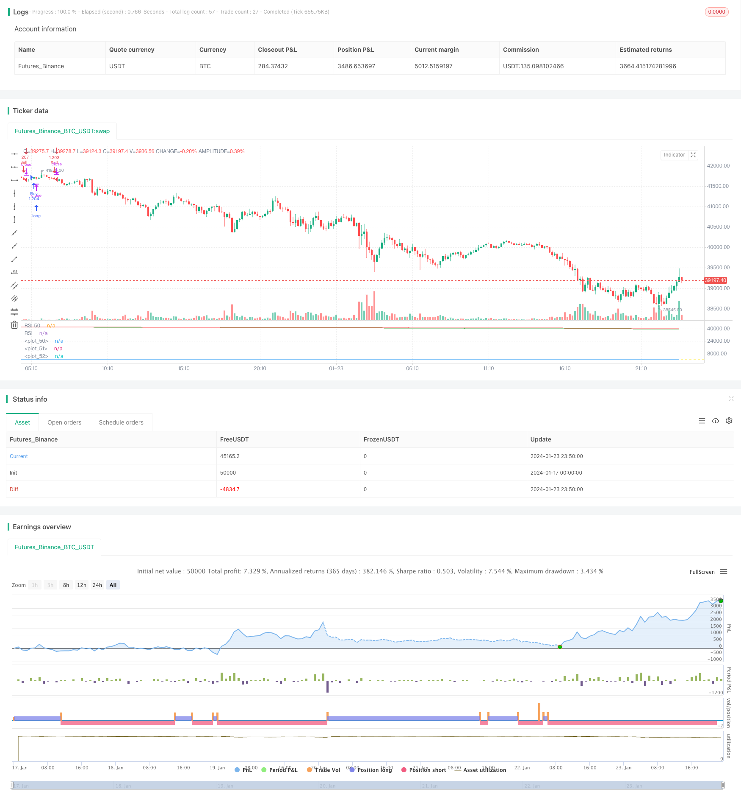

> Name

Multi-timeline collaborative trading strategy MT-Coordination-Trading-Strategy
> Author

ChaoZhang

> Strategy Description


 [trans]

## Overview
Multi-timeline collaborative trading strategy (MT-Coordination Trading Strategy) is an advanced quantitative trading strategy. It integrates a variety of technical indicators and is able to identify short-term trading opportunities in the market. This strategy was designed by well-known trader I3ig_Trades and is specifically used for high-frequency trading in financial markets.
## Strategy Principle
This strategy combines three different periods of smoothed moving averages (21-day, 50-day, and 200-day), the relative strength index (14-day RSI), and the William indicator (2-day). The specific transaction logic is as follows:
Bull entry signal: When the closing price is higher than all three moving averages, the RSI is above 50, and the highest price of the current K line is higher than the upward triangle of the previous K line. Open a long position at this time.
Short entry signal: When the closing price is below all three moving averages, the RSI is below 50, and the lowest price of the current K line is lower than the downward triangle of the previous K line. Open a short position at this time.
Position size is calculated dynamically based on the selected percentage and leverage level.
## Advantage Analysis
This strategy combines a variety of indicators to filter out false signals and find high-probability breakout points for entry, which greatly reduces trading risks. At the same time, the position is set according to a certain proportion of the account equity, and single losses are controlled.
Specific advantages include:
1. Use multiple timeline indicators for confirmation to avoid being trapped. Short-term, mid-term and long-term moving averages can identify trends at different levels.
2. RSI avoids trading in overheated or cold areas. An RSI above 50 is a bullish signal, and an RSI below 50 is a bearish signal.
3. William indicator further verified the breakthrough. Enter only when price breaks through the extreme points of the indicator.
4. Dynamic positions are calculated as a percentage of the account amount, and single losses are strictly controlled.
5. Customizable parameters to adapt to different trading styles.
## Risk Analysis
This strategy mainly faces the following risks:
1. The risk of getting stuck cannot be completely avoided. When the three moving averages diverge, there is a possibility that the transaction will be trapped.
2. Unable to exit the market in time before the trend reverses. There is a lag in the indicator and the reversal cannot be predicted.
3. Risk of loss oom. Under extreme market conditions, a single loss exceeds the preset.
Countermeasures:
1. Optimize the moving average combination and find the best parameters.
2. Increase the filtering of positive and negative lines to further avoid false breakthroughs. 
3. Adjust the percentage and leverage level appropriately.
## Optimization direction
This strategy can still be optimized from the following dimensions:
1. Test different combinations of moving average and RSI parameters to find the optimal parameters.
2. Add other filtering indicators, such as Binance width, to further identify trend traderjack signals, etc.
3. Add a stop loss strategy to stop the loss when the loss reaches a certain proportion.
4. Use deep learning models to determine key support and resistance.
5. Use the adaptive percentage position management system to make the position size more reasonable.
## Summarize
The multi-timeline collaborative trading strategy is a mature high-frequency breakthrough strategy. It integrates multiple indicators to reduce false signals, and dynamic positions strictly control single losses. This strategy is suitable for private equity funds and professional traders with a certain capital size. By continuously optimizing parameters and models, long-term stable returns can be obtained.
||

## Overview

The MT-Coordination Trading Strategy is an advanced quantitative trading strategy integrating multiple technical indicators to identify short-term trading opportunities in financial markets. Designed by renowned trader I3ig_Trades, it is specialized for high-frequency trading.  

## Strategy Logic  

The strategy incorporates three Smoothed Moving Averages (SMA) of different timeframes (21, 50, 200), the 14-day Relative Strength Index (RSI) and the Williams Fractals (2 days). The specific entry logic is defined as follows:

Long signal: Triggered when close is above all three SMAs, RSI is above 50 and current high is greater than the previous fractal up.  

Short signal: Activated when close is below all three SMAs, RSI is below 50 and current low is less than the previous fractal down.

Position sizing is dynamically calculated based on selected percentage of equity and leverage level.

## Advantage Analysis

This strategy combines multiple indicators to filter out false signals and identify high probability breakout levels, greatly reducing trading risk. Meanwhile, the position sizing is set according to a percentage of account equity, controlling single loss.

Specific strengths are:

1. Using multi timeframe indicators for confirmation to avoid traps. SMAs recognize trends across short, medium and long terms.  

2. RSI avoids overbought and oversold zones. Values above 50 signal bullishness and below 50 signal bearishness.

3. Williams Fractals further verify the breakout, only entering on penetration of extremes.  

4. Dynamic position sizing based on percentage of account balance strictly manages downside.

5. Customizable parameters suit different trading styles.

## Risk Analysis  

The main risks of this strategy include:

1. Failure to fully avoid whipsaws when SMAs diverge.  

2. Inability to exit timely before trend reversal due to lagging indicators.

3. Risk of losing the full position in extreme moves when loss exceeds preset.

Solutions:

1. Optimize SMAs combinations to find best parameters.  

2. Add candlestick filters to further avoid false breakouts.

3. Reduce percentage and leverage levels appropriately.  

## Optimization Directions

The strategy can be further enhanced by:

1. Testing different combinations of SMAs and RSI for optimal parameters.  

2. Incorporating additional filters like Bollinger Bands width, traderjack signals etc. 

3. Adding stop loss mechanisms to cut losses at a predefined level.

4. Integrating deep learning models for support and resistance detection.

5. Implementing adaptive position sizing scheme for sensible scaling of positions.

## Conclusion  

The MT-Coordination Trading Strategy is a mature breakout system leveraging multiple timeframes. By combining indicators to filter signals and dynamically managing position sizing, it is capable of consistent profits for capitalized funds and professional traders through continuous parameter tuning and model optimization.

[/trans]

> Strategy Arguments


|Argument|Default|Description|
|----|----|----|
|v_input_float_1|true|Leverage|
|v_input_float_2|100|Percent of Portfolio|
|v_input_int_1|14|RSI Length|
|v_input_int_2|2|Williams Fractals Length|
|v_input_int_3|21|SMA 21 Length|
|v_input_int_4|50|SMA 50 Length|
|v_input_int_5|200|SMA 200 Length|
|v_input_1||Buy Entry Parameters|
|v_input_2||Buy Exit Parameters|
|v_input_3||Sell Entry Parameters|
|v_input_4||Sell Exit Parameters|


> Source (PineScript)

``` pinescript
/*backtest
start: 2024-01-17 00:00:00
end: 2024-01-24 00:00:00
period: 10m
basePeriod: 1m
exchanges: [{"eid":"Futures_Binance","currency":"BTC_USDT"}]
*/

//@version=5
// Written by I3ig_Trades. Follow And Let Me Know Any Strategies You'd Like To See!
strategy("Best Scalping Strategy Period (TMA)", shorttitle="Best Scalping Strategy Period (TMA)", overlay=false,
         initial_capital=100000, 
         default_qty_type=strategy.percent_of_equity, 
         default_qty_value=100)

// Leverage Input
leverage = input.float(1, title="Leverage", minval=1, step=0.1)

// Calculate position size based on the percentage of the portfolio and leverage
percentOfPortfolio = input.float(100, title="Percent of Portfolio")

// Define input options
rsiLength = input.int(14, title="RSI Length", minval=1)
williamsLength = input.int(2, title="Williams Fractals Length", minval=1)
sma21Length = input.int(21, title="SMA 21 Length", minval=1)
sma50Length = input.int(50, title="SMA 50 Length", minval=1)
sma200Length = input.int(200, title="SMA 200 Length", minval=1)

// Smoothed Moving Averages
sma21 = ta.sma(close, sma21Length)
sma50 = ta.sma(close, sma50Length)
sma200 = ta.sma(close, sma200Length)

// RSI
rsiValue = ta.rsi(close, rsiLength)

// Williams Fractals
fractalUp = ta.highest(close, williamsLength)
fractalDown = ta.lowest(close, williamsLength)

// Conditions for Buy Entry
buyCondition = close > sma21 and close > sma50 and close > sma200 and rsiValue > 50 and high > fractalUp[1]

// Conditions for Sell Entry
sellCondition = close < sma21 and close < sma50 and close < sma200 and rsiValue < 50 and low < fractalDown[1]

positionSizePercent = percentOfPortfolio / 100 * leverage
positionSize = strategy.equity * positionSizePercent / close

// Executing strategy with dynamic position size
if buyCondition
    strategy.entry("Buy", strategy.long, qty=positionSize)

if sellCondition
    strategy.entry("Sell", strategy.short, qty=positionSize)

// Plotting the Smoothed Moving Averages
plot(sma21, color=color.white)
plot(sma50, color=color.green)
plot(sma200, color=color.red)

// Plotting RSI and Fractals for visual confirmation
hline(50, "RSI 50", color=color.yellow)
plot(rsiValue, color=color.blue, title="RSI")

// Input text boxes for trading actions
var buy_entry_params = input("", title="Buy Entry Parameters")
var buy_exit_params = input("", title="Buy Exit Parameters")
var sell_entry_params = input("", title="Sell Entry Parameters")
var sell_exit_params = input("", title="Sell Exit Parameters")

```

> Detail

https://www.fmz.com/strategy/439981

> Last Modified

2024-01-25 15:06:04
