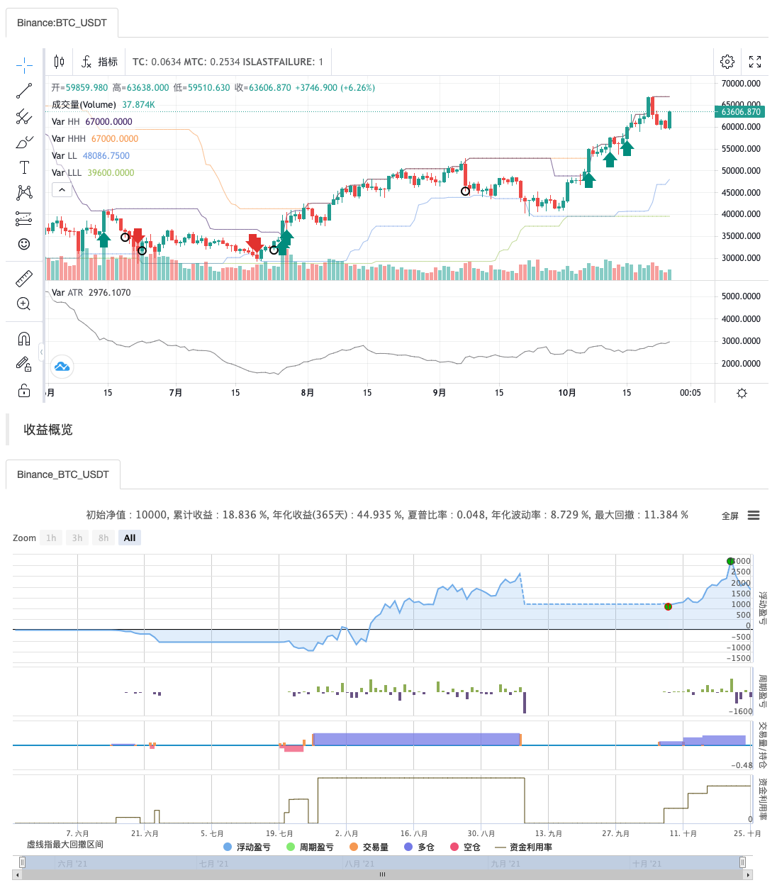

> Name

Mai language turtle strategy experience
> Author

Zero

> Strategy Description

> Have a taste
* Based on the inventor's powerful low-level, fully supports digital currency spot futures and domestic commodity futures
* Automatically move positions to months, truly reflecting the main contract switching process
* API documentation https://www.fmz.com/bbs-topic/2569
>Language enhancement
The inventor Quantified not only implemented the interpreter of the Mac language, but also enhanced it to enable mixed programming with the high-level language Javascript. Here is an example.
```
%%
// 这里面可以调用发明者量化的任何API 
scope.TEST = function(obj) {
    return obj.val * 100;
}
%%
收盘价:C;
收盘价放大100倍:TEST(C);
上一个收盘价放大100倍:TEST(REF(C, 1)); // 鼠标移动到回测的K线上就会提示变量值
```

   

> Strategy Arguments


|Argument|Default|Description|
|----|----|----|
|RATIO|0.01|Funding Ratio|

> Source (MyLanguage)

``` pascal
(*backtest
start: 2020-10-26 00:00:00
end: 2021-10-25 23:59:00
period: 1d
basePeriod: 1h
exchanges: [{"eid":"Binance","currency":"BTC_USDT"}]
*)

//该示范主要用海龟交易法则，演示“头寸计算，最大仓位控制等资金管理”的编写方法
//编写示范中，只对示范重点内容语句进行了注释，其他语句请自行翻译，或者咨询客服
//该模型仅仅用来示范演示使用，依此入市，风险自负。
ATRPERIOD:=20; // ATR波动周期
SHORTPERIOD:=20; // 入市短周期
LONGPERIOD:= 55; // 入市长周期
VARIABLE:ISLASTFAILURE:=1; // 上次是否止损离场, 全局变量过滤信号
TR:=MAX(MAX((HIGH-LOW),ABS(REF(CLOSE,1)-HIGH)),ABS(REF(CLOSE,1)-LOW));//真实波幅
ATR:MA(TR,ATRPERIOD); //求20个周期内真实波幅的简单移动平均, 在附图显示
ZOOM:=IFELSE(ISCONTRACT('@Futures_(?!CTP).*'), CLOSE, 1); // 兼容数字货币期货币为保证金
LOT:=((MONEYTOT*RATIO*ZOOM)/(UNIT*ATR))*ZOOM;//根据权益的1%计算下单手数
TC..IFELSE(ISCONTRACT('@Futures.*'), INTPART(LOT), LOT); // 兼容期货与现货ISCONTRACT以@开头表示匹配交易所名子, 支持正则
MTC..4*TC; //总的持仓头寸
HH^^HV(H,SHORTPERIOD); // 附加到主图显示
LL^^LV(L,SHORTPERIOD);
HHH^^HV(H,LONGPERIOD);
LLL^^LV(L,LONGPERIOD);
ISEMPTY:=ISLASTBK=0&&ISLASTSK=0;
CROSSUP(C,HH)&&ISEMPTY&&ISLASTFAILURE,BK(TC);//最新价超过短周期的最高值，首次买入开仓，手数为TC手
CROSSDOWN(C,LL)&&ISEMPTY&&ISLASTFAILURE,SK(TC); //最新价跌破短周期的最低值，首次卖出开仓，手数为TC手
CROSSUP(C,HHH)&&ISEMPTY,BK(TC);//最新价超过长周期的最高值，首次买入开仓，手数为TC手
CROSSDOWN(C,LLL)&&ISEMPTY,SK(TC); //最新价跌破长周期的最低值，首次卖出开仓，手数为TC手
C>=BKPRICE+0.5*ATR&&BKVOL<MTC&&ISLASTBK,BK(TC);//价格在上次开仓的基础上上涨0.5倍ATR，在手数不超过4倍TC的时候，买入加仓TC手
C<=SKPRICE-0.5*ATR&&SKVOL<MTC&&ISLASTSK,SK(TC);//价格在上次开仓的基础上下跌0.5倍ATR，在手数不超过4倍TC的时候，卖出加仓TC手
NEEDSTOP:=(C<=(BKPRICE-2*ATR)&&BKVOL>0) OR (C>=(SKPRICE+2*ATR)&&SKVOL>0);
NEEDLEAVE:=(CROSSUP(H,HV(H,10))&&SKVOL>0) OR (CROSSDOWN(L,LV(L,10))&&BKVOL>0);
NEEDSTOP OR NEEDLEAVE,CLOSEOUT;
ISLASTFAILURE..IF(NEEDSTOP OR NEEDLEAVE, NEEDSTOP, ISLASTFAILURE);
INFO(NEEDSTOP, '止损离场');
INFO(NEEDLEAVE, '成功离场');
TRADE_AGAIN(10);
MULTSIG(1, 1, 10);
```

> Detail

https://www.fmz.com/strategy/126968

> Last Modified

2021-10-27 12:32:17
