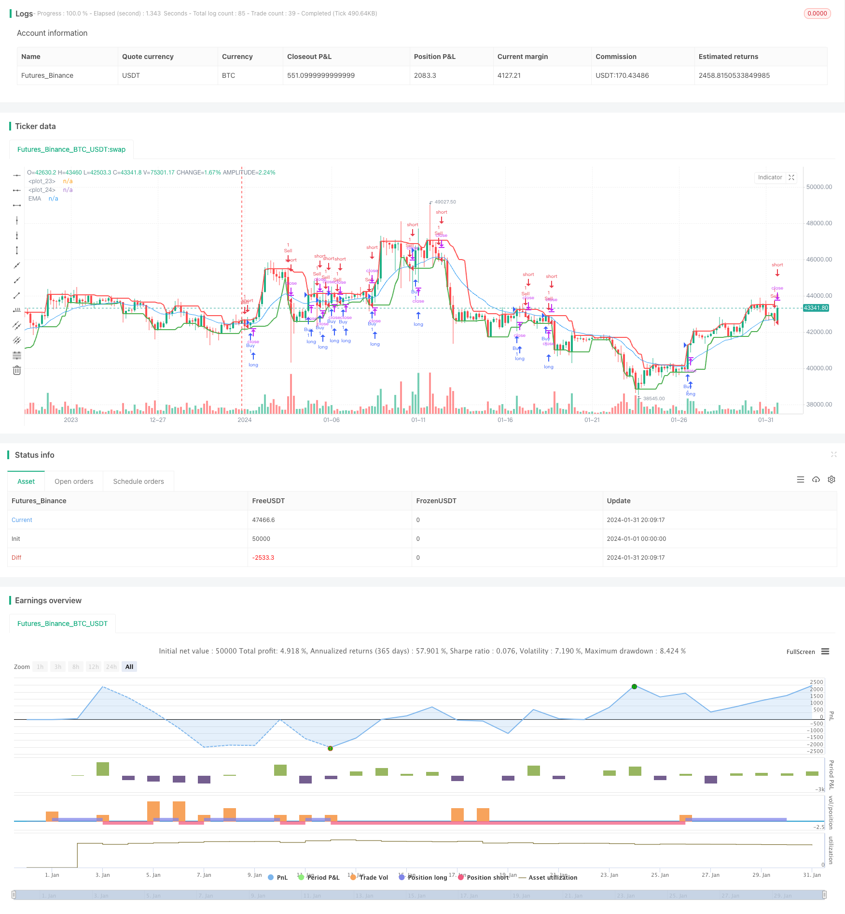

> Name

Mayan Treasure Hunting GuideMayan-Treasure-Hunting-Guide
> Author

ChaoZhang

> Strategy Description


[trans]
## Overview
Mayan Treasure Hunt Guide is a simple stock trading strategy based on the EMA indicator. This strategy combines the EMA moving average indicator and price high and low point judgment, sets buying and selling conditions, and realizes automated trading.
## Strategy Principle
The core basis of this strategy is the EMA moving average indicator. EMA, the exponential moving average, is a commonly used trend judgment indicator. The EMA line can smooth price fluctuations and determine the direction of price trends.
When the stock price rises, it will stand above the EMA line, which is considered a buy signal. When the stock price falls and stands below the EMA line, it is a sell signal. This strategy sets the 20-day EMA line as the basis for judgment.
In addition, the strategy also combines the highest price and lowest price of the day to assist in judgment. At the EMA golden cross moment, if the closing price is lower than the highest price of the day, a buy signal is generated; if the closing price is higher than the lowest price of the day, a sell signal is generated. This can filter out some volatile trading signals.
## Strategic Advantages
The advantage of this strategy is mainly reflected in using the EMA indicator to determine the main buying and selling points. The EMA indicator is a commonly used and practical technical indicator that can effectively smooth price fluctuations and determine the general stock price trend. Compared with complex indicators, EMA is simple and intuitive, making it easy to implement automated trading.
In addition, combining the high and low points of the day for auxiliary judgment can further improve the signal quality and filter out some false signals. This idea of ​​using technical indicators in combination is worthy of promotion and application.
Overall, this strategy is simple and practical, easy to understand and use, and is very suitable for the automated implementation of quantitative trading. This is the biggest advantage of this strategy.
## Strategy Risk
Although this strategy uses the simple and effective EMA indicator, any technical indicator can fail. Especially when prices fluctuate violently, the EMA line may lag, resulting in delayed trading signals and thus missing the best buying and selling opportunities. This is the main risk to this strategy.
In addition, although the auxiliary judgment conditions can filter out false signals, they may also filter out some real signals, resulting in insufficient signals. This also affects strategy effectiveness.
Finally, this strategy only designs trading rules based on technical indicators and does not consider fundamental factors. If there are major changes in the company's fundamentals, the market may fluctuate significantly that technical indicators cannot predict. At this time, strategic trading signals may completely fail.
## Strategy optimization
This strategy can be optimized from the following aspects:
1. Adjust EMA parameters to adapt to more market environments. You can set the adaptive EMA length and dynamically adjust it according to the degree of market volatility.
2. Add other technical indicators for combination. For example, adding the MACD indicator to determine buying and selling points can improve signal accuracy. Or use graphic indicators such as K-line patterns for assistance.
3. Add machine learning models to predict market trends and assist artificial intelligence in determining buying and selling points. This can overcome the limitations of pure rules trading.
4. Consider the company’s fundamentals and macro policies. After adding these factors, the strategy can cope with more complex market environments.
## Summarize
The Mayan Treasure Hunt Guide is a simple and intuitive stock market trading strategy. It uses the widely recognized EMA moving average indicator to determine price trends and confirm trading signals. At the same time, filtering is supplemented by high and low price points to improve signal quality. This strategy is easy to understand and use, and is suitable for automated quantitative trading. However, there are also potential risks such as technical indicator failure. In the future, improvements can be made from multiple perspectives such as parameter optimization, signal enhancement, and machine learning to make the strategy more effective.
||

## Overview

The Mayan Treasure Hunting Guide is a simple stock trading strategy based on the EMA indicator. The strategy combines the EMA line indicator and price highs and lows to set buy and sell conditions for automated trading.  

## Strategy Principles  

The core of this strategy relies on the EMA indicator. EMA stands for Exponential Moving Average, which is a commonly used trend judgment indicator. The EMA line can smooth price fluctuations and determine the direction of the price trend.  

When stock prices rise, they will stand above the EMA line, which is considered a buy signal. When prices fall, they will stand below the EMA line as a sell signal. This strategy sets a 20-day EMA line as the decision benchmark.

In addition, the strategy also combines the highest and lowest prices of the day to assist in judgment. At the moment of the EMA golden cross, if the closing price is lower than the highest price of the day, a buy signal is generated; if the closing price is higher than the lowest price of the day, a sell signal is generated. This filters out some unstable trading signals.

## Advantages of the Strategy

The main advantage of this strategy lies in using the EMA indicator to determine the main buy and sell points. The EMA indicator is a commonly used and practical technical indicator that can effectively smooth price fluctuations and determine the general trend of stock prices. Compared to complex indicators, the EMA is simple and intuitive, easy to implement for automated trading.

In addition, combining intraday highs and lows for auxiliary judgment can further improve signal quality and filter out some false signals. This idea of combining technical indicators is worth promoting.

Overall, this strategy is simple, practical, easy to understand and use, and highly suitable for automated implementation in quantitative trading. This is the biggest advantage of the strategy.

## Risks of the Strategy

Although the strategy uses a simple and effective EMA indicator, any technical indicator may fail at times. Especially in times of violent price fluctuations, EMA lines can lag, leading to delayed trading signals and thus missing the best buy and sell timing. This is the main risk facing the strategy. 

In addition, although the auxiliary judgment conditions can filter out false signals, it may also filter out some real signals, resulting in insufficient signals. This will also affect strategy performance.

Finally, the strategy is designed solely on technical indicator rules without considering fundamentals. If the company's fundamentals change dramatically, the market may see large, unpredictable moves that technical indicators fail to foresee. The trading signals from the strategy can become completely invalid.

## Optimization of the Strategy

The strategy can be optimized in the following aspects:

1. Adjust EMA parameters to adapt to more market conditions. Adaptive EMA lengths can be set based on the degree of market volatility.

2. Increase other technical indicators for combination. For example, adding the MACD indicator to determine buy and sell points can improve signal accuracy. Or use graphical indicators like candlestick patterns for assistance.  

3. Increase machine learning models to predict market conditions and aid in AI judgment of buy and sell points. This can overcome the limitations of pure rules-based trading.  

4. Consider company fundamentals and macro policies. Adding these factors allows strategies to cope with more complex market conditions.

## Summary  

The Mayan Treasure Hunting Guide is a simple and intuitive stock trading strategy. It uses the widely recognized EMA line to determine price trends and confirm trading signals. At the same time, it uses price highs and lows to filter and improve signal quality. The strategy is easy to understand and use, suitable for automated quantitative trading. But it also has potential risks such as technical indicator failure. Future improvements can be made from multiple perspectives like parameter tuning, signal enhancement, and introducing machine learning to improve strategy effectiveness.

[/trans]

> Strategy Arguments


|Argument|Default|Description|
|----|----|----|
|v_input_int_1|20|Length|
|v_input_1_close|0|Source: close|high|low|open|hl2|hlc3|hlcc4|ohlc4|


> Source (PineScript)

``` pinescript
/*backtest
start: 2024-01-01 00:00:00
end: 2024-01-31 23:59:59
period: 4h
basePeriod: 15m
exchanges: [{"eid":"Futures_Binance","currency":"BTC_USDT"}]
*/

// This Pine Script™ code is subject to the terms of the Mozilla Public License 2.0 at https://mozilla.org/MPL/2.0/
// © alex-aftc


//@version=5
strategy("Megalodon", shorttitle="Megalodon", overlay=true)

// Parámetros de la EMA
length = input.int(20, minval=1, title="Length")
src = input(close, title="Source")

// Calcular la EMA
ema = ta.ema(src, length)

// Plot de la EMA
plot(ema, title="EMA", color=color.blue)

// Encontrar los puntos más altos y más bajos
last8h = ta.highest(close, 8)
lastl8 = ta.lowest(close, 8)

// Plot de los puntos más altos y más bajos
plot(last8h, color=color.red, linewidth=2)
plot(lastl8, color=color.green, linewidth=2)

// Condiciones de compra y venta
buy_condition = ta.cross(close, ema) == 1 and close[1] < close
sell_condition = ta.cross(close, ema) == 1 and close[1] > close

// Estrategia de trading
strategy.entry("Buy", strategy.long, when=buy_condition)
strategy.entry("Sell", strategy.short, when=sell_condition)

```

> Detail

https://www.fmz.com/strategy/442961

> Last Modified

2024-02-27 16:33:02
