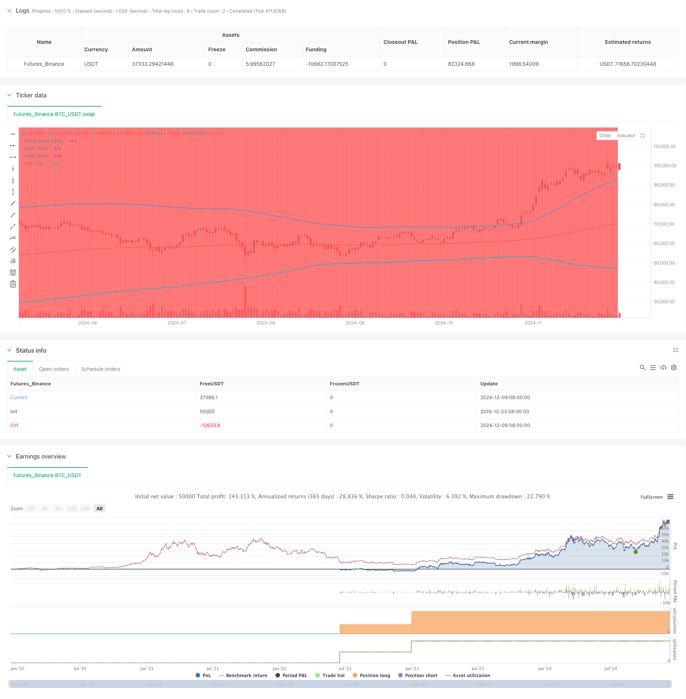

> Name

Mean-Reversion-Bollinger-Band-Dollar-Cost-Averaging-Investment-Strategy
> Author

ChaoZhang

> Strategy Description



[trans]
#### Overview
This strategy is a smart investment strategy that combines dollar cost averaging (DCA) and Bollinger Bands technical indicators. It invests using the principle of mean reversion by systematically opening positions during price corrections. The core of this strategy is to execute a fixed amount of buying operations when the price falls below the lower Bollinger Band, thereby obtaining a better entry price during the market adjustment period.
#### Strategy Principle
The core principles of the strategy are based on three foundations: 1) dollar-cost averaging, which reduces timing risk by investing a fixed amount on a regular basis; 2) mean reversion theory, which believes that prices will eventually return to their historical averages; 3) Bollinger Bands indicators, which are used to identify overbought and oversold areas. When the price breaks through the lower Bollinger Band, a buy signal is triggered, and the purchase amount is determined by dividing the set investment amount by the current price. The strategy uses the 200-period exponential moving average as the middle track of the Bollinger Bands, and the standard deviation multiple is 2 to define the upper and lower tracks.
#### Strategic Advantages
1. Reduce timing risk - reduce human error through systematic buying rather than subjective judgment
2. Seize the opportunity for pullbacks - automatically execute buy operations when prices are oversold
3. Flexible parameter settings - Bollinger Band parameters and investment amount can be adjusted according to different market environments
4. Clear entry and exit rules - objective signals based on technical indicators
5. Automated execution - no manual intervention required to avoid emotional trading
#### Strategy Risk
1. Risk of mean reversion failure - more false signals may be generated in trending markets
2. Fund management risk - sufficient funds need to be reserved to deal with continuous buying signals
3. Risks of parameter optimization - over-optimization may lead to strategy failure
4. Market environment dependence - may perform poorly in highly volatile markets
It is recommended to adopt a strict money management system and regularly evaluate the performance of the strategy to manage these risks.
#### Strategy optimization direction
1. Introduce trend filters to avoid counter-trend operations in strong trends
2. Add multiple time period confirmation mechanism
3. Optimize the fund management system and dynamically adjust the investment amount based on volatility
4. Add a profit-taking mechanism to take profits when the price returns to the mean
5. Consider combining with other technical indicators to improve signal reliability
#### Summary
This is a robust strategy that combines technical analysis with a systematic investment approach. Use Bollinger Bands to identify oversold opportunities and use dollar-cost averaging to reduce risks. The key to the success of the strategy lies in the reasonable setting of parameters and strict execution discipline. Although there are certain risks, the stability of the strategy can be improved through continuous optimization and risk management. ||
#### Overview
This strategy is an intelligent investment approach that combines Dollar-Cost Averaging (DCA) with Bollinger Bands technical indicator. It systematically builds positions during price pullbacks by leveraging mean reversion principles. The core mechanism executes fixed-amount purchases when prices break below the lower Bollinger Band, aiming to achieve better entry prices during market corrections.

#### Strategy Principles
The strategy is built on three fundamental pillars: 1) Dollar-Cost Averaging, which reduces timing risk through regular fixed-amount investments; 2) Mean Reversion Theory, which assumes prices will eventually return to their historical average; 3) Bollinger Bands indicator for identifying overbought and oversold zones. Buy signals are triggered when price breaks below the lower band, with purchase quantity determined by dividing the set investment amount by current price. The strategy employs a 200-period EMA as the middle band with a standard deviation multiplier of 2 to define the upper and lower bands.

#### Strategy Advantages
1. Reduced Timing Risk - Systematic buying rather than subjective judgment reduces human error
2. Capturing Pullbacks - Automatic execution of purchases during oversold conditions
3. Flexible Parameters - Adjustable Bollinger Band parameters and investment amounts for different market conditions
4. Clear Entry/Exit Rules - Objective signals based on technical indicators
5. Automated Execution - No manual intervention needed, avoiding emotional trading

#### Strategy Risks
1. Mean Reversion Failure Risk - May generate false signals in trending markets
2. Capital Management Risk - Requires sufficient capital reserve for consecutive buy signals
3. Parameter Optimization Risk - Over-optimization may lead to strategy failure
4. Market Environment Dependency - May underperform in highly volatile markets
Recommended to implement strict capital management rules and regularly evaluate strategy performance to manage these risks.

#### Strategy Optimization Directions
1. Incorporate trend filters to avoid counter-trend operations in strong trends
2. Add multiple timeframe confirmation mechanisms
3. Optimize capital management system with volatility-based position sizing
4. Implement profit-taking mechanisms when price reverts to mean
5. Consider combining with other technical indicators to improve signal reliability

#### Summary
This is a robust strategy that combines technical analysis with systematic investment methods. It uses Bollinger Bands to identify oversold opportunities while implementing Dollar-Cost Averaging to reduce risk. The key to success lies in proper parameter settings and strict execution discipline. While risks exist, continuous optimization and risk management can improve strategy stability.[/trans]


> Source (PineScript)

``` pinescript
/*backtest
start: 2019-12-23 08:00:00
end: 2024-12-10 08:00:00
period: 1d
basePeriod: 1d
exchanges: [{"eid":"Futures_Binance","currency":"BTC_USDT"}]
*/

//@version=5
strategy("DCA Strategy with Mean Reversion and Bollinger Band", overlay=true) // Define the strategy name and set overlay=true to display on the main chart

// Inputs for investment amount and dates
investment_amount = input.float(10000, title="Investment Amount (USD)", tooltip="Amount to be invested in each buy order (in USD)") // Amount to invest in each buy order
open_date = input(timestamp("2024-01-01 00:00:00"), title="Open All Positions On", tooltip="Date when to start opening positions for DCA strategy") // Date to start opening positions
close_date = input(timestamp("2024-08-04 00:00:00"), title="Close All Positions On", tooltip="Date when to close all open positions for DCA strategy") // Date to close all positions

// Bollinger Band parameters
source = input.source(title="Source", defval=close, group="Bollinger Band Parameter", tooltip="The price source to calculate the Bollinger Bands (e.g., closing price)") // Source of price for calculating Bollinger Bands (e.g., closing price)
length = input.int(200, minval=1, title='Period', group="Bollinger Band Parameter", tooltip="Period for the Bollinger Band calculation (e.g., 200-period moving average)") // Period for calculating the Bollinger Bands (e.g., 200-period moving average)
mult = input.float(2, minval=0.1, maxval=50, step=0.1, title='Standard Deviation', group="Bollinger Band Parameter", tooltip="Multiplier for the standard deviation to define the upper and lower bands") // Multiplier for the standard deviation to calculate the upper and lower bands

// Timeframe selection for Bollinger Bands
tf = input.timeframe(title="Bollinger Band Timeframe", defval="240", group="Bollinger Band Parameter", tooltip="The timeframe used to calculate the Bollinger Bands (e.g., 4-hour chart)") // Timeframe for calculating the Bollinger Bands (e.g., 4-hour chart)

// Calculate BB for the chosen timeframe using security
[basis, bb_dev] = request.security(syminfo.tickerid, tf, [ta.ema(source, length), mult * ta.stdev(source, length)]) // Calculate Basis (EMA) and standard deviation for the chosen timeframe
upper = basis + bb_dev // Calculate the Upper Band by adding the standard deviation to the Basis
lower = basis - bb_dev // Calculate the Lower Band by subtracting the standard deviation from the Basis

// Plot Bollinger Bands
plot(basis, color=color.red, title="Middle Band (SMA)") // Plot the middle band (Basis, EMA) in red
plot(upper, color=color.blue, title="Upper Band") // Plot the Upper Band in blue
plot(lower, color=color.blue, title="Lower Band") // Plot the Lower Band in blue
fill(plot(upper), plot(lower), color=color.blue, transp=90) // Fill the area between Upper and Lower Bands with blue color at 90% transparency

// Define buy condition based on Bollinger Band 
buy_condition = ta.crossunder(source, lower) // Define the buy condition when the price crosses under the Lower Band (Mean Reversion strategy)

// Execute buy orders on the Bollinger Band Mean Reversion condition
if (buy_condition ) // Check if the buy condition is true and time is within the open and close date range
    strategy.order("DCA Buy", strategy.long, qty=investment_amount / close) // Execute the buy order with the specified investment amount

// Close all positions on the specified date
if (time >= close_date) // Check if the current time is after the close date
    strategy.close_all() // Close all open positions

// Track the background color state
var color bgColor = na // Initialize a variable to store the background color (set to 'na' initially)

// Update background color based on conditions
if close > upper // If the close price is above the Upper Band
    bgColor := color.red // Set the background color to red
else if close < lower // If the close price is below the Lower Band
    bgColor := color.green // Set the background color to green

// Apply the background color
bgcolor(bgColor, transp=90, title="Background Color Based on Bollinger Bands") // Set the background color based on the determined condition with 90% transparency

// Postscript:
// 1. Once you have set the "Investment Amount (USD)" in the input box, proceed with additional configuration. 
// Go to "Properties" and adjust the "Initial Capital" value by calculating it as "Total Closed Trades" multiplied by "Investment Amount (USD)" 
// to ensure the backtest results are aligned correctly with the actual investment values.
//
// Example:
// Investment Amount (USD) = 100 USD
// Total Closed Trades = 10 
// Initial Capital = 10 x 100 = 1,000 USD

// Investment Amount (USD) = 200 USD
// Total Closed Trades = 24 
// Initial Capital = 24 x 200 = 4,800 USD

```

> Detail

https://www.fmz.com/strategy/474879

> Last Modified

2024-12-12 17:17:15
