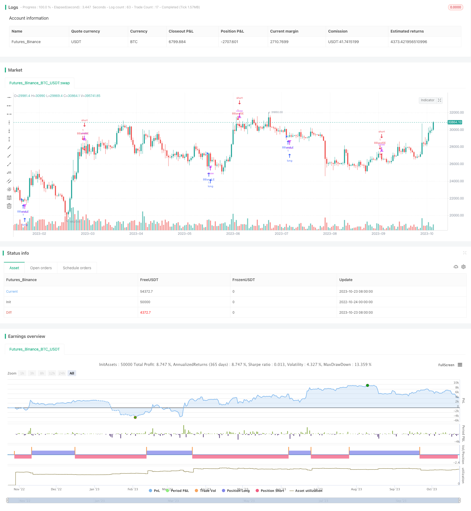

> Name

Mean-Reversion-Bollinger-Bands-Strategy
> Author

ChaoZhang

> Strategy Description



[trans]


### Overview
The moving average crossing fluctuation band strategy uses the Bollinger Band indicator to judge market volatility, cooperates with the moving average to judge the market trend, and determines the trend direction when volatility is low, so as to achieve the purpose of obtaining trend profits when volatility is low.
### Strategy Principles
This strategy determines the volatility of the market by calculating the moving average and its up and down fluctuations. Specifically, the n-day simple moving average is first calculated, and then the standard deviation range is expanded k times above and below the moving average to form an upper rail and a lower rail, namely Bollinger Bands. When the price is close to the upper and lower rails, it means that the market volatility increases; when the price is between the upper and lower rails, it means that the market volatility decreases.
This strategy uses the direction of the moving average to determine the direction of the trend when the volatility decreases. It goes long when the moving average goes up and goes short when the moving average goes down. Specifically, when the price breaks upward from the lower track, go long; when the price breaks downward from the upper track, go short. The stop loss point of each position is set to the corresponding track to control risks.
The advantage of this strategy is to participate in trends when volatility is low, avoiding random fluctuations in some markets, thereby increasing the probability of profit.
### Advantage Analysis
1. Use low volatility to determine trends, reduce randomness, and improve stability.
This strategy only participates in the trend when the Bollinger Bands shrink and market volatility weakens, avoiding the uncertainty in periods of high volatility, thereby reducing randomness and improving stability.
2. Moving average assists judgment and improves judgment accuracy
In addition to Bollinger Bands to identify volatility, this strategy also introduces moving averages to determine the trend direction. The two verify each other and can improve the accuracy of judgment.
3. Have a stop loss point to control risks
Each transaction of this strategy has a stop loss point, which is the upper or lower track of the Bollinger Bands, which can quickly stop losses and control risks.
### Risk Analysis
1. Risk of incorrect trend judgment
During the contraction of Bollinger Bands, the direction of the moving average may change, leading to errors in trend judgment and resulting in losses.
This risk can be reduced by adjusting the moving average parameters or adding other indicators for verification.
2. Risk of excessive Bollinger Band fluctuations
If the Bollinger Band parameters are set too large and the fluctuations are too large, it may lead to too many invalid transactions.
It can be optimized by adjusting the Bollinger Bands standard deviation multiple parameters, or you can set the Bollinger Bands width threshold as a filter condition.
3. Risk of breakthrough failure
After the price breaks through the upper or lower rail, it may fail and fail to form a trend, resulting in losses.
You can reduce the probability of breakthrough failure by only entering the market when the closing price or K-line entity breaks through, or by adding auxiliary conditions such as volume and energy to verify the breakthrough signal.
### Optimization direction
1. Verify with more indicators
Other indicators such as MACD and KDJ can be introduced to verify the moving average judgment and improve the accuracy of judgment.
2. Optimize parameters
You can optimize the moving average parameters and Bollinger Band standard deviation multiple parameters through backtesting to obtain the best parameter combination.
3. Optimize the timing of entry
You can adjust it to enter the market only when the closing price or K-line entity breaks through the Bollinger Band, or add volume and energy conditions to verify the breakthrough.
4. Optimize stop loss strategy
You can lock in profits through trailing stop or trailing stop to avoid profit taking.
### Summarize
The moving average crossing fluctuation band strategy is a typical trend following strategy. It cleverly uses Bollinger Bands to determine the low volatility time period, cooperates with the moving average to determine the trend direction, and participates in the trend when the volatility is low. This can effectively filter out part of the market randomness and improve stability. This strategy has certain advantages, but there are also certain risks that need to be taken care of. By introducing more indicators, optimizing parameters and entry timing, etc., the stability and profit factor of the strategy can be continuously improved.

||

### Overview

The Mean Reversion Bollinger Bands strategy uses the Bollinger Bands indicator to gauge market volatility and moving averages to determine the trend, taking trend trades during periods of low volatility to profit from the trend while avoiding excessive randomness.

### Strategy Logic

The strategy calculates the moving average and upper/lower bands representing a certain multiplier of standard deviation above and below the moving average, forming the Bollinger Bands. When price approaches the bands, it indicates increased volatility. When price is within the bands, it signals decreased volatility.

The strategy goes long when price breaks above the lower band on an uptrending moving average, and goes short when price breaks below the upper band on a downtrending moving average. The corresponding band is used as the stop loss to control risk.

The advantage of this approach is participating in the trend during periods of low volatility, avoiding excessive random price fluctuations and increasing the probability of profit.

### Advantage Analysis  

1. Trading the trend on low volatility reduces randomness and increases stability

By only trading the trend when the Bollinger Bands contract and volatility decreases, the strategy avoids uncertain periods of high volatility, reducing randomness and increasing stability.

2. Moving average assists trend judgment, improving accuracy

The moving average, in addition to the Bollinger Bands gauging volatility, helps determine the trend direction, with the two validating each other and improving accuracy.

3. Built-in stop loss controls risk

The strategy sets stop loss levels at the bands for each trade, allowing quick stops and risk control.

### Risk Analysis

1. Trend misjudgment risk

The moving average direction may change during band contraction, leading to incorrect trend judgment and losses.

Adding other indicators to confirm the trend can help minimize this risk.

2. Excessive band volatility risk 

If bands are too wide due to excessive standard deviation multiplier, ineffective trades will be too frequent.

Optimizing the parameter or adding band width threshold filters can improve this.

3. Breakout failure risk

Price may fail to trend after breaking the bands, causing losses. 

Using only closing breaks or adding volume confirmation can reduce failed breakouts.

### Optimization Directions

1. Add more indicator confirmations 

Adding indicators like MACD and KDJ to confirm moving average signals improves accuracy.

2. Optimize parameters

Backtesting to find optimal moving average and standard deviation multiplier parameters improves performance.

3. Optimize entry timing

Using only closing breaks or adding volume filters improves timing.

4. Optimize stop loss strategy 

Trailing stops and moving stops can help lock in profits and prevent giving back gains.

### Conclusion

The Mean Reversion Bollinger Bands Strategy cleverly uses the bands to identify low volatility periods and the moving average to determine trend direction, participating in trends when volatility decreases. This filters out excessive randomness and increases stability. The strategy has advantages but also risks to watch out for. Further improvements in stability and profitability can come from additional indicator confirmations, parameter optimization, improved entry timing, and advanced stop loss strategies.

[/trans]

> Strategy Arguments


|Argument|Default|Description|
|----|----|----|
|v_input_1|20|length|
|v_input_2|2|mult|


> Source (PineScript)

``` pinescript
/*backtest
start: 2022-10-24 00:00:00
end: 2023-10-24 00:00:00
period: 1d
basePeriod: 1h
exchanges: [{"eid":"Futures_Binance","currency":"BTC_USDT"}]
*/

//@version=4
strategy("Trading Public School", overlay=true)
source = close
length = input(20, minval=1)
mult = input(2.0, minval=0.001, maxval=50)

basis = sma(source, length)
dev = mult * stdev(source, length)

upper = basis + dev
lower = basis - dev

buyEntry = crossover(source, lower)
sellEntry = crossunder(source, upper)

if (crossover(source, lower))
    strategy.entry("BBandLE", strategy.long, stop=lower, oca_name="BollingerBands",  comment="BBandLE")
else
    strategy.cancel(id="BBandLE")

if (crossunder(source, upper))
    strategy.entry("BBandSE", strategy.short, stop=upper, oca_name="BollingerBands",  comment="BBandSE")
else
    strategy.cancel(id="BBandSE")

//plot(strategy.equity, title="equity", color=color.red, linewidth=2, style=plot.style_areabr)

```

> Detail

https://www.fmz.com/strategy/430115

> Last Modified

2023-10-25 11:04:13
