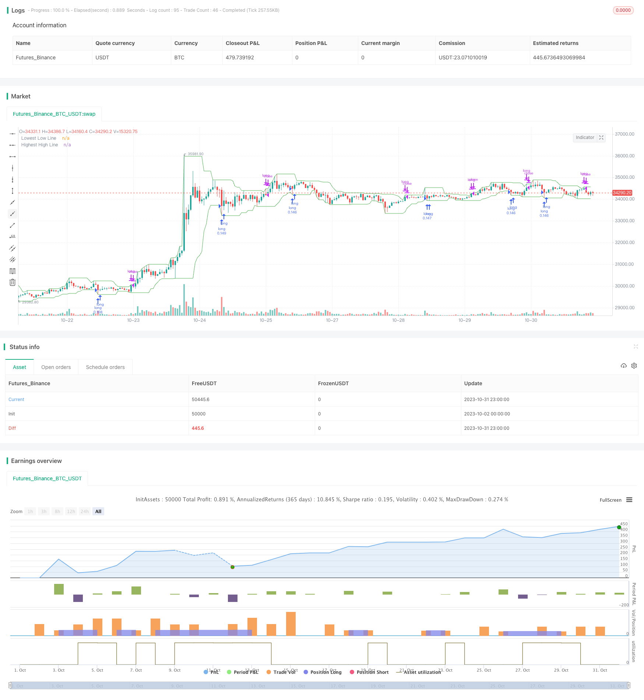

> Name

Mean-Reversion-Breakout-Low-Strategy
> Author

ChaoZhang

> Strategy Description


[trans]

### Overview
The main idea of ​​this strategy is to detect whether the price breaks through the lowest price in a specified period. If it breaks through, go long and wait for the price to return to the moving average. It is a trend following strategy.
### Strategy Principles
This strategy obtains the lowest price lowestLow in the specified period by calling the ta.lowest method of the Pine script, and compares it with the lowest price prevLow of the previous period.
If the lowest price lowestLow of the latest period is lower than the lowest price prevLow of the previous period, a long signal is issued. After going long, compare it with the highest price in the specified period, highestHigh. If the highest price in the latest period is greater than the highest price in the previous period, the position will be closed.
This strategy allows you to choose the trigger condition, that is, the lowest price needs to continuously break through 1, 2, 3 or 4 previous lowest prices, thereby controlling the trading frequency.
In addition, this strategy also draws the lowest price moving average lowestLow and the highest price moving average highestHigh on the chart to visually display the change in trend.
### Advantage Analysis
- This strategy captures the reversal trend after breaking through new lows and has a high winning rate.
- Allows you to choose the quantity that breaks through the lowest price, and you can control the trading frequency.
- Drawing moving averages helps visually determine trend change points.
- The strategy logic is simple and clear, easy to understand and implement.
- Different stocks and time periods can be configured for optimization testing.
### Risk Analysis
- A false breakthrough cannot determine the trend reversal point and may lead to losses.
- It is necessary to test different parameter combinations to optimize the configuration, otherwise the transaction frequency may be too high or too low.
- Parameters need to be adjusted according to different stocks and are not suitable for mechanical application.
- Insufficient backtesting time period may lead to strategy overfitting.
- After the breakthrough, the price may hit a new low, and a stop loss needs to be set to control the risk.
### Optimization direction
- Add stop loss mechanisms, such as trailing stop loss, trailing stop loss, etc., to control single losses.
- Optimize the number of breakouts and balance trading frequency with signal quality.
- Test parameter optimization for different stocks and time periods.
- Add filter conditions to avoid frequent trading in volatile markets.
- Consider adding trend indicators to avoid trading against the trend.
- Test different exit signals.
### Summarize
This strategy captures reversal opportunities by monitoring the lowest price breakthrough and is a typical breakthrough return strategy. The advantages are that it is simple and easy to understand, the trading frequency is controllable, and it can be applied to a variety of stocks. However, there is also a certain risk of false breakthroughs, and auxiliary conditions need to be added for filtering and optimization. At the same time, it is necessary to control risks. Through comprehensive testing and optimization, this strategy can become a stable and reliable quantitative trading system.
||


### Overview

The main idea of this strategy is to detect if the price breaks through the lowest price in a specified period and go long, waiting for the price to revert to the mean. It belongs to trend following strategies.

### Strategy Logic

The strategy gets the lowest price in a specified period lowestLow using Pine Script's ta.lowest method and compares it with the lowest price of the previous period prevLow. 

If the latest period's lowest price lowestLow is lower than the previous period's lowest price prevLow, a long signal is triggered. After going long, it compares with the highest price in the specified period highestHigh. If the latest period's highest price is greater than the previous highest price, it closes the position.

The strategy allows choosing the trigger condition, i.e. the lowest price needs to break through 1, 2, 3 or 4 previous lowest prices consecutively, to control the trading frequency.

It also plots the lowest price line lowestLow and highest price line highestHigh on the chart to visually display the trend change.

### Advantage Analysis

- The strategy catches the reversal trend after breaking new lows with relatively high win rate.

- Allows choosing the number of broken lowest prices to control trading frequency. 

- Drawing the lines helps visually determine trend change points.

- Simple and clear strategy logic, easy to understand and implement.

- Can be configured and optimized on different stocks and time periods.

### Risk Analysis

- Breaking false bottom cannot determine trend reversal points, may lead to losses.

- Needs to test different parameter combinations to optimize configurations, otherwise trading frequency may be too high or too low.

- Parameters need to be adjusted for different stocks, should not mechanically apply.

- Insufficient backtest period may cause overfitting. 

- Price may make new lows after breaking out, need to set stop loss to control risks.

### Optimization Directions

- Add stop loss mechanisms like moving stop loss, trailing stop loss, to limit per trade loss.

- Optimize the number of breakouts to balance trading frequency and signal quality.

- Test parameters on different stocks and time periods.

- Add filters to avoid frequent trading in ranging markets.

- Consider adding trend indicators to avoid counter trend trading.

- Test different exit signals.

### Conclusion

The strategy catches reversal opportunities by monitoring lowest price breakouts, a typical mean reversion breakout strategy. The advantages are simplicity, controllable frequency, and applicability to various stocks. But it also has some false breakout risks. Adding filters and optimizing is necessary, as well as controlling risks. With comprehensive testing and optimization, it can become a stable and reliable trading system.

[/trans]

> Strategy Arguments


|Argument|Default|Description|
|----|----|----|
|v_input_1|9|Minimum number of bars|
|v_input_string_1|0|Number of broken lows: One|Two|Three|Four|


> Source (PineScript)

``` pinescript
/*backtest
start: 2023-10-02 00:00:00
end: 2023-11-01 00:00:00
period: 1h
basePeriod: 15m
exchanges: [{"eid":"Futures_Binance","currency":"BTC_USDT"}]
*/

// This source code is subject to the terms of the Mozilla Public License 2.0 at https://mozilla.org/MPL/2.0/
// © merovinh

//@version=5
strategy(title="Merovinh - Mean Reversion Lowest low",
     overlay = true,
     default_qty_type = strategy.percent_of_equity,
     initial_capital = 10000,
     default_qty_value = 10,
     commission_type = strategy.commission.percent,
     slippage = 1,
     commission_value = 0.04)

GR_TIME = 'Time Period'

bars = input(9, title = "Minimum number of bars", tooltip = "The minimum number of bars before updating lowest low / highest high")

numberOfLows  = input.string(defval='One', title='Number of broken lows', options=['One', 'Two', 'Three', 'Four'])

//Period

var prevLow = .0
var prevHigh = .0
var prevLow2 = .0
var prevLow3 = .0
var prevLow4 = .0

truetime = true


highestHigh = ta.highest(high, bars)
lowestLow = ta.lowest(low, bars)

if numberOfLows == 'One'
    if truetime and prevLow > 0 and lowestLow < prevLow
        strategy.entry('long', strategy.long)
if numberOfLows == 'Two'
    if truetime and prevLow > 0 and lowestLow < prevLow and prevLow < prevLow2
        strategy.entry('long', strategy.long)
if numberOfLows == 'Three'
    if truetime and prevLow > 0 and lowestLow < prevLow and prevLow < prevLow2 and prevLow2 < prevLow3
        strategy.entry('long', strategy.long)
if numberOfLows == 'Four'
    if truetime and prevLow > 0 and lowestLow < prevLow and prevLow < prevLow2 and prevLow2 < prevLow3 and prevLow3 < prevLow4
        strategy.entry('long', strategy.long)

if truetime and prevHigh > 0 and highestHigh > prevHigh
    strategy.close('long')


if prevLow != lowestLow
    prevLow4 := prevLow3
    prevLow3 := prevLow2
    prevLow2 := prevLow
    prevLow := lowestLow
prevHigh := highestHigh

plot(lowestLow, color=color.green, linewidth=1, title="Lowest Low Line")
plot(highestHigh, color=color.green, linewidth=1, title="Highest High Line")


```

> Detail

https://www.fmz.com/strategy/430867

> Last Modified

2023-11-02 15:34:22
