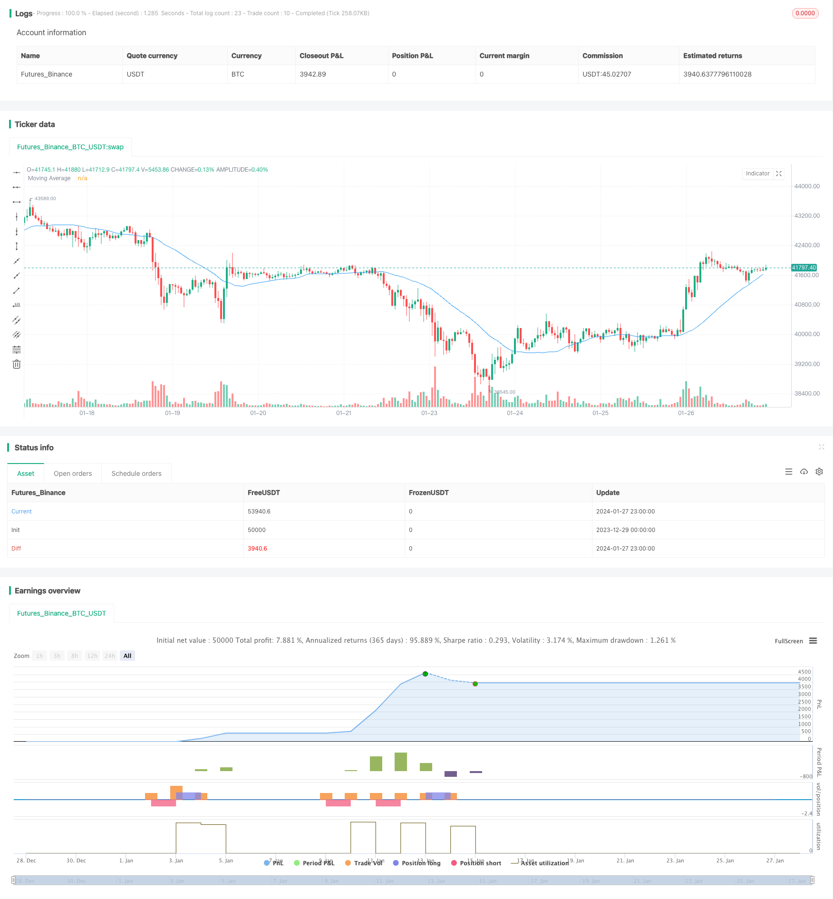

> Name

Mean-Reversion-with-Incremental-Entry-Strategy
> Author

ChaoZhang

> Strategy Description


[trans]
## Overview
The mean reversion progressive opening strategy is an advanced quantitative trading strategy script designed by HedgerLabs, focusing on mean reversion technology in financial markets. This strategy is aimed at traders who prefer a systematic approach and emphasizes the gradual opening of positions based on price relative to moving averages.
## Strategy Principle
The core of this strategy is the Simple Moving Average (SMA). All entry and exit trades are made around the moving average. Traders can customize the MA length to suit different trading styles and time frames.
The unique feature of this strategy is its progressive position opening mechanism. This strategy initiates the first position when the price deviates from the moving average by more than a certain percentage. Subsequently, as the price continues to deviate more and more away from the moving average, the strategy increases the position in a gradual manner defined by the trader. This approach can yield higher returns when market volatility increases.
The strategy also manages positions intelligently. Go long when the price is below the moving average and go short when it is above to adapt to different market conditions. The closing point is set when the price touches the moving average, aiming to seize the potential reversal point to achieve the optimal closing of the position.
By enabling `calc_on_every_tick`, the strategy can continuously evaluate market conditions and react promptly.
## Advantage Analysis
The mean reversion gradual opening strategy has the following advantages:
1. High degree of systematization, which can reduce the risk of subjective misoperation
2. Gradual opening of positions can lead to higher returns when the market fluctuates significantly.
3. You can customize parameters such as MA cycle to adapt to different varieties
4. The position management mechanism is relatively intelligent and can automatically adjust long and short positions.
5. Reasonable selection of the exit point is helpful to seize the reversal and close the position
## Risk Analysis
There are also some risks with this strategy:
1. Relying on technical indicators may lead to the risk of false signals.
2. Unable to judge market trends and easily trapped
3. Improper setting of MA parameters may lead to frequent stop loss
4. Gradual opening of positions will increase position risks
The above risks can be mitigated by appropriately optimizing exits, better judging the trend, or appropriately reducing the opening range.
## Optimization direction
This strategy can be optimized from the following aspects:
1. Add trend elimination conditions to avoid opening positions against the trend
2. Combined with volatility indicators to optimize position opening range
3. Optimize trailing stop to lock in profits
4. Try different types of moving averages
5. Add filters to reduce invalid signals
## Summarize
The mean reversion progressive opening strategy focuses on mean reversion trading technology, using systematic progressive opening to manage positions, with customizable parameters suitable for different trading varieties. This strategy performs well in volatile markets and is suitable for quantitative traders who focus on short-term operations.
||

## Overview

The Mean Reversion with Incremental Entry strategy designed by HedgerLabs is an advanced trading strategy script focusing on the mean reversion technique in financial markets. It is tailored for traders who prefer a systematic approach with emphasis on incremental entries based on price movements relative to a moving average.

## Strategy Logic

Central to this strategy is the Simple Moving Average (SMA) which all entries and exits revolve around. Traders can customize the MA length to suit different trading styles and timeframes.  

Unique to this strategy is the incremental entry system. It initiates a first position when the price deviates from the MA by a specified percentage. Subsequent entries are then made in incremental steps, as defined by the trader, as the price moves further away from the MA. This aims to capitalize on increasing volatility.

The strategy intelligently manages positions by entering long when price is below MA and short when above to adapt to changing market conditions.  

Exits are determined when the price touches the MA, with the goal of closing positions at potential reversal points for optimized outcomes.

With calc_on_every_tick enabled, the strategy continually evaluates the market to ensure prompt reaction.  

## Advantage Analysis   

The Mean Reversion with Incremental Entry strategy has the following key advantages:

1. Highly systematized to reduce emotional interference 
2. Incremental entry captures greater profit during high volatility
3. Customizable parameters like MA period suit different instruments  
4. Intelligent position management automatically adapts long/short  
5. Optimal exit targeting reversals to close positions

## Risk Analysis

The risks to consider include:

1. Whipsaws from technical indicator reliance  
2. Trendlessness causing extended drawdowns
3. Poor MA settings lead to frequent stop outs
4. Larger position size from incremental entry  

Exits can be optimized, trend filters added, position sizing reduced to mitigate the above risks.

## Enhancement Opportunities

The strategy can be enhanced by:

1. Adding trend filters to avoid unfavorable trades
2. Optimizing entry increments with volatility  
3. Incorporating trailing stops to lock in profits
4. Experimenting with different moving averages  
5. Using filters to reduce false signals  

## Conclusion

The Mean Reversion with Incremental Entry strategy focuses on mean reversion techniques using a systemized incremental position sizing approach. With customizable settings, it is adaptable across different trading instruments. It performs well in ranging markets and suits short-term systematic traders.

[/trans]

> Strategy Arguments


|Argument|Default|Description|
|----|----|----|
|v_input_int_1|30|MA Length|
|v_input_float_1|5|Initial Percent for First Order|
|v_input_float_2|true|Percent Step for Additional Orders|


> Source (PineScript)

``` pinescript
/*backtest
start: 2023-12-29 00:00:00
end: 2024-01-28 00:00:00
period: 1h
basePeriod: 15m
exchanges: [{"eid":"Futures_Binance","currency":"BTC_USDT"}]
*/

//@version=5
strategy("Mean Reversion with Incremental Entry by HedgerLabs", overlay=true, calc_on_every_tick=true)

// Input for adjustable settings
maLength = input.int(30, title="MA Length", minval=1)
initialPercent = input.float(5, title="Initial Percent for First Order", minval=0.01, step=0.01)
percentStep = input.float(1, title="Percent Step for Additional Orders", minval=0.01, step=0.01)

// Calculating Moving Average
ma = ta.sma(close, maLength)

// Plotting the Moving Average
plot(ma, "Moving Average", color=color.blue)

var float lastBuyPrice = na
var float lastSellPrice = na

// Function to calculate absolute price percentage difference
pricePercentDiff(price1, price2) =>
    diff = math.abs(price1 - price2) / price2 * 100
    diff

// Initial Entry Condition Check Function
initialEntryCondition(price, ma, initialPercent) =>
    pricePercentDiff(price, ma) >= initialPercent

// Enhanced Entry Logic for Buy and Sell
if (low < ma)
    if (na(lastBuyPrice))
        if (initialEntryCondition(low, ma, initialPercent))
            strategy.entry("Buy", strategy.long)
            lastBuyPrice := low
    else
        if (low < lastBuyPrice and pricePercentDiff(low, lastBuyPrice) >= percentStep)
            strategy.entry("Buy", strategy.long)
            lastBuyPrice := low

if (high > ma)
    if (na(lastSellPrice))
        if (initialEntryCondition(high, ma, initialPercent))
            strategy.entry("Sell", strategy.short)
            lastSellPrice := high
    else
        if (high > lastSellPrice and pricePercentDiff(high, lastSellPrice) >= percentStep)
            strategy.entry("Sell", strategy.short)
            lastSellPrice := high

// Exit Conditions - Close position if price touches the MA
if (close >= ma and strategy.position_size > 0)
    strategy.close("Buy")
    lastBuyPrice := na

if (close <= ma and strategy.position_size < 0)
    strategy.close("Sell")
    lastSellPrice := na

// Reset last order price when position is closed
if (strategy.position_size == 0)
    lastBuyPrice := na
    lastSellPrice := na

```

> Detail

https://www.fmz.com/strategy/440358

> Last Modified

2024-01-29 15:47:24
