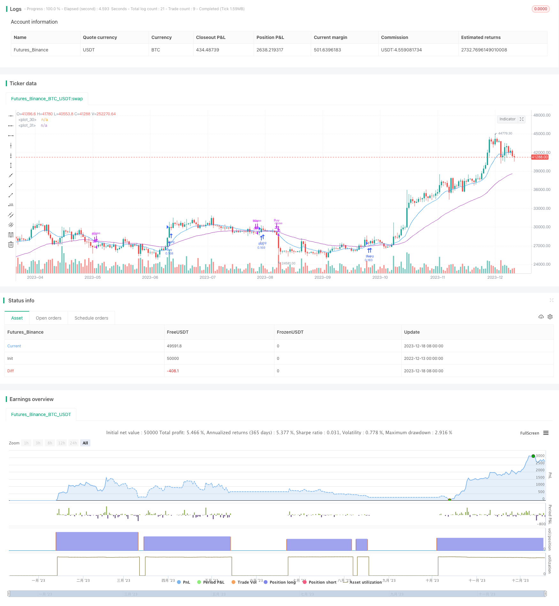

> Name

Meticulous-EMA-Crossover-Strategy based on two different parameters gradient moving average trading strategy
> Author

ChaoZhang

> Strategy Description


 [trans]

### Overview
The gradient moving average trading strategy is a strategy for trading based on the crossover signals of two exponential moving averages (EMA) with different parameter settings. It uses a shorter-period EMA line and a longer-period EMA line to generate trading signals when they cross. When the fast line crosses the slow line upwards, go long, and when it crosses downwards, close the position. This strategy also combines risk management methods such as stop loss and trailing stop loss to lock in profits and control risks.
### Strategy Principles
The core indicators of this strategy are the two EMA lines: the fast line and the slow line. The fast line parameters are set to the 13-day line by default, which responds more sensitively to price changes; the slow line parameters are set to the 48-day line by default, which responds more slowly to price changes. When the short-term rises rapidly, the fast line will rise before the slow line; when the short-term falls, the fast line will fall faster than the slow line. Therefore, when the fast line breaks through the slow line upward, it is a long-term rising signal; when the fast line falls below the slow line, it is a long-term falling signal.
According to this principle, this strategy goes long when the fast line breaks through the slow line from bottom to top, which means that the price starts to rise, and you can buy; when the fast line breaks through the slow line from top to bottom, you close the position, which means that the upward trend is over, and you should take profits in a timely manner. In order to control risks, the strategy also sets an initial stop loss and a trailing stop loss: the initial stop loss distance is 8% of the entry price, and the trailing stop loss distance is 120 points by default. This can stop losses as early as possible when the price reverses and reduce losses.
In terms of code implementation, the strategy uses the two functions crossover and crossunder to determine the EMA crossover signal, and when the crossover occurs, the corresponding entry and close are triggered for buying and closing.
### Advantage Analysis
The Gradient Moving Average trading strategy has the following advantages:
1. The strategy signal is simple and clear, easy to understand and implement, and suitable for novices to learn;
2. The moving average indicator has a good filtering effect on market noise and can detect changes in trends;
3. Strong configurability, fast and slow line parameters and stop loss points can be customized;
4. Combined with stop loss methods, risks can be effectively controlled.
5. Has certain stability.
### Risk Analysis
This strategy also has certain risks:
1. When the market fluctuates violently, the EMA cross signal may lag behind and fail to reflect price changes in a timely manner;
2. Adjusting moving average indicator parameters too quickly may produce more false signals;
3. When the market trend is weak, there are fewer EMA crossovers and it is impossible to effectively capture the price trend.
4. The strategy itself does not consider large-level trend analysis. When the overall market trend is unclear, it is easy to produce transactions that deviate from the general trend.
The above risks can be mitigated by the following means:
1. Combine with other indicators to confirm moving average crossover signals, such as MACD, KD, etc.;
2. Adjust EMA parameters according to different markets to reduce the false signal rate;
3. Add a trend judgment module to judge the overall market direction with reference to long-term moving averages.
### Optimization direction
This strategy can be optimized from the following directions:
1. Add filtering of opening conditions to avoid too many unnecessary transactions in volatile market conditions. The threshold for opening a position can be set by combining indicators such as volatility and trading volume;
2. Set stop-loss and take-profit positions based on market highs and lows, support levels, etc., to improve the accuracy of stop-loss and take-profit;
3. Add a trend judgment module and use long-term trends under a higher time frame to filter short-term signals to avoid deviations from the general trend;
4. Machine learning can be used to train and optimize EMA parameters to make them more suitable for actual market conditions and reduce the false signal rate.
The above points are the main directions in which this strategy can be improved and optimized in the future. Appropriate combination of more indicators and risk management methods will make the EMA crossover strategy more effective.
### Summarize
The Gradient Moving Average trading strategy is a basic trend following strategy. It uses the intersection of EMA fast and slow lines to judge the price trend, and combines stop loss means to control risks. The signal of this strategy is simple and clear, easy to understand and use, and is especially suitable for novices to learn. It is one of the typical strategies for getting started with quantification. But it also has certain lag and risk of false positives. In the future, this strategy can be optimized and improved by introducing more indicators and means to make it operate stably in a more complex market environment.
|| 

### Overview  

The Meticulous EMA Crossover Strategy is a trend trading system based on the crossover signals between two exponential moving average lines (EMAs) with different parameter settings. It uses a shorter-period fast EMA line and a longer-period slow EMA line and generates trade signals when they cross over. A long signal is triggered when the fast line crosses above the slow line, and a close position signal is triggered when the fast line crosses below the slow line. This system also incorporates risk management means like stop loss, trailing stop to lock profits and control risks.

### Strategy Principles   

The core indicators of this strategy are two EMA lines: fast line and slow line. The fast line's parameter is defaulted to a 13-period line for faster reaction to price changes. The slow line's parameter is defaulted to a 48-period line for slower responses. When the short-term trend rises rapidly, the fast line will rally ahead of the slow line. And when the prices fall, the fast line will drop faster than the slow line. Therefore, the fast line's crossing above the slow line signals an upward trend, and the fast line's crossing below the slow line signals a downward reversal.

Based on this principle, the strategy goes long when the fast EMA line crosses above the slow EMA line, indicating an upward trend so you can buy. When the fast line crosses below the slow line, it closes positions, showing the end of uptrend and the time to take profit. To control risks, the strategy also sets an initial stop loss at 8% below entry price and a trailing stop defaulted to be 120 points from market price. This allows the system to exit early and minimize losses when there is a trend reversal.

In coding implementation, the "crossover" and "crossunder" functions are used to determine the EMA crossover signals. The corresponding "entry" and "close" commands will then be triggered to buy or close positions.

### Advantage Analysis   

The Meticulous EMA Crossover Strategy has the following key advantages:

1. The signals are simple and clear, easy to understand and implement. Suitable for beginners.

2. The MA filter can discover trend changes with less market noise.  

3. Highly configurable parameters on fast/slow EMA lines, stop loss levels, etc.

4. Stop loss means effectively control risks.  

5. Relatively stable system across various market conditions.

### Risk Analysis  

There are also some inherent risks of this strategy:

1. EMA signals may lag during violent market swings, unable to reflect price changes timely.

2. Overly fast parameter tuning of the MA indicators can produce more false signals. 

3. Weak price trends may generate fewer EMA crossovers thus unable to capture moves.

4. No analysis of overall market trends means going against the main trend.

The risks can be mitigated through:

1. Adding filters like MACD and KD to confirm crossover signals.

2. Adjust EMA parameters based on different markets to decrease false signals.  

3. Incorporate analysis of overall trend based on long-term moving averages.

### Optimization Directions

The strategy can be upgraded from the aspects below:

1. Adding open position filters to avoid overtrading in range-bound markets. Can combine volatility and volume indicators to set position opening threshold.

2. Set stop loss and take profit levels based on swing high/low levels and support/resistance zones for better accuracy.

3. Add a trend module to analyze longer-timeframe trends as filters for short-term signals, avoiding trading against major trends.  

4. Use machine learning to train and optimize ideal EMA parameters fitting the practical markets to decrease false signals.

The above are the major directions for improving this basic EMA crossover strategy going forward. Properly combining more technical indicators and risk management means can surely enhance the strategy's efficacy.

### Conclusion   

The Meticulous EMA Crossover Strategy is a foundational trend following system based on EMA fast and slow line crossovers to determine price trends and incorporates stop loss to control risks. Its signals are simple and clean, easy to understand for beginners, making it one of the typical starter quant strategies. But inherent lags and false signals risks exist. Going forward, introducing more filters and means can better optimize this strategy for more sophisticate market environments and achieve more stable returns.  
[/trans]

> Strategy Arguments


|Argument|Default|Description|
|----|----|----|
|v_input_1_close|0|Fast MA Source: close|high|low|open|hl2|hlc3|hlcc4|ohlc4|
|v_input_2|13|Fast MA Period|
|v_input_3_close|0|Slow MA Source: close|high|low|open|hl2|hlc3|hlcc4|ohlc4|
|v_input_4|48|Slow MA Period|
|v_input_5|false|Invert Trade Direction?|
|v_input_6|true|Use Initial Stop Loss?|
|v_input_7|25|Initial Stop Loss Points|
|v_input_8|true|Use Trailing Stop?|
|v_input_9|120|Trail Points|
|v_input_10|false|Use Offset For Trailing Stop?|
|v_input_11|20|Trail Offset Points|


> Source (PineScript)

``` pinescript
/*backtest
start: 2022-12-13 00:00:00
end: 2023-12-19 00:00:00
period: 1d
basePeriod: 1h
exchanges: [{"eid":"Futures_Binance","currency":"BTC_USDT"}]
*/

//@version=3
// *** USE AT YOUR OWN RISK ***
// 
strategy("EMA Strategy", shorttitle = "EMA Strategy", overlay=true, pyramiding = 3,default_qty_type = strategy.percent_of_equity, default_qty_value = 10)


// === Inputs ===
// short ma
maFastSource   = input(defval = close, title = "Fast MA Source")
maFastLength   = input(defval = 13, title = "Fast MA Period", minval = 1)

// long ma
maSlowSource   = input(defval = close, title = "Slow MA Source")
maSlowLength   = input(defval = 48, title = "Slow MA Period", minval = 1)

// invert trade direction
tradeInvert = input(defval = false, title = "Invert Trade Direction?")
// risk management
useStop     = input(defval = true, title = "Use Initial Stop Loss?")
slPoints    = input(defval = 25, title = "Initial Stop Loss Points", minval = 1)
useTS       = input(defval = true, title = "Use Trailing Stop?")
tslPoints   = input(defval = 120, title = "Trail Points", minval = 1)
useTSO      = input(defval = false, title = "Use Offset For Trailing Stop?")
tslOffset   = input(defval = 20, title = "Trail Offset Points", minval = 1)

// === Vars and Series ===
fastMA = ema(maFastSource, maFastLength)
slowMA = ema(maSlowSource, maSlowLength)

plot(fastMA, color=blue)
plot(slowMA, color=purple)

goLong() => crossover(fastMA, slowMA)
killLong() => crossunder(fastMA, slowMA)
strategy.entry("Buy", strategy.long, when = goLong())
strategy.close("Buy", when = killLong())

// Shorting if using
goShort() => crossunder (fastMA, slowMA)
killShort() => crossover(fastMA, slowMA)
//strategy.entry("Sell", strategy.short, when = goShort())
//strategy.close("Sell", when = killShort())

if (useStop)
    strategy.exit("XLS", from_entry ="Buy", stop = strategy.position_avg_price / 1.08 )
    strategy.exit("XSS", from_entry ="Sell", stop = strategy.position_avg_price * 1.08)


```

> Detail

https://www.fmz.com/strategy/435963

> Last Modified

2023-12-20 14:28:36
