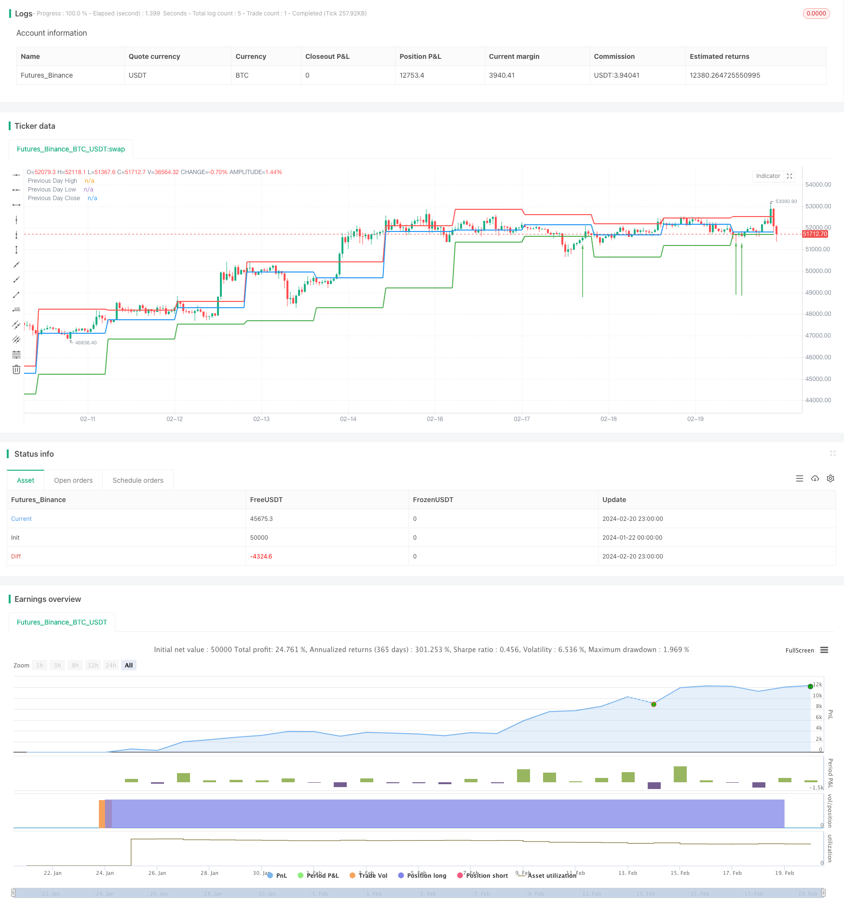

> Name

Momentum-Breakout-Backtesting-Support-Resistance-Strategy
> Author

ChaoZhang

> Strategy Description


[trans]
## Overview
This strategy mainly uses the highest price, lowest price and closing price of the previous trading day as the support and resistance levels of the day. It goes long when the resistance level is broken and goes short when the support level is tested back. It is a typical breakthrough strategy.
## Strategy Principle
The code first defines a function calculateSupportResistance that calculates support and resistance levels. This function extracts the highest price, lowest price, and closing price of the previous trading day as the support and resistance levels for the day.
Then call this function in the main logic to obtain these three price levels and display them in a drawing.
In the backtesting logic, if the closing price is lower than the lowest price of the previous day and the current price is higher than the lowest price, then go long; if the closing price is higher than the highest price of the previous day and the current price is lower than the highest price, it is short.
Through such a breakthrough model, the judgment of trends and the generation of trading signals are achieved.
## Strategic Advantages
1. Use the data of the previous trading day to construct the support and resistance levels of the day, avoiding the problem of parameter optimization.
2. Support and resistance levels come from real market transaction data and have certain reference value.
3. The backtest model is simple and direct, easy to understand and implement
4. Visually display support and resistance levels to form a perception of price
5. Monitor breakthroughs in real time and capture trading opportunities in a timely manner
## Strategy Risk
1. Support and resistance levels will change over time, and their effectiveness cannot be determined
2. It is impossible to predict the trend direction and there is a risk of missing the reversal.
3. Vulnerable to false breakthroughs and risk of entering the market prematurely
4. The continuity of the breakthrough cannot be determined, and there is a possibility of premature stop loss.
5. When the market fluctuates violently, the support and resistance of individual stocks are more likely to fail.
Countermeasures:
1. Combine more factors to determine the effectiveness of a breakthrough
2. Appropriately enlarge the stop loss range to ensure that the trend is captured
3. Establish positions in batches to reduce the impact of individual stock fluctuations
## Strategy optimization
1. Add more historical data to determine support and resistance levels, such as 5-day and 10-day line prices
2. Use indicators such as trading volume to determine the effectiveness of breakthroughs
3. Set stop loss based on actual volatility
4. Optimize fund management and control single losses
## Summarize
Generally speaking, this strategy is a typical breakthrough strategy, which is simple and intuitive. It uses the data of the previous trading day to construct the support and resistance of the day, and backtests the breakthrough to go long and short. The advantage is that it is easy to understand and implement, and support and resistance can be directly seen; the disadvantage is that there is a risk of false breakthroughs and the continuity of the trend cannot be determined. The next step can be optimization from determining the effectiveness of breakthroughs, controlling risks, optimizing fund management, etc.
||

## Overview

This strategy mainly uses the previous trading day's high, low and close prices as the support and resistance levels for the current day. It goes long when the resistance level is broken and goes short when the support level is backtested. It belongs to a typical breakout strategy.

## Strategy Principle 

The code first defines a function calculateSupportResistance to calculate the support and resistance levels, which extracts the previous trading day's high, low and close prices as the current day's support and resistance levels.

Then in the main logic, this function is called to get these three price levels and plot them.

In the backtesting logic, if the close price is lower than the previous day's low while the current price is higher than that low forming a breakout, it goes long. If the close price is higher than the previous day's high while the current price is lower than that high forming a breakout, it goes short. 

Through this breakout model, the judgment of trend and generation of trading signals are implemented.

## Advantages

1. Use previous trading day's data to build current day's support and resistance levels, avoiding the parameter optimization problem

2. Support and resistance levels come from real market trading data, with some reference value

3. Simple and straightforward backtesting model, easy to understand and implement

4. Visual display of support and resistance levels forms perception of prices  

5. Real-time monitoring of breakouts, timely catching trading opportunities

## Risks

1. Support and resistance levels change over time, hard to determine validity

2. Unable to predict trend direction, risk of missing reversals 

3. Easily affected by false breakouts, premature entry risk

4. Unable to determine persistence of breakouts, early stop loss likely

5. Individual support and resistance failure more likely under huge market fluctuation

Countermeasures:

1. Combine more factors to judge validity of breakouts

2. Appropriately expand stop loss range to catch trends  

3. Open positions in batches, reduce impact of individual fluctuations

## Optimizations

1. Add more historical data like 5-day, 10-day lines to determine levels

2. Incorporate other indicators like volume to judge breakout validity  

3. Set stop loss based on actual volatility  

4. Optimize capital management, control single loss

## Summary

Overall this is a typical breakout strategy, simple and intuitive. By building current day's support and resistance with previous day's data and backtesting breakouts of those levels for long/short. Pros are easy to understand and directly visualize levels; cons are false breakout risks and uncertainty of persistence. Next steps are improving breakout validity, controlling risks, optimizing capital management etc.

[/trans]


> Source (PineScript)

``` pinescript
/*backtest
start: 2024-01-22 00:00:00
end: 2024-02-21 00:00:00
period: 1h
basePeriod: 15m
exchanges: [{"eid":"Futures_Binance","currency":"BTC_USDT"}]
*/

//@version=5
strategy("Support and Resistance with Backtesting", overlay=true)

// Function to calculate support and resistance levels
calculateSupportResistance() =>
    highPrevDay = request.security(syminfo.tickerid, "D", high[1], lookahead=barmerge.lookahead_on)
    lowPrevDay = request.security(syminfo.tickerid, "D", low[1], lookahead=barmerge.lookahead_on)
    closePrevDay = request.security(syminfo.tickerid, "D", close[1], lookahead=barmerge.lookahead_on)
    [highPrevDay, lowPrevDay, closePrevDay]

// Call the function to get support and resistance levels
[supResHigh, supResLow, supResClose] = calculateSupportResistance()

// Plotting support and resistance levels
plot(supResHigh, color=color.red, linewidth=2, title="Previous Day High")
plot(supResLow, color=color.green, linewidth=2, title="Previous Day Low")
plot(supResClose, color=color.blue, linewidth=2, title="Previous Day Close")

// Backtesting logic
backtestCondition = close[1] < supResLow and close > supResLow
strategy.entry("Long", strategy.long, when=backtestCondition)

// Plotting buy/sell arrows for backtesting
plotarrow(backtestCondition ? 1 : na, colorup=color.green, offset=-1, transp=0)

```

> Detail

https://www.fmz.com/strategy/442528

> Last Modified

2024-02-22 16:07:14
