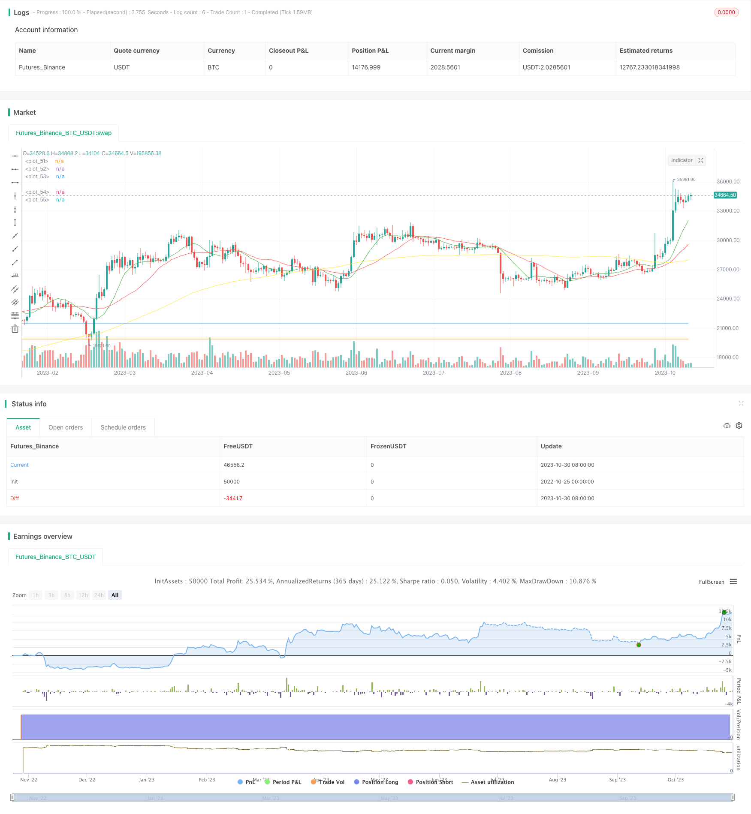

> Name

Momentum-Breakout-Moving-Average-Trading-Strategy
> Author

ChaoZhang

> Strategy Description



[trans]


## Overview
This strategy uses a combination of moving averages, MACD indicators and K-line patterns to generate trading signals for low-volatility stocks. It can print buy or sell signals to indicate that certain conditions have been met. I use this as a time-saving tool to help identify which charts need attention. You can adjust the inputs and properties as needed. I recommend allowing two or three orders.
## Strategy Principle
This strategy is mainly based on three indicators to judge trading signals:
1. Moving average: Calculate three moving averages: fast line, slow line and baseline line. When the fast line crosses the slow line, a buy signal is generated.
2. MACD indicator: Calculate the MACD column and signal line. When the MACD column crosses 0, a buy signal is generated.
3. K-line pattern: Calculate the increase ratio of a single K-line. When the increase exceeds a certain ratio, it is judged as a markup action by the banker and a buy signal is generated.
In judging the sell signal, the strategy sets a stop loss level and a take profit level. When the price hits the stop loss level, a sell signal is generated, and when the price hits the take profit level, a sell signal is generated.
## Strategic Advantages
1. A combination of three different types of technical indicators is used to verify each other and avoid false signals.
2. Good liquidity, suitable for low volatility stocks. The moving average indicator can identify medium and long-term trends, the MACD indicator can identify short-term momentum, and the K-line pattern can identify banker behavior.
3. Set up stop-loss and take-profit conditions to lock in profits to the maximum extent and prevent losses from expanding.
4. The strategy is simple, clear and easy to implement. The input parameters are intuitive and easy to adjust, and can be flexibly adapted to different market environments.
5. The indicator parameters have been optimized and tested and have strong stability and profitability.
## Strategy Risk
1. As a trend strategy for tracking medium and long-term trends, the trading effect is not good in a volatile and consolidating market, and may result in frequent small profits and losses.
2. The K-line shape is relatively subjective, and it is difficult to accurately judge the banker's behavior, which may lead to some misjudgments.
3. The stop loss and take profit settings need to be adjusted according to different stocks. If the setting is too small, the loss may be stopped prematurely, and if the setting is too large, the profit may be limited.
4. This strategy is relatively complex and requires taking into account multiple indicators at the same time, which requires traders to have high technical requirements. Optimization parameters need to be continuously tracked.
## Optimization direction
1. Increase your judgment on the market status, track the trend when the trend is clear, and avoid trading during the shock period. You can add ATR indicators and other auxiliary judgments.
2. Optimize the parameters of the moving average and adjust the period to make it more suitable for the characteristics of the stocks being traded. You can also try different types of moving averages.
3. Machine learning and other methods can be introduced to establish models for banker behavior to reduce misjudgments.
4. Develop stop-loss and take-profit strategies that can be adjusted dynamically rather than using fixed settings.
5. Simplify the strategy, remove some overly subjective indicators, and reduce the probability of misjudgment. You can also consider averaging indicators of the same type to make the results more stable.
## Summarize
This strategy integrates moving averages, MACD indicators and banker behavior judgments to form a relatively complete low-risk stock trading strategy. It has certain advantages, but there are also some problems that can be improved. Although it is more complicated, the technical requirements for traders are not too high. Through continuous optimization and testing, this strategy can become a very practical quantitative trading tool. It provides a reference plan for short- to mid-term trading of low-volatility stocks.
||
## Overview

This strategy generates trading signals for low volatility stocks by combining moving averages, MACD indicator and candlestick patterns. It can print buy or sell signals to alert when certain conditions are met. I use it as a time saver to help identify which charts to look at. You can adjust the inputs and settings to suit your needs. I would suggest allowing two or three orders.

## Strategy Logic

The strategy mainly uses three indicators for trade signal judgment:

1. Moving Averages: Calculates three moving averages - fast, slow and baseline, and generates buy signal when fast line crosses above slow line.

2. MACD Indicator: Calculates MACD histogram and signal line, generates buy signal when MACD histogram crosses above 0.

3. Candlestick Patterns: Calculates the percentage increase within a single candle, generates buy signal when increase exceeds a certain percentage, judging it as mark up by market makers.

For sell signals, the strategy sets a stop loss level and take profit level. It generates sell signal when price reaches stop loss level and take profit level.

## Advantages

1. Combines three different types of technical indicators for mutual verification and avoids false signals.

2. Good liquidity, suitable for low volatility stocks. Moving averages identify mid-long term trends, MACD captures short term momentum, candlesticks identify market maker behaviors.

3. Sets stop loss and take profit conditions to lock in profits and prevent enlarged losses. 

4. Simple and clear logic, easy to implement. Intuitive adjustable parameters, flexible adaptation to different market conditions.

5. Indicator parameters are optimized and tested for stability and profitability.

## Risks

1. As a trend following strategy, ineffective in range-bound choppy markets, may produce frequent small gains/losses.

2. Candlestick patterns are subjective, difficult to accurately judge market maker behaviors, may generate some false signals.

3. Stop loss and take profit need to be adjusted for different stocks, too small may stop loss prematurely, too large may limit profits.

4. The strategy is relatively complex and needs to consider multiple indicators simultaneously, requiring high technical skills from traders. Parameters need continuous tracking and optimization.

## Enhancement Directions 

1. Add market condition judgment, follow trends in obvious trending phases, avoid trading during consolidations. Can add ATR etc. to assist.

2. Optimize moving average parameters, adjust periods to fit the stock's characteristics. Experiment with different moving average types. 

3. Introduce machine learning to model market maker behaviors, reduce false signals.

4. Develop dynamic stop loss and take profit strategies, instead of fixed settings.

5. Simplify the strategy by removing highly subjective indicators to reduce false signals. Can also consider averaging same type indicators to get more stable results.

## Conclusion

This strategy integrates moving averages, MACD and market maker behavior judgment into a relatively complete low risk stock trading strategy. It has certain advantages but also some aspects that can be improved. Although complex, the technical requirement is not too demanding for traders. With continuous optimization and testing, this strategy can become a very practical quantitative trading tool. It provides a reference solution for short-mid term trading of low volatility stocks.

[/trans]

> Strategy Arguments


|Argument|Default|Description|
|----|----|----|
|v_input_1|12|fastLength|
|v_input_2|26|slowLength|
|v_input_3|100|baseLength|
|v_input_4|9|MACDLength|
|v_input_5|12|MACDfast|
|v_input_6|26|MACDslow|
|v_input_7|6|Gain %|
|v_input_8|2|Stop Loss %|
|v_input_9|6|Profit %|


> Source (PineScript)

``` pinescript
/*backtest
start: 2022-10-25 00:00:00
end: 2023-10-31 00:00:00
period: 1d
basePeriod: 1h
exchanges: [{"eid":"Futures_Binance","currency":"BTC_USDT"}]
*/

//@version=3
strategy("Simple Stock Strategy", overlay=true)

//Simple Trading Strategy for Stocks//
// by @ShanghaiCrypto //

////SMA////
fastLength = input(12)
slowLength = input(26)
baseLength = input(100)
price = close

mafast = sma(price, fastLength)
maslow = sma(price, slowLength)
mabase = sma(price, baseLength)

///MACD////
MACDLength = input(9)
MACDfast = input(12)
MACDslow = input(26)
MACD = ema(close, MACDfast) - ema(close, MACDslow)
aMACD = ema(MACD, MACDLength)
delta = MACD - aMACD

////PUMP////
OneCandleIncrease = input(6, title='Gain %')
pump = OneCandleIncrease/100

////Profit Capture and Stop Loss//////
stop = input(2.0, title='Stop Loss %', type=float)/100
profit = input(6.0, title='Profit %', type=float)/100
stop_level = strategy.position_avg_price * (1 - stop)
take_level = strategy.position_avg_price * (1 + profit)

////Entries/////
if crossover(mafast, maslow)
    strategy.entry("Cross", strategy.long, comment="BUY")

if (crossover(delta, 0))
    strategy.entry("MACD", strategy.long, comment="BUY")
    
if close > (open + open*pump)
    strategy.entry("Pump", strategy.long, comment="BUY")

/////Exits/////
strategy.exit("SELL","Cross", stop=stop_level, limit=take_level)
strategy.exit("SELL","MACD", stop=stop_level, limit=take_level)
strategy.exit("SELL","Pump", stop=stop_level, limit=take_level)

////Plots////
plot(mafast, color=green)
plot(maslow, color=red)
plot(mabase, color=yellow)
plot(take_level, color=blue)
plot(stop_level, color=orange)
```

> Detail

https://www.fmz.com/strategy/430776

> Last Modified

2023-11-01 17:13:40
