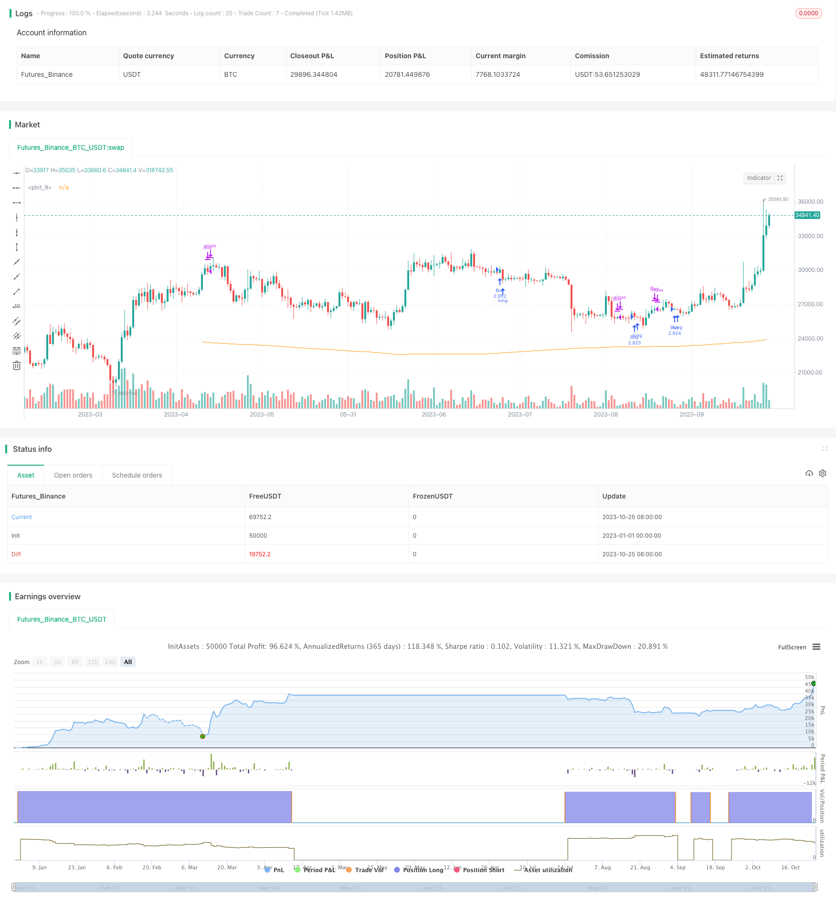

> Name

Momentum-Breakout-Reversal-Trading-Strategy
> Author

ChaoZhang

> Strategy Description


[trans]

## Overview
This strategy uses a simple moving average to determine the direction of the trend, go long in the continuing rising market, and short in the continuing falling market to achieve two-way trading.
## Strategy Principle
This strategy uses the weighted moving average VWMA to determine the market trend direction. When the VWMA rises, go long; when the VWMA falls, go short.
Specifically, the strategy first calculates the VWMA of a certain period, and then determines whether the VWMA rises for more than 5 days. If so, open a long position; if the VWMA falls for more than 5 days, open a short position. The condition for closing the position is to close the position after the VWMA direction reverses for more than 5 days.
To calculate monthly and annual performance, the strategy records monthly and annual returns. By comparing the returns of this strategy with the market benchmark, you can intuitively see the performance of the strategy relative to the market.
## Advantage Analysis
This strategy has the following advantages:
1. Using VWMA to determine trends can effectively filter market noise and capture the main trends.
2. Only open a position after the trend is confirmed to avoid risks caused by trend reversal.
3. Using two-way trading, you can make profits whether the market rises or falls.
4. Record monthly and annual income to facilitate evaluation of strategy effects.
5. Adding market benchmark returns to the income statement allows you to intuitively compare the relative performance of strategies and the market.
## Risk Analysis
This strategy also has some risks:
1. There may be a lag in using VWMA to judge the trend, and you may miss the opportunity at the beginning of the trend.
2. Only open a position after the trend is confirmed, and you may miss some Movements.
3. Two-way trading needs to determine the stop loss point, otherwise the loss may increase.
4. Large market fluctuations may cause stop loss to be triggered, making it impossible to hold the complete trend.
5. The judgment of trend reversal may be inaccurate, resulting in increased losses.
## Optimization direction
This strategy can be optimized from the following aspects:
1. Optimize VWMA cycle parameters and improve trend judgment.
2. Adjust the number of days to confirm the trend and improve the timing of entry and exit.
3. Add a stop loss strategy to control single losses.
4. Combine with other indicators to judge trend reversal to improve certainty.
5. Optimize position management and adjust positions according to market conditions.
6. Consider transaction costs and set MinimumProfit.
## Summarize
The overall idea of ​​this strategy is clear and simple. It uses VWMA to determine the trend direction and trades in both directions after the trend is confirmed, which can effectively track the market trend. However, there are certain risks, and it is necessary to further test and optimize parameters, adjust the entry and exit logic, and appropriately control the position size. This strategy is a basic two-way trading strategy, which lays the foundation for quantitative trading and is worthy of further research and improvement.
||

## Overview

This strategy uses simple moving average to determine the trend direction and go long in an uptrend and go short in a downtrend to implement reversal trading.

## Strategy Logic

This strategy uses Weighted Moving Average (VWMA) to determine the market trend direction. It goes long when VWMA is rising and goes short when VWMA is falling. 

Specifically, it first calculates VWMA of a certain period, and then judges if VWMA has risen for over 5 days. If so, it opens long position. If VWMA has fallen for over 5 days, it opens short position. The closing condition is when VWMA direction reverses for over 5 days.

To calculate monthly and yearly returns, the strategy records the profit/loss of each month and year. By comparing the returns of this strategy with market benchmark, we can visually see the relative performance.

## Advantage Analysis 

The advantages of this strategy include:

1. Using VWMA to determine trend can filter market noise effectively and capture major trends.

2. Opening position only after trend is confirmed can avoid risks associated with trend reversal.

3. Reversal trading can profit from both uptrend and downtrend. 

4. Recording monthly and yearly returns facilitates evaluating strategy performance.

5. Adding market benchmark returns enables direct comparison between strategy and market.

## Risk Analysis

Some risks of this strategy:

1. Using VWMA to determine trend may lag and miss opportunities at beginning of the trend.

2. Opening position only after confirmation may miss some movements.

3. Reversal trading needs to set stop loss, otherwise loss could enlarge. 

4. Significant market fluctuation may trigger stop loss and unable to hold entire trend.

5. Trend reversal judgement may be inaccurate, enlarging losses.

## Optimization Directions

Some aspects that could optimize the strategy:

1. Optimize VWMA period parameter to improve trend determination.

2. Adjust number of days to confirm trend, improving entry and exit timing.

3. Add stop loss strategy to control single trade loss. 

4. Incorporate other indicators to determine reversals, improving certainty.

5. Optimize position sizing based on market condition.

6. Consider trading cost, set minimum profit target.

## Summary 

The overall logic of this strategy is simple and clear, using VWMA to determine trend direction and reversal trade after confirmation, which can effectively track market moves. But it also has some risks, requiring further testing and parameter tuning, adjusting entry/exit logic, and appropriate position sizing. This basic reversal trading strategy lays the foundation for quantitative trading and is worth further research and improvement.

[/trans]

> Strategy Arguments


|Argument|Default|Description|
|----|----|----|
|v_input_1|400|maLength|


> Source (PineScript)

``` pinescript
/*backtest
start: 2023-01-01 00:00:00
end: 2023-10-26 00:00:00
period: 1d
basePeriod: 1h
exchanges: [{"eid":"Futures_Binance","currency":"BTC_USDT"}]
*/

//@version=4
strategy(title="Monthly Returns in Strategies with Market Benchmark", shorttitle="Monthly P&L With Market", initial_capital= 1000, overlay=true,default_qty_type = strategy.percent_of_equity, default_qty_value = 100, commission_type = strategy.commission.percent, commission_value = 0.1)
maLength= input(400)

wma= vwma(hl2,maLength)
uptrend= rising(wma, 5)
downtrend= falling(wma,5)

plot(wma)

if uptrend
    strategy.entry("Buy", strategy.long)
else
    strategy.close("Buy")//

///////////////////
// MONTHLY TABLE //

new_month = month(time) != month(time[1])
new_year  = year(time)  != year(time[1])

eq = strategy.equity

bar_pnl = eq / eq[1] - 1
bar_bh = (close-close[1])/close[1]

cur_month_pnl = 0.0
cur_year_pnl  = 0.0
cur_month_bh = 0.0
cur_year_bh  = 0.0

// Current Monthly P&L
cur_month_pnl := new_month ? 0.0 : 
                 (1 + cur_month_pnl[1]) * (1 + bar_pnl) - 1 
cur_month_bh := new_month ? 0.0 : 
                 (1 + cur_month_bh[1]) * (1 + bar_bh) - 1

// Current Yearly P&L
cur_year_pnl := new_year ? 0.0 : 
                 (1 + cur_year_pnl[1]) * (1 + bar_pnl) - 1
cur_year_bh := new_year ? 0.0 : 
                 (1 + cur_year_bh[1]) * (1 + bar_bh) - 1

// Arrays to store Yearly and Monthly P&Ls
var month_pnl  = array.new_float(0)
var month_time = array.new_int(0)
var month_bh  = array.new_float(0)

var year_pnl  = array.new_float(0)
var year_time = array.new_int(0)
var year_bh  = array.new_float(0)

last_computed = false

if (not na(cur_month_pnl[1]) and (new_month or time_close + (time_close - time_close[1]) > timenow or barstate.islastconfirmedhistory))
    if (last_computed[1])
        array.pop(month_pnl)
        array.pop(month_time)
        
    array.push(month_pnl , cur_month_pnl[1])
    array.push(month_time, time[1])
    array.push(month_bh , cur_month_bh[1])

if (not na(cur_year_pnl[1]) and (new_year or time_close + (time_close - time_close[1]) > timenow or barstate.islastconfirmedhistory))
    if (last_computed[1])
        array.pop(year_pnl)
        array.pop(year_time)
        
    array.push(year_pnl , cur_year_pnl[1])
    array.push(year_time, time[1])
    array.push(year_bh , cur_year_bh[1])

last_computed := (time_close + (time_close - time_close[1]) > timenow or barstate.islastconfirmedhistory) ? true : nz(last_computed[1])

// Monthly P&L Table    
var monthly_table = table(na)

getCellColor(pnl, bh)  => 
    if pnl > 0
        if bh < 0 or pnl > 2 * bh
            color.new(color.green, transp = 20)
        else if pnl > bh
            color.new(color.green, transp = 50)
        else
            color.new(color.green, transp = 80)
    else
        if bh > 0
            color.new(color.red, transp = 20)
        else if pnl < bh
            color.new(color.red, transp = 50)
        else
            color.new(color.red, transp = 80)

if last_computed
    monthly_table := table.new(position.bottom_right, columns = 14, rows = array.size(year_pnl) + 1, border_width = 1)

    table.cell(monthly_table, 0,  0, "",     bgcolor = #cccccc)
    table.cell(monthly_table, 1,  0, "Jan",  bgcolor = #cccccc)
    table.cell(monthly_table, 2,  0, "Feb",  bgcolor = #cccccc)
    table.cell(monthly_table, 3,  0, "Mar",  bgcolor = #cccccc)
    table.cell(monthly_table, 4,  0, "Apr",  bgcolor = #cccccc)
    table.cell(monthly_table, 5,  0, "May",  bgcolor = #cccccc)
    table.cell(monthly_table, 6,  0, "Jun",  bgcolor = #cccccc)
    table.cell(monthly_table, 7,  0, "Jul",  bgcolor = #cccccc)
    table.cell(monthly_table, 8,  0, "Aug",  bgcolor = #cccccc)
    table.cell(monthly_table, 9,  0, "Sep",  bgcolor = #cccccc)
    table.cell(monthly_table, 10, 0, "Oct",  bgcolor = #cccccc)
    table.cell(monthly_table, 11, 0, "Nov",  bgcolor = #cccccc)
    table.cell(monthly_table, 12, 0, "Dec",  bgcolor = #cccccc)
    table.cell(monthly_table, 13, 0, "Year", bgcolor = #999999)


    for yi = 0 to array.size(year_pnl) - 1
        table.cell(monthly_table, 0,  yi + 1, tostring(year(array.get(year_time, yi))), bgcolor = #cccccc)
        
        y_color = getCellColor(array.get(year_pnl, yi), array.get(year_bh, yi))
        table.cell(monthly_table, 13, yi + 1, tostring(round(array.get(year_pnl, yi) * 100)) + " (" + tostring(round(array.get(year_bh, yi) * 100)) + ")", bgcolor = y_color)
        
    for mi = 0 to array.size(month_time) - 1
        m_row   = year(array.get(month_time, mi))  - year(array.get(year_time, 0)) + 1
        m_col   = month(array.get(month_time, mi)) 
        m_color = getCellColor(array.get(month_pnl, mi), array.get(month_bh, mi))
        
        table.cell(monthly_table, m_col, m_row, tostring(round(array.get(month_pnl, mi) * 100)) + " (" + tostring(round(array.get(month_bh, mi) * 100)) +")", bgcolor = m_color)
```

> Detail

https://www.fmz.com/strategy/430385

> Last Modified

2023-10-27 17:04:48
