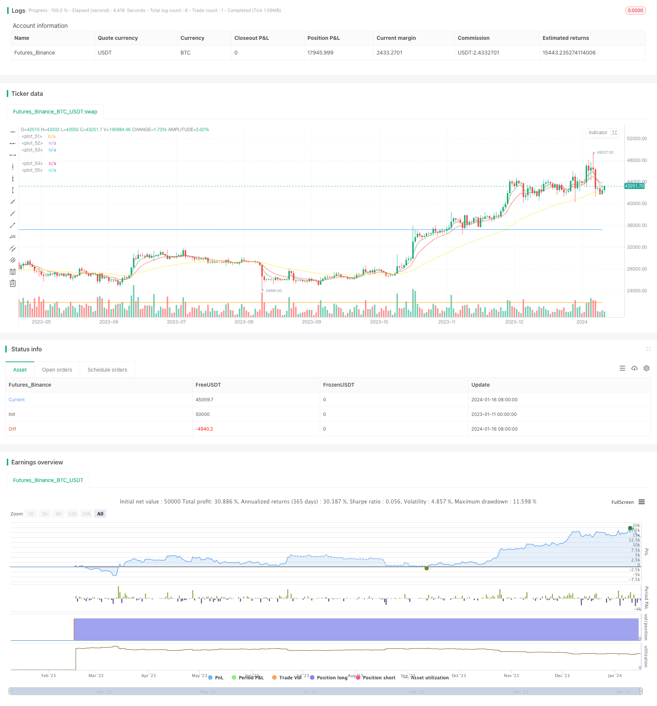

> Name

Momentum Trading Strategy Buy Low Sell High-Momentum-Breakout-Strategy
> Author

ChaoZhang

> Strategy Description


[trans]
### Overview
This strategy calculates the EMA moving average, MACD indicator and single-day increase, comprehensively determines the market's breakthrough signal, and implements a momentum trading strategy of buying low and selling high.
### Strategy Principles
When the fast EMA line crosses the slow EMA line, it is deemed that the market is in an upward trend, and a buy signal is generated; when the difference value of the MACD indicator crosses the 0 axis, a buy signal is also generated, realizing the long position opening of the strategy.
In addition, if the closing price of a single day rises by more than 10% compared to the opening price, a buying signal will also be generated to pursue a breakthrough in the market.
After opening a position, if the price drops by more than 10%, the loss will be stopped; if the profit reaches 45%, the profit will be stopped.
### Advantage Analysis
This is a typical trend following strategy, which can capture the rising market after a strong breakthrough in the market and has great profit potential. The specific advantages are as follows:
1. Use EMA moving average to realize trend judgment and avoid wrong opening of positions in volatile markets.
2. The MACD indicator ensures that the buy signal is more reliable
3. Single-day increase conditions can seize the market breaking point
4. The stop-loss and stop-profit settings are reasonable and can effectively control risks.
### Risk Analysis
Although this strategy is well designed, there are still certain risks that need to be addressed:
1. If the breakthrough signal is not judged properly, short losses may occur.
2. When the market stops falling and rebounds, wrong signals will also be generated.
3. If the stop loss point is set too large, the risk of loss increases.
4. If there is not enough follow-up market support after the breakthrough, the profit taking may be insufficient.
In order to reduce the above risks, you can consider optimizing the trailing stop loss strategy, or combining other indicators such as trading volume for signal filtering.
### Optimization direction
There is room for further optimization of this strategy:
1. Increase trading volume indicators to ensure there is sufficient trading volume to support the trend
2. Optimize MACD indicator parameters and improve indicator sensitivity
3. Test different EMA period parameter combinations
4. Add adaptive stop loss mechanism
5. Optimize the profit stop point to achieve more efficient cash management
Through further improvement through parameter adjustment, indicator combination and other methods, the stability and profitability of the strategy can be greatly improved.
### Summarize
Overall, this strategy is simple, practical and has great profit potential. By judging the market breakthrough point, we can effectively seize the rising trend of the market, and the retracement control is also more reasonable. In the subsequent strategy optimization, we will continue to promote parameter adjustments and improvements in stop-loss and take-profit designs, making it a quantitative trading strategy worthy of long-term application.
||

### Overview

This strategy combines EMA lines, MACD indicator and single-day gain to identify market breakthrough signals and implement a momentum trading strategy to buy low and sell high.

### Strategy Principle  

When the fast EMA line crosses over the slow EMA line, it is considered that the market is in an upward trend and a buy signal is generated. When the difference of MACD indicator crosses over the 0 axis, a buy signal is also generated to open long positions.

In addition, if the close price of a single day rises more than 10% compared to the open price, a buy signal will also be generated to chase the breaking market trend.

After opening positions, if the price falls more than 10%, stop loss will be triggered. If the profit reaches 45%, take profit will be triggered.

### Advantage Analysis

This is a typical trend following strategy that can capture the uptrend after a strong momentum breakthrough, with great profit potential. The main advantages are:

1. EMA lines implement trend judgment to avoid opening positions during market consolidation.  
2. MACD indicator ensures more reliable buy signals.
3. Single day gain condition captures trend outbreak. 
4. Reasonable stop loss and take profit settings help control risks.

### Risk Analysis  

Although reasonably designed, some risks still exist:

1. Improper breakthrough signal judgment may lead to short losses.
2. Market rebound may also generate false signals.
3. Oversize stop loss setting increases loss risk. 
4. Insufficient follow-up trend after breakthrough may lead to insufficient profit.

To reduce the above risks, we can consider optimizing the moving stop loss strategy or adding other indicators like volume to filter signals.

### Optimization Directions

There is still room for further optimization:

1. Add volume indicator to ensure enough trading volume supporting the trend.
2. Optimize MACD parameters to improve indicator sensitivity.
3. Test different combinations of EMA periods.  
4. Add adaptive stop loss mechanism.
5. Optimize take profit points for more efficient money management.

Through parameter tuning, indicator combination and other methods, the stability and profitability of this strategy can be greatly improved.

### Conclusion  

In general, this strategy is simple, practical and with great profit potential. By judging market breakthrough points, it can effectively capture uptrends, and the drawdown control is also reasonable. In future optimization, continuingly improving parameter adjustment and stop loss/take profit design can make it a worthwhile long-term quantitative trading strategy.

[/trans]

> Strategy Arguments


|Argument|Default|Description|
|----|----|----|
|v_input_1|5|fastLength|
|v_input_2|12|slowLength|
|v_input_3|50|baseLength|
|v_input_4|9|MACDLength|
|v_input_5|12|MACDfast|
|v_input_6|26|MACDslow|
|v_input_7|10|Gain %|
|v_input_8|10|Stop Loss %|
|v_input_9|45|Profit %|


> Source (PineScript)

``` pinescript
/*backtest
start: 2023-01-11 00:00:00
end: 2024-01-17 00:00:00
period: 1d
basePeriod: 1h
exchanges: [{"eid":"Futures_Binance","currency":"BTC_USDT"}]
*/

//@version=3
strategy("Alt Coins", overlay=true)

//Simple Alt Coin Trading Strategy//
// by @ShanghaiCrypto //

////EMA////
fastLength = input(5)
slowLength = input(12)
baseLength = input(50)
price = close

emafast = ema(price, fastLength)
emaslow = ema(price, slowLength)
emabase = ema(price, baseLength)

///MACD////
MACDLength = input(9)
MACDfast = input(12)
MACDslow = input(26)
MACD = ema(close, MACDfast) - ema(close, MACDslow)
aMACD = ema(MACD, MACDLength)
delta = MACD - aMACD

////PUMP////
OneCandleIncrease = input(10, title='Gain %')
pump = OneCandleIncrease/100

////Profit Capture and Stop Loss//////
stop = input(10.0, title='Stop Loss %', type=float)/100
profit = input(45.0, title='Profit %', type=float)/100
stop_level = strategy.position_avg_price * (1 - stop)
take_level = strategy.position_avg_price * (1 + profit)

////Entries/////
if crossover(emafast, emaslow)
    strategy.entry("Cross", strategy.long, comment="BUY")

if (crossover(delta, 0))
    strategy.entry("MACD", strategy.long, comment="BUY")
    
if close > (open + open*pump)
    strategy.entry("Pump", strategy.long, comment="BUY")

/////Exits/////
strategy.exit("SELL","Cross", stop=stop_level, limit=take_level)
strategy.exit("SELL","MACD", stop=stop_level, limit=take_level)
strategy.exit("SELL","Pump", stop=stop_level, limit=take_level)

////Plots////
plot(emafast, color=green)
plot(emaslow, color=red)
plot(emabase, color=yellow)
plot(take_level, color=blue)
plot(stop_level, color=orange)
```

> Detail

https://www.fmz.com/strategy/439229

> Last Modified

2024-01-18 15:17:11
