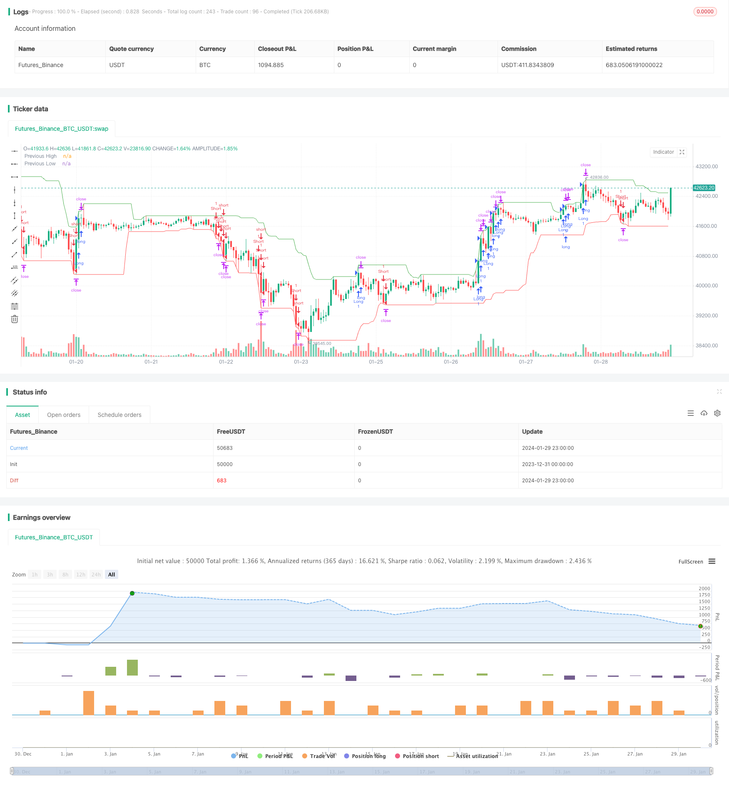

> Name

Trend following breakout trading strategy based on momentum indicatorMomentum-Breakout-Trading-Strategy
> Author

ChaoZhang

> Strategy Description


 [trans]

### Overview
This strategy is a trend following breakout trading strategy based on the momentum indicator. It determines the direction of the market trend by calculating the highest and lowest prices within a certain period, and conducts buying or selling operations when the price breaks through the key price level.
### Strategy Principles
The core logic of this strategy is:
1. Use the highest() and lowest() functions to calculate the highest and lowest prices of the last 20 K lines as a momentum indicator to determine the trend.
2. When the latest closing price exceeds the highest price of the previous period, perform a buying operation and enter a long position. This is an upward breakout signal.
3. When the latest closing price is lower than the lowest price of the previous period, perform a selling operation and enter a short position. This is a downward breakout signal.
4. To control risks, set a stop loss distance of 1% and a take profit distance of 2%. That is, the profit-loss ratio is 2:1.
5. The drawing displays the highest and lowest prices within the last 20 K lines to visually determine the trend direction and breakthrough situation.
The above is the core trading logic of this strategy. It uses momentum indicators to determine the trend direction and operates when the price breaks through key price levels. It is a trend following breakout trading strategy.
### Strategic Advantages
This strategy has the following advantages:
1. Capture the direction and strength of the trend and be highly targeted. By calculating the highest price and lowest price to determine the trend, and only entering the market after a clear trend is formed, it can effectively filter out false signals that shake the market.
2. Simple and clear operation. Buying and selling is only based on the logic of breaking through the highest price or lowest price, which is easy to understand and implement.
3. Risks are controllable. After setting the stop-loss and take-profit distances, the maximum loss is 1% and the maximum profit is 2%, and the profit-loss ratio is reasonable.
4. Easy to optimize. The cycle parameters for calculating the highest and lowest prices can be adjusted to optimize the timing of entry. You can also adjust the stop-loss and take-profit parameters to achieve greater profits or better risk control.
### Risk Analysis
There are also some risks with this strategy:
1. Stop loss may be broken down. When prices fluctuate rapidly and significantly, this risk cannot be completely avoided.
2. Positions cannot be closed in time when the trend reverses. The longer the period for calculating the highest and lowest prices, the lagging trend judgment will lead to the possibility of missing the opportunity to operate at the trend reversal point.
3. Improper parameter settings may not achieve profitability. The calculation period and stop-loss and stop-profit distance need to be carefully tested and optimized, otherwise you will not be able to make a profit.
### Optimization ideas
This strategy can be optimized from the following aspects:
1. Add filter conditions to ensure that you enter the market only when the trend is clear enough to avoid unnecessary transactions. For example, trend indicators can be calculated to determine trend strength.
2. Adjust the cycle parameters for calculating the highest and lowest prices to balance the timeliness and stability of trend judgment. If the cycle is too short, it is easy to be misled by short-term fluctuations; if the cycle is too long, trend judgment will lag behind.
3. Add stop loss tracking function. Tracking the stop loss to a certain extent can lock in more profits, and at the same time, it can also prevent the stop loss from being penetrated to a certain extent.
4. Carry out parameter optimization. You can use historical backtesting to test different combinations of calculation cycles and stop-loss and take-profit parameters to find the optimal parameters.
### Summarize
This strategy is a more typical trend following breakthrough trading strategy. It uses the momentum indicator to determine the direction of the trend and operates when the price breaks through key points. The advantages of the strategy are that it is simple and clear, the risks are controllable, and it is easy to understand and optimize. But it may also underperform in certain market conditions. Through further optimization, the stability and efficiency of the strategy can be improved.
||

### Overview

This is a momentum-based trend following breakout trading strategy. It calculates the highest and lowest prices over a certain period to determine the trend direction, and enters long or short trades when prices break key levels.  

### Strategy Logic

The core logic of this strategy is:

1. Use the highest() and lowest() functions to calculate the highest and lowest prices of the recent 20 candlesticks, as momentum indicators to judge the trend.

2. When the latest close price breaks above the highest price of the previous period, go long. This is an upward breakout signal.

3. When the latest close price breaks below the lowest price of the previous period, go short. This is a downward breakout signal.

4. To control risks, set a 1% stop loss distance and 2% take profit distance, giving a risk-reward ratio of 2:1.

5. Plot the highest and lowest prices within the 20 candlesticks to visually determine the trend direction and breakout levels.

The above is the core trading logic of this strategy. It uses momentum indicators to judge the trend, and trades breakouts of key levels, making it a trend following breakout strategy.

### Advantages

The advantages of this strategy include:

1. Catching the direction and strength of trends with high precision. Calculating highest and lowest prices helps filter out false signals from range-bound markets. 

2. Simple and clear logic. Just long above previous highest, and short below previous lowest. Easy to understand and implement.

3. Controllable risks. The max loss is 1% and max profit is 2% with stop loss and take profit set, giving a reasonable risk-reward ratio.

4. Easy to optimize. The calculation period can be adjusted for better entry timing. Stop loss and take profit levels can also be tuned for more profits or lower risks.

### Risks

There are also some risks:

1. Stop loss being hit is still possible with fast, huge price swings.

2. Missing reversal signals if the calculation period is too long. Trend judgment then lags behind.

3. Improper parameter settings may lead to unprofitability. The calculation period and stop loss/take profit levels need careful testing and optimization.

### Optimization

This strategy can be improved in aspects like:

1. Adding filters to ensure sufficient trend strength before entering trades. Trend metrics can be used.

2. Adjusting the period parameter to balance timeliness and stability of trend judgment. Too short leads to false signals, too long leads to lag.

3. Incorporating trailing stop loss to lock in profits and avoid stop loss being hit. 

4. Parameter optimization through historical backtesting to find the optimal combinations of settings.

### Conclusion  
This is a typical trend following breakout trading strategy. It uses momentum indicators to determine the trend, and trades breakouts of key levels. The pros are simplicity, controllable risks, and ease of understanding/optimization. But it may underperform in certain market environments. Further optimizations can improve its robustness and efficiency.

[/trans]

> Strategy Arguments


|Argument|Default|Description|
|----|----|----|
|v_input_1|20|Length|
|v_input_2|true|Stop Loss %|


> Source (PineScript)

``` pinescript
/*backtest
start: 2023-12-31 00:00:00
end: 2024-01-30 00:00:00
period: 1h
basePeriod: 15m
exchanges: [{"eid":"Futures_Binance","currency":"BTC_USDT"}]
*/

//@version=4
strategy("Trend Following Breakout Strategy with 2:1 RRR", overlay=true)

// 定义前高和前低的计算
length = input(20, minval=1, title="Length")
highestHigh = highest(high, length)
lowestLow = lowest(low, length)

// 定义买入和卖出的条件
longCondition = close > highestHigh[1] // 当前收盘价高于前一期的最高价
shortCondition = close < lowestLow[1] // 当前收盘价低于前一期的最低价

// 为了确保盈亏比为2:1，我们需要定义止损和目标价
stopLoss = input(1, title="Stop Loss %") / 100
takeProfit = stopLoss * 2

// 如果满足买入条件，进入多头
if (longCondition)
    strategy.entry("Long", strategy.long)
    strategy.exit("Long TP", "Long", profit=takeProfit * close, loss=stopLoss * close)

// 如果满足卖出条件，进入空头
if (shortCondition)
    strategy.entry("Short", strategy.short)
    strategy.exit("Short TP", "Short", profit=takeProfit * close, loss=stopLoss * close)

// 绘图显示前高和前低
plot(highestHigh, color=color.green, title="Previous High")
plot(lowestLow, color=color.red, title="Previous Low")

```

> Detail

https://www.fmz.com/strategy/440531

> Last Modified

2024-01-31 14:14:56
